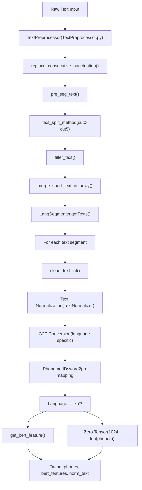
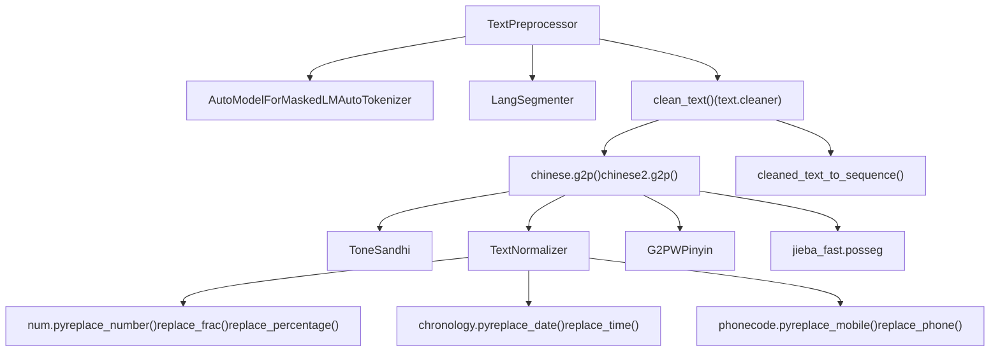
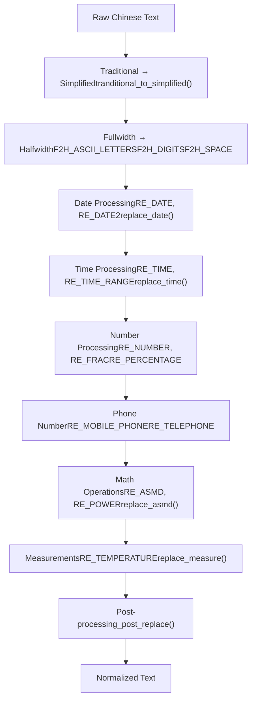
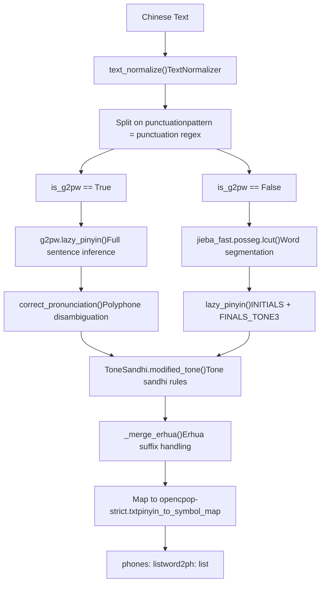
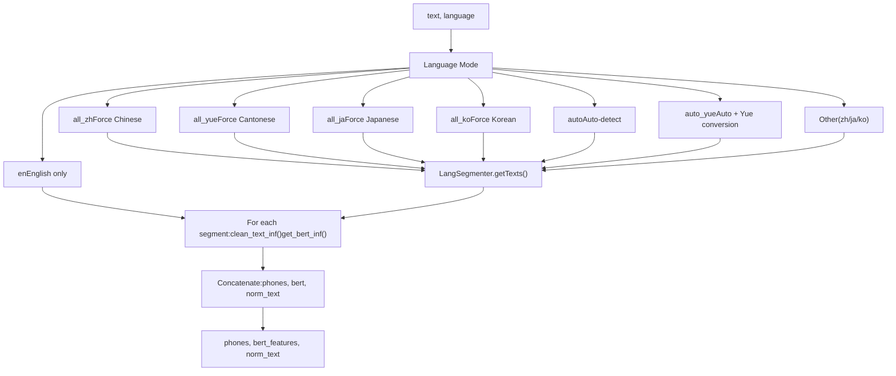

# Text Processing (文本处理)

相关源文件

-   [.gitignore](https://github.com/RVC-Boss/GPT-SoVITS/blob/c767f0b8/.gitignore)
-   [GPT\_SoVITS/AR/models/t2s\_model.py](https://github.com/RVC-Boss/GPT-SoVITS/blob/c767f0b8/GPT_SoVITS/AR/models/t2s_model.py)
-   [GPT\_SoVITS/AR/models/utils.py](https://github.com/RVC-Boss/GPT-SoVITS/blob/c767f0b8/GPT_SoVITS/AR/models/utils.py)
-   [GPT\_SoVITS/TTS\_infer\_pack/TTS.py](https://github.com/RVC-Boss/GPT-SoVITS/blob/c767f0b8/GPT_SoVITS/TTS_infer_pack/TTS.py)
-   [GPT\_SoVITS/TTS\_infer\_pack/TextPreprocessor.py](https://github.com/RVC-Boss/GPT-SoVITS/blob/c767f0b8/GPT_SoVITS/TTS_infer_pack/TextPreprocessor.py)
-   [GPT\_SoVITS/configs/tts\_infer.yaml](https://github.com/RVC-Boss/GPT-SoVITS/blob/c767f0b8/GPT_SoVITS/configs/tts_infer.yaml)
-   [GPT\_SoVITS/text/chinese.py](https://github.com/RVC-Boss/GPT-SoVITS/blob/c767f0b8/GPT_SoVITS/text/chinese.py)
-   [GPT\_SoVITS/text/chinese2.py](https://github.com/RVC-Boss/GPT-SoVITS/blob/c767f0b8/GPT_SoVITS/text/chinese2.py)
-   [GPT\_SoVITS/text/zh\_normalization/num.py](https://github.com/RVC-Boss/GPT-SoVITS/blob/c767f0b8/GPT_SoVITS/text/zh_normalization/num.py)
-   [GPT\_SoVITS/text/zh\_normalization/text\_normlization.py](https://github.com/RVC-Boss/GPT-SoVITS/blob/c767f0b8/GPT_SoVITS/text/zh_normalization/text_normlization.py)
-   [api\_v2.py](https://github.com/RVC-Boss/GPT-SoVITS/blob/c767f0b8/api_v2.py)

## Overview (概览)

Text Processing (文本处理) 系统将原始文本输入转换为 Phoneme Sequences (音素序列)、BERT Features (BERT 特征) 以及适用于 TTS 生成的 Normalized Text (归一化文本)。该系统通过特定语言的处理流水线、文本归一化、G2P (Grapheme-to-Phoneme, 字幕转音素) 转换和语言特征提取来处理多语言文本。

**范围**：本页面涵盖通用的文本处理架构和归一化子系统。有关特定语言的详细实现，请参见：

-   语言检测与分段：[Language Detection and Segmentation](/RVC-Boss/GPT-SoVITS/4.1-language-detection-and-segmentation)
-   中文文本处理：[Chinese Text Processing](/RVC-Boss/GPT-SoVITS/4.2-chinese-text-processing)
-   其他语言支持：[Other Language Support](/RVC-Boss/GPT-SoVITS/4.3-multi-language-support)

## Text Processing Pipeline (文本处理流水线)

文本处理流水线通过多个阶段转换原始文本，以生成模型就绪的特征：


**Sources**: [GPT\_SoVITS/TTS\_infer\_pack/TextPreprocessor.py52-239](https://github.com/RVC-Boss/GPT-SoVITS/blob/c767f0b8/GPT_SoVITS/TTS_infer_pack/TextPreprocessor.py#L52-L239)

## Core Components (核心组件)

### TextPreprocessor Class

`TextPreprocessor` 类 [GPT\_SoVITS/TTS\_infer\_pack/TextPreprocessor.py52-58](https://github.com/RVC-Boss/GPT-SoVITS/blob/c767f0b8/GPT_SoVITS/TTS_infer_pack/TextPreprocessor.py#L52-L58) 编排整个文本处理工作流。它在初始化时需要一个 BERT 模型、分词器和设备。

**关键方法**：

| Method | Purpose | Line Reference |
| --- | --- | --- |
| `preprocess()` | 批量文本处理的主要入口点 | [GPT\_SoVITS/TTS\_infer\_pack/TextPreprocessor.py59-75](https://github.com/RVC-Boss/GPT-SoVITS/blob/c767f0b8/GPT_SoVITS/TTS_infer_pack/TextPreprocessor.py#L59-L75) |
| `pre_seg_text()` | 文本分段与验证 | [GPT\_SoVITS/TTS\_infer\_pack/TextPreprocessor.py77-115](https://github.com/RVC-Boss/GPT-SoVITS/blob/c767f0b8/GPT_SoVITS/TTS_infer_pack/TextPreprocessor.py#L77-L115) |
| `get_phones_and_bert()` | 语言感知处理流水线 | [GPT\_SoVITS/TTS\_infer\_pack/TextPreprocessor.py122-189](https://github.com/RVC-Boss/GPT-SoVITS/blob/c767f0b8/GPT_SoVITS/TTS_infer_pack/TextPreprocessor.py#L122-L189) |
| `clean_text_inf()` | 文本归一化与 G2P 转换 | [GPT\_SoVITS/TTS\_infer\_pack/TextPreprocessor.py206-210](https://github.com/RVC-Boss/GPT-SoVITS/blob/c767f0b8/GPT_SoVITS/TTS_infer_pack/TextPreprocessor.py#L206-L210) |
| `get_bert_feature()` | BERT 嵌入提取 | [GPT\_SoVITS/TTS\_infer\_pack/TextPreprocessor.py191-204](https://github.com/RVC-Boss/GPT-SoVITS/blob/c767f0b8/GPT_SoVITS/TTS_infer_pack/TextPreprocessor.py#L191-L204) |

### Code Entity Relationships (代码实体关系)


**Sources**: [GPT\_SoVITS/TTS\_infer\_pack/TextPreprocessor.py1-239](https://github.com/RVC-Boss/GPT-SoVITS/blob/c767f0b8/GPT_SoVITS/TTS_infer_pack/TextPreprocessor.py#L1-L239) [GPT\_SoVITS/text/chinese.py1-195](https://github.com/RVC-Boss/GPT-SoVITS/blob/c767f0b8/GPT_SoVITS/text/chinese.py#L1-L195) [GPT\_SoVITS/text/chinese2.py1-340](https://github.com/RVC-Boss/GPT-SoVITS/blob/c767f0b8/GPT_SoVITS/text/chinese2.py#L1-L340)

### Text Segmentation Strategy (文本分段策略)

系统提供了多种文本切分方法来处理不同的输入格式：

| Method | Description | Implementation |
| --- | --- | --- |
| `cut0` | 不切分 | 原样返回文本 |
| `cut1` | 在 4 个标点符号处切分 | 在 `。，？！` 处切分 |
| `cut2` | 在 2 个标点符号处切分 | 在 `。？` 处切分 |
| `cut3` | 在中文句尾符号处切分 | 在 `。！？` 处切分 |
| `cut4` | 在英文句尾符号处切分 | 在 `.!?` 处切分 |
| `cut5` | 自定义切分方法 | 基于 `\n` 进行切分 |

如果合并后的短分段低于阈值 [GPT\_SoVITS/TTS\_infer\_pack/TextPreprocessor.py34-49](https://github.com/RVC-Boss/GPT-SoVITS/blob/c767f0b8/GPT_SoVITS/TTS_infer_pack/TextPreprocessor.py#L34-L49)，则会进行合并，以确保处理效率。

**Sources**: [GPT\_SoVITS/TTS\_infer\_pack/text\_segmentation\_method.py](https://github.com/RVC-Boss/GPT-SoVITS/blob/c767f0b8/GPT_SoVITS/TTS_infer_pack/text_segmentation_method.py)

## Text Normalization System (文本归一化系统)

### TextNormalizer Architecture (TextNormalizer 架构)

`TextNormalizer` 类 [GPT\_SoVITS/text/zh\_normalization/text\_normlization.py61-176](https://github.com/RVC-Boss/GPT-SoVITS/blob/c767f0b8/GPT_SoVITS/text/zh_normalization/text_normlization.py#L61-L176) 通过基于规则的流水线提供全面的中文文本归一化：


**Sources**: [GPT\_SoVITS/text/zh\_normalization/text\_normlization.py61-176](https://github.com/RVC-Boss/GPT-SoVITS/blob/c767f0b8/GPT_SoVITS/text/zh_normalization/text_normlization.py#L61-L176)

### Number Normalization (数字归一化)

数字归一化模块 [GPT\_SoVITS/text/zh\_normalization/num.py](https://github.com/RVC-Boss/GPT-SoVITS/blob/c767f0b8/GPT_SoVITS/text/zh_normalization/num.py) 将各种数值表达式转换为中文字符：

**支持的数字格式**：

| Format | Regular Expression | Handler Function | Example |
| --- | --- | --- | --- |
| 分数 (Fractions) | `RE_FRAC` | `replace_frac()` | `3/4` → `四分之三` |
| 百分比 (Percentages) | `RE_PERCENTAGE` | `replace_percentage()` | `50%` → `百分之五十` |
| 负数 (Negative numbers) | `RE_INTEGER` | `replace_negative_num()` | `-10` → `负十` |
| 小数 (Decimals) | `RE_DECIMAL_NUM` | `replace_number()` | `3.14` → `三点一四` |
| 范围 (Ranges) | `RE_RANGE` | `replace_range()` | `10-20` → `十到二十` |
| 数学运算 (Math operations) | `RE_ASMD` | `replace_asmd()` | `3+5` → `3加5` |
| 版本号 (Version numbers) | `RE_VERSION_NUM` | `replace_vrsion_num()` | `1.2.3` → `一点二点三` |

**Cardinal Number Conversion (基数转换)**：

`verbalize_cardinal()` 函数 [GPT\_SoVITS/text/zh\_normalization/num.py293-306](https://github.com/RVC-Boss/GPT-SoVITS/blob/c767f0b8/GPT_SoVITS/text/zh_normalization/num.py#L293-L306) 使用位值单位 (Place-value Units) 将数字字符串转换为中文：

```
DIGITS = {str(i): tran for i, tran in enumerate("零一二三四五六七八九")}
UNITS = OrderedDict({1: "十", 2: "百", 3: "千", 4: "万", 8: "亿"})
```
示例：`1234` → `一千二百三十四`

**Sources**: [GPT\_SoVITS/text/zh\_normalization/num.py1-340](https://github.com/RVC-Boss/GPT-SoVITS/blob/c767f0b8/GPT_SoVITS/text/zh_normalization/num.py#L1-L340)

### Quantifier Handling (量词处理)

后跟量词的正整数 [GPT\_SoVITS/text/zh\_normalization/num.py175-191](https://github.com/RVC-Boss/GPT-SoVITS/blob/c767f0b8/GPT_SoVITS/text/zh_normalization/num.py#L175-L191) 会受到特殊处理：

-   模式：`(\d+)([多余几\+])?` + 量词
-   在量词前，`二` 会被转换为 `两`
-   示例：`2个` → `两个`, `3多天` → `三多天`

**Sources**: [GPT\_SoVITS/text/zh\_normalization/num.py34-191](https://github.com/RVC-Boss/GPT-SoVITS/blob/c767f0b8/GPT_SoVITS/text/zh_normalization/num.py#L34-L191)

## Chinese G2P Conversion (中文 G2P 转换)

### 两种实现变体

系统提供了两种具有不同拼音预测策略的中文 G2P 实现：

| File | Pinyin Method | Features | Use Case |
| --- | --- | --- | --- |
| `chinese.py` | `pypinyin` | 基础拼音，快速 | 默认，较简单的文本 |
| `chinese2.py` | `G2PWPinyin` (可选) | 上下文感知的多音字消歧 | 精度更高，可通过 `is_g2pw` 标志配置 |

**Sources**: [GPT\_SoVITS/text/chinese.py1-195](https://github.com/RVC-Boss/GPT-SoVITS/blob/c767f0b8/GPT_SoVITS/text/chinese.py#L1-L195) [GPT\_SoVITS/text/chinese2.py1-340](https://github.com/RVC-Boss/GPT-SoVITS/blob/c767f0b8/GPT_SoVITS/text/chinese2.py#L1-L340)

### G2P 流水线


**Sources**: [GPT\_SoVITS/text/chinese.py76-168](https://github.com/RVC-Boss/GPT-SoVITS/blob/c767f0b8/GPT_SoVITS/text/chinese.py#L76-L168) [GPT\_SoVITS/text/chinese2.py73-295](https://github.com/RVC-Boss/GPT-SoVITS/blob/c767f0b8/GPT_SoVITS/text/chinese2.py#L73-L295)

### Tone Sandhi Processing (变调处理)

`ToneSandhi` 类 [GPT\_SoVITS/text/tone\_sandhi.py](https://github.com/RVC-Boss/GPT-SoVITS/blob/c767f0b8/GPT_SoVITS/text/tone_sandhi.py) 应用中文变调规则：

-   **上声变调**：两个连续的上声（第三声） → 第一个变为阳平（第二声）
-   **“一”的变调**：根据上下文产生的音调变化
-   **“不”的变调**：根据随后的音节产生的音调变化
-   **预合并处理**：在变调修改前合并某些词语模式

**Sources**: [GPT\_SoVITS/text/tone\_sandhi.py](https://github.com/RVC-Boss/GPT-SoVITS/blob/c767f0b8/GPT_SoVITS/text/tone_sandhi.py)

### Erhua (儿化音) 处理

`_merge_erhua()` 函数 [GPT\_SoVITS/text/chinese2.py142-177](https://github.com/RVC-Boss/GPT-SoVITS/blob/c767f0b8/GPT_SoVITS/text/chinese2.py#L142-L177) 处理北京官话中常见的“儿化”后缀：

-   根据 `must_erhua` 和 `not_erhua` 集合检查词语 [GPT\_SoVITS/text/chinese2.py93-139](https://github.com/RVC-Boss/GPT-SoVITS/blob/c767f0b8/GPT_SoVITS/text/chinese2.py#L93-L139)
-   将“儿”后缀与前一个音节合并
-   调整韵母以匹配前一个音节的音调
-   示例：`小院儿` → 特殊的合并发音

**Sources**: [GPT\_SoVITS/text/chinese2.py93-177](https://github.com/RVC-Boss/GPT-SoVITS/blob/c767f0b8/GPT_SoVITS/text/chinese2.py#L93-L177)

### Pinyin Symbol Mapping (拼音符号映射)

拼音音节通过 `opencpop-strict.txt` 映射到音标 [GPT\_SoVITS/text/chinese.py14-17](https://github.com/RVC-Boss/GPT-SoVITS/blob/c767f0b8/GPT_SoVITS/text/chinese.py#L14-L17)：

```
格式: pinyin\tinitial final
示例: ni\tn i
```
G2P 过程：

1.  将拼音切分为 Initial (声母) 和 Final (韵母)
2.  应用特定音节的转换 [GPT\_SoVITS/text/chinese.py121-160](https://github.com/RVC-Boss/GPT-SoVITS/blob/c767f0b8/GPT_SoVITS/text/chinese.py#L121-L160)
3.  映射到符号：`new_c, new_v = pinyin_to_symbol_map[pinyin].split(" ")`
4.  在韵母后附加调号：`new_v = new_v + tone`

**Sources**: [GPT\_SoVITS/text/chinese.py14-168](https://github.com/RVC-Boss/GPT-SoVITS/blob/c767f0b8/GPT_SoVITS/text/chinese.py#L14-L168)

## Punctuation Handling (标点符号处理)

### 标点符号替换

系统将标点符号归一化为标准集合 [GPT\_SoVITS/text/chinese.py26-55](https://github.com/RVC-Boss/GPT-SoVITS/blob/c767f0b8/GPT_SoVITS/text/chinese.py#L26-L55)：

```
rep_map = {
    "：": ",", "；": ",", "，": ",", "。": ".",
    "！": "!", "？": "?", "\n": ".",
    "·": ",", "、": ",", "...": "…",
    "$": ".", "/": ",", "—": "-",
    "~": "…", "～": "…"}
```
替换之后：

-   过滤非中文字符和非标点符号 [GPT\_SoVITS/text/chinese.py53](https://github.com/RVC-Boss/GPT-SoVITS/blob/c767f0b8/GPT_SoVITS/text/chinese.py#L53-L53)
-   折叠连续标点符号 [GPT\_SoVITS/text/chinese.py69-73](https://github.com/RVC-Boss/GPT-SoVITS/blob/c767f0b8/GPT_SoVITS/text/chinese.py#L69-L73)

**Sources**: [GPT\_SoVITS/text/chinese.py26-74](https://github.com/RVC-Boss/GPT-SoVITS/blob/c767f0b8/GPT_SoVITS/text/chinese.py#L26-L74)

## Language-Specific Processing Flow (特定语言的处理流程)

`get_phones_and_bert()` 方法 [GPT\_SoVITS/TTS\_infer\_pack/TextPreprocessor.py122-189](https://github.com/RVC-Boss/GPT-SoVITS/blob/c767f0b8/GPT_SoVITS/TTS_infer_pack/TextPreprocessor.py#L122-L189) 将文本路由到特定语言的流水线：


**Sources**: [GPT\_SoVITS/TTS\_infer\_pack/TextPreprocessor.py122-189](https://github.com/RVC-Boss/GPT-SoVITS/blob/c767f0b8/GPT_SoVITS/TTS_infer_pack/TextPreprocessor.py#L122-L189)

## BERT Feature Extraction (BERT 特征提取)

### 特征提取过程

仅针对中文文本，系统提取 BERT Embeddings (BERT 嵌入) [GPT\_SoVITS/TTS\_infer\_pack/TextPreprocessor.py191-222](https://github.com/RVC-Boss/GPT-SoVITS/blob/c767f0b8/GPT_SoVITS/TTS_infer_pack/TextPreprocessor.py#L191-L222)：

1.  **Tokenization (分词)**：使用 `AutoTokenizer` 对文本进行分词。
2.  **模型推理**：BERT 模型产生隐藏状态。
3.  **层选择**：拼接最后 2 层隐藏层 [GPT\_SoVITS/TTS\_infer\_pack/TextPreprocessor.py197](https://github.com/RVC-Boss/GPT-SoVITS/blob/c767f0b8/GPT_SoVITS/TTS_infer_pack/TextPreprocessor.py#L197-L197)。
4.  **音素级对齐 (Phone-level alignment)**：根据 `word2ph` 映射重复特征 [GPT\_SoVITS/TTS\_infer\_pack/TextPreprocessor.py199-203](https://github.com/RVC-Boss/GPT-SoVITS/blob/c767f0b8/GPT_SoVITS/TTS_infer_pack/TextPreprocessor.py#L199-L203)。
5.  **输出形状**：`(1024, num_phones)` 张量。

**非中文语言**：形状为 `(1024, len(phones))` 的全零张量 [GPT\_SoVITS/TTS\_infer\_pack/TextPreprocessor.py217-220](https://github.com/RVC-Boss/GPT-SoVITS/blob/c767f0b8/GPT_SoVITS/TTS_infer_pack/TextPreprocessor.py#L217-L220)。

**Sources**: [GPT\_SoVITS/TTS\_infer\_pack/TextPreprocessor.py191-222](https://github.com/RVC-Boss/GPT-SoVITS/blob/c767f0b8/GPT_SoVITS/TTS_infer_pack/TextPreprocessor.py#L191-L222)

## Output Format (输出格式)

文本处理系统为每个文本段生成三个输出：

### Phones (音素序列)

-   **类型**：`List[int]`
-   **内容**：从符号字符串映射的音素 ID。
-   **映射**：通过 `cleaned_text_to_sequence()` 实现 [GPT\_SoVITS/TTS\_infer\_pack/TextPreprocessor.py209](https://github.com/RVC-Boss/GPT-SoVITS/blob/c767f0b8/GPT_SoVITS/TTS_infer_pack/TextPreprocessor.py#L209-L209)。
-   **版本依赖**：符号集随模型版本（v1, v2）而异。

### Word2ph Mapping (字到音素映射)

-   **类型**：`List[int]`
-   **内容**：每个字符/单词对应的音素数量。
-   **目的**：将字符级特征对齐到音素级。
-   **示例**：`"你好"` 对应的 word2ph 为 `[2, 2]`，表示每个字对应 2 个音素。

### BERT Features (BERT 特征)

-   **类型**：`torch.Tensor`
-   **形状**：`(1024, num_phones)`
-   **内容**：
    -   中文：来自 BERT 的上下文嵌入。
    -   其他语言：全零张量。
-   **设备**：移动到模型设备（CPU/CUDA）。

### Normalized Text (归一化文本)

-   **类型**：`str`
-   **内容**：完成所有转换后的已清洗、归一化的文本。
-   **目的**：已处理文本的可读参考。

**完整输出结构**：

```
{
    "phones": [23, 45, 67, ...],           # 音素 ID 列表
    "bert_features": torch.Tensor(1024, N), # BERT 嵌入
    "norm_text": "你好世界"                   # 归一化文本
}
```
**Sources**: [GPT\_SoVITS/TTS\_infer\_pack/TextPreprocessor.py59-75](https://github.com/RVC-Boss/GPT-SoVITS/blob/c767f0b8/GPT_SoVITS/TTS_infer_pack/TextPreprocessor.py#L59-L75) [GPT\_SoVITS/TTS\_infer\_pack/TextPreprocessor.py206-222](https://github.com/RVC-Boss/GPT-SoVITS/blob/c767f0b8/GPT_SoVITS/TTS_infer_pack/TextPreprocessor.py#L206-L222)
