# 语言检测与切分 (Language Detection and Segmentation)

相关源文件

-   [GPT\_SoVITS/TTS\_infer\_pack/TextPreprocessor.py](https://github.com/RVC-Boss/GPT-SoVITS/blob/c767f0b8/GPT_SoVITS/TTS_infer_pack/TextPreprocessor.py)
-   [GPT\_SoVITS/text/chinese.py](https://github.com/RVC-Boss/GPT-SoVITS/blob/c767f0b8/GPT_SoVITS/text/chinese.py)
-   [GPT\_SoVITS/text/chinese2.py](https://github.com/RVC-Boss/GPT-SoVITS/blob/c767f0b8/GPT_SoVITS/text/chinese2.py)
-   [GPT\_SoVITS/text/zh\_normalization/num.py](https://github.com/RVC-Boss/GPT-SoVITS/blob/c767f0b8/GPT_SoVITS/text/zh_normalization/num.py)
-   [GPT\_SoVITS/text/zh\_normalization/text\_normlization.py](https://github.com/RVC-Boss/GPT-SoVITS/blob/c767f0b8/GPT_SoVITS/text/zh_normalization/text_normlization.py)

GPT-SoVITS 提供自动语言检测 (Language Detection) 和文本切分 (Text Segmentation) 以处理混合语言输入。系统将文本切分为特定语言块 (language-specific chunks)，并将每个片段路由到适当的文本处理流水线 (text processing pipeline)。这使得能够无缝处理多语言文本，而无需手动添加语言标注。

语言检测系统支持中文（简体）、英语、日语、韩语和粤语，针对单语言、混合语言和自动检测场景提供不同的操作模式。

## 概览 (Overview)

语言检测和切分系统通过以下几个组件运行：

**语言检测流水线 (Language Detection Pipeline)**

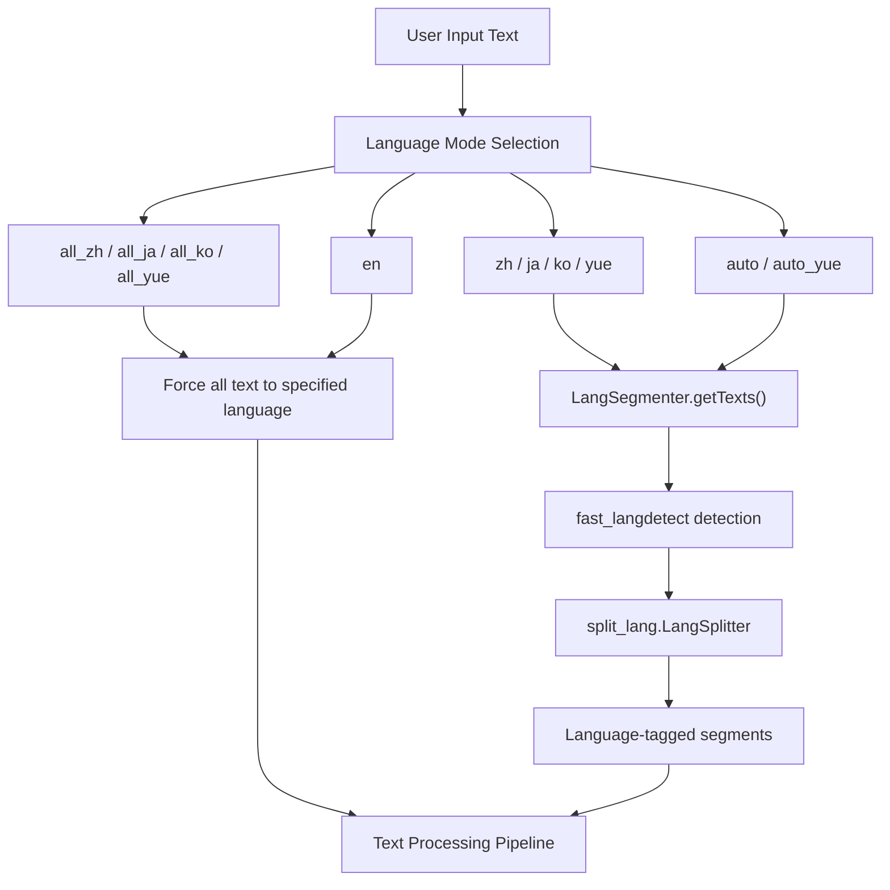
来源: [GPT\_SoVITS/TTS\_infer\_pack/TextPreprocessor.py122-189](https://github.com/RVC-Boss/GPT-SoVITS/blob/c767f0b8/GPT_SoVITS/TTS_infer_pack/TextPreprocessor.py#L122-L189) [GPT\_SoVITS/text/LangSegmenter/langsegmenter.py77-213](https://github.com/RVC-Boss/GPT-SoVITS/blob/c767f0b8/GPT_SoVITS/text/LangSegmenter/langsegmenter.py#L77-L213)

## 语言模式 (Language Modes)

TTS 系统支持通过 `text_lang` 参数配置多种语言模式。可用模式取决于模型版本：

### 版本特定的语言支持 (Version-Specific Language Support)

| 模式 | v1 支持 | v2+ 支持 | 描述 |
| --- | --- | --- | --- |
| `auto` | ✓ | ✓ | 自动检测语言并切分 |
| `auto_yue` | ✗ | ✓ | 自动检测，将中文视为粤语 |
| `en` | ✓ | ✓ | 将所有文本视为英语 |
| `zh` | ✓ | ✓ | 中英混合，检测边界 |
| `ja` | ✓ | ✓ | 日英混合，检测边界 |
| `yue` | ✗ | ✓ | 粤英混合，检测边界 |
| `ko` | ✗ | ✓ | 韩英混合，检测边界 |
| `all_zh` | ✓ | ✓ | 强制将所有文本视为中文 |
| `all_ja` | ✓ | ✓ | 强制将所有文本视为日语 |
| `all_yue` | ✗ | ✓ | 强制将所有文本视为粤语 |
| `all_ko` | ✗ | ✓ | 强制将所有文本视为韩语 |

来源: [GPT\_SoVITS/TTS\_infer\_pack/TTS.py275-277](https://github.com/RVC-Boss/GPT-SoVITS/blob/c767f0b8/GPT_SoVITS/TTS_infer_pack/TTS.py#L275-L277)

### 语言模式处理 (Language Mode Processing)

**基于模式的文本处理流 (Mode-Based Text Processing Flow)**

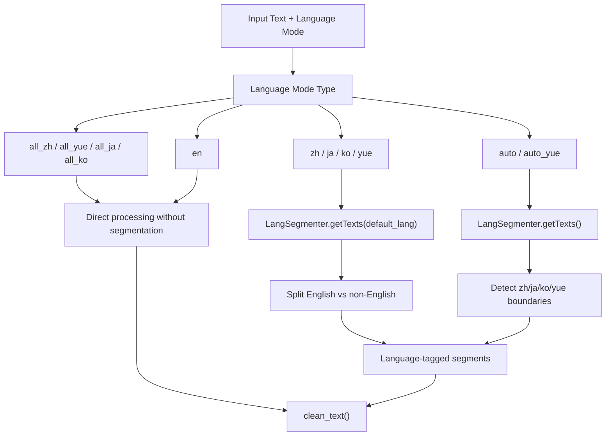
在混合语言模式（例如 `zh`、`ja`）中，系统区分英语片段和指定的语言，但统一处理指定的语言。例如，在 `zh` 模式下，日语字符将被作为中文处理。

来源: [GPT\_SoVITS/TTS\_infer\_pack/TextPreprocessor.py127-169](https://github.com/RVC-Boss/GPT-SoVITS/blob/c767f0b8/GPT_SoVITS/TTS_infer_pack/TextPreprocessor.py#L127-L169)

## LangSegmenter 架构 (LangSegmenter Architecture)

[GPT\_SoVITS/text/LangSegmenter/langsegmenter.py](https://github.com/RVC-Boss/GPT-SoVITS/blob/c767f0b8/GPT_SoVITS/text/LangSegmenter/langsegmenter.py) 中的 `LangSegmenter` 类实现了核心语言检测和切分逻辑。它使用两个外部库：

1.  **fast\_langdetect**: 检测文本片段的语言
2.  **split\_lang.LangSplitter**: 在字符级 (character-level) 语言边界切分文本

**LangSegmenter 组件架构**

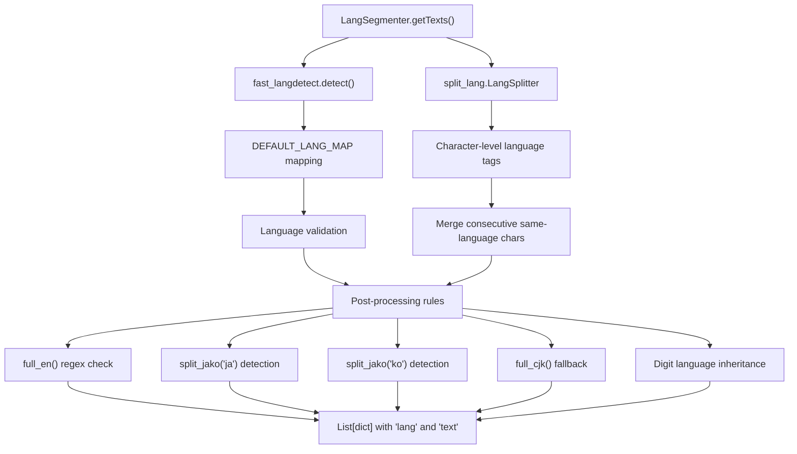
来源: [GPT\_SoVITS/text/LangSegmenter/langsegmenter.py77-213](https://github.com/RVC-Boss/GPT-SoVITS/blob/c767f0b8/GPT_SoVITS/text/LangSegmenter/langsegmenter.py#L77-213)

### 语言代码映射 (Language Code Mapping)

`DEFAULT_LANG_MAP` 将语言检测结果归一化为支持的语言代码：

| 检测到的代码 | 映射后的代码 | 备注 |
| --- | --- | --- |
| `zh` | `zh` | 中文简体 |
| `yue` | `zh` | 粤语映射为中文 |
| `wuu` | `zh` | 吴语映射为中文 |
| `zh-cn` | `zh` | 中国大陆中文 |
| `zh-tw` | `x` | 繁体中文标记为未知 |
| `ko` | `ko` | 韩语 |
| `ja` | `ja` | 日语 |
| `en` | `en` | 英语 |

来源: [GPT\_SoVITS/text/LangSegmenter/langsegmenter.py78-88](https://github.com/RVC-Boss/GPT-SoVITS/blob/c767f0b8/GPT_SoVITS/text/LangSegmenter/langsegmenter.py#L78-L88)

## 语言检测过程 (Language Detection Process)

语言检测过程涉及多个分析和精细化阶段：

### 阶段 1：初步检测 (Initial Detection)

**初步语言检测 (Initial Language Detection)**

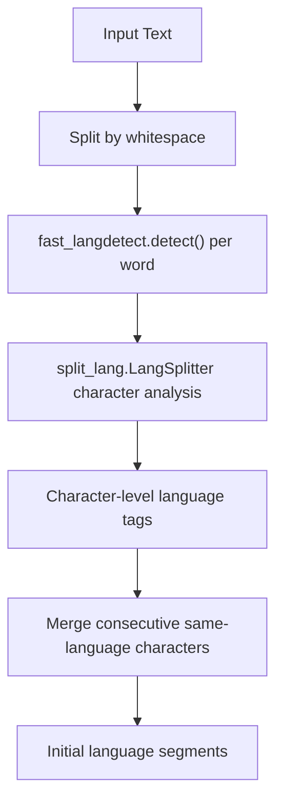
来源: [GPT\_SoVITS/text/LangSegmenter/langsegmenter.py90-130](https://github.com/RVC-Boss/GPT-SoVITS/blob/c767f0b8/GPT_SoVITS/text/LangSegmenter/langsegmenter.py#L90-L130)

### 阶段 2：精细化与模式匹配 (Refinement and Pattern Matching)

在初步检测之后，系统应用基于模式的精细化处理：

**基于模式的精细化 (Pattern-Based Refinement)**

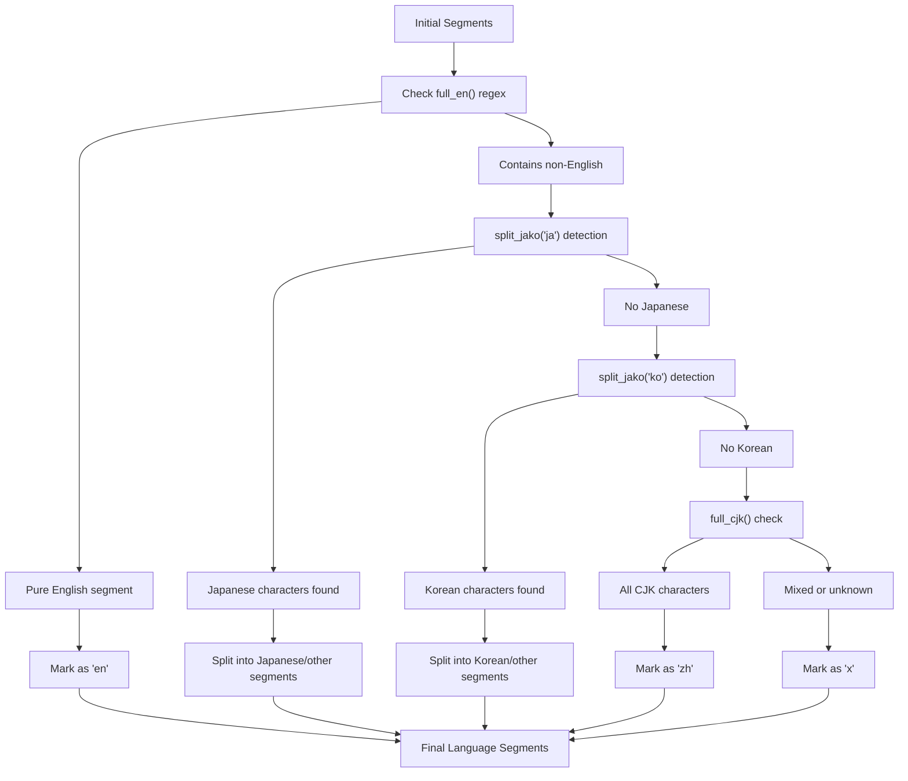
来源: [GPT\_SoVITS/text/LangSegmenter/langsegmenter.py131-213](https://github.com/RVC-Boss/GPT-SoVITS/blob/c767f0b8/GPT_SoVITS/text/LangSegmenter/langsegmenter.py#L131-L213)

### 模式检测函数 (Pattern Detection Functions)

系统使用专门的模式检测函数：

| 函数 | 用途 | 模式 |
| --- | --- | --- |
| `full_en()` | 检测纯英语 | `^[a-zA-Z\s.,!?;:'"\-()]+$` |
| `full_cjk()` | 检测 CJK 字符 | `^[\u4e00-\u9fff\u3040-\u309f\u30a0-\u30ff]+$` |
| `split_jako()` | 检测日语/韩语 | 字符范围分析 |

来源: [GPT\_SoVITS/text/LangSegmenter/langsegmenter.py17-66](https://github.com/RVC-Boss/GPT-SoVITS/blob/c767f0b8/GPT_SoVITS/text/LangSegmenter/langsegmenter.py#L17-L66)

### 特殊情况 (Special Cases)

**数字语言分配 (Digit Language Assignment)**

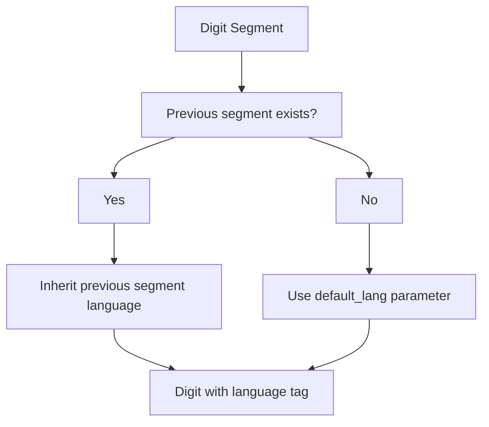
数字和数值继承前一个文本片段的语言。如果没有前一个片段，则使用传递给 `getTexts()` 的 `default_lang` 参数。

来源: [GPT\_SoVITS/text/LangSegmenter/langsegmenter.py175-186](https://github.com/RVC-Boss/GPT-SoVITS/blob/c767f0b8/GPT_SoVITS/text/LangSegmenter/langsegmenter.py#L175-L186)

## 片段输出格式 (Segment Output Format)

`LangSegmenter.getTexts()` 方法返回一个字典列表：

```json
[
    {"lang": "zh", "text": "这是中文"},
    {"lang": "en", "text": "This is English"},
    {"lang": "ja", "text": "これは日本語です"}
]
```
每个片段包含：

-   `lang`: 语言代码（`zh`、`en`、`ja`、`ko`、`yue` 或 `x` 表示未知）
-   `text`: 该片段的文本内容

来源: [GPT\_SoVITS/text/LangSegmenter/langsegmenter.py90-213](https://github.com/RVC-Boss/GPT-SoVITS/blob/c767f0b8/GPT_SoVITS/text/LangSegmenter/langsegmenter.py#L90-L213)

## 与文本处理集成 (Integration with Text Processing)

切分后的输出通过 `TextPreprocessor.get_phones_and_bert()` 流入文本处理流水线：

**片段处理集成 (Segment Processing Integration)**

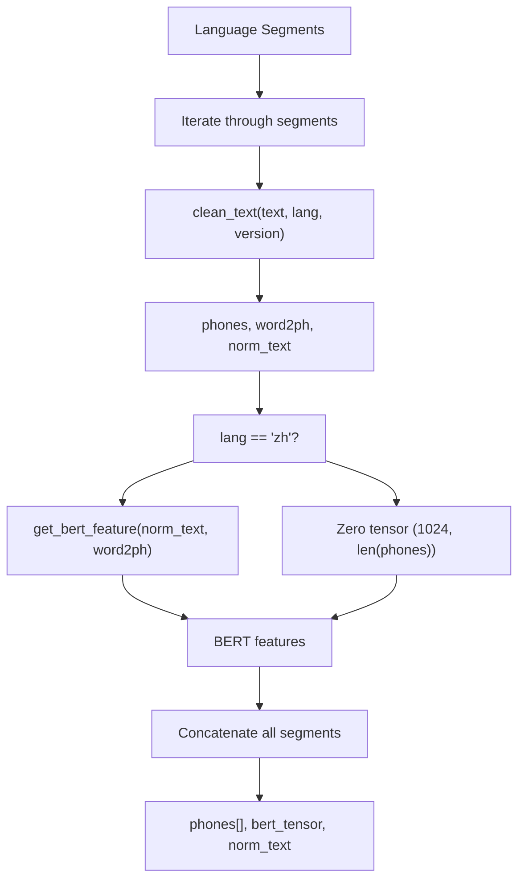
对于中文片段，使用 `get_bert_feature()` 提取 BERT 特征。对于所有其他语言，使用全零张量作为占位符 BERT 特征。

来源: [GPT\_SoVITS/TTS\_infer\_pack/TextPreprocessor.py172-189](https://github.com/RVC-Boss/GPT-SoVITS/blob/c767f0b8/GPT_SoVITS/TTS_infer_pack/TextPreprocessor.py#L172-L189) [GPT\_SoVITS/TTS\_infer\_pack/TextPreprocessor.py212-222](https://github.com/RVC-Boss/GPT-SoVITS/blob/c767f0b8/GPT_SoVITS/TTS_infer_pack/TextPreprocessor.py#L212-L222)

## 特定语言处理模块 (Language-Specific Processing Modules)

每种支持的语言都有一个专门的处理模块，负责处理文本归一化 (Text Normalization) 和 G2P 转换。

### 日语处理 (Japanese Processing - `japanese.py`)

**日语 G2P 流水线 (Japanese G2P Pipeline)**

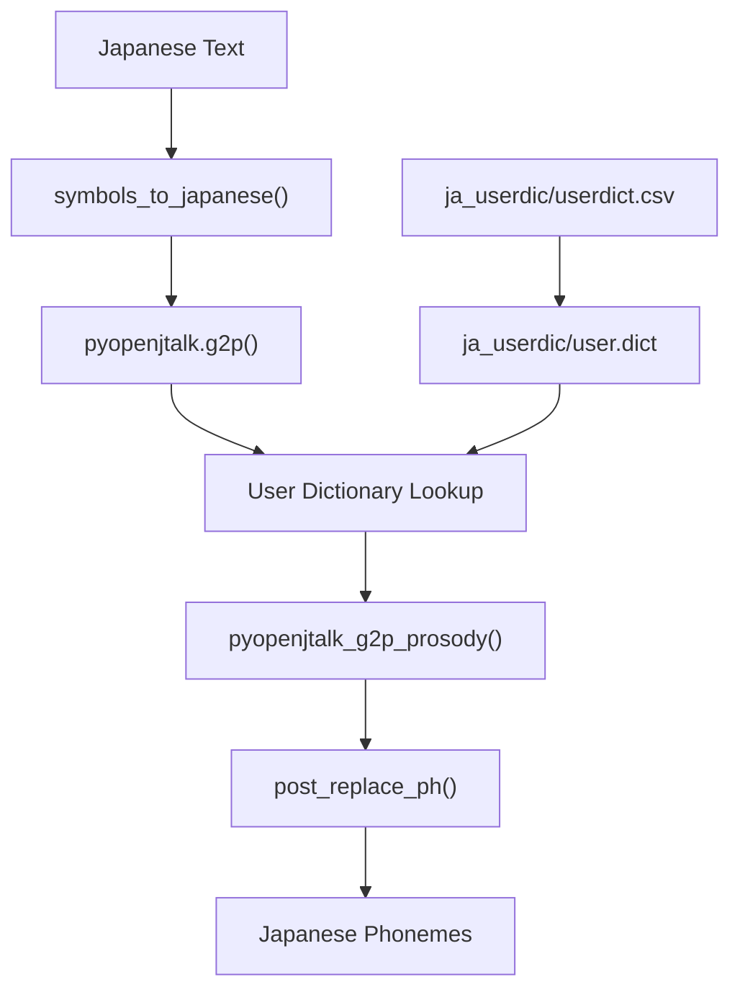
关键函数：

-   `preprocess_jap()`: 带有可选韵律 (prosody) 的主预处理函数
-   `pyopenjtalk_g2p_prosody()`: 提取带有韵律符号的音素 (phoneme)
-   `g2p()`: 返回音素列表的入口函数

来源: [GPT\_SoVITS/text/japanese.py151-171](https://github.com/RVC-Boss/GPT-SoVITS/blob/c767f0b8/GPT_SoVITS/text/japanese.py#L151-L171) [GPT\_SoVITS/text/japanese.py183-256](https://github.com/RVC-Boss/GPT-SoVITS/blob/c767f0b8/GPT_SoVITS/text/japanese.py#L183-L256) [GPT\_SoVITS/text/japanese.py267-271](https://github.com/RVC-Boss/GPT-SoVITS/blob/c767f0b8/GPT_SoVITS/text/japanese.py#L267-L271)

### 韩语处理 (Korean Processing - `korean.py`)

韩语模块使用 `g2pk2.G2p` 进行罗马化处理，并处理数字到谚文 (Hangul) 的转换：

关键特性：

-   **数字归一化**: `hangul_number()` 将数字转换为韩语数字
-   **谚文分解**: `divide_hangul()` 将谚文分解为组成部分
-   **Windows 兼容性**: 针对路径编码问题的特殊处理
-   **IPA 转换**: `korean_to_ipa()` 用于语音表示

来源: [GPT\_SoVITS/text/korean.py183-259](https://github.com/RVC-Boss/GPT-SoVITS/blob/c767f0b8/GPT_SoVITS/text/korean.py#L183-L259) [GPT\_SoVITS/text/korean.py292-298](https://github.com/RVC-Boss/GPT-SoVITS/blob/c767f0b8/GPT_SoVITS/text/korean.py#L292-L298) [GPT\_SoVITS/text/korean.py324-332](https://github.com/RVC-Boss/GPT-SoVITS/blob/c767f0b8/GPT_SoVITS/text/korean.py#L324-L332)

### 粤语处理 (Cantonese Processing - `cantonese.py`)

**粤语处理流 (Cantonese Processing Flow)**

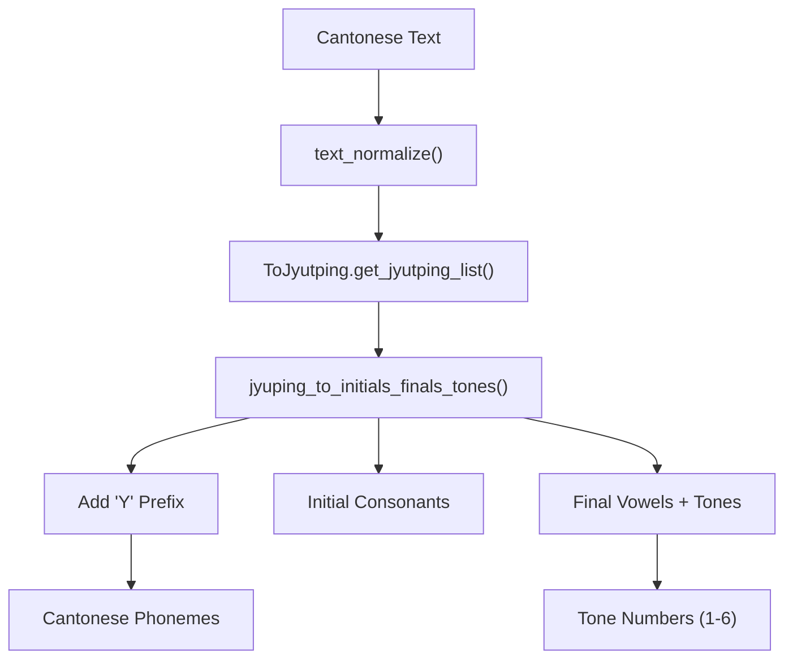
粤语模块在音素前添加 "Y" 前缀，以防止与符号系统中的普通话音素冲突。

来源: [GPT\_SoVITS/text/cantonese.py118-173](https://github.com/RVC-Boss/GPT-SoVITS/blob/c767f0b8/GPT_SoVITS/text/cantonese.py#L118-L173) [GPT\_SoVITS/text/cantonese.py176-194](https://github.com/RVC-Boss/GPT-SoVITS/blob/c767f0b8/GPT_SoVITS/text/cantonese.py#L176-L194) [GPT\_SoVITS/text/cantonese.py203-212](https://github.com/RVC-Boss/GPT-SoVITS/blob/c767f0b8/GPT_SoVITS/text/cantonese.py#L203-L212)

## 符号系统与版本管理 (Symbol System and Version Management)

系统支持两个版本的符号集，具有不同的语言覆盖范围：

### 符号集比较 (Symbol Set Comparison)

| 组件 | 版本 1 (`symbols.py`) | 版本 2 (`symbols2.py`) |
| --- | --- | --- |
| 中文音素 | ✓（带有声调 1-5） | ✓（带有声调 1-5） |
| 日语音素 | ✓（基础集合） | ✓（带有韵律标记） |
| 英语 ARPA | ✓ | ✓ |
| 韩语音素 | ✗ | ✓ (`ko_symbols`) |
| 粤语音素 | ✗ | ✓ (`yue_symbols`) |
| 韵律标记 | ✗ | ✓ (`[`, `]`) |

**符号集成架构 (Symbol Integration Architecture)**

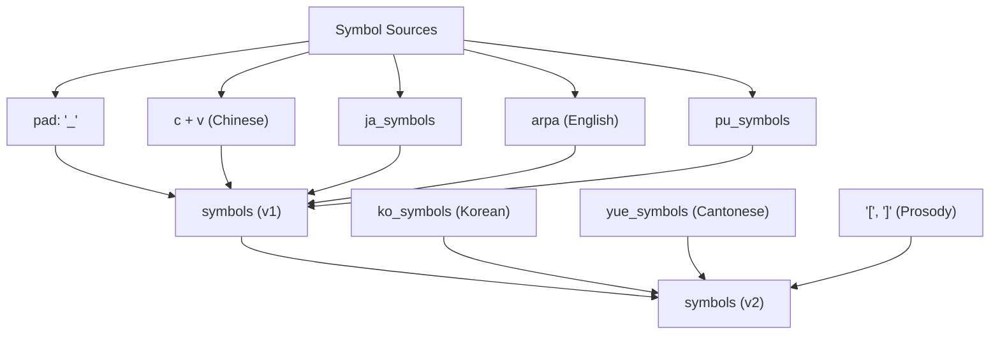
来源: [GPT\_SoVITS/text/symbols.py396-397](https://github.com/RVC-Boss/GPT-SoVITS/blob/c767f0b8/GPT_SoVITS/text/symbols.py#L396-L397) [GPT\_SoVITS/text/symbols2.py782-788](https://github.com/RVC-Boss/GPT-SoVITS/blob/c767f0b8/GPT_SoVITS/text/symbols2.py#L782-L788)

## 与文本清洗器集成 (Integration with Text Cleaner)

`cleaner.py` 中的 `clean_text()` 函数编排整个多语言处理流水线：

**文本清洗流水线 (Text Cleaning Pipeline)**

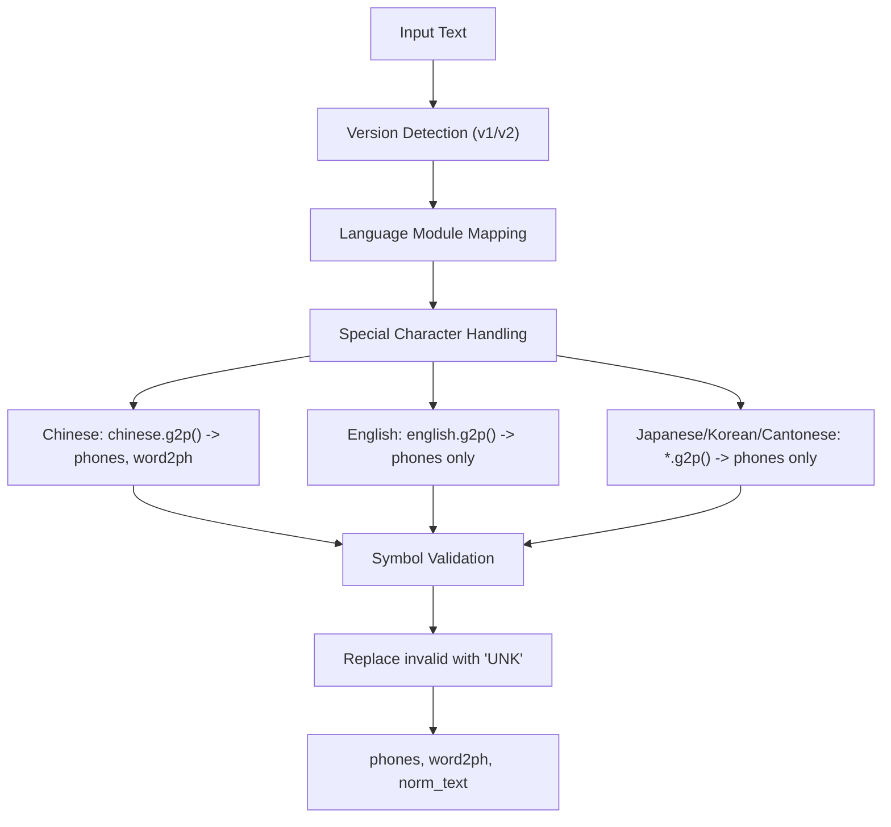
### 特殊字符处理 (Special Character Processing)

系统将特殊字符（如 `￥`（人民币符号）和 `^`）作为特殊停顿标记处理：

```python
special = [
    ("￥", "zh", "SP2"),  # Chinese currency -> SP2 pause
    ("^", "zh", "SP3"),  # Caret -> SP3 pause
]
```
来源: [GPT\_SoVITS/text/cleaner.py13-18](https://github.com/RVC-Boss/GPT-SoVITS/blob/c767f0b8/GPT_SoVITS/text/cleaner.py#L13-L18) [GPT\_SoVITS/text/cleaner.py21-55](https://github.com/RVC-Boss/GPT-SoVITS/blob/c767f0b8/GPT_SoVITS/text/cleaner.py#L21-L55) [GPT\_SoVITS/text/cleaner.py58-82](https://github.com/RVC-Boss/GPT-SoVITS/blob/c767f0b8/GPT_SoVITS/text/cleaner.py#L58-L82)

## 文本到序列转换 (Text-to-Sequence Conversion)

最后一步将处理后的音素转换为整数序列，作为模型输入：

**音素到 ID 转换 (Phoneme-to-ID Conversion)**

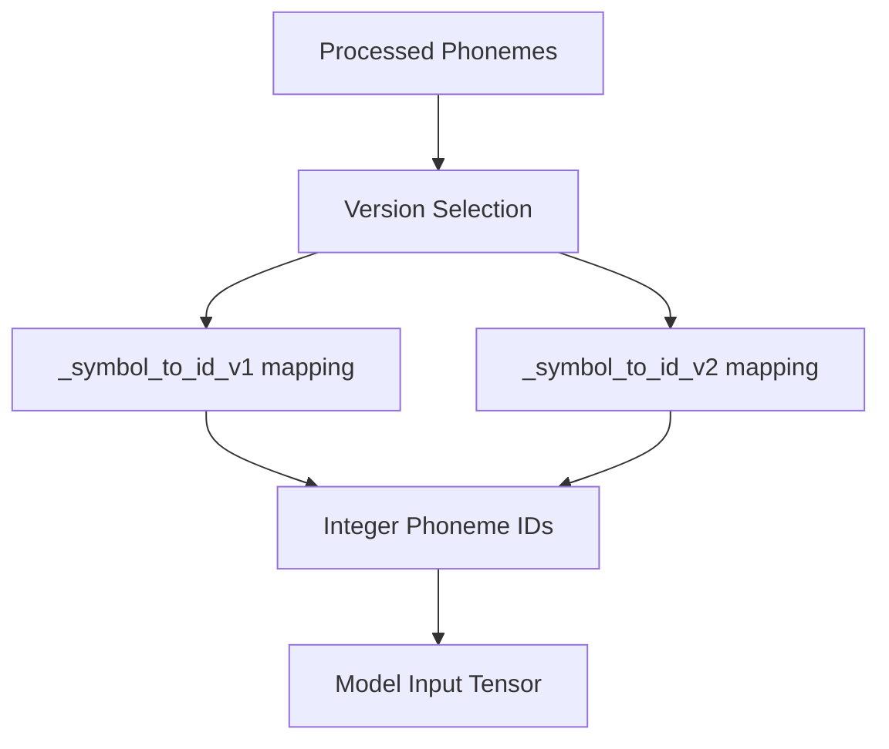
转换使用在模块初始化时构建的预置音素到 ID 映射。

来源: [GPT\_SoVITS/text/\_\_init\_\_.py10-28](https://github.com/RVC-Boss/GPT-SoVITS/blob/c767f0b8/GPT_SoVITS/text/__init__.py#L10-L28)
