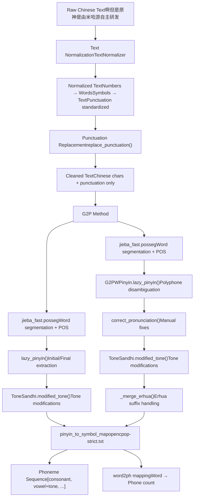
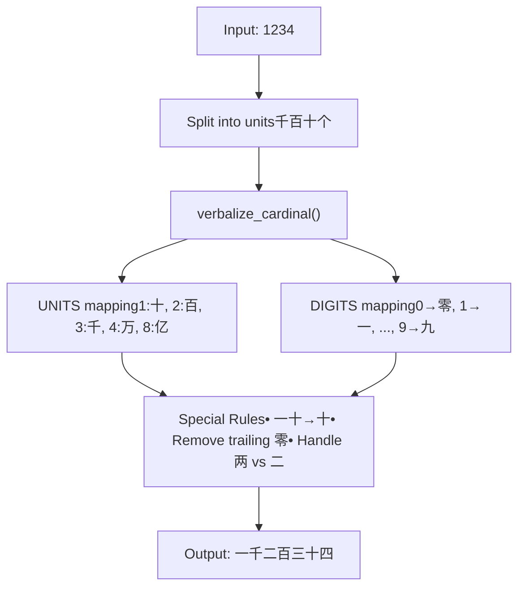
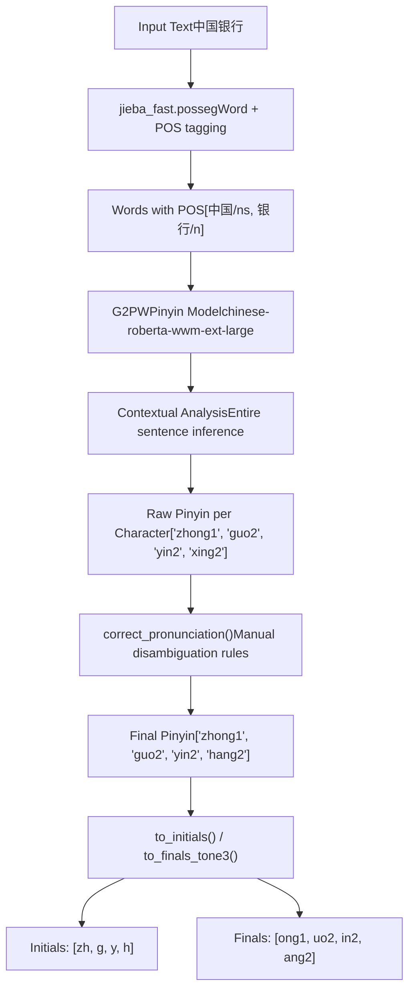
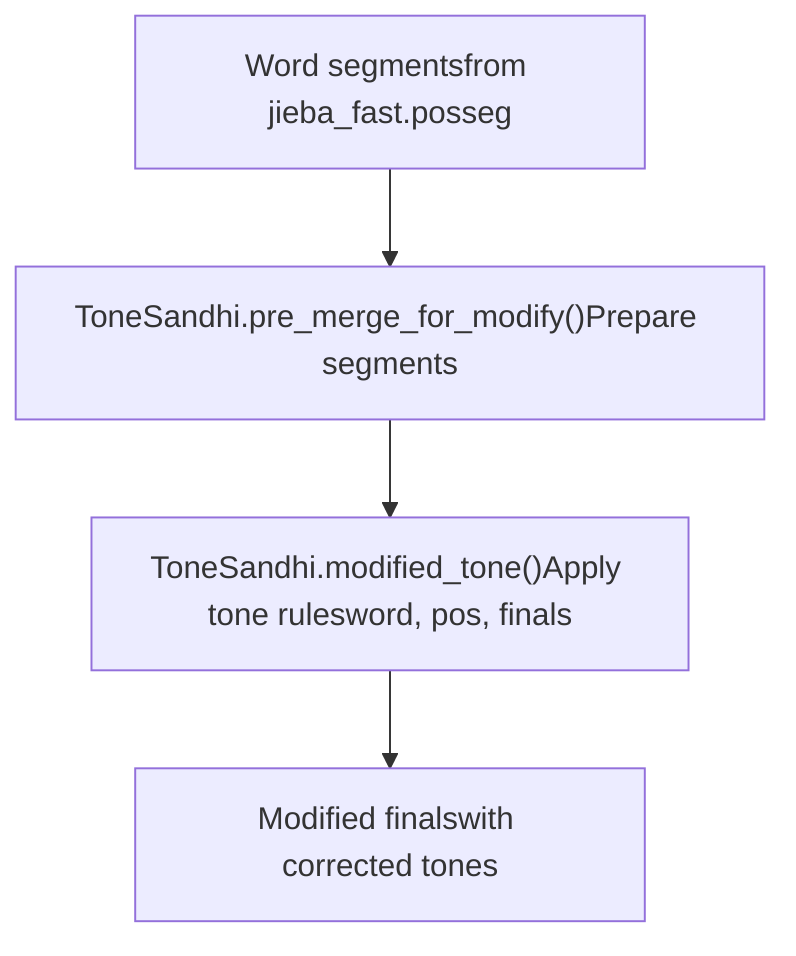
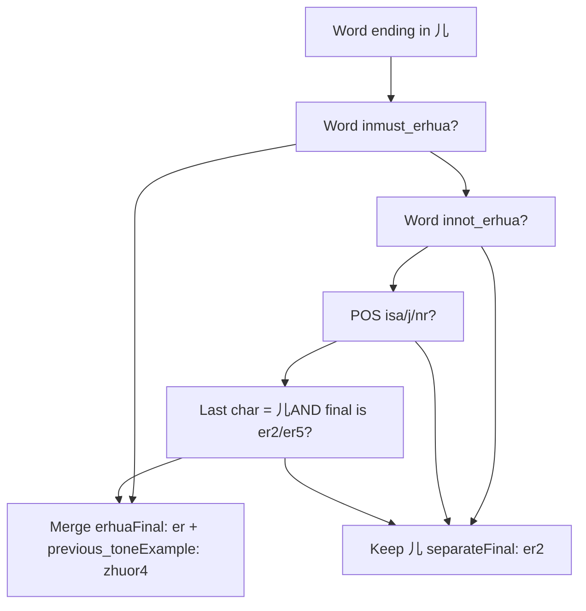
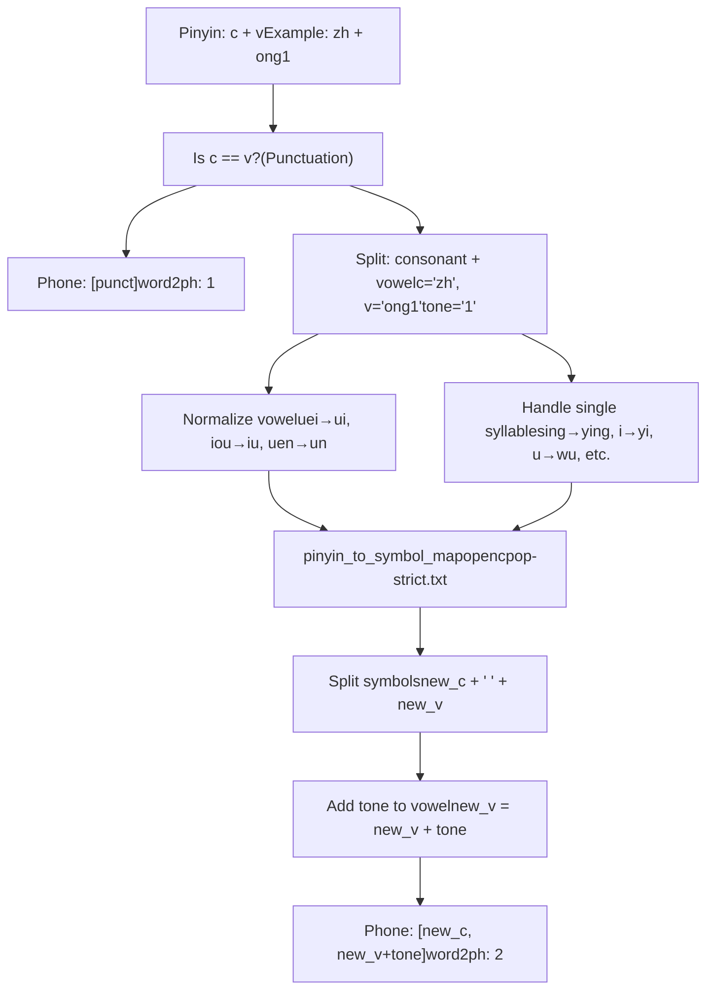
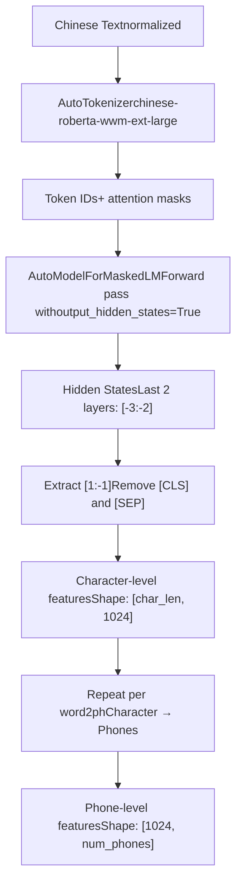
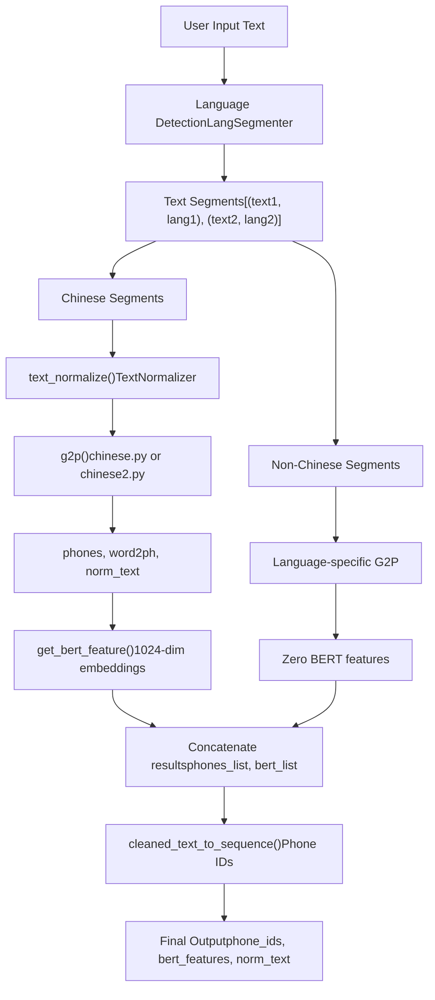

# 中文文本处理 (Chinese Text Processing)

相关源文件

-   [GPT\_SoVITS/TTS\_infer\_pack/TextPreprocessor.py](https://github.com/RVC-Boss/GPT-SoVITS/blob/c767f0b8/GPT_SoVITS/TTS_infer_pack/TextPreprocessor.py)
-   [GPT\_SoVITS/text/chinese.py](https://github.com/RVC-Boss/GPT-SoVITS/blob/c767f0b8/GPT_SoVITS/text/chinese.py)
-   [GPT\_SoVITS/text/chinese2.py](https://github.com/RVC-Boss/GPT-SoVITS/blob/c767f0b8/GPT_SoVITS/text/chinese2.py)
-   [GPT\_SoVITS/text/zh\_normalization/num.py](https://github.com/RVC-Boss/GPT-SoVITS/blob/c767f0b8/GPT_SoVITS/text/zh_normalization/num.py)
-   [GPT\_SoVITS/text/zh\_normalization/text\_normlization.py](https://github.com/RVC-Boss/GPT-SoVITS/blob/c767f0b8/GPT_SoVITS/text/zh_normalization/text_normlization.py)

## 目的与范围 (Purpose and Scope)

本文档描述了 GPT-SoVITS 中的中文文本处理流水线，涵盖文本归一化 (Text Normalization)、字母到音素转换 (G2P, Grapheme-to-Phoneme)、变调 (Tone Sandhi) 处理和 BERT 特征提取。此处理专门针对普通话和粤语（配置时）。有关跨多种语言的语言检测和切分，请参阅 [Language Detection and Segmentation (语言检测与切分)](/RVC-Boss/GPT-SoVITS/4.1-language-detection-and-segmentation)。有关其他语言支持（英语、日语、韩语），请参阅 [Other Language Support (其他语言支持)](/RVC-Boss/GPT-SoVITS/4.3-multi-language-support)。

## 概览 (Overview)

GPT-SoVITS 中的中文文本处理遵循多阶段流水线，将原始中文文本转换为适用于 TTS 合成的音素序列和语言特征。系统提供两种 G2P 实现：一种是基于 `pypinyin` 的简单方法，另一种是使用 BERT 模型进行多音字歧义消除 (polyphone disambiguation) 的高级 G2PW（Grapheme-to-Phoneme with Word segmentation，带分词的字母到音素转换）方法。

### 处理流水线 (Processing Pipeline)


**来源:** [GPT\_SoVITS/text/chinese.py1-195](https://github.com/RVC-Boss/GPT-SoVITS/blob/c767f0b8/GPT_SoVITS/text/chinese.py#L1-L195) [GPT\_SoVITS/text/chinese2.py1-340](https://github.com/RVC-Boss/GPT-SoVITS/blob/c767f0b8/GPT_SoVITS/text/chinese2.py#L1-L340) [GPT\_SoVITS/TTS\_infer\_pack/TextPreprocessor.py117-223](https://github.com/RVC-Boss/GPT-SoVITS/blob/c767f0b8/GPT_SoVITS/TTS_infer_pack/TextPreprocessor.py#L117-L223)

## 文本归一化 (Text Normalization)

`TextNormalizer` 类负责全面的中文文本归一化，将各种非标准书写形式 (NSW, non-standard written forms) 转换为口语化的中文字符。

### 归一化组件 (Normalization Components)

| 组件 | 正则表达式 | 函数 | 示例 |
| --- | --- | --- | --- |
| 数字 | `RE_NUMBER` | `replace_number()` | "123" → "一百二十三" |
| 分数 | `RE_FRAC` | `replace_frac()` | "3/4" → "四分之三" |
| 百分比 | `RE_PERCENTAGE` | `replace_percentage()` | "85%" → "百分之八十五" |
| 日期 | `RE_DATE`, `RE_DATE2` | `replace_date()` | "2024-01-15" → "二零二四年一月十五日" |
| 时间 | `RE_TIME` | `replace_time()` | "14:30" → "十四点三十分" |
| 范围 | `RE_RANGE` | `replace_range()` | "10-20" → "十到二十" |
| 电话号码 | `RE_MOBILE_PHONE` | `replace_mobile()` | "13812345678" → "幺三八..." |
| 版本号 | `RE_VERSION_NUM` | `replace_vrsion_num()` | "3.1.4" → "三点一点四" |
| 数学表达式 | `RE_ASMD` | `replace_asmd()` | "2+3" → "二加三" |
| 次方 | `RE_POWER` | `replace_power()` | "x²" → "x的二次方" |
| 温度 | `RE_TEMPERATURE` | `replace_temperature()` | "25℃" → "二十五摄氏度" |
| 量词 | `RE_POSITIVE_QUANTIFIERS` | `replace_positive_quantifier()` | "3个" → "三个" |

### 数字口语化 (Number Verbalization)

系统使用一种遵循中文语言规则的高级数字到单词转换：


**关键函数:**

-   `verbalize_cardinal()`: 将整数转换为中文单词 [GPT\_SoVITS/text/zh\_normalization/num.py293-306](https://github.com/RVC-Boss/GPT-SoVITS/blob/c767f0b8/GPT_SoVITS/text/zh_normalization/num.py#L293-L306)
-   `verbalize_digit()`: 逐个将数字转换为中文字符 [GPT\_SoVITS/text/zh\_normalization/num.py309-314](https://github.com/RVC-Boss/GPT-SoVITS/blob/c767f0b8/GPT_SoVITS/text/zh_normalization/num.py#L309-L314)
-   `num2str()`: 处理整数和小数的主要入口点 [GPT\_SoVITS/text/zh\_normalization/num.py317-339](https://github.com/RVC-Boss/GPT-SoVITS/blob/c767f0b8/GPT_SoVITS/text/zh_normalization/num.py#L317-L339)

### 字符转换 (Character Conversions)

归一化器还处理特殊字符替换：

```text
# 希腊字母 α → 阿尔法, β → 贝塔, γ → 伽玛, θ → 西塔, π → 派
# 数学运算符 + → 加, - → 减, × → 乘, ÷ → 除, = → 等
# 带圈数字 ① → 一, ② → 二, ③ → 三, ..., ⑩ → 十
```
**来源:** [GPT\_SoVITS/text/zh\_normalization/text\_normlization.py130-170](https://github.com/RVC-Boss/GPT-SoVITS/blob/c767f0b8/GPT_SoVITS/text/zh_normalization/text_normlization.py#L130-L170) [GPT\_SoVITS/text/zh\_normalization/num.py1-340](https://github.com/RVC-Boss/GPT-SoVITS/blob/c767f0b8/GPT_SoVITS/text/zh_normalization/num.py#L1-L340)

## 标点符号处理 (Punctuation Processing)

### 标点映射 (Punctuation Mapping)

中文标点符号被归一化为 TTS 系统使用的一组一致的符号：

```python
rep_map = {
    "：": ",",  "；": ",",  "，": ",",
    "。": ".",  "！": "!",  "？": "?",
    "\n": ".",  "·": ",",  "、": ",",
    "...": "…", "$": ".",  "/": ",",
    "—": "-",   "~": "…",  "～": "…",
}
```
### 处理函数 (Processing Functions)

**`replace_punctuation(text)`**: 归一化标点符号并仅过滤为中文字符

-   将 "嗯" → "恩", "呣" → "母" 替换（常见的说话习惯）
-   应用 `rep_map` 转换
-   过滤以仅保留中文字符和允许的标点符号
-   模式: `[^\u4e00-\u9fa5" + punctuation + "]+`

**`replace_punctuation_with_en(text)`**: 保留英文字母的变体

-   与上述相同，但在过滤器中允许 `[A-Za-z]`

**`replace_consecutive_punctuation(text)`**: 移除重复的标点符号

-   防止由于重复标点符号导致的训练中参考泄露 (reference leakage)
-   将序列合并，例如 "!!!" → "!"

**来源:** [GPT\_SoVITS/text/chinese.py26-73](https://github.com/RVC-Boss/GPT-SoVITS/blob/c767f0b8/GPT_SoVITS/text/chinese.py#L26-L73) [GPT\_SoVITS/text/chinese2.py41-313](https://github.com/RVC-Boss/GPT-SoVITS/blob/c767f0b8/GPT_SoVITS/text/chinese2.py#L41-L313)

## G2P 转换 (G2P Conversion)

### 两个实现路径 (Two Implementation Paths)

系统提供通过 `is_g2pw` 标志选择的两种 G2P 实现：

| 实现 | 文件 | 模型 | 准确度 | 性能 |
| --- | --- | --- | --- | --- |
| **pypinyin** | `chinese.py` | 基于规则 (Rule-based) | 较低 | 快 |
| **G2PW** | `chinese2.py` | 基于 BERT (BERT-based) | 较高 | 较慢 |

### G2PW 架构 (G2PW Architecture)


**G2PWPinyin 初始化:**

```python
g2pw = G2PWPinyin(
    model_dir="GPT_SoVITS/text/G2PWModel",
    model_source="GPT_SoVITS/pretrained_models/chinese-roberta-wwm-ext-large",
    v_to_u=False,
    neutral_tone_with_five=True,
)
```
**G2PW 的主要优势:**

-   对多音字 (Polyphone) 的上下文理解
-   使用词性标注 (POS tags) 进行词级歧义消除
-   基于 BERT 的语义分析
-   已知异常的手动纠正层

**来源:** [GPT\_SoVITS/text/chinese2.py26-40](https://github.com/RVC-Boss/GPT-SoVITS/blob/c767f0b8/GPT_SoVITS/text/chinese2.py#L26-L40) [GPT\_SoVITS/text/chinese2.py206-243](https://github.com/RVC-Boss/GPT-SoVITS/blob/c767f0b8/GPT_SoVITS/text/chinese2.py#L206-L243)

### Pypinyin 路径 (Pypinyin Path)

较简单的实现使用 `lazy_pinyin()` 并立即提取声母/韵母：

```python
def _get_initials_finals(word):
    initials = lazy_pinyin(word, neutral_tone_with_five=True, style=Style.INITIALS)
    finals = lazy_pinyin(word, neutral_tone_with_five=True, style=Style.FINALS_TONE3)
    return initials, finals
```
此方法：

-   独立处理每个词，没有完整的上下文
-   在模糊上下文中可能会错误识别多音字
-   速度更快，但对于复杂文本的准确度较低

**来源:** [GPT\_SoVITS/text/chinese.py83-91](https://github.com/RVC-Boss/GPT-SoVITS/blob/c767f0b8/GPT_SoVITS/text/chinese.py#L83-L91)

## 变调处理 (Tone Sandhi Processing)

`ToneSandhi` 类处理自然中文语音中发生的声调变化。这些是根据相邻音节改变声调的语言规则。

### 常见的变调规则 (Common Tone Sandhi Rules)

| 规则 | 条件 | 转换 | 示例 |
| --- | --- | --- | --- |
| 上声变调 (三声变调) | 两个三声相连 | 第一个变为二声 | 你好 (ni3 hao3 → ni2 hao3) |
| "一" 的变调 | 取决于上下文 | 1→2 或 1→4 | 一个 (yi1 ge → yi2 ge) |
| "不" 的变调 | 在四声前 | bu4 → bu2 | 不去 (bu4 qu4 → bu2 qu4) |
| 轻声 | 弱音节 | 声调 5 (轻声) | 桌子 (zhuo1 zi3 → zhuo1 zi5) |

### 处理流 (Processing Flow)


`modified_tone()` 函数接受三个参数：

-   `word`: 正在处理的词
-   `pos`: 来自 jieba 的词性标注 (POS tag)
-   `finals`: 带有声调的韵母列表

**来源:** [GPT\_SoVITS/text/chinese.py104-111](https://github.com/RVC-Boss/GPT-SoVITS/blob/c767f0b8/GPT_SoVITS/text/chinese.py#L104-L111) [GPT\_SoVITS/text/chinese2.py234-238](https://github.com/RVC-Boss/GPT-SoVITS/blob/c767f0b8/GPT_SoVITS/text/chinese2.py#L234-L238)

## 儿化音处理 (Erhua Processing)

儿化音 (Erhua) 是普通话中的一种语音现象，后缀 "儿" (er) 与前一个音节合并。G2PW 实现包含全面的儿化处理。

### 儿化规则 (Erhua Rules)


### 儿化列表 (Erhua Lists)

**`must_erhua`**: 必须儿化的词

```text
{"小院儿", "胡同儿", "范儿", "老汉儿", "撒欢儿", "寻老礼儿", "妥妥儿", "媳妇儿"}
```
**`not_erhua`**: "儿" 需单独发音的词（亲属称谓、姓名等）

```text
{"女儿", "男儿", "儿子", "婴儿", "幼儿", "孤儿", "患儿", "流浪儿", ...}
```
**`_merge_erhua()` 逻辑:**

1.  修复声调: 结尾的 "儿" 带有 `er1` → `er2`
2.  检查白名单/黑名单和词性标注 (POS tags)
3.  如果满足合并条件：用 `er + previous_tone` 替换韵母
4.  返回修改后的声母 (initials) 和韵母 (finals)

**来源:** [GPT\_SoVITS/text/chinese2.py93-177](https://github.com/RVC-Boss/GPT-SoVITS/blob/c767f0b8/GPT_SoVITS/text/chinese2.py#L93-L177) [GPT\_SoVITS/text/chinese2.py199-236](https://github.com/RVC-Boss/GPT-SoVITS/blob/c767f0b8/GPT_SoVITS/text/chinese2.py#L199-L236)

## 拼音到音素映射 (Pinyin to Phoneme Mapping)

在获得拼音（声母 + 韵母）后，系统将其映射到 TTS 模型使用的音素符号集。

### 映射过程 (Mapping Process)


### 特殊归一化 (Special Normalizations)

**多音节（带有辅音）：**

```python
v_rep_map = {
    "uei": "ui",  # zhui (zh + uei → zh + ui)
    "iou": "iu",  # liu (l + iou → l + iu)
    "uen": "un",  # zhun (zh + uen → zh + un)
}
```
**单音节（没有辅音）：**

```python
pinyin_rep_map = {
    "ing": "ying",  # 英
    "i": "yi",      # 一
    "in": "yin",    # 因
    "u": "wu",      # 五
}
single_rep_map = {
    "v": "yu",  # ü → yu
    "e": "e",
    "i": "y",   # i* → y*
    "u": "w",   # u* → w*
}
```
### opencpop-strict.txt 格式 (opencpop-strict.txt Format)

映射文件包含拼音到音素对：

```text
zh_ong	zh ong
x_i	x i
y_i	y i
...
```
每一行将拼音（带有下划线分隔符）映射到以空格分隔的声母和韵母符号。

**来源:** [GPT\_SoVITS/text/chinese.py117-168](https://github.com/RVC-Boss/GPT-SoVITS/blob/c767f0b8/GPT_SoVITS/text/chinese.py#L117-L168) [GPT\_SoVITS/text/chinese2.py244-294](https://github.com/RVC-Boss/GPT-SoVITS/blob/c767f0b8/GPT_SoVITS/text/chinese2.py#L244-L294)

## BERT 特征提取 (BERT Feature Extraction)

BERT 特征**仅针对中文文本**提取，提供改善韵律 (prosody) 和自然度的上下文嵌入 (contextual embeddings)。

### TextPreprocessor 中的 BERT 处理 (BERT Processing in TextPreprocessor)


### 实现细节 (Implementation Details)

**TextPreprocessor 中的 `get_bert_feature()`:**

1.  **分词 (Tokenization)**: 将文本转换为 token ID
2.  **模型推理 (Model Inference)**: 使用 `output_hidden_states=True` 进行前向传播
3.  **层提取 (Layer Extraction)**: 连接最后 2 个隐藏层（隐藏状态，每个 1024 维 → 2048 维，但实际上使用 [-3:-2]，得到 1024 维）
4.  **音素映射 (Phone Mapping)**: 根据 `word2ph` 映射重复字符特征
5.  **转置 (Transpose)**: 输出形状为 `[1024, num_phones]`

**非中文语言的全零特征:**

```python
if language == "zh":
    feature = self.get_bert_feature(norm_text, word2ph).to(self.device)
else:
    feature = torch.zeros((1024, len(phones)), dtype=torch.float32).to(self.device)
```
这确保了跨语言的张量形状一致，同时仅对中文计算 BERT。

**来源:** [GPT\_SoVITS/TTS\_infer\_pack/TextPreprocessor.py191-222](https://github.com/RVC-Boss/GPT-SoVITS/blob/c767f0b8/GPT_SoVITS/TTS_infer_pack/TextPreprocessor.py#L191-L222)

## 与 TTS 流水线集成 (Integration with TTS Pipeline)

### 完整的处理链 (Complete Processing Chain)


### TextPreprocessor 的使用 (TextPreprocessor Usage)

`TextPreprocessor` 类编排所有中文文本处理：

**关键方法:**

| 方法 | 用途 | 输入 | 输出 |
| --- | --- | --- | --- |
| `preprocess()` | 主要入口点 | 原始文本、语言、切分方法 | `{phones, bert_features, norm_text}` 字典列表 |
| `get_phones_and_bert()` | 处理单个文本片段 | 文本、语言、版本 | phones, bert\_tensor, norm\_text |
| `clean_text_inf()` | 归一化并转换为 ID | 文本、语言、版本 | phone\_ids, word2ph, norm\_text |
| `get_bert_inf()` | 提取 BERT 或全零特征 | phones, word2ph, norm\_text, 语言 | bert\_tensor \[1024, n\_phones\] |

**`get_phones_and_bert()` 中的处理流程:**

1.  **语言切分 (Language Segmentation)**: 切分混合语言文本
2.  **按片段处理 (Per-Segment Processing)**:
    -   调用 `clean_text_inf()` → phones, word2ph, norm\_text
    -   调用 `get_bert_inf()` → BERT 特征或全零
3.  **连接 (Concatenation)**: 合并所有片段
4.  **验证 (Validation)**: 确保最少 6 个音素（如果需要，添加 "." 前缀）

**来源:** [GPT\_SoVITS/TTS\_infer\_pack/TextPreprocessor.py52-239](https://github.com/RVC-Boss/GPT-SoVITS/blob/c767f0b8/GPT_SoVITS/TTS_infer_pack/TextPreprocessor.py#L52-L239)

## 配置与变体 (Configuration and Variants)

### 环境变量 (Environment Variables)

| 变量 | 默认值 | 用途 |
| --- | --- | --- |
| `is_g2pw` | `True` | 启用 G2PW 模型（在 chinese2.py 中） |
| `bert_path` | `GPT_SoVITS/pretrained_models/chinese-roberta-wwm-ext-large` | BERT 模型路径 |

### 文件选择 (File Selection)

系统在大多数推理路径中默认使用 `chinese2.py`。较旧的 `chinese.py`（没有 G2PW）保留用于兼容性。

**`clean_text()` 中的导入模式:**

```python
from text import chinese
# 在推理中，通常导入 chinese2：
# import text.chinese2 as chinese
```
### 语言模式 (Language Modes)

在 `TextPreprocessor.get_phones_and_bert()` 中处理中文时：

| 模式 | 行为 |
| --- | --- |
| `"all_zh"` | 强制将所有文本视为中文 (zh)，使用 `LangSegmenter` 且 `target="zh"` |
| `"all_yue"` | 强制全部视为粤语 (yue)，转换 zh → yue |
| `"zh"` | 作为纯中文处理，但允许英语片段 |
| `"auto"` | 每个片段自动检测语言 |
| `"auto_yue"` | 自动检测，转换 zh → yue |

**来源:** [GPT\_SoVITS/TTS\_infer\_pack/TextPreprocessor.py127-169](https://github.com/RVC-Boss/GPT-SoVITS/blob/c767f0b8/GPT_SoVITS/TTS_infer_pack/TextPreprocessor.py#L127-L169)

## 关键类与函数 (Key Classes and Functions)

### 核心类 (Core Classes)

| 类 | 文件 | 用途 |
| --- | --- | --- |
| `TextNormalizer` | [text/zh\_normalization/text\_normlization.py61-176](https://github.com/RVC-Boss/GPT-SoVITS/blob/c767f0b8/text/zh_normalization/text_normlization.py#L61-L176) | 全面的文本归一化 (Text Normalization) |
| `ToneSandhi` | [text/tone\_sandhi.py](https://github.com/RVC-Boss/GPT-SoVITS/blob/c767f0b8/text/tone_sandhi.py) | 变调规则应用 |
| `G2PWPinyin` | [text/g2pw.py](https://github.com/RVC-Boss/GPT-SoVITS/blob/c767f0b8/text/g2pw.py) | 基于 BERT 的多音字歧义消除 |
| `TextPreprocessor` | [TTS\_infer\_pack/TextPreprocessor.py52-239](https://github.com/RVC-Boss/GPT-SoVITS/blob/c767f0b8/TTS_infer_pack/TextPreprocessor.py#L52-L239) | 主要编排类 |

### 核心函数 (Core Functions)

| 函数 | 文件 | 用途 |
| --- | --- | --- |
| `text_normalize(text)` | [chinese.py171-181](https://github.com/RVC-Boss/GPT-SoVITS/blob/c767f0b8/chinese.py#L171-L181) [chinese2.py316-326](https://github.com/RVC-Boss/GPT-SoVITS/blob/c767f0b8/chinese2.py#L316-L326) | 归一化的入口点 |
| `g2p(text)` | [chinese.py76-80](https://github.com/RVC-Boss/GPT-SoVITS/blob/c767f0b8/chinese.py#L76-L80) [chinese2.py73-77](https://github.com/RVC-Boss/GPT-SoVITS/blob/c767f0b8/chinese2.py#L73-L77) | 将文本转换为音素和 word2ph |
| `_g2p(segments)` | [chinese.py94-168](https://github.com/RVC-Boss/GPT-SoVITS/blob/c767f0b8/chinese.py#L94-L168) [chinese2.py180-295](https://github.com/RVC-Boss/GPT-SoVITS/blob/c767f0b8/chinese2.py#L180-L295) | 内部 G2P 处理 |
| `replace_punctuation(text)` | [chinese.py47-55](https://github.com/RVC-Boss/GPT-SoVITS/blob/c767f0b8/chinese.py#L47-L55) [chinese2.py62-70](https://github.com/RVC-Boss/GPT-SoVITS/blob/c767f0b8/chinese2.py#L62-L70) | 归一化标点符号 |
| `_merge_erhua()` | [chinese2.py142-177](https://github.com/RVC-Boss/GPT-SoVITS/blob/c767f0b8/chinese2.py#L142-L177) | 处理儿化音后缀合并 |
| `num2str(value_string)` | [zh\_normalization/num.py317-339](https://github.com/RVC-Boss/GPT-SoVITS/blob/c767f0b8/zh_normalization/num.py#L317-L339) | 将数字转换为中文单词 |
| `get_bert_feature()` | [TextPreprocessor.py191-204](https://github.com/RVC-Boss/GPT-SoVITS/blob/c767f0b8/TextPreprocessor.py#L191-L204) | 提取 BERT 嵌入 (embeddings) |

### 数据文件 (Data Files)

| 文件 | 用途 |
| --- | --- |
| `opencpop-strict.txt` | 拼音到音素符号映射 |
| `chinese-roberta-wwm-ext-large/` | 预训练的中文 BERT 模型 |
| `G2PWModel/` | G2PW 多音字歧义消除模型 |

**来源:** 以上所有文件参考
