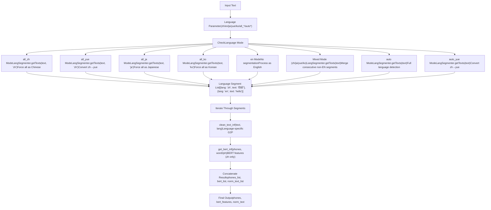
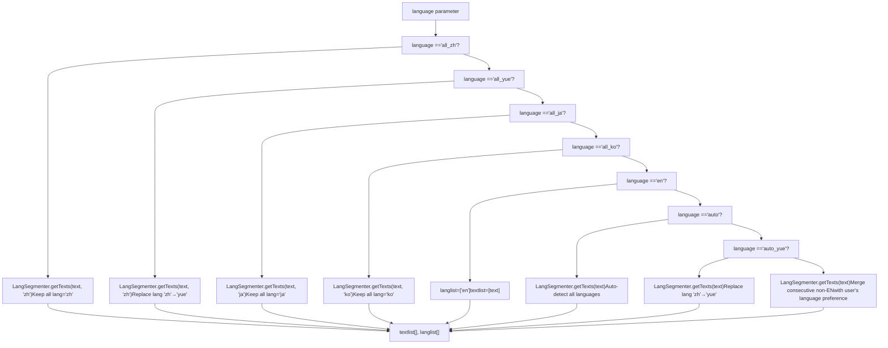
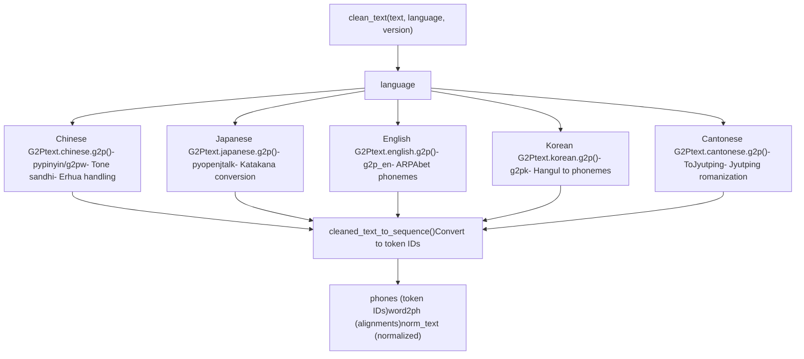
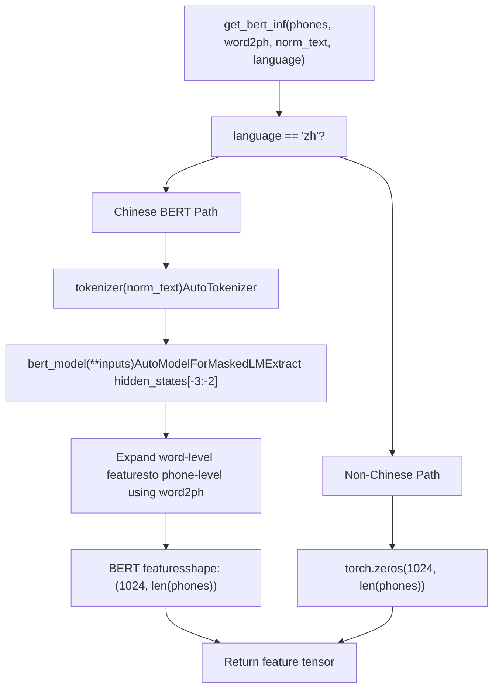
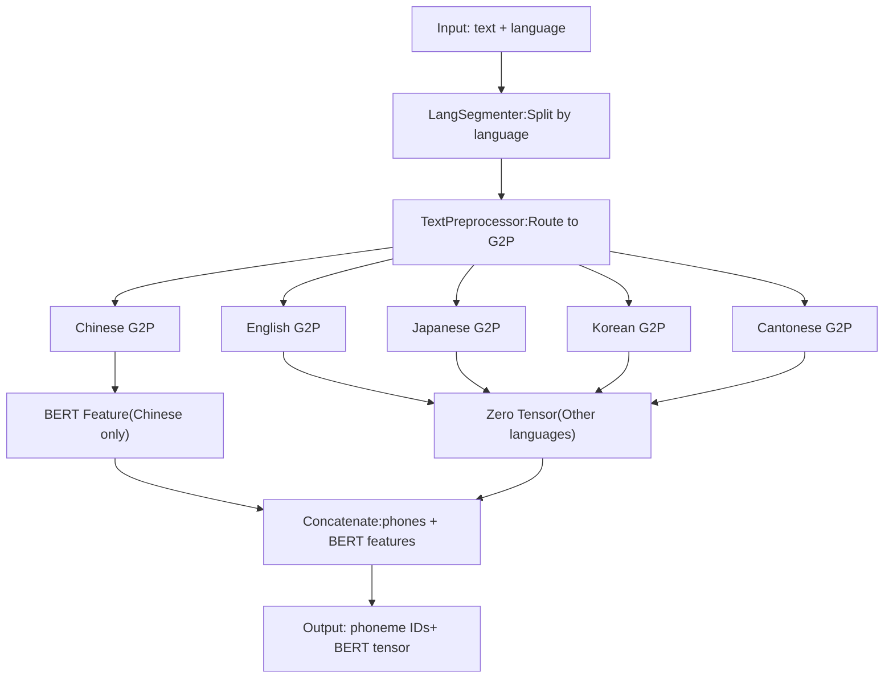

# 多语言支持 (Multi-language Support)

相关源文件

-   [.gitignore](https://github.com/RVC-Boss/GPT-SoVITS/blob/c767f0b8/.gitignore)
-   [GPT\_SoVITS/AR/models/t2s\_model.py](https://github.com/RVC-Boss/GPT-SoVITS/blob/c767f0b8/GPT_SoVITS/AR/models/t2s_model.py)
-   [GPT\_SoVITS/AR/models/utils.py](https://github.com/RVC-Boss/GPT-SoVITS/blob/c767f0b8/GPT_SoVITS/AR/models/utils.py)
-   [GPT\_SoVITS/TTS\_infer\_pack/TTS.py](https://github.com/RVC-Boss/GPT-SoVITS/blob/c767f0b8/GPT_SoVITS/TTS_infer_pack/TTS.py)
-   [GPT\_SoVITS/TTS\_infer\_pack/TextPreprocessor.py](https://github.com/RVC-Boss/GPT-SoVITS/blob/c767f0b8/GPT_SoVITS/TTS_infer_pack/TextPreprocessor.py)
-   [GPT\_SoVITS/configs/tts\_infer.yaml](https://github.com/RVC-Boss/GPT-SoVITS/blob/c767f0b8/GPT_SoVITS/configs/tts_infer.yaml)
-   [GPT\_SoVITS/text/chinese.py](https://github.com/RVC-Boss/GPT-SoVITS/blob/c767f0b8/GPT_SoVITS/text/chinese.py)
-   [GPT\_SoVITS/text/chinese2.py](https://github.com/RVC-Boss/GPT-SoVITS/blob/c767f0b8/GPT_SoVITS/text/chinese2.py)
-   [GPT\_SoVITS/text/zh\_normalization/num.py](https://github.com/RVC-Boss/GPT-SoVITS/blob/c767f0b8/GPT_SoVITS/text/zh_normalization/num.py)
-   [GPT\_SoVITS/text/zh\_normalization/text\_normlization.py](https://github.com/RVC-Boss/GPT-SoVITS/blob/c767f0b8/GPT_SoVITS/text/zh_normalization/text_normlization.py)
-   [api\_v2.py](https://github.com/RVC-Boss/GPT-SoVITS/blob/c767f0b8/api_v2.py)

本文档描述了 GPT-SoVITS 的多语言文本处理能力，包括支持的语言、语言检测、切分 (Segmentation) 以及特定语言的字母到音素 (G2P) 转换。有关一般文本处理架构，请参阅 [Text Processing Pipeline (文本处理流水线)](/RVC-Boss/GPT-SoVITS/2.2-text-processing-pipeline)。有关中文特定的 G2P 和归一化详细信息，请参阅 [Chinese Text Processing (中文文本处理)](/RVC-Boss/GPT-SoVITS/4.2-chinese-text-processing)。有关语言检测和切分的实现，请参阅 [Language Detection and Segmentation (语言检测与切分)](/RVC-Boss/GPT-SoVITS/4.1-language-detection-and-segmentation)。

## 概览 (Overview)

GPT-SoVITS 支持多种语言，其能力取决于版本。系统可以处理：

-   纯单语言文本
-   带有自动语言检测的混合语言 (Mixed-language) 文本
-   强制语言解释模式 (Forced language interpretation modes)

语言支持因模型版本而异：

-   **v1**: 中文、英语、日语（有限）
-   **v2+**: 中文、英语、日语、韩语、粤语（扩展）

多语言系统由三个主要组件组成：

1.  **语言检测与切分 (Language detection and segmentation)** - 识别混合文本中的语言边界 (language boundaries)
2.  **特定语言的 G2P 转换 (Language-specific G2P conversion)** - 使用适合该语言的规则将文本转换为音素
3.  **BERT 特征提取 (BERT feature extraction)** - 生成上下文嵌入 (contextual embeddings)（仅限中文）

来源: [GPT\_SoVITS/TTS\_infer\_pack/TTS.py275-277](https://github.com/RVC-Boss/GPT-SoVITS/blob/c767f0b8/GPT_SoVITS/TTS_infer_pack/TTS.py#L275-L277) [GPT\_SoVITS/TTS\_infer\_pack/TextPreprocessor.py52-222](https://github.com/RVC-Boss/GPT-SoVITS/blob/c767f0b8/GPT_SoVITS/TTS_infer_pack/TextPreprocessor.py#L52-L222)

## 支持的语言与语言代码 (Supported Languages and Language Codes)

### 版本特定的语言支持 (Version-Specific Language Support)

`TTS_Config` 类根据模型版本定义了两个语言列表：

```python
v1_languages: ["auto", "en", "zh", "ja", "all_zh", "all_ja"]
v2_languages: ["auto", "auto_yue", "en", "zh", "ja", "yue", "ko", "all_zh", "all_ja", "all_yue", "all_ko"]
```
| 语言代码 | 全名 | 模式类型 | v1 支持 | v2+ 支持 | 描述 |
| --- | --- | --- | --- | --- | --- |
| `zh` | 中文 (Chinese) | 混合 | ✓ | ✓ | 允许中英混合 |
| `en` | 英语 (English) | 纯语言 | ✓ | ✓ | 仅限英语 |
| `ja` | 日语 (Japanese) | 混合 | ✓ | ✓ | 允许日英混合 |
| `yue` | 粤语 (Cantonese) | 混合 | ✗ | ✓ | 允许粤英混合 |
| `ko` | 韩语 (Korean) | 混合 | ✗ | ✓ | 允许韩英混合 |
| `all_zh` | 全中文 | 强制 | ✓ | ✓ | 强制将所有文本解释为中文 |
| `all_ja` | 全日语 | 强制 | ✓ | ✓ | 强制将所有文本解释为日语 |
| `all_yue` | 全粤语 | 强制 | ✗ | ✓ | 强制将所有文本解释为粤语 |
| `all_ko` | 全韩语 | 强制 | ✗ | ✓ | 强制将所有文本解释为韩语 |
| `auto` | 自动检测 | 自动 | ✓ | ✓ | 检测中/日/英/韩语 |
| `auto_yue` | 自动检测 (粤语) | 自动 | ✗ | ✓ | 类似于 `auto`，但将中文视为粤语 |

来源: [GPT\_SoVITS/TTS\_infer\_pack/TTS.py275-277](https://github.com/RVC-Boss/GPT-SoVITS/blob/c767f0b8/GPT_SoVITS/TTS_infer_pack/TTS.py#L275-L277) [GPT\_SoVITS/TTS\_infer\_pack/TTS.py338](https://github.com/RVC-Boss/GPT-SoVITS/blob/c767f0b8/GPT_SoVITS/TTS_infer_pack/TTS.py#L338-L338)

### 语言模式分类 (Language Mode Categories)

**混合语言模式 (Mixed Language Modes)** (`zh`, `ja`, `yue`, `ko`): 这些模式使用 `LangSegmenter` 来检测语言边界。嵌入在文本中的英语片段会被保留并单独处理，而主要语言则根据指定的代码进行解释。

**强制语言模式 (Forced Language Modes)** (`all_zh`, `all_ja`, `all_yue`, `all_ko`): 这些模式强制将整个输入解释为单一语言，忽略实际的语言检测。对于处理模糊字符（可能是中文、日语或韩语的 CJK 字符）非常有用。

**自动检测模式 (Automatic Detection Modes)** (`auto`, `auto_yue`): 这些模式在不提供语言提示的情况下调用 `LangSegmenter`，从而实现完整的多语言检测。`auto_yue` 变体将检测到的中文片段替换为粤语处理。

来源: [GPT\_SoVITS/TTS\_infer\_pack/TextPreprocessor.py122-169](https://github.com/RVC-Boss/GPT-SoVITS/blob/c767f0b8/GPT_SoVITS/TTS_infer_pack/TextPreprocessor.py#L122-L169)

## 语言检测与文本切分流程 (Language Detection and Text Segmentation Flow)

### 语言处理流水线 (Language Processing Pipeline)


**关键处理逻辑**:

1.  **语言参数检查** [TextPreprocessor.py127-169](https://github.com/RVC-Boss/GPT-SoVITS/blob/c767f0b8/TextPreprocessor.py#L127-L169): 路由到适当的切分策略
2.  **LangSegmenter 调用**: 返回 `{lang: str, text: str}` 字典列表
3.  **片段处理 (Segment Processing)**: 每个片段使用特定语言的 G2P 和 BERT 提取进行处理
4.  **特征拼接 (Feature Concatenation)**: 结果合并为单个音素序列和 BERT 特征张量

来源: [GPT\_SoVITS/TTS\_infer\_pack/TextPreprocessor.py122-189](https://github.com/RVC-Boss/GPT-SoVITS/blob/c767f0b8/GPT_SoVITS/TTS_infer_pack/TextPreprocessor.py#L122-L189)

### 语言模式决策逻辑 (Language Mode Decision Logic)


**混合语言模式特殊逻辑** [TextPreprocessor.py159-169](https://github.com/RVC-Boss/GPT-SoVITS/blob/c767f0b8/TextPreprocessor.py#L159-L169): 当用户指定 `zh`、`ja`、`yue` 或 `ko` 时，系统会：

1.  运行 `LangSegmenter.getTexts(text)` 来检测所有语言
2.  保留英语片段作为单独的条目
3.  将连续的非英语片段与用户指定的语言合并
4.  防止非英语文本碎片化

来源: [GPT\_SoVITS/TTS\_infer\_pack/TextPreprocessor.py127-169](https://github.com/RVC-Boss/GPT-SoVITS/blob/c767f0b8/GPT_SoVITS/TTS_infer_pack/TextPreprocessor.py#L127-L169)

## 特定语言的文本处理 (Language-Specific Text Processing)

### 各语言的 G2P 与音素转换 (G2P and Phoneme Conversion by Language)

每种语言通过 `clean_text` 函数使用不同的 G2P（字母到音素）转换方法：


来源: [GPT\_SoVITS/TTS\_infer\_pack/TextPreprocessor.py206-210](https://github.com/RVC-Boss/GPT-SoVITS/blob/c767f0b8/GPT_SoVITS/TTS_infer_pack/TextPreprocessor.py#L206-L210)

### 特定语言的处理细节 (Language-Specific Processing Details)

| 语言 | G2P 库 | 音素系统 | 关键特性 | 文本模块 |
| --- | --- | --- | --- | --- |
| 中文 (zh) | pypinyin / g2pw | 带声调的拼音 | • 通过 BERT 进行多音字歧义消除<br>• 变调 (Tone sandhi) 规则<br>• 儿化 (Erhua) 处理<br>• 文本归一化 | `text.chinese` |
| 英语 (en) | g2p\_en | ARPAbet | • 标准美式英语发音<br>• 字母到 ARPAbet 转换 | `text.english` |
| 日语 (ja) | pyopenjtalk | 罗马字 (Romaji) | • 片假名/平假名/汉字支持<br>• 重音标记<br>• MeCab 分词 | `text.japanese` |
| 韩语 (ko) | g2pk | 罗马化韩语 | • 谚文 (Hangul) 到音素转换<br>• 韩语语音规则 | `text.korean` |
| 粤语 (yue) | ToJyutping | 粤拼 (Jyutping) | • 粤语特定声调<br>• 繁体字支持 | `text.cantonese` |

来源: [GPT\_SoVITS/TTS\_infer\_pack/TextPreprocessor.py206-210](https://github.com/RVC-Boss/GPT-SoVITS/blob/c767f0b8/GPT_SoVITS/TTS_infer_pack/TextPreprocessor.py#L206-L210) [GPT\_SoVITS/text/chinese.py76-80](https://github.com/RVC-Boss/GPT-SoVITS/blob/c767f0b8/GPT_SoVITS/text/chinese.py#L76-L80) [GPT\_SoVITS/text/chinese2.py73-77](https://github.com/RVC-Boss/GPT-SoVITS/blob/c767f0b8/GPT_SoVITS/text/chinese2.py#L73-L77)

## BERT 特征提取 (仅限中文) (BERT Feature Extraction (Chinese-Only))

### BERT 特征处理逻辑 (BERT Feature Processing Logic)


**BERT 模型配置**: 系统使用 `chinese-roberta-wwm-ext-large`（在中文文本上训练的 RoBERTa，具有整词掩码）。模型路径在 `tts_infer.yaml` 中指定：

```yaml
bert_base_path: GPT_SoVITS/pretrained_models/chinese-roberta-wwm-ext-large
```
**特征提取过程** [TextPreprocessor.py191-222](https://github.com/RVC-Boss/GPT-SoVITS/blob/c767f0b8/TextPreprocessor.py#L191-L222):

1.  **分词 (Tokenization)**: 使用 BERT 分词器对输入文本进行分词
2.  **模型推理**: 通过带有 `output_hidden_states=True` 的 BERT 模型进行前向传播
3.  **层选择**: 从第 -3 层提取隐藏状态（在某些版本中与 -2 层拼接）
4.  **Token 对齐**: 使用 `word2ph` 对齐数组将词级 BERT 特征映射到音素级
5.  **特征扩展**: 根据该词中的音素数量重复每个词的特征
6.  **转置**: 最终形状为 `(1024, num_phones)`，以与模型输入兼容

**非中文语言**: 对于所有非中文语言，由于 BERT 特征对非中文文本没有意义，系统会生成形状为 `(1024, num_phones)` 的全零张量。

来源: [GPT\_SoVITS/TTS\_infer\_pack/TextPreprocessor.py191-222](https://github.com/RVC-Boss/GPT-SoVITS/blob/c767f0b8/GPT_SoVITS/TTS_infer_pack/TextPreprocessor.py#L191-L222) [GPT\_SoVITS/TTS\_infer\_pack/TTS.py484-491](https://github.com/RVC-Boss/GPT-SoVITS/blob/c767f0b8/GPT_SoVITS/TTS_infer_pack/TTS.py#L484-L491)

## 中文 G2P 实现细节 (Chinese G2P Implementation Details)

中文文本处理有两种变体：`text.chinese`（基础）和 `text.chinese2`（带有 g2pw）。

### G2PW 多音字歧义消除 (G2PW Polyphone Disambiguation)

高级中文处理器 (`chinese2.py`) 使用 g2pw（基于 BERT 的多音字歧义消除）：

```python
is_g2pw = True  # 默认启用 g2pw
g2pw = G2PWPinyin(
    model_dir="GPT_SoVITS/text/G2PWModel",
    model_source="GPT_SoVITS/pretrained_models/chinese-roberta-wwm-ext-large",
    v_to_u=False,
    neutral_tone_with_five=True,
)
```
**g2pw vs pypinyin**:

-   **pypinyin** [chinese.py](https://github.com/RVC-Boss/GPT-SoVITS/blob/c767f0b8/chinese.py): 基于规则，速度快但多音字准确度较低
-   **g2pw** [chinese2.py](https://github.com/RVC-Boss/GPT-SoVITS/blob/c767f0b8/chinese2.py): 基于 BERT 的上下文感知，对于模糊字符更准确

### 中文文本归一化 (Chinese Text Normalization)

`TextNormalizer` 类处理数字、日期、时间和特殊字符归一化：

**归一化流水线 (Normalization Pipeline)**:

1.  繁体转简体转换
2.  全角 (Full-width) 转半角 (Half-width) ASCII/数字转换
3.  日期/时间表达式口语化（例如，“2024年1月1日” → “二零二四年一月一日”）
4.  数字口语化（例如，“123” → “一百二十三”）
5.  分数/百分比口语化
6.  电话号码口语化
7.  数学表达式口语化
8.  特殊符号替换（希腊字母 → 中文名称）

来源: [GPT\_SoVITS/text/chinese.py171-181](https://github.com/RVC-Boss/GPT-SoVITS/blob/c767f0b8/GPT_SoVITS/text/chinese.py#L171-L181) [GPT\_SoVITS/text/chinese2.py316-326](https://github.com/RVC-Boss/GPT-SoVITS/blob/c767f0b8/GPT_SoVITS/text/chinese2.py#L316-L326) [GPT\_SoVITS/text/zh\_normalization/text\_normlization.py130-170](https://github.com/RVC-Boss/GPT-SoVITS/blob/c767f0b8/GPT_SoVITS/text/zh_normalization/text_normlization.py#L130-L170)

### 儿化音处理 (Erhua Handling)

儿化音 (Erhua, "r-coloring") 在 `chinese2.py` 中有特殊处理：

```python
must_erhua = {"小院儿", "胡同儿", "范儿", ...}
not_erhua = {"虐儿", "为儿", "护儿", ...}

def _merge_erhua(initials, finals, word, pos):
    # 为儿化词将 "er" 音与前一个音节合并
    # 例如，“玩儿” → "wan2" + "er5" → "wanr2"
    ...
```
系统维护白名单 (`must_erhua`) 和黑名单 (`not_erhua`) 以正确处理模糊情况。

来源: [GPT\_SoVITS/text/chinese2.py93-178](https://github.com/RVC-Boss/GPT-SoVITS/blob/c767f0b8/GPT_SoVITS/text/chinese2.py#L93-L178)

## API 使用与验证 (API Usage and Validation)

### 语言参数验证 (Language Parameter Validation)

REST API 根据版本特定的支持语言验证语言代码：

```python
# 在 api_v2.py 的 check_params() 中
if text_lang.lower() not in tts_config.languages:
    return JSONResponse(
        status_code=400,
        content={"message": f"text_lang: {text_lang} is not supported in version {tts_config.version}"}
    )

if prompt_lang.lower() not in tts_config.languages:
    return JSONResponse(
        status_code=400,
        content={"message": f"prompt_lang: {prompt_lang} is not supported in version {tts_config.version}"}
    )
```
### API 请求示例 (API Request Examples)

**单语言 (中文)**:

```json
{
    "text": "你好世界",
    "text_lang": "zh",
    "prompt_text": "大家好",
    "prompt_lang": "zh",
    "ref_audio_path": "reference.wav"
}
```
**混合语言 (中文带英文)**:

```json
{
    "text": "我喜欢Python programming",
    "text_lang": "zh",
    "prompt_lang": "zh"
}
```
系统会自动将 "Python" 和 "programming" 检测为英语片段。

**多语言自动检测**:

```json
{
    "text": "你好world こんにちは",
    "text_lang": "auto",
    "prompt_lang": "zh"
}
```
自动检测中文、英文和日文片段。

**强制语言解释**:

```json
{
    "text": "今日はいい天気",
    "text_lang": "all_ja",
    "prompt_lang": "ja"
}
```
强制将所有字符解释为日语，即使它们也是有效的中文。

来源: [api\_v2.py305-341](https://github.com/RVC-Boss/GPT-SoVITS/blob/c767f0b8/api_v2.py#L305-L341) [api\_v2.py456-508](https://github.com/RVC-Boss/GPT-SoVITS/blob/c767f0b8/api_v2.py#L456-L508)

## 配置与模型路径 (Configuration and Model Paths)

### 语言相关配置 (Language-Related Configuration)

`tts_infer.yaml` 配置指定了所有语言处理模型的路径：

```yaml
custom:
  bert_base_path: GPT_SoVITS/pretrained_models/chinese-roberta-wwm-ext-large
  cnhuhbert_base_path: GPT_SoVITS/pretrained_models/chinese-hubert-base
  version: v2
```
所有模型版本（v1-v4、v2Pro、v2ProPlus）都使用相同的 BERT 和 CNHubert 模型，确保各版本之间一致的多语言支持。

### 版本特定的语言列表 (Version-Specific Language Lists)

`TTS_Config.__init__` 方法根据版本设置适当的语言列表：

```python
def __init__(self, configs):
    ...
    self.version = configs.get("version", None)
    self.languages = self.v1_languages if self.version == "v1" else self.v2_languages
```
这确保了 API 验证和 UI 选项反映了所加载模型版本的正确语言能力。

来源: [GPT\_SoVITS/configs/tts_infer.yaml1-57](https://github.com/RVC-Boss/GPT-SoVITS/blob/c767f0b8/GPT_SoVITS/configs/tts_infer.yaml#L1-L57) [GPT\_SoVITS/TTS\_infer\_pack/TTS.py299-338](https://github.com/RVC-Boss/GPT-SoVITS/blob/c767f0b8/GPT_SoVITS/TTS_infer_pack/TTS.py#L299-L338)

## 实现摘要 (Implementation Summary)

### 关键类与方法 (Key Classes and Methods)

| 组件 | 文件 | 关键方法/类 | 职责 |
| --- | --- | --- | --- |
| 语言路由 | `TextPreprocessor.py` | `get_phones_and_bert()` | 将文本片段路由到特定语言的处理程序 |
| 中文 G2P | `chinese.py`, `chinese2.py` | `g2p()`, `_g2p()` | 将中文文本转换为拼音音素 |
| BERT 提取 | `TextPreprocessor.py` | `get_bert_feature()`, `get_bert_inf()` | 提取中文的 BERT 嵌入 |
| 文本清洗 | `cleaner.py` | `clean_text()` | 分发到特定语言的 G2P |
| 归一化 | `zh_normalization/` | `TextNormalizer` | 归一化数字、日期、符号 |
| 配置 | `TTS.py` | `TTS_Config` | 管理语言列表和验证 |
| API 验证 | `api_v2.py` | `check_params()` | 验证语言代码 |

### 处理流摘要 (Processing Flow Summary)


来源: [GPT\_SoVITS/TTS\_infer\_pack/TextPreprocessor.py52-222](https://github.com/RVC-Boss/GPT-SoVITS/blob/c767f0b8/GPT_SoVITS/TTS_infer_pack/TextPreprocessor.py#L52-L222) [GPT\_SoVITS/TTS\_infer\_pack/TTS.py421-463](https://github.com/RVC-Boss/GPT-SoVITS/blob/c767f0b8/GPT_SoVITS/TTS_infer_pack/TTS.py#L421-L463)
