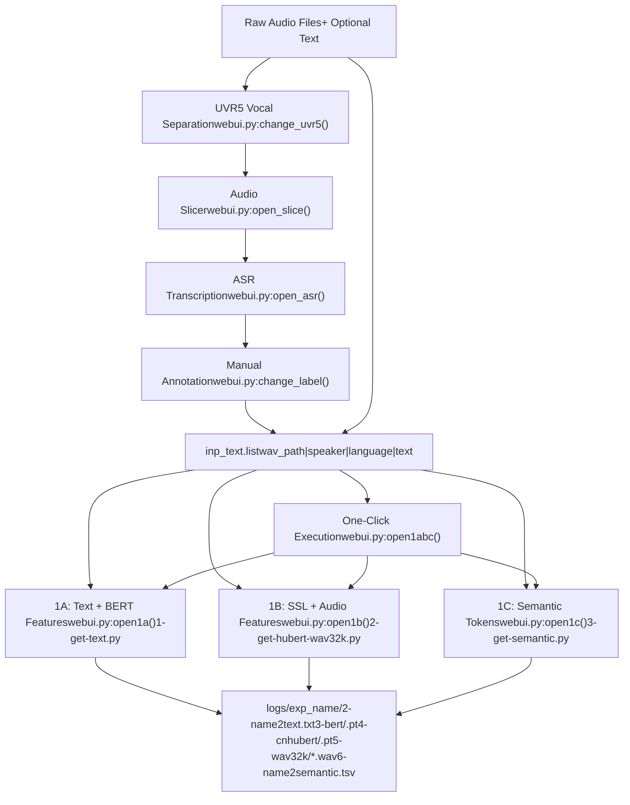
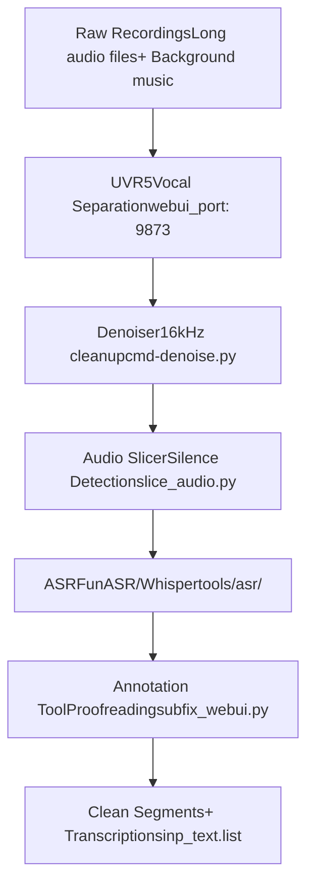
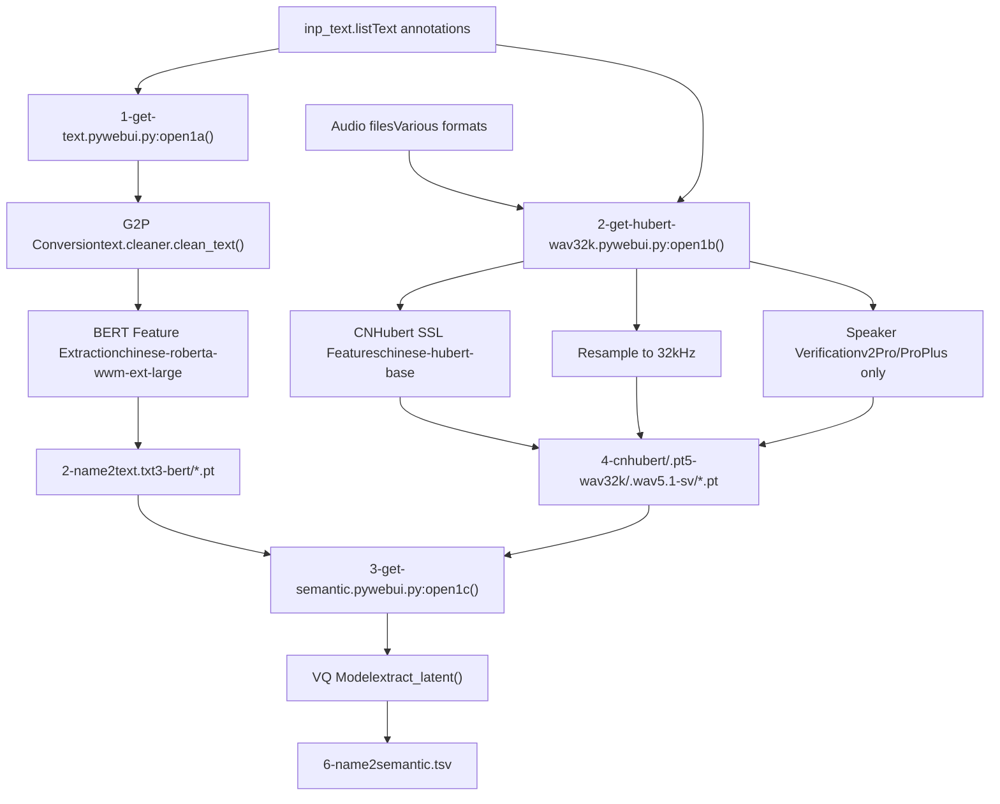
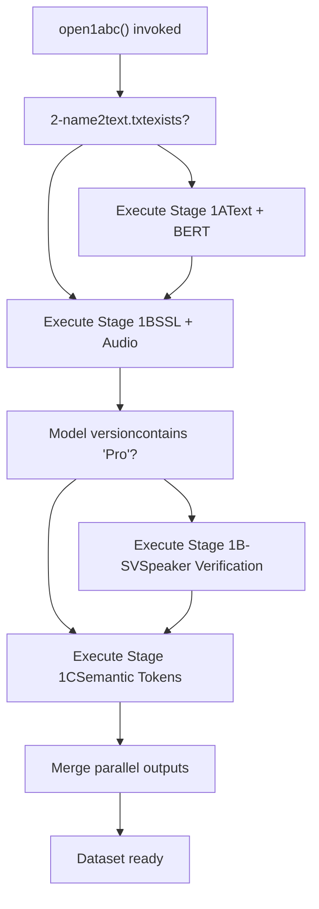

# Data Preparation (数据准备)

相关源文件

-   [GPT\_SoVITS/prepare\_datasets/1-get-text.py](https://github.com/RVC-Boss/GPT-SoVITS/blob/c767f0b8/GPT_SoVITS/prepare_datasets/1-get-text.py)
-   [GPT\_SoVITS/prepare\_datasets/2-get-hubert-wav32k.py](https://github.com/RVC-Boss/GPT-SoVITS/blob/c767f0b8/GPT_SoVITS/prepare_datasets/2-get-hubert-wav32k.py)
-   [GPT\_SoVITS/prepare\_datasets/3-get-semantic.py](https://github.com/RVC-Boss/GPT-SoVITS/blob/c767f0b8/GPT_SoVITS/prepare_datasets/3-get-semantic.py)
-   [GPT\_SoVITS/s1\_train.py](https://github.com/RVC-Boss/GPT-SoVITS/blob/c767f0b8/GPT_SoVITS/s1_train.py)
-   [api.py](https://github.com/RVC-Boss/GPT-SoVITS/blob/c767f0b8/api.py)
-   [config.py](https://github.com/RVC-Boss/GPT-SoVITS/blob/c767f0b8/config.py)
-   [webui.py](https://github.com/RVC-Boss/GPT-SoVITS/blob/c767f0b8/webui.py)

## Purpose and Scope (目的与范围)

Data Preparation (数据准备) 是将原始音频文件及其对应的文本 Transcriptions (转录) 转换为训练 GPT-SoVITS 模型所需的 Structured Feature Representations (结构化特征表示) 的过程。本页面提供了完整数据准备工作流的概览。

有关特定工具和流程的详细信息：

-   音频预处理工具（UVR5、切分、去噪）：参见 [Audio Preprocessing Tools](/RVC-Boss/GPT-SoVITS/5.1-audio-preprocessing-tools)
-   自动语音识别 (ASR)：参见 [Automatic Speech Recognition](/RVC-Boss/GPT-SoVITS/5.2-automatic-speech-recognition)
-   特征提取脚本：参见 [Feature Extraction Scripts](/RVC-Boss/GPT-SoVITS/5.3-feature-extraction-scripts)
-   手动标注与校对：参见 [Audio Annotation Tools](/RVC-Boss/GPT-SoVITS/5.4-audio-annotation-tools)

有关使用准备好的数据进行训练的信息，请参见 [Model Training](/RVC-Boss/GPT-SoVITS/6-model-training)。

## Overview (概览)

数据准备工作流将原始录音转换为可以进行模型训练的结构化数据集。该过程包含两个主要阶段：

1.  **Stage 0 (可选)**：音频预处理，用于清洗和切分原始录音
2.  **Stage 1 (必选)**：Feature Extraction (特征提取)，用于从清洗后的音频片段中生成训练数据

整个工作流可以通过主 WebUI 执行，高级用例也可以通过单个命令行脚本执行。


**Sources:** [webui.py1-1500](https://github.com/RVC-Boss/GPT-SoVITS/blob/c767f0b8/webui.py#L1-L1500) [GPT\_SoVITS/prepare\_datasets/1-get-text.py](https://github.com/RVC-Boss/GPT-SoVITS/blob/c767f0b8/GPT_SoVITS/prepare_datasets/1-get-text.py) [GPT\_SoVITS/prepare\_datasets/2-get-hubert-wav32k.py](https://github.com/RVC-Boss/GPT-SoVITS/blob/c767f0b8/GPT_SoVITS/prepare_datasets/2-get-hubert-wav32k.py) [GPT\_SoVITS/prepare\_datasets/3-get-semantic.py](https://github.com/RVC-Boss/GPT-SoVITS/blob/c767f0b8/GPT_SoVITS/prepare_datasets/3-get-semantic.py)

## Input Requirements (输入要求)

### Input Text List Format (输入文本列表格式)

主要的输入是一个文本文件 (`inp_text.list`)，每一行使用管道符分隔的值来描述一个音频文件：

```
wav_path|speaker_name|language|text_content
```
**字段描述：**

| Field | Description | Example |
| --- | --- | --- |
| `wav_path` | 音频文件的绝对或相对路径 | `/data/audio/sample001.wav` |
| `speaker_name` | 说话人标识符（用于多说话人模型） | `speaker1` |
| `language` | 语言代码：`zh`, `en`, `ja`, `ko`, `yue` | `zh` |
| `text_content` | 音频的文本转录 | `你好世界` |

**示例：**

```
/data/audio/001.wav|speaker1|zh|今天天气很好。
/data/audio/002.wav|speaker1|en|Hello world.
/data/audio/003.wav|speaker2|ja|こんにちは。
```
**Sources:** [webui.py780-829](https://github.com/RVC-Boss/GPT-SoVITS/blob/c767f0b8/webui.py#L780-L829) [GPT\_SoVITS/prepare\_datasets/1-get-text.py127-136](https://github.com/RVC-Boss/GPT-SoVITS/blob/c767f0b8/GPT_SoVITS/prepare_datasets/1-get-text.py#L127-L136)

### Supported Languages (支持的语言)

系统支持五种语言，并对 v1 格式具有 Backward Compatibility (向后兼容性)：

| v2 Code | v1 Code | Language |
| --- | --- | --- |
| `zh` | `ZH` | Mandarin Chinese (普通话) |
| `en` | `EN` | English (英语) |
| `ja` | `JP`, `JA` | Japanese (日语) |
| `ko` | `KO` | Korean (韩语) |
| `yue` | `YUE` | Cantonese (粤语) |

**Sources:** [GPT\_SoVITS/prepare\_datasets/1-get-text.py110-126](https://github.com/RVC-Boss/GPT-SoVITS/blob/c767f0b8/GPT_SoVITS/prepare_datasets/1-get-text.py#L110-L126)

### Audio File Requirements (音频文件要求)

-   **格式**：WAV、MP3 或 librosa 支持的其他格式
-   **推荐时长**：每个分段 2-15 秒
-   **采样率**：任意（在处理过程中将重采样至 32kHz）
-   **声道**：单声道或立体声（立体声将被转换为单声道）
-   **质量**：干净的、没有背景音乐的人声录音（如有需要，请使用 UVR5）

**Sources:** [GPT\_SoVITS/prepare\_datasets/2-get-hubert-wav32k.py82-106](https://github.com/RVC-Boss/GPT-SoVITS/blob/c767f0b8/GPT_SoVITS/prepare_datasets/2-get-hubert-wav32k.py#L82-L106)

## Stage 0: Audio Preprocessing (Optional) (阶段 0：音频预处理 (可选))

阶段 0 包含一些可选的预处理步骤，用于在特征提取之前提高数据质量。虽然不是严格要求的，但这些步骤会显著提升训练效果。

### Preprocessing Tools Overview (预处理工具概览)


**工作流说明：**

1.  **UVR5 Vocal Separation (人声分离)**：从录音中去除背景音乐和混响
2.  **Denoising (去噪)**：减少噪声伪影（可选，针对嘈杂的录音）
3.  **Audio Slicer (音频切分器)**：根据 Silence Detection (静音检测) 将长录音切分为适合训练的片段
4.  **ASR**：自动转录音频片段
5.  **手动标注**：用于纠正 ASR 错误和管理片段的校对界面

这些工具集成在主 WebUI 中，可以按顺序访问，也可以独立访问。

**Sources:** [webui.py298-483](https://github.com/RVC-Boss/GPT-SoVITS/blob/c767f0b8/webui.py#L298-L483) [webui.py678-773](https://github.com/RVC-Boss/GPT-SoVITS/blob/c767f0b8/webui.py#L678-L773)

有关每个预处理工具的详细文档，请参见 [Audio Preprocessing Tools](/RVC-Boss/GPT-SoVITS/5.1-audio-preprocessing-tools) 和 [Automatic Speech Recognition](/RVC-Boss/GPT-SoVITS/5.2-automatic-speech-recognition)。

## Stage 1: Feature Extraction (Required) (阶段 1：特征提取 (必选))

阶段 1 是核心数据准备阶段，从干净的音频片段中提取多种特征表示。该阶段由处理文本和音频数据的三个并行子阶段组成。

### Feature Extraction Pipeline (特征提取流水线)


**Sources:** [webui.py780-1151](https://github.com/RVC-Boss/GPT-SoVITS/blob/c767f0b8/webui.py#L780-L1151) [GPT\_SoVITS/prepare\_datasets/1-get-text.py](https://github.com/RVC-Boss/GPT-SoVITS/blob/c767f0b8/GPT_SoVITS/prepare_datasets/1-get-text.py) [GPT\_SoVITS/prepare\_datasets/2-get-hubert-wav32k.py](https://github.com/RVC-Boss/GPT-SoVITS/blob/c767f0b8/GPT_SoVITS/prepare_datasets/2-get-hubert-wav32k.py) [GPT\_SoVITS/prepare\_datasets/3-get-semantic.py](https://github.com/RVC-Boss/GPT-SoVITS/blob/c767f0b8/GPT_SoVITS/prepare_datasets/3-get-semantic.py)

### Stage 1A: Text and BERT Features (阶段 1A：文本和 BERT 特征)

**脚本**：[GPT\_SoVITS/prepare\_datasets/1-get-text.py](https://github.com/RVC-Boss/GPT-SoVITS/blob/c767f0b8/GPT_SoVITS/prepare_datasets/1-get-text.py)
**WebUI 函数**：[webui.py780-862](https://github.com/RVC-Boss/GPT-SoVITS/blob/c767f0b8/webui.py#L780-L862) `open1a()`

**流程：**

1.  读取输入文本列表并解析语言代码
2.  清洗并归一化文本（数字转文字、符号处理）
3.  使用特定语言的 G2P 模型将文本转换为音素序列
4.  提取 BERT 上下文特征（仅限中文文本）

**输出：**

-   `2-name2text.txt`：具有字到音素映射的音素序列
    -   格式：`filename\tphones\tword2ph\tnorm_text`
-   `3-bert/*.pt`：BERT 特征张量（1024 维，仅限中文）

**关键代码实体：**

-   `clean_text()`：文本归一化和 G2P 转换
-   `get_bert_feature()`：使用 `chinese-roberta-wwm-ext-large` 进行 BERT 特征提取
-   `process()`：用于并行执行的主处理循环

**Sources:** [GPT\_SoVITS/prepare\_datasets/1-get-text.py1-144](https://github.com/RVC-Boss/GPT-SoVITS/blob/c767f0b8/GPT_SoVITS/prepare_datasets/1-get-text.py#L1-L144) [webui.py780-862](https://github.com/RVC-Boss/GPT-SoVITS/blob/c767f0b8/webui.py#L780-L862)

### Stage 1B: SSL and Audio Features (阶段 1B：SSL 和音频特征)

**脚本**：[GPT\_SoVITS/prepare\_datasets/2-get-hubert-wav32k.py](https://github.com/RVC-Boss/GPT-SoVITS/blob/c767f0b8/GPT_SoVITS/prepare_datasets/2-get-hubert-wav32k.py)
**WebUI 函数**：[webui.py870-953](https://github.com/RVC-Boss/GPT-SoVITS/blob/c767f0b8/webui.py#L870-L953) `open1b()`

**流程：**

1.  使用 librosa 加载音频文件
2.  使用 Adaptive Scaling (自适应缩放) 归一化音频幅度
3.  将音频重采样至 16kHz 以进行 CNHubert 处理
4.  使用 `chinese-hubert-base` 提取 768 维 SSL 特征
5.  保存重采样的 32kHz 音频用于训练
6.  （仅限 v2Pro/ProPlus）提取说话人验证嵌入

**输出：**

-   `4-cnhubert/*.pt`：SSL 特征张量（768 维）
-   `5-wav32k/*.wav`：32kHz 的重采样音频
-   `5.1-sv/*.pt`：说话人验证特征（20480 维，仅限 v2Pro）

**音频归一化：**

```
# 自适应幅度归一化
tmp_audio32 = (tmp_audio / tmp_max * (0.95 * 0.5 * 32768)) + ((1 - 0.5) * 32768) * tmp_audio
```
**NaN Handling (NaN 处理)**：如果 SSL 提取在使用 FP16 时产生 NaN 值，脚本会自动回退到 FP32 处理。

**Sources:** [GPT\_SoVITS/prepare\_datasets/2-get-hubert-wav32k.py1-135](https://github.com/RVC-Boss/GPT-SoVITS/blob/c767f0b8/GPT_SoVITS/prepare_datasets/2-get-hubert-wav32k.py#L1-L135) [webui.py870-953](https://github.com/RVC-Boss/GPT-SoVITS/blob/c767f0b8/webui.py#L870-L953)

### Stage 1C: Semantic Token Extraction (阶段 1C：语义标记提取)

**脚本**：[GPT\_SoVITS/prepare\_datasets/3-get-semantic.py](https://github.com/RVC-Boss/GPT-SoVITS/blob/c767f0b8/GPT_SoVITS/prepare_datasets/3-get-semantic.py)
**WebUI 函数**：[webui.py960-1039](https://github.com/RVC-Boss/GPT-SoVITS/blob/c767f0b8/webui.py#L960-L1039) `open1c()`

**流程：**

1.  加载预训练的 SoVITS-G 模型作为 VQ Quantizer (VQ 量化器)
2.  读取阶段 1B 输出的 SSL 特征
3.  将连续的 SSL 特征编码为离散的 Semantic Tokens (语义标记)
4.  保存标记序列用于 GPT 训练

**输出：**

-   `6-name2semantic.tsv`：语义标记 ID
    -   格式：`filename\ttoken_id1 token_id2 token_id3 ...`

**模型版本检测**：脚本根据文件大小自动检测模型版本：

-   < 82978 KB: v1
-   82978-100000 KB: v2
-   100000-103520 KB: v1
-   103520-700000 KB: v2
-   \> 700000 KB: v3/v4

**关键代码实体：**

-   `vq_model.extract_latent()`：将 SSL 特征转换为离散代码
-   `SynthesizerTrn` / `SynthesizerTrnV3`：版本特定的模型类

**Sources:** [GPT\_SoVITS/prepare\_datasets/3-get-semantic.py1-119](https://github.com/RVC-Boss/GPT-SoVITS/blob/c767f0b8/GPT_SoVITS/prepare_datasets/3-get-semantic.py#L1-L119) [webui.py960-1039](https://github.com/RVC-Boss/GPT-SoVITS/blob/c767f0b8/webui.py#L960-L1039)

### One-Click Execution (一键执行)

**WebUI 函数**：[webui.py1046-1151](https://github.com/RVC-Boss/GPT-SoVITS/blob/c767f0b8/webui.py#L1046-L1151) `open1abc()`

WebUI 中的“1Aabc”按钮会按顺序执行所有三个特征提取阶段：


**并行处理**：通过指定 GPU 编号（例如，3 个 GPU 为 `0-1-2`），每个阶段都可以在多个 GPU 上执行。

**Sources:** [webui.py1046-1151](https://github.com/RVC-Boss/GPT-SoVITS/blob/c767f0b8/webui.py#L1046-L1151)

## Output Dataset Structure (输出数据集结构)

完成阶段 1 后，数据集组织在 `logs/exp_name/` 目录中：

```
logs/exp_name/
├── 2-name2text.txt          # 音素序列
├── 3-bert/                  # BERT 特征（仅限中文）
│   ├── audio001.wav.pt
│   ├── audio002.wav.pt
│   └── ...
├── 4-cnhubert/              # SSL 特征
│   ├── audio001.wav.pt
│   ├── audio002.wav.pt
│   └── ...
├── 5-wav32k/                # 重采样音频
│   ├── audio001.wav
│   ├── audio002.wav
│   └── ...
├── 5.1-sv/                  # 说话人验证 (仅限 v2Pro)
│   ├── audio001.wav.pt
│   ├── audio002.wav.pt
│   └── ...
└── 6-name2semantic.tsv      # 语义标记
```
### 文件格式详情

**2-name2text.txt：**

```
audio001.wav	p h o n e1 p h o n e2	[2, 1, 3, 1, 2]	normalized_text
audio002.wav	p h o n e3 p h o n e4	[1, 2, 1, 3]	normalized_text
```
字段（制表符分隔）：

1.  文件名
2.  空格分隔的音素序列
3.  字到音素映射（每个词的音素计数列表）
4.  归一化文本

**6-name2semantic.tsv：**

```
item_name	semantic_audio
audio001.wav	142 523 234 156 789 ...
audio002.wav	234 567 123 890 456 ...
```
字段（制表符分隔）：

1.  文件名
2.  空格分隔的语义标记 ID

**二进制特征文件 (.pt)：**

-   BERT 特征：`[1024, num_phones]` 张量
-   SSL 特征：`[768, num_frames]` 张量
-   说话人验证：`[20480]` 张量（仅限 v2Pro）

**Sources:** [webui.py819-828](https://github.com/RVC-Boss/GPT-SoVITS/blob/c767f0b8/webui.py#L819-L828) [webui.py1003-1011](https://github.com/RVC-Boss/GPT-SoVITS/blob/c767f0b8/webui.py#L1003-L1011) [GPT\_SoVITS/prepare\_datasets/1-get-text.py139-143](https://github.com/RVC-Boss/GPT-SoVITS/blob/c767f0b8/GPT_SoVITS/prepare_datasets/1-get-text.py#L139-L143) [GPT\_SoVITS/prepare\_datasets/3-get-semantic.py99-100](https://github.com/RVC-Boss/GPT-SoVITS/blob/c767f0b8/GPT_SoVITS/prepare_datasets/3-get-semantic.py#L99-L100)

## Parallel Processing (并行处理)

所有特征提取阶段都支持多 GPU Parallel Processing (并行处理)，以加速数据集准备。

### GPU Distribution Strategy (GPU 分配策略)

**配置**：将 GPU 指定为连字符分隔的索引（例如，3 个 GPU 为 `0-1-2`）

**负载分配：**

```
for line in lines[int(i_part) :: int(all_parts)]:    # 从 i_part 开始处理每隔 all_parts 这一行
```
每个 GPU 使用 Round-robin Distribution (轮询分配) 处理输入列表的不相交子集。

**使用 3 个 GPU 的示例：**

-   GPU 0：处理第 0, 3, 6, 9, ... 行
-   GPU 1：处理第 1, 4, 7, 10, ... 行
-   GPU 2：处理第 2, 5, 8, 11, ... 行

### Output Merging (输出合并)

并行处理完成后，WebUI 会自动合并部分输出：

**阶段 1A (文本)：**

```
# 合并 2-name2text-{i}.txt 文件
for i_part in range(all_parts):
    txt_path = "%s/2-name2text-%s.txt" % (opt_dir, i_part)
    with open(txt_path, "r", encoding="utf8") as f:
        opt += f.read().strip("\n").split("\n")
    os.remove(txt_path)
# 写入合并后的输出
with open("%s/2-name2text.txt" % opt_dir, "w", encoding="utf8") as f:
    f.write("\n".join(opt) + "\n")
```
**阶段 1C (语义)：**

```
# 合并 6-name2semantic-{i}.tsv 文件
for i_part in range(all_parts):
    semantic_path = "%s/6-name2semantic-%s.tsv" % (opt_dir, i_part)
    with open(semantic_path, "r", encoding="utf8") as f:
        opt += f.read().strip("\n").split("\n")
    os.remove(semantic_path)
# 写入合并后的输出
with open("%s/6-name2semantic.tsv" % opt_dir, "w", encoding="utf8") as f:
    f.write("\n".join(opt) + "\n")
```
**Sources:** [webui.py817-828](https://github.com/RVC-Boss/GPT-SoVITS/blob/c767f0b8/webui.py#L817-L828) [webui.py1003-1011](https://github.com/RVC-Boss/GPT-SoVITS/blob/c767f0b8/webui.py#L1003-L1011) [GPT\_SoVITS/prepare\_datasets/1-get-text.py108-109](https://github.com/RVC-Boss/GPT-SoVITS/blob/c767f0b8/GPT_SoVITS/prepare_datasets/1-get-text.py#L108-L109) [GPT\_SoVITS/prepare\_datasets/2-get-hubert-wav32k.py111](https://github.com/RVC-Boss/GPT-SoVITS/blob/c767f0b8/GPT_SoVITS/prepare_datasets/2-get-hubert-wav32k.py#L111-L111) [GPT\_SoVITS/prepare\_datasets/3-get-semantic.py106](https://github.com/RVC-Boss/GPT-SoVITS/blob/c767f0b8/GPT_SoVITS/prepare_datasets/3-get-semantic.py#L106-L106)

## Environment Configuration (环境配置)

特征提取脚本通过 WebUI 设置的环境变量接收配置：

| Variable | Description | Example |
| --- | --- | --- |
| `inp_text` | 输入文本列表路径 | `/data/project/input.list` |
| `inp_wav_dir` | 包含音频文件的目录 | `/data/project/audio/` |
| `exp_name` | 实验名称 | `my_speaker` |
| `opt_dir` | 输出目录 | `logs/my_speaker` |
| `i_part` | 当前 GPU 索引 (从 0 开始) | `0` |
| `all_parts` | GPU 总数 | `3` |
| `_CUDA_VISIBLE_DEVICES` | GPU 设备 ID | `0` |
| `is_half` | 使用 FP16 精度 | `True` |
| `bert_pretrained_dir` | BERT 模型路径 | `GPT_SoVITS/pretrained_models/chinese-roberta-wwm-ext-large` |
| `cnhubert_base_dir` | CNHubert 模型路径 | `GPT_SoVITS/pretrained_models/chinese-hubert-base` |
| `pretrained_s2G` | 用于语义提取的 SoVITS-G 模型路径 | `GPT_SoVITS/pretrained_models/s2G488k.pth` |
| `s2config_path` | SoVITS 配置路径 | `GPT_SoVITS/configs/s2.json` |

**Sources:** [webui.py788-806](https://github.com/RVC-Boss/GPT-SoVITS/blob/c767f0b8/webui.py#L788-L806) [webui.py878-897](https://github.com/RVC-Boss/GPT-SoVITS/blob/c767f0b8/webui.py#L878-L897) [webui.py973-991](https://github.com/RVC-Boss/GPT-SoVITS/blob/c767f0b8/webui.py#L973-L991) [GPT\_SoVITS/prepare\_datasets/1-get-text.py5-13](https://github.com/RVC-Boss/GPT-SoVITS/blob/c767f0b8/GPT_SoVITS/prepare_datasets/1-get-text.py#L5-L13) [GPT\_SoVITS/prepare\_datasets/2-get-hubert-wav32k.py6-16](https://github.com/RVC-Boss/GPT-SoVITS/blob/c767f0b8/GPT_SoVITS/prepare_datasets/2-get-hubert-wav32k.py#L6-L16) [GPT\_SoVITS/prepare\_datasets/3-get-semantic.py3-11](https://github.com/RVC-Boss/GPT-SoVITS/blob/c767f0b8/GPT_SoVITS/prepare_datasets/3-get-semantic.py#L3-L11)

## Next Steps (后续步骤)

完成数据准备后：

1.  **验证输出**：检查所有输出目录包含的文件数量是否与输入列表一致
2.  **配置训练**：在 WebUI 或配置文件中设置训练参数
3.  **训练 GPT 模型**：参见 [GPT Model Training](/RVC-Boss/GPT-SoVITS/6.2-gpt-model-training)
4.  **训练 SoVITS 模型**：参见 [SoVITS Model Training](/RVC-Boss/GPT-SoVITS/6.3-sovits-model-training)

要解决常见的数据准备问题，请参考 WebUI 的错误消息，这些消息会自动对输入路径和输出进行验证。

**Sources:** [webui.py784-785](https://github.com/RVC-Boss/GPT-SoVITS/blob/c767f0b8/webui.py#L784-L785) [webui.py874-875](https://github.com/RVC-Boss/GPT-SoVITS/blob/c767f0b8/webui.py#L874-L875) [webui.py963-964](https://github.com/RVC-Boss/GPT-SoVITS/blob/c767f0b8/webui.py#L963-L964) [webui.py1061-1062](https://github.com/RVC-Boss/GPT-SoVITS/blob/c767f0b8/webui.py#L1061-L1062)
