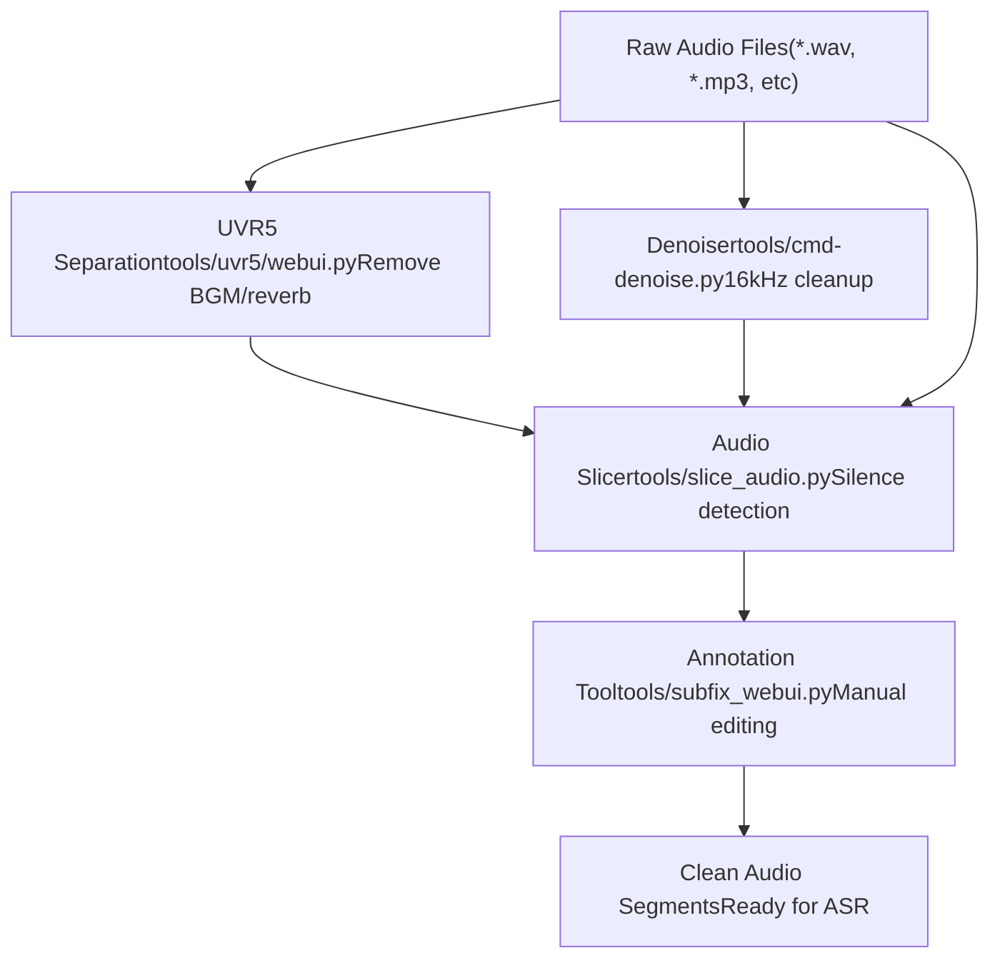
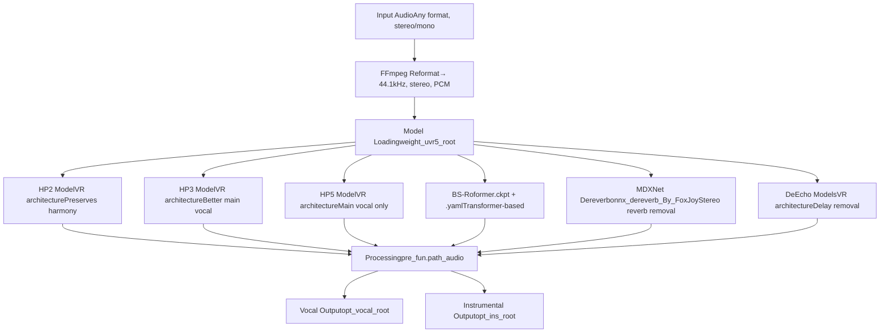
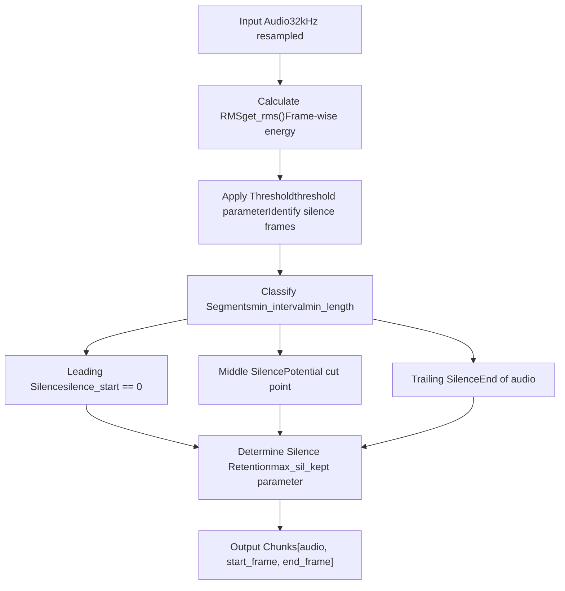
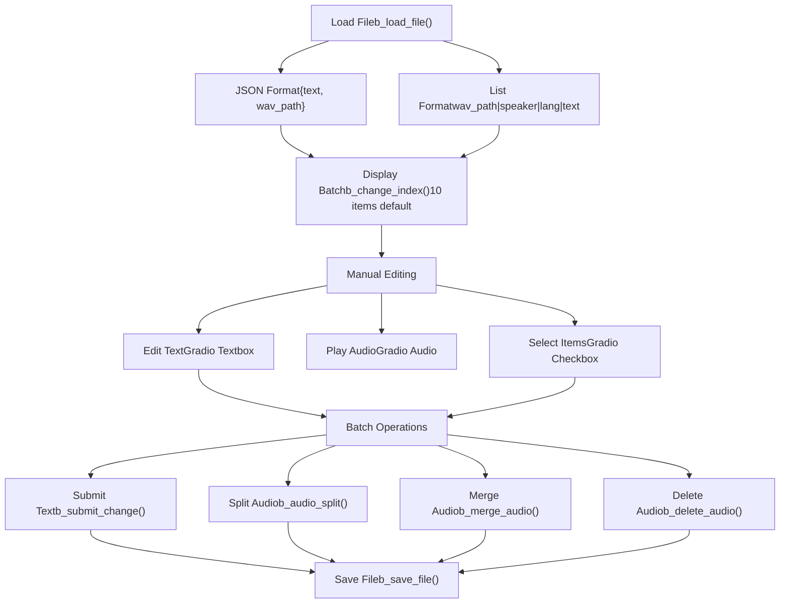

# 音频预处理工具 (Audio Preprocessing Tools)

相关源文件

-   [api.py](https://github.com/RVC-Boss/GPT-SoVITS/blob/c767f0b8/api.py)
-   [config.py](https://github.com/RVC-Boss/GPT-SoVITS/blob/c767f0b8/config.py)
-   [tools/my\_utils.py](https://github.com/RVC-Boss/GPT-SoVITS/blob/c767f0b8/tools/my_utils.py)
-   [tools/slice\_audio.py](https://github.com/RVC-Boss/GPT-SoVITS/blob/c767f0b8/tools/slice_audio.py)
-   [tools/slicer2.py](https://github.com/RVC-Boss/GPT-SoVITS/blob/c767f0b8/tools/slicer2.py)
-   [tools/subfix\_webui.py](https://github.com/RVC-Boss/GPT-SoVITS/blob/c767f0b8/tools/subfix_webui.py)
-   [tools/uvr5/webui.py](https://github.com/RVC-Boss/GPT-SoVITS/blob/c767f0b8/tools/uvr5/webui.py)
-   [webui.py](https://github.com/RVC-Boss/GPT-SoVITS/blob/c767f0b8/webui.py)

本页面记录了用于在 GPT-SoVITS 中准备原始录音以供训练的音频预处理工具。这些工具在特征提取 (Feature Extraction) 之前对音频数据进行清洗、切分和组织。

**范围**: 本页面涵盖人声分离 (UVR5)、音频切分 (Audio Slicing)、降噪 (Denoising) 和标注工具。有关用于转录 (Transcription) 的自动语音识别，请参阅 [Automatic Speech Recognition (自动语音识别)](/RVC-Boss/GPT-SoVITS/5.2-automatic-speech-recognition)。有关随后的特征提取步骤，请参阅 [Feature Extraction Scripts (特征提取脚本)](/RVC-Boss/GPT-SoVITS/5.3-feature-extraction-scripts)。

## 概览 (Overview)

预处理流水线通过四个主要工具将原始录音转换为可用于训练的片段：

| 工具 | 用途 | 端口 | 入口点 |
| --- | --- | --- | --- |
| UVR5 | 人声/伴奏分离，混响/回声移除 | 9873 | [tools/uvr5/webui.py](https://github.com/RVC-Boss/GPT-SoVITS/blob/c767f0b8/tools/uvr5/webui.py) |
| 音频切分器 (Audio Slicer) | 基于静音的切分 | 不适用 | [tools/slice\_audio.py](https://github.com/RVC-Boss/GPT-SoVITS/blob/c767f0b8/tools/slice_audio.py) |
| 降噪器 (Denoiser) | 16kHz 降噪 | 不适用 | [tools/cmd-denoise.py](https://github.com/RVC-Boss/GPT-SoVITS/blob/c767f0b8/tools/cmd-denoise.py) |
| 标注工具 (Annotation Tool) | 手动转录纠正，片段编辑 | 9871 | [tools/subfix\_webui.py](https://github.com/RVC-Boss/GPT-SoVITS/blob/c767f0b8/tools/subfix_webui.py) |

所有工具都集成在主 WebUI ([webui.py](https://github.com/RVC-Boss/GPT-SoVITS/blob/c767f0b8/webui.py)) 中，可以作为独立进程启动或通过编程方式调用。

来源: [webui.py1-484](https://github.com/RVC-Boss/GPT-SoVITS/blob/c767f0b8/webui.py#L1-L484) [config.py140-143](https://github.com/RVC-Boss/GPT-SoVITS/blob/c767f0b8/config.py#L140-L143)

## 处理工作流 (Processing Workflow)


**典型工作流**:

1.  **UVR5**: 移除录音中的背景音乐 (BGM) 和混响
2.  **降噪器 (Denoiser)**: 减少环境噪音（可选）
3.  **切分器 (Slicer)**: 将长音频切分为训练长度的片段（2-15 秒）
4.  **标注 (Annotation)**: 检查并编辑切分结果，纠正转录内容

来源: [webui.py298-326](https://github.com/RVC-Boss/GPT-SoVITS/blob/c767f0b8/webui.py#L298-L326) [webui.py432-482](https://github.com/RVC-Boss/GPT-SoVITS/blob/c767f0b8/webui.py#L432-L482) [webui.py682-757](https://github.com/RVC-Boss/GPT-SoVITS/blob/c767f0b8/webui.py#L682-L757) [webui.py270-295](https://github.com/RVC-Boss/GPT-SoVITS/blob/c767f0b8/webui.py#L270-L295)

## UVR5 人声分离 (UVR5 Vocal Separation)

UVR5 (Ultimate Vocal Remover 5) 用于从伴奏中分离人声，并移除混响 (reverb) 和回声 (echo) 等声学伪影。这对于准备带有背景音乐或环境效果的录音至关重要。

### 架构 (Architecture)


来源: [tools/uvr5/webui.py45-125](https://github.com/RVC-Boss/GPT-SoVITS/blob/c767f0b8/tools/uvr5/webui.py#L45-L125)

### 模型分类 (Model Categories)

**1\. 人声保留 (HP2, HP3)**

-   保留和声和伴唱 (backing vocals)
-   HP3 可能会有轻微的伴奏残留，但比 HP2 能更好地保留主唱
-   用例：不带和声的独唱录音

**2\. 仅限主唱 (HP5)**

-   隔离领唱 (lead vocal)，抑制和声
-   可能会略微削弱主唱质量
-   用例：具有多个声部的录音

**3\. 去混响/去回声 (Dereverb/DeEcho)**

-   **MDXNet Dereverb**: 最适合立体声混响，无法移除单声道混响
-   **DeEcho-Normal**: 标准延迟 (delay) 移除
-   **DeEcho-Aggressive**: 更彻底的延迟移除
-   **DeEcho-DeReverb**: 组合延迟和混响移除，速度慢约 2 倍，可以移除单声道混响

推荐的清洁配置：MDXNet Dereverb → DeEcho-Aggressive

来源: [tools/uvr5/webui.py137-168](https://github.com/RVC-Boss/GPT-SoVITS/blob/c767f0b8/tools/uvr5/webui.py#L137-L168)

### 实现细节 (Implementation Details)

模型加载逻辑：

```python
# tools/uvr5/webui.py:52-74
if model_name == "onnx_dereverb_By_FoxJoy":
    pre_fun = MDXNetDereverb(15)
elif "roformer" in model_name.lower():
    func = Roformer_Loader
    pre_fun = func(
        model_path=os.path.join(weight_uvr5_root, model_name + ".ckpt"),
        config_path=os.path.join(weight_uvr5_root, model_name + ".yaml"),
        device=device, is_half=is_half
    )
else:
    func = AudioPre if "DeEcho" not in model_name else AudioPreDeEcho
    pre_fun = func(
        agg=int(agg),
        model_path=os.path.join(weight_uvr5_root, model_name + ".pth"),
        device=device, is_half=is_half
    )
```
处理流水线：

1.  检查音频是否为 44.1kHz 立体声；如果不是，使用 ffmpeg 重新格式化 ([tools/uvr5/webui.py86-100](https://github.com/RVC-Boss/GPT-SoVITS/blob/c767f0b8/tools/uvr5/webui.py#L86-L100))
2.  通过所选模型的 `_path_audio_` 方法进行处理 ([tools/uvr5/webui.py103](https://github.com/RVC-Boss/GPT-SoVITS/blob/c767f0b8/tools/uvr5/webui.py#L103-L103))
3.  输出到单独的人声 (vocal) 和器乐 (instrumental) 目录

**侵略性参数** (`agg`): 控制人声提取的侵略性 (0-20)，目前未在 UI 中公开 ([tools/uvr5/webui.py182-190](https://github.com/RVC-Boss/GPT-SoVITS/blob/c767f0b8/tools/uvr5/webui.py#L182-L190))

来源: [tools/uvr5/webui.py45-125](https://github.com/RVC-Boss/GPT-SoVITS/blob/c767f0b8/tools/uvr5/webui.py#L45-L125)

### WebUI 集成 (WebUI Integration)

从主 WebUI 通过 `change_uvr5()` 启动：

```python
# webui.py:301-325
def change_uvr5():
    global p_uvr5
    if p_uvr5 is None:
        cmd = '"%s" -s tools/uvr5/webui.py "%s" %s %s %s' % (
            python_exec, infer_device, is_half, webui_port_uvr5, is_share
        )
        p_uvr5 = Popen(cmd, shell=True)
        # ... yield 状态更新
    else:
        kill_process(p_uvr5.pid, process_name_uvr5)
        p_uvr5 = None
```
UVR5 WebUI 作为一个单独的 Gradio 应用在 9873 端口运行（可通过 `webui_port_uvr5` 配置）。

来源: [webui.py298-325](https://github.com/RVC-Boss/GPT-SoVITS/blob/c767f0b8/webui.py#L298-L325) [config.py141](https://github.com/RVC-Boss/GPT-SoVITS/blob/c767f0b8/config.py#L141-L141)

## 音频切分器 (Audio Slicer)

音频切分器根据静音检测 (silence detection) 将长录音切分为适合训练的片段（通常为 2-15 秒）。

### 算法概览 (Algorithm Overview)


来源: [tools/slicer2.py67-152](https://github.com/RVC-Boss/GPT-SoVITS/blob/c767f0b8/tools/slicer2.py#L67-L152)

### 核心参数 (Core Parameters)

| 参数 | 默认值 | 单位 | 描述 |
| --- | --- | --- | --- |
| `threshold` | \-40 | dB | RMS 阈值，低于该值的帧被视为静音 |
| `min_length` | 5000 | ms | 每个输出片段的最小持续时间 |
| `min_interval` | 300 | ms | 触发切割的最小静音持续时间 |
| `hop_size` | 20 | ms | RMS 计算帧步长（精度 vs 速度） |
| `max_sil_kept` | 5000 | ms | 每个片段周围保留的最大静音时间 |

来源: [tools/slicer2.py39-58](https://github.com/RVC-Boss/GPT-SoVITS/blob/c767f0b8/tools/slicer2.py#L39-L58)

### Slicer 类实现 (Slicer Class Implementation)

[tools/slicer2.py](https://github.com/RVC-Boss/GPT-SoVITS/blob/c767f0b8/tools/slicer2.py) 中的 `Slicer` 类实现了核心算法：

**初始化** ([tools/slicer2.py39-58](https://github.com/RVC-Boss/GPT-SoVITS/blob/c767f0b8/tools/slicer2.py#L39-L58))：

```python
class Slicer:
    def __init__(self, sr: int, threshold: float = -40.0, 
                 min_length: int = 5000, min_interval: int = 300,
                 hop_size: int = 20, max_sil_kept: int = 5000):
        # 将毫秒转换为采样点/帧
        min_interval = sr * min_interval / 1000
        self.threshold = 10 ** (threshold / 20.0)  # dB 转换为线性值
        self.hop_size = round(sr * hop_size / 1000)
        self.win_size = min(round(min_interval), 4 * self.hop_size)
        self.min_length = round(sr * min_length / 1000 / self.hop_size)
        self.min_interval = round(min_interval / self.hop_size)
        self.max_sil_kept = round(sr * max_sil_kept / 1000 / self.hop_size)
```
**切分逻辑** ([tools/slicer2.py67-152](https://github.com/RVC-Boss/GPT-SoVITS/blob/c767f0b8/tools/slicer2.py#L67-L152))：

1.  使用 `get_rms()` 为每一帧计算 RMS ([tools/slicer2.py5-35](https://github.com/RVC-Boss/GPT-SoVITS/blob/c767f0b8/tools/slicer2.py#L5-L35))
2.  遍历各帧，跟踪静音区域 (silence regions)
3.  当足够的静音之后紧随非静音帧时：
    -   检查间隔是否 ≥ `min_interval` 且片段是否 ≥ `min_length`
    -   根据 `max_sil_kept` 约束记录切割点
4.  返回 `[waveform_chunk, start_sample, end_sample]` 列表

来源: [tools/slicer2.py38-152](https://github.com/RVC-Boss/GPT-SoVITS/blob/c767f0b8/tools/slicer2.py#L38-L152)

### 在流水线中的用法 (Usage in Pipeline)

[tools/slice\_audio.py](https://github.com/RVC-Boss/GPT-SoVITS/blob/c767f0b8/tools/slice_audio.py) 中的 `slice()` 函数封装了 `Slicer` 类：

```python
# tools/slice_audio.py:13-50
def slice(inp, opt_root, threshold, min_length, min_interval, 
          hop_size, max_sil_kept, _max, alpha, i_part, all_part):
    # 在 32kHz 下初始化切分器
    slicer = Slicer(sr=32000, threshold=int(threshold), 
                    min_length=int(min_length), ...)
    
    # 处理文件（支持并行处理）
    for inp_path in input[int(i_part)::int(all_part)]:
        audio = load_audio(inp_path, 32000)
        for chunk, start, end in slicer.slice(audio):
            # 归一化并保存片段
            tmp_max = np.abs(chunk).max()
            chunk = (chunk / tmp_max * (_max * alpha)) + (1 - alpha) * chunk
            wavfile.write(f"{opt_root}/{name}_{start:010d}_{end:010d}.wav", 
                        32000, (chunk * 32767).astype(np.int16))
```
**归一化参数**:

-   `_max`: 目标最大振幅（通常为 0.9）
-   `alpha`: 归一化后与原始信号之间的混合因子 (0-1)

来源: [tools/slice\_audio.py13-50](https://github.com/RVC-Boss/GPT-SoVITS/blob/c767f0b8/tools/slice_audio.py#L13-L50)

### WebUI 集成 (WebUI Integration)

从主 WebUI 通过 `open_slice()` 启动：

```python
# webui.py:682-757
def open_slice(inp, opt_root, threshold, min_length, min_interval, 
               hop_size, max_sil_kept, _max, alpha, n_parts):
    # 支持在 n_parts 个工作进程中进行并行处理
    for i_part in range(n_parts):
        cmd = '"%s" -s tools/slice_audio.py "%s" "%s" %s %s %s %s %s %s %s %s %s' % (
            python_exec, inp, opt_root, threshold, min_length, 
            min_interval, hop_size, max_sil_kept, _max, alpha, 
            i_part, n_parts
        )
        p = Popen(cmd, shell=True)
        ps_slice.append(p)
```
该函数支持：

-   单个文件或目录输入
-   跨多个工作进程（由 `n_parts` 指定）的并行处理
-   输出文件使用开始/结束帧位置命名

来源: [webui.py682-757](https://github.com/RVC-Boss/GPT-SoVITS/blob/c767f0b8/webui.py#L682-L757)

## 降噪器 (Denoiser)

降噪器从音频录制中移除背景噪音，为提高效率在 16kHz 下运行。

### 实现 (Implementation)

通过主 WebUI 中的 `open_denoise()` 调用：

```python
# webui.py:432-470
def open_denoise(denoise_inp_dir, denoise_opt_dir):
    global p_denoise
    if p_denoise == None:
        cmd = '"%s" -s tools/cmd-denoise.py -i "%s" -o "%s" -p %s' % (
            python_exec, denoise_inp_dir, denoise_opt_dir,
            "float16" if is_half == True else "float32"
        )
        p_denoise = Popen(cmd, shell=True)
        p_denoise.wait()
        # ... 状态更新
```
**参数**:

-   `-i`: 输入目录路径
-   `-o`: 输出目录路径
-   `-p`: 精度 (`float16` 或 `float32`)

实际的降噪实现在 [tools/cmd-denoise.py](https://github.com/RVC-Boss/GPT-SoVITS/blob/c767f0b8/tools/cmd-denoise.py) 中（未在提供的文件中显示）。

来源: [webui.py429-482](https://github.com/RVC-Boss/GPT-SoVITS/blob/c767f0b8/webui.py#L429-L482)

## 音频标注工具 (Audio Annotation Tool)

标注 WebUI (`tools/subfix_webui.py`) 提供了对带有转录内容的切分音频的手动纠正和编辑。

### 架构 (Architecture)


来源: [tools/subfix\_webui.py1-425](https://github.com/RVC-Boss/GPT-SoVITS/blob/c767f0b8/tools/subfix_webui.py#L1-L425)

### 核心功能 (Core Functionality)

**数据加载**:

-   支持 JSON（每行一个对象）或 List（竖线分隔）格式
-   全局变量跟踪当前状态：`g_data_json`, `g_index`, `g_max_json_index`
-   可配置的批大小 (`g_batch`，默认为 10)

来源: [tools/subfix\_webui.py238-273](https://github.com/RVC-Boss/GPT-SoVITS/blob/c767f0b8/tools/subfix_webui.py#L238-L273)

**文本提交** (`b_submit_change`)：

```python
# tools/subfix_webui.py:96-107
def b_submit_change(*text_list):
    change = False
    for i, new_text in enumerate(text_list):
        if g_index + i <= g_max_json_index:
            new_text = new_text.strip() + " "
            if g_data_json[g_index + i][g_json_key_text] != new_text:
                g_data_json[g_index + i][g_json_key_text] = new_text
                change = True
    if change:
        b_save_file()
```
**音频切分** (`b_audio_split`)：

-   通过复选框选择一个音频项目
-   以秒为单位指定切分点
-   创建带有后缀 `_00.wav`, `_01.wav` 等的新文件
-   在数据列表中插入新条目

来源: [tools/subfix\_webui.py149-175](https://github.com/RVC-Boss/GPT-SoVITS/blob/c767f0b8/tools/subfix_webui.py#L149-L175)

**音频合并** (`b_merge_audio`)：

-   选择多个音频项目
-   以指定的静音间隔拼接音频
-   合并文本字段
-   覆盖第一个文件，删除其他文件

来源: [tools/subfix\_webui.py178-219](https://github.com/RVC-Boss/GPT-SoVITS/blob/c767f0b8/tools/subfix_webui.py#L178-L219)

**删除** (`b_delete_audio`)：

-   从数据列表中移除所选项目
-   **不**删除实际的音频文件
-   如果需要，更新索引

来源: [tools/subfix\_webui.py110-131](https://github.com/RVC-Boss/GPT-SoVITS/blob/c767f0b8/tools/subfix_webui.py#L110-L131)

### 导航控制 (Navigation Controls)

| 控件 | 功能 | 行为 |
| --- | --- | --- |
| 索引滑块 (Index Slider) | 跳转到位置 | 显示从该索引开始的批次 |
| 上一页索引 | 向后导航 | 回退批大小 (batch size) |
| 下一页索引 | 向前导航 | 在移动前自动保存 |
| 批大小 (Batch Size) | 控制显示 | 在初始化时固定（默认 10） |
| 提交文本 | 保存编辑 | 将更改写入内存和文件 |

来源: [tools/subfix\_webui.py38-93](https://github.com/RVC-Boss/GPT-SoVITS/blob/c767f0b8/tools/subfix_webui.py#L38-L93) [tools/subfix\_webui.py311-417](https://github.com/RVC-Boss/GPT-SoVITS/blob/c767f0b8/tools/subfix_webui.py#L311-L417)

### 与主 WebUI 集成 (Integration with Main WebUI)

从 `change_label()` 启动：

```python
# webui.py:270-295
def change_label(path_list):
    global p_label
    if p_label is None:
        cmd = '"%s" -s tools/subfix_webui.py --load_list "%s" --webui_port %s --is_share %s' % (
            python_exec, path_list, webui_port_subfix, is_share
        )
        p_label = Popen(cmd, shell=True)
```
在 9871 端口运行（可通过 `webui_port_subfix` 配置）。

来源: [webui.py267-295](https://github.com/RVC-Boss/GPT-SoVITS/blob/c767f0b8/webui.py#L267-L295) [config.py143](https://github.com/RVC-Boss/GPT-SoVITS/blob/c767f0b8/config.py#L143-L143)

## WebUI 中的进程管理 (Process Management in WebUI)

主 WebUI 将预处理工具作为单独的子进程 (Subprocess) 进行管理：

### 进程变量 (Process Variables)

```python
# webui.py:204-208
p_label = None      # 标注工具 (subfix_webui)
p_uvr5 = None       # UVR5 人声分离
p_asr = None        # ASR 转录 (见 5.2)
p_denoise = None    # 降噪器
ps_slice = []       # 音频切分器（可以是多个并行进程）
```
### 进程生命周期 (Process Lifecycle)

**启动模式**:

```python
def change_tool():
    global p_tool
    if p_tool is None:
        cmd = '"%s" -s tool_script.py <args>' % python_exec
        p_tool = Popen(cmd, shell=True)
        yield (status_message, button_visibility_updates)
    else:
        kill_process(p_tool.pid, process_name)
        p_tool = None
```
**终止** (`kill_process`)：

-   Windows: 使用 `taskkill /t /f /pid <pid>` ([webui.py235-238](https://github.com/RVC-Boss/GPT-SoVITS/blob/c767f0b8/webui.py#L235-L238))
-   Unix: 通过 `psutil` 递归终止进程树 ([webui.py211-228](https://github.com/RVC-Boss/GPT-SoVITS/blob/c767f0b8/webui.py#L211-L228))

来源: [webui.py211-241](https://github.com/RVC-Boss/GPT-SoVITS/blob/c767f0b8/webui.py#L211-L241) [webui.py234-241](https://github.com/RVC-Boss/GPT-SoVITS/blob/c767f0b8/webui.py#L234-L241)

### 状态报告 (Status Reporting)

`process_info()` 辅助函数生成国际化的状态消息：

```python
# webui.py:244-264
def process_info(process_name="", indicator=""):
    if indicator == "opened":
        return process_name + i18n("已开启")
    elif indicator == "running":
        return process_name + i18n("运行中")
    elif indicator == "finish":
        return process_name + i18n("已完成")
    # ... 更多状态
```
来源: [webui.py244-264](https://github.com/RVC-Boss/GPT-SoVITS/blob/c767f0b8/webui.py#L244-L264)

## 与训练流水线集成 (Integration with Training Pipeline)

预处理后，音频片段将进行以下步骤：

1.  **ASR** (见 [Automatic Speech Recognition (自动语音识别)](/RVC-Boss/GPT-SoVITS/5.2-automatic-speech-recognition)): 生成转录
2.  **特征提取 (Feature Extraction)** (见 [Feature Extraction Scripts (特征提取脚本)](/RVC-Boss/GPT-SoVITS/5.3-feature-extraction-scripts)):
    -   Stage 1A: BERT 文本特征
    -   Stage 1B: CNHubert SSL 特征
    -   Stage 1C: 语义 Token (Semantic tokens)

预处理后的音频必须满足以下要求：

-   **采样率**: 特征提取期间将重采样到 32kHz
-   **时长**: 2-15 秒为佳（由切分器强制执行）
-   **质量**: 清洁的人声，无 BGM、混响或显著噪音
-   **格式**: `ffmpeg` 支持的任何格式（在加载期间转换）

来源: [webui.py780-1039](https://github.com/RVC-Boss/GPT-SoVITS/blob/c767f0b8/webui.py#L780-L1039)

## 文件格式规范 (File Format Specifications)

### List 格式 (`.list`)

整个流水线中使用的竖线分隔格式：

```text
wav_path|speaker_name|language|text
```
示例：

```text
output/sliced/audio_0000000000_0000032000.wav|speaker1|zh|你好世界
output/sliced/audio_0000032000_0000064000.wav|speaker1|zh|这是测试
```
字段：

-   `wav_path`: 音频文件的绝对或相对路径
-   `speaker_name`: 说话人标识符（可以任意设置）
-   `language`: 语言代码 (`zh`, `en`, `ja`, `ko`, `yue`)
-   `text`: 转录文本（ASR 自动生成或手动生成）

来源: [tools/subfix\_webui.py246-259](https://github.com/RVC-Boss/GPT-SoVITS/blob/c767f0b8/tools/subfix_webui.py#L246-L259)

### JSON 格式 (JSON Format)

标注工具的替代格式：

```json
{"text": "transcription", "wav_path": "/path/to/audio.wav"}
```
每一行是一个单独的 JSON 对象（不是 JSON 数组）。

来源: [tools/subfix\_webui.py238-243](https://github.com/RVC-Boss/GPT-SoVITS/blob/c767f0b8/tools/subfix_webui.py#L238-L243)

## 实用函数 (Utility Functions)

### 路径清洗 (Path Cleaning)

```python
# tools/my_utils.py:40-46
def clean_path(path_str: str):
    if path_str.endswith(("\\", "/")):
        return clean_path(path_str[0:-1])
    path_str = path_str.replace("/", os.sep).replace("\\", os.sep)
    return path_str.strip(" '\n\"\u202a")
```
移除：

-   前导/尾随空格、引号、换行符
-   Unicode 从左至右标记 (`\u202a`)
-   尾随斜杠

来源: [tools/my\_utils.py40-46](https://github.com/RVC-Boss/GPT-SoVITS/blob/c767f0b8/tools/my_utils.py#L40-L46)

### 音频加载 (Audio Loading)

```python
# tools/my_utils.py:16-37
def load_audio(file, sr):
    out, _ = (
        ffmpeg.input(file, threads=0)
        .output("-", format="f32le", acodec="pcm_f32le", ac=1, ar=sr)
        .run(cmd=["ffmpeg", "-nostdin"], capture_stdout=True, capture_stderr=True)
    )
    return np.frombuffer(out, np.float32).flatten()
```
使用 `ffmpeg` 返回指定采样率下的单声道 float32 音频。

来源: [tools/my\_utils.py16-37](https://github.com/RVC-Boss/GPT-SoVITS/blob/c767f0b8/tools/my_utils.py#L16-L37)

### 存在性检查 (Existence Checking)

```python
# tools/my_utils.py:49-87
def check_for_existance(file_list: list = None, 
                        is_train=False, 
                        is_dataset_processing=False):
    # 验证文件/目录是否存在
    # 对缺失的项目显示 Gradio 警告
```
在整个 WebUI 中用于在启动进程前验证输入。

来源: [tools/my\_utils.py49-87](https://github.com/RVC-Boss/GPT-SoVITS/blob/c767f0b8/tools/my_utils.py#L49-L87)

## 总结 (Summary)

音频预处理工具形成了一个用于准备原始录音的完整流水线：

1.  **UVR5**: 使用神经模型移除不需要的音频（BGM、混响、回声）
2.  **切分器 (Slicer)**: 通过静音检测切分为适合训练的长度
3.  **降噪器 (Denoiser)**: 在 16kHz 下清洗环境噪音
4.  **标注 (Annotation)**: 手动检查、纠正和片段编辑

所有工具都集成到主 WebUI 中，作为受管子进程运行，具有自动路径处理、错误检查和国际化状态报告功能。输出（采用 `.list` 格式的清洁、切分音频及其转录内容）直接进入特征提取流水线。
