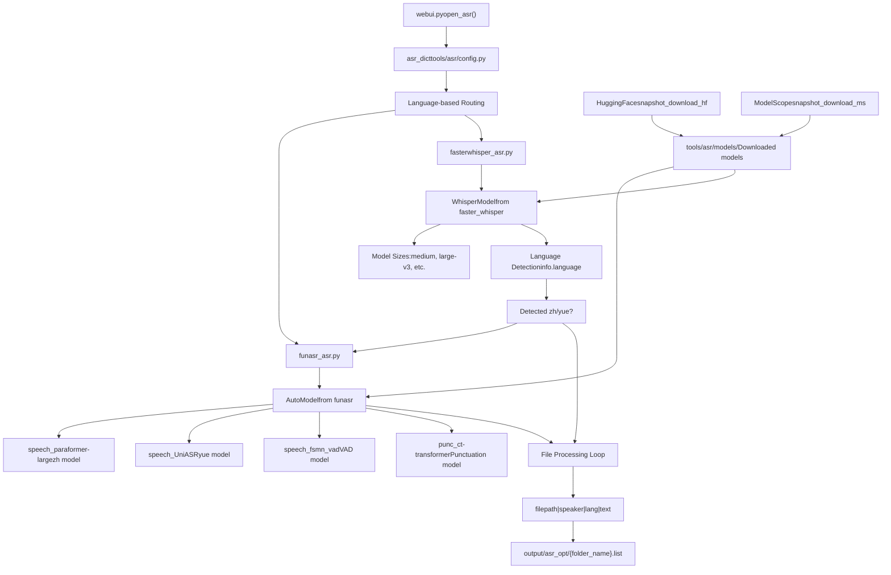
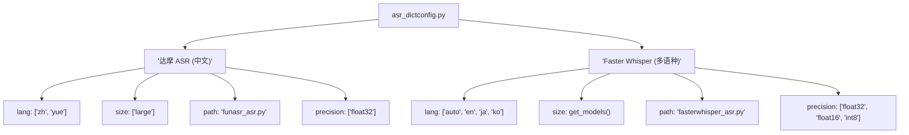
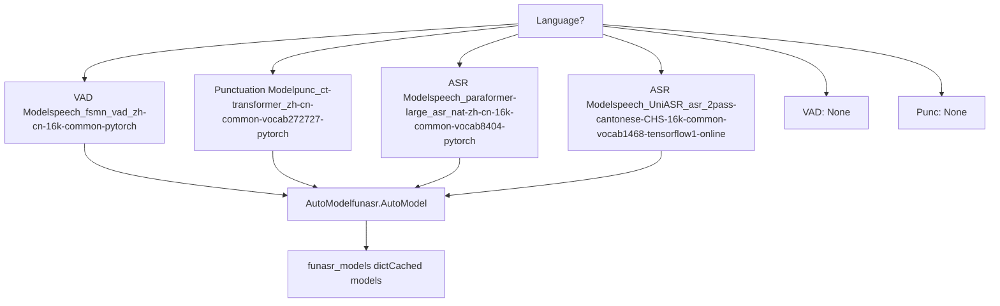
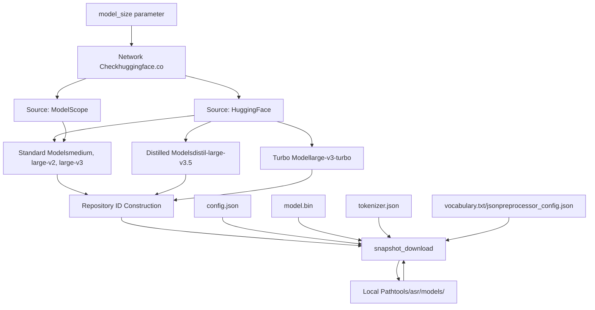
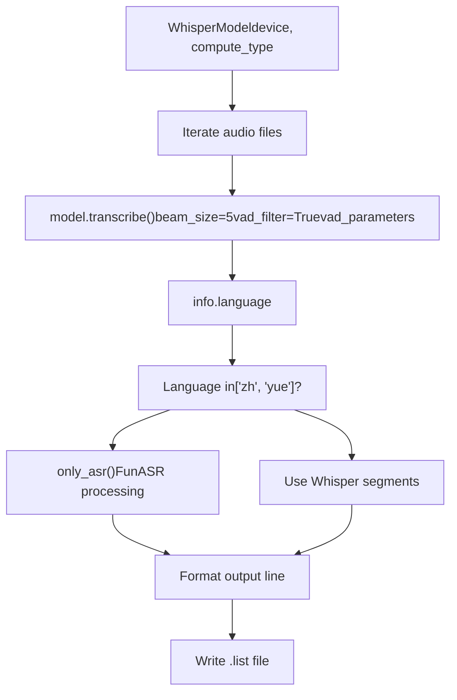
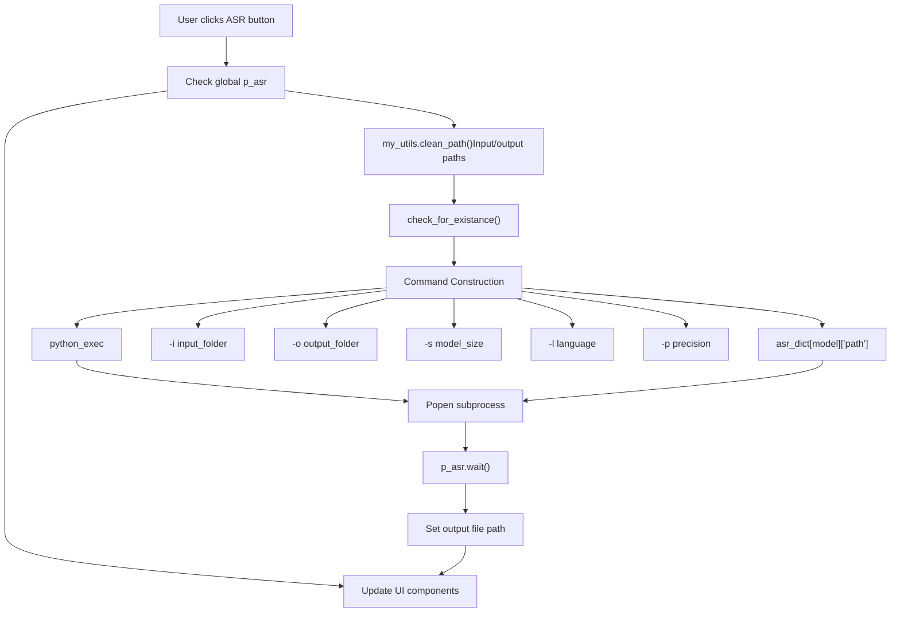
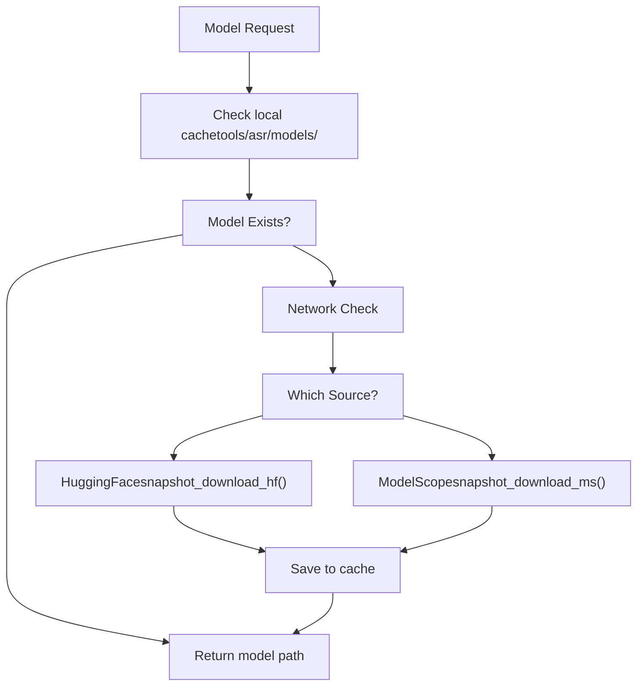
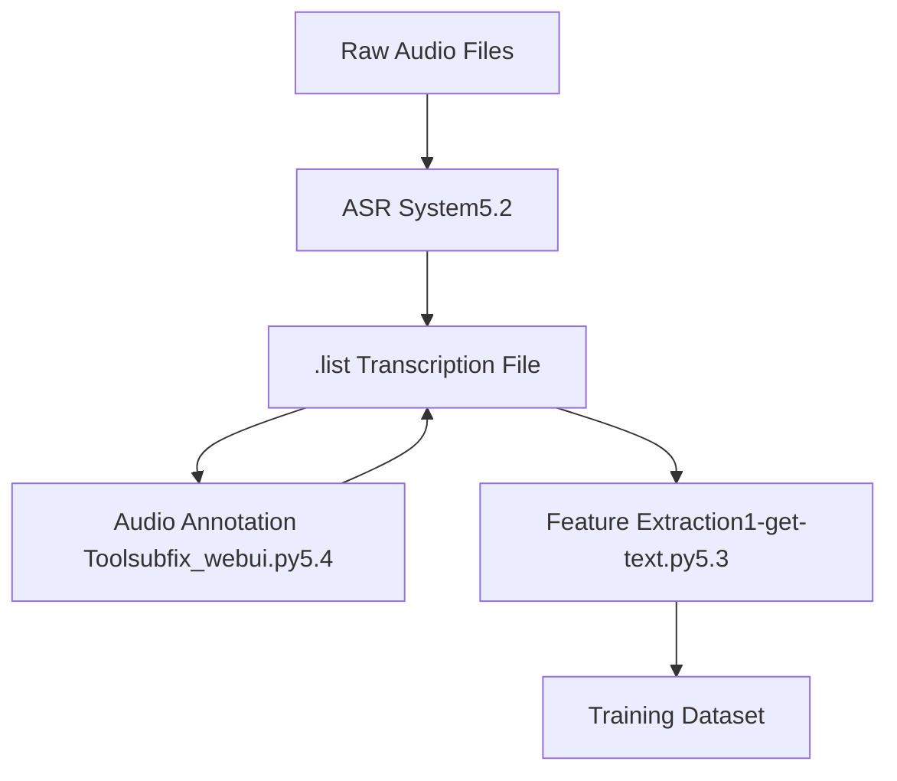

# 自动语音识别 (Automatic Speech Recognition)

相关源文件

-   [GPT\_SoVITS/text/.gitignore](https://github.com/RVC-Boss/GPT-SoVITS/blob/c767f0b8/GPT_SoVITS/text/.gitignore)
-   [api.py](https://github.com/RVC-Boss/GPT-SoVITS/blob/c767f0b8/api.py)
-   [config.py](https://github.com/RVC-Boss/GPT-SoVITS/blob/c767f0b8/config.py)
-   [tools/asr/config.py](https://github.com/RVC-Boss/GPT-SoVITS/blob/c767f0b8/tools/asr/config.py)
-   [tools/asr/fasterwhisper\_asr.py](https://github.com/RVC-Boss/GPT-SoVITS/blob/c767f0b8/tools/asr/fasterwhisper_asr.py)
-   [tools/asr/funasr\_asr.py](https://github.com/RVC-Boss/GPT-SoVITS/blob/c767f0b8/tools/asr/funasr_asr.py)
-   [tools/asr/models/.gitignore](https://github.com/RVC-Boss/GPT-SoVITS/blob/c767f0b8/tools/asr/models/.gitignore)
-   [webui.py](https://github.com/RVC-Boss/GPT-SoVITS/blob/c767f0b8/webui.py)

## 目的与范围 (Purpose and Scope)

本页面记录了 GPT-SoVITS 中使用的自动语音识别 (ASR, Automatic Speech Recognition) 子系统，用于在数据准备阶段从音频文件生成文本转录 (transcription)。ASR 系统是阶段 0 预处理的一部分，产生的带标注的转录文件将作为后续特征提取步骤的输入。

有关完整数据准备工作流的信息，请参阅 [Data Preparation (数据准备)](/RVC-Boss/GPT-SoVITS/5-data-preparation)。有关手动文本纠正和标注工具，请参阅 [Audio Annotation and Management (音频标注与管理)](/RVC-Boss/GPT-SoVITS/5.4-audio-annotation-tools)。

## 概览 (Overview)

GPT-SoVITS 集成了两个互补的 ASR 系统，根据目标语言自动选择：

| ASR 系统 | 支持的语言 | 模型大小 | 精度选项 |
| --- | --- | --- | --- |
| **FunASR (达摩 ASR)** | 中文 (`zh`)、粤语 (`yue`) | Large | float32 |
| **Faster Whisper** | 多语言 (`auto`、`en`、`ja`、`ko` 等) | medium, medium.en, large-v2, large-v3, large-v3-turbo | float32, float16, int8 |

系统会自动将中文和粤语音频路由到 FunASR 以获得最佳识别质量，而其他语言则使用 Faster Whisper。即使 Faster Whisper 最初检测到中文文本，也会发生这种特定于语言的路由。

**来源:** [tools/asr/config.py15-23](https://github.com/RVC-Boss/GPT-SoVITS/blob/c767f0b8/tools/asr/config.py#L15-L23) [tools/asr/fasterwhisper\_asr.py129-131](https://github.com/RVC-Boss/GPT-SoVITS/blob/c767f0b8/tools/asr/fasterwhisper_asr.py#L129-L131)

## 系统架构 (System Architecture)


**来源:** [webui.py371-415](https://github.com/RVC-Boss/GPT-SoVITS/blob/c767f0b8/webui.py#L371-L415) [tools/asr/config.py15-23](https://github.com/RVC-Boss/GPT-SoVITS/blob/c767f0b8/tools/asr/config.py#L15-L23) [tools/asr/fasterwhisper\_asr.py104-148](https://github.com/RVC-Boss/GPT-SoVITS/blob/c767f0b8/tools/asr/fasterwhisper_asr.py#L104-L148) [tools/asr/funasr\_asr.py73-98](https://github.com/RVC-Boss/GPT-SoVITS/blob/c767f0b8/tools/asr/funasr_asr.py#L73-L98)

## ASR 配置系统 (ASR Configuration System)

ASR 系统配置集中在 `asr_dict` 中，它将面向用户的 ASR 名称映射到其实现细节：


**来源:** [tools/asr/config.py15-23](https://github.com/RVC-Boss/GPT-SoVITS/blob/c767f0b8/tools/asr/config.py#L15-L23)

## FunASR 实现 (FunASR Implementation)

FunASR 是阿里巴巴的语音识别框架，针对中文和粤语进行了优化。系统为每种语言使用单独的模型流水线。

### 模型架构 (Model Architecture)


中文流水线包含语音活动检测 (VAD, Voice Activity Detection) 和标点恢复 (punctuation restoration)，而粤语流水线使用更简单的统一模型。

**来源:** [tools/asr/funasr\_asr.py24-70](https://github.com/RVC-Boss/GPT-SoVITS/blob/c767f0b8/tools/asr/funasr_asr.py#L24-L70)

### 处理工作流 (Processing Workflow)

FunASR 中的 `execute_asr()` 函数遵循以下工作流：

1.  **模型初始化**: 通过 `create_model(language)` 加载或检索缓存的模型
2.  **文件迭代**: 处理 `input_folder` 中的每个音频文件
3.  **转录 (Transcription)**: 调用 `model.generate(input=file_path)[0]["text"]`
4.  **输出格式化**: 格式化为 `filepath|speaker|language|text`
5.  **文件写入**: 保存到 `{output_folder}/{folder_name}.list`

**来源:** [tools/asr/funasr\_asr.py73-98](https://github.com/RVC-Boss/GPT-SoVITS/blob/c767f0b8/tools/asr/funasr_asr.py#L73-L98)

### 单文件 ASR 函数 (Single-File ASR Function)

`only_asr()` 函数提供了一个独立接口，用于处理单个文件而不生成列表文件：

```python
def only_asr(input_file, language):
    model = create_model(language)
    text = model.generate(input=input_file)[0]["text"]
    return text
```
当检测到中文/粤语文本时，Faster Whisper 会调用此函数。

**来源:** [tools/asr/funasr\_asr.py14-21](https://github.com/RVC-Boss/GPT-SoVITS/blob/c767f0b8/tools/asr/funasr_asr.py#L14-L21)

## Faster Whisper 实现 (Faster Whisper Implementation)

Faster Whisper 是 OpenAI Whisper 模型的一个优化实现，使用 CTranslate2 以获得更快的推理 (inference) 速度。

### 模型管理 (Model Management)


**来源:** [tools/asr/fasterwhisper\_asr.py42-101](https://github.com/RVC-Boss/GPT-SoVITS/blob/c767f0b8/tools/asr/fasterwhisper_asr.py#L42-L101)

### 语言检测与路由 (Language Detection and Routing)

Faster Whisper 系统实现了智能语言检测，并自动回退 (fallback) 到 FunASR：


**关键实现细节:**

-   **VAD 参数**: `min_silence_duration_ms=700` 以获得更好的切分效果
-   **束搜索大小 (Beam Size)**: 5，用于平衡准确度和速度
-   **自动语言检测**: 当 `language=None`（用户选择 "auto"）时
-   **中文/粤语回退**: 第 129-131 行检测并重定向到 FunASR

**来源:** [tools/asr/fasterwhisper\_asr.py104-148](https://github.com/RVC-Boss/GPT-SoVITS/blob/c767f0b8/tools/asr/fasterwhisper_asr.py#L104-L148) [tools/asr/fasterwhisper\_asr.py129-131](https://github.com/RVC-Boss/GPT-SoVITS/blob/c767f0b8/tools/asr/fasterwhisper_asr.py#L129-L131)

### 支持的语言代码 (Supported Language Codes)

Faster Whisper 支持 100 多种语言。实现在 `language_code_list` 中定义了支持的代码：

| 代码 | 语言 | 代码 | 语言 | 代码 | 语言 |
| --- | --- | --- | --- | --- | --- |
| `zh` | 中文 | `en` | 英语 | `ja` | 日语 |
| `ko` | 韩语 | `yue` | 粤语 | `auto` | 自动检测 |
| `ar` | 阿拉伯语 | `de` | 德语 | `fr` | 法语 |
| `ru` | 俄语 | `es` | 西班牙语 | `hi` | 印地语 |

（以及 90 多种其他语言代码）

**来源:** [tools/asr/fasterwhisper\_asr.py17-38](https://github.com/RVC-Boss/GPT-SoVITS/blob/c767f0b8/tools/asr/fasterwhisper_asr.py#L17-L38)

## WebUI 集成 (WebUI Integration)

ASR 功能通过主 WebUI 的 `open_asr()` 函数公开：


**命令行构建示例:**

```bash
"{python_exec}" -s tools/asr/{asr_script}
  -i "{input_dir}"
  -o "{output_dir}"
  -s {model_size}
  -l {language}
  -p {precision}
```
**来源:** [webui.py371-415](https://github.com/RVC-Boss/GPT-SoVITS/blob/c767f0b8/webui.py#L371-L415)

### 进程生命周期管理 (Process Lifecycle Management)

WebUI 维护一个全局变量 `p_asr` 来跟踪 ASR 子进程 (subprocess)：

-   **启动**: `p_asr = Popen(cmd, shell=True)`（第 395 行）
-   **等待**: `p_asr.wait()` 阻塞直到完成（第 396 行）
-   **重置**: 完成后 `p_asr = None`（第 397 行）
-   **终止**: 如果需要，`close_asr()` 函数会杀死进程（第 417-426 行）

**来源:** [webui.py395-397](https://github.com/RVC-Boss/GPT-SoVITS/blob/c767f0b8/webui.py#L395-L397) [webui.py417-426](https://github.com/RVC-Boss/GPT-SoVITS/blob/c767f0b8/webui.py#L417-L426)

## 输出格式规范 (Output Format Specification)

两个 ASR 系统生成的输出文件格式完全相同，确保了整个流水线的一致性。

### 文件结构 (File Structure)

**输出路径**: `{output_folder}/{input_folder_basename}.list`

**行格式**: `filepath|speaker|language|text`

**示例**:

```text
/path/to/audio/001.wav|dataset_name|ZH|这是一段中文语音。
/path/to/audio/002.wav|dataset_name|EN|This is English speech.
/path/to/audio/003.wav|dataset_name|JA|これは日本語です。
```
### 字段定义 (Field Definitions)

| 字段 | 来源 | 描述 |
| --- | --- | --- |
| `filepath` | `file_path` 变量 | 音频文件的绝对路径 |
| `speaker` | `output_file_name` | 输入文件夹的基准名称 (basename)（用作说话人标识符） |
| `language` | `info.language.upper()` | 检测到或指定的语言代码（大写） |
| `text` | 转录结果 | 来自 ASR 模型的原始转录文本 |

**来源:** [tools/asr/fasterwhisper\_asr.py136](https://github.com/RVC-Boss/GPT-SoVITS/blob/c767f0b8/tools/asr/fasterwhisper_asr.py#L136-L136) [tools/asr/funasr\_asr.py87](https://github.com/RVC-Boss/GPT-SoVITS/blob/c767f0b8/tools/asr/funasr_asr.py#L87-L87)

### 下游用途 (Downstream Usage)

此输出格式由以下各项使用：

1.  **手动纠错工具 (Manual Correction Tool)** (`tools/subfix_webui.py`) - 加载 `.list` 文件进行编辑
2.  **特征提取 (Feature Extraction)** (`1-get-text.py`) - 解析以生成 BERT 特征
3.  **数据集格式化 (Dataset Formatting)** - 组织训练数据结构

**来源:** [webui.py270-295](https://github.com/RVC-Boss/GPT-SoVITS/blob/c767f0b8/webui.py#L270-L295)

## 模型下载与缓存 (Model Download and Caching)

两个 ASR 系统都实现了带有智能回退功能的自动模型下载。

### 下载策略 (Download Strategy)


### FunASR 模型下载 (FunASR Model Downloads)

FunASR 专门通过 `snapshot_download()` 使用 ModelScope：

| 模型组件 | 仓库 ID | 本地目录 |
| --- | --- | --- |
| 中文 ASR | `iic/speech_paraformer-large_asr_nat-zh-cn-16k-common-vocab8404-pytorch` | `tools/asr/models/speech_paraformer-large_asr_nat-zh-cn-16k-common-vocab8404-pytorch` |
| 中文 VAD | `iic/speech_fsmn_vad_zh-cn-16k-common-pytorch` | `tools/asr/models/speech_fsmn_vad_zh-cn-16k-common-pytorch` |
| 中文标点 | `iic/punc_ct-transformer_zh-cn-common-vocab272727-pytorch` | `tools/asr/models/punc_ct-transformer_zh-cn-common-vocab272727-pytorch` |
| 粤语 ASR | `iic/speech_UniASR_asr_2pass-cantonese-CHS-16k-common-vocab1468-tensorflow1-online` | `tools/asr/models/speech_UniASR_asr_2pass-cantonese-CHS-16k-common-vocab1468-tensorflow1-online` |

**来源:** [tools/asr/funasr\_asr.py29-46](https://github.com/RVC-Boss/GPT-SoVITS/blob/c767f0b8/tools/asr/funasr_asr.py#L29-L46)

### Faster Whisper 模型下载 (Faster Whisper Model Downloads)

Faster Whisper 同时支持 HuggingFace 和 ModelScope：

**HuggingFace 仓库:**

-   标准 (Standard): `Systran/faster-whisper-{model_size}`
-   精简 (Distilled): `Systran/faster-distil-whisper-{variant}` 或 `distil-whisper/distil-large-v3.5-ct2`
-   Turbo: `mobiuslabsgmbh/faster-whisper-large-v3-turbo`

**ModelScope 仓库:**

-   所有模型: `XXXXRT/faster-whisper` 及子目录

**来源:** [tools/asr/fasterwhisper\_asr.py50-100](https://github.com/RVC-Boss/GPT-SoVITS/blob/c767f0b8/tools/asr/fasterwhisper_asr.py#L50-L100)

## 错误处理与边缘情况 (Error Handling and Edge Cases)

### FunASR 错误处理 (FunASR Error Handling)

FunASR 将转录操作封装在 try-except 块中：

```python
try:
    text = model.generate(input=file_path)[0]["text"]
except Exception:
    print(traceback.format_exc())
    # 继续处理下一个文件
```
**来源:** [tools/asr/funasr\_asr.py83-89](https://github.com/RVC-Boss/GPT-SoVITS/blob/c767f0b8/tools/asr/funasr_asr.py#L83-L89)

### Faster Whisper 错误处理 (Faster Whisper Error Handling)

Faster Whisper 包含额外的保护措施：

1.  **空文本处理**: 如果 FunASR 回退返回空字符串，则回退到 Whisper 片段
2.  **转录错误**: 封装在 try-except 中，打印错误并继续
3.  **模型下载失败**: 在尝试下载前检查网络连接

**来源:** [tools/asr/fasterwhisper\_asr.py117-139](https://github.com/RVC-Boss/GPT-SoVITS/blob/c767f0b8/tools/asr/fasterwhisper_asr.py#L117-L139)

## 性能考虑 (Performance Considerations)

### 设备选择 (Device Selection)

两个系统都自动选择可用的 GPU：

```python
device = "cuda" if torch.cuda.is_available() else "cpu"
```
**来源:** [tools/asr/fasterwhisper\_asr.py108](https://github.com/RVC-Boss/GPT-SoVITS/blob/c767f0b8/tools/asr/fasterwhisper_asr.py#L108-L108)

### 精度选项 (Precision Options)

| 精度 | 显存占用 | 速度 | 准确度 | 支持者 |
| --- | --- | --- | --- | --- |
| `float32` | 最高 | 最慢 | 最佳 | 两者 |
| `float16` | 中等 | 中等 | 良好 | Faster Whisper |
| `int8` | 最低 | 最快 | 可接受 | Faster Whisper |

**来源:** [tools/asr/config.py15-23](https://github.com/RVC-Boss/GPT-SoVITS/blob/c767f0b8/tools/asr/config.py#L15-L23)

### 模型缓存 (Model Caching)

FunASR 通过 `funasr_models` 字典实现模型缓存，以避免重新加载：

```python
if language in funasr_models:
    return funasr_models[language]
else:
    model = AutoModel(...)
    funasr_models[language] = model
    return model
```
**来源:** [tools/asr/funasr\_asr.py56-70](https://github.com/RVC-Boss/GPT-SoVITS/blob/c767f0b8/tools/asr/funasr_asr.py#L56-L70)

## 集成点 (Integration Points)

ASR 系统与其他 GPT-SoVITS 组件集成：


**来源:** [webui.py780-846](https://github.com/RVC-Boss/GPT-SoVITS/blob/c767f0b8/webui.py#L780-L846)
