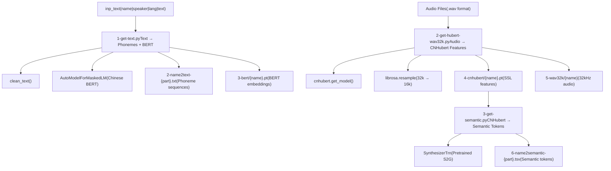
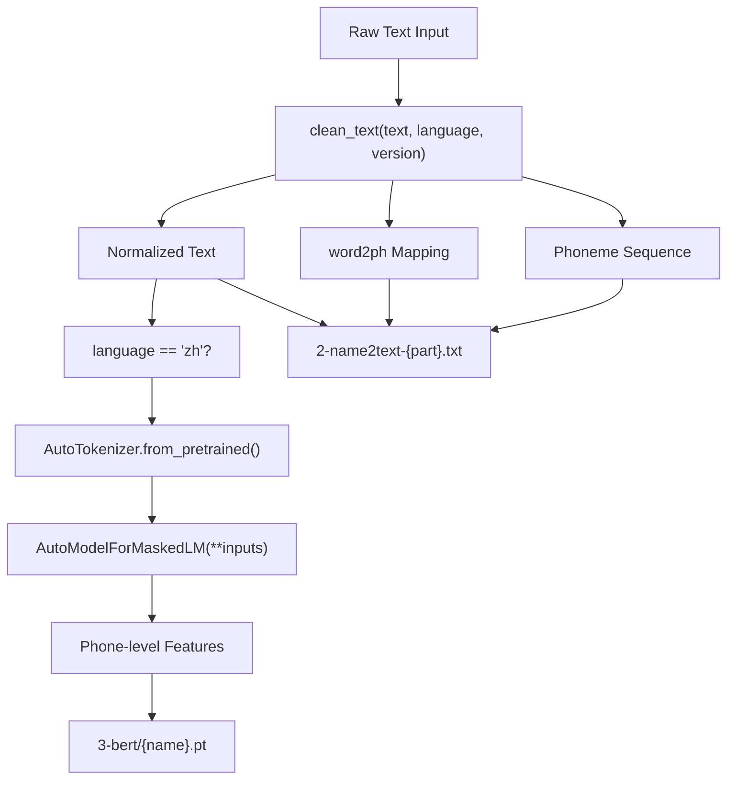
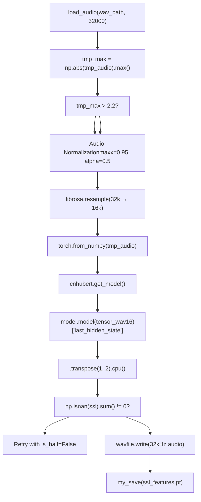
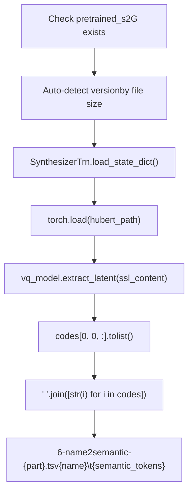

# 特征提取 (Feature Extraction)

相关源文件

-   [GPT\_SoVITS/prepare\_datasets/1-get-text.py](https://github.com/RVC-Boss/GPT-SoVITS/blob/c767f0b8/GPT_SoVITS/prepare_datasets/1-get-text.py)
-   [GPT\_SoVITS/prepare\_datasets/2-get-hubert-wav32k.py](https://github.com/RVC-Boss/GPT-SoVITS/blob/c767f0b8/GPT_SoVITS/prepare_datasets/2-get-hubert-wav32k.py)
-   [GPT\_SoVITS/prepare\_datasets/3-get-semantic.py](https://github.com/RVC-Boss/GPT-SoVITS/blob/c767f0b8/GPT_SoVITS/prepare_datasets/3-get-semantic.py)
-   [GPT\_SoVITS/s1\_train.py](https://github.com/RVC-Boss/GPT-SoVITS/blob/c767f0b8/GPT_SoVITS/s1_train.py)

特征提取是数据准备流水线的第二阶段，负责将原始音频和文本数据转换为神经网络兼容的表示 (neural network-compatible representations)。此过程提取三类特征：带有 BERT 嵌入 (BERT embeddings) 的文本音素序列、来自音频的 CNHubert SSL 特征，以及用于训练 GPT-SoVITS 模型的语义 Token (Semantic tokens)。

有关音频预处理和数据标注的信息，请参阅 [Audio Management Tools (音频管理工具)](/RVC-Boss/GPT-SoVITS/5.4-audio-annotation-tools)。有关完整的训练数据集准备工作流，请参阅 [Dataset Preparation (数据集准备)](/RVC-Boss/GPT-SoVITS/6.1-dataset-format-and-structure)。

## 概览 (Overview)

特征提取流水线由三个顺序运行的脚本组成，这些脚本将原始训练数据转换为模型就绪的特征：


来源: [GPT\_SoVITS/prepare\_datasets/1-get-text.py1-144](https://github.com/RVC-Boss/GPT-SoVITS/blob/c767f0b8/GPT_SoVITS/prepare_datasets/1-get-text.py#L1-L144) [GPT\_SoVITS/prepare\_datasets/2-get-hubert-wav32k.py1-135](https://github.com/RVC-Boss/GPT-SoVITS/blob/c767f0b8/GPT_SoVITS/prepare_datasets/2-get-hubert-wav32k.py#L1-L135) [GPT\_SoVITS/prepare\_datasets/3-get-semantic.py1-119](https://github.com/RVC-Boss/GPT-SoVITS/blob/c767f0b8/GPT_SoVITS/prepare_datasets/3-get-semantic.py#L1-L119)

## 步骤 1：文本特征提取 (Text Feature Extraction)

### 文本处理流水线 (Text Processing Pipeline)

`1-get-text.py` 脚本处理文本标注以提取音素序列和 BERT 特征。它通过 `clean_text` 函数支持多种语言，并生成中文 BERT 嵌入以增强文本理解。


### 关键组件 (Key Components)

| 组件 | 功能 | 实现 |
| --- | --- | --- |
| `clean_text()` | 文本归一化和 G2P 转换 | [GPT\_SoVITS/prepare\_datasets/1-get-text.py92](https://github.com/RVC-Boss/GPT-SoVITS/blob/c767f0b8/GPT_SoVITS/prepare_datasets/1-get-text.py#L92-L92) |
| `get_bert_feature()` | 针对中文的 BERT 特征提取 | [GPT\_SoVITS/prepare\_datasets/1-get-text.py68-84](https://github.com/RVC-Boss/GPT-SoVITS/blob/c767f0b8/GPT_SoVITS/prepare_datasets/1-get-text.py#L68-L84) |
| `AutoTokenizer` | 文本分词 (Tokenization) | [GPT\_SoVITS/prepare\_datasets/1-get-text.py61](https://github.com/RVC-Boss/GPT-SoVITS/blob/c767f0b8/GPT_SoVITS/prepare_datasets/1-get-text.py#L61-L61) |
| `AutoModelForMaskedLM` | BERT 模型推理 | [GPT\_SoVITS/prepare\_datasets/1-get-text.py62](https://github.com/RVC-Boss/GPT-SoVITS/blob/c767f0b8/GPT_SoVITS/prepare_datasets/1-get-text.py#L62-L62) |

该脚本处理格式为 `wav_name|spk_name|language|text` 的输入文件，并通过 `language_v1_to_language_v2` 映射支持语言代码：`zh`、`ja`、`en`、`ko`、`yue`。

来源: [GPT\_SoVITS/prepare\_datasets/1-get-text.py110-126](https://github.com/RVC-Boss/GPT-SoVITS/blob/c767f0b8/GPT_SoVITS/prepare_datasets/1-get-text.py#L110-L126) [GPT\_SoVITS/prepare\_datasets/1-get-text.py68-84](https://github.com/RVC-Boss/GPT-SoVITS/blob/c767f0b8/GPT_SoVITS/prepare_datasets/1-get-text.py#L68-L84) [GPT\_SoVITS/prepare\_datasets/1-get-text.py86-104](https://github.com/RVC-Boss/GPT-SoVITS/blob/c767f0b8/GPT_SoVITS/prepare_datasets/1-get-text.py#L86-L104)

## 步骤 2：CNHubert 音频特征提取 (CNHubert Audio Feature Extraction)

### 音频处理流水线 (Audio Processing Pipeline)

`2-get-hubert-wav32k.py` 脚本从音频文件中提取 CNHubert SSL（自监督学习，Self-Supervised Learning）特征。它处理多种采样率的音频，并应用归一化以获得最佳特征提取。


### 音频处理参数 (Audio Processing Parameters)

| 参数 | 值 | 用途 |
| --- | --- | --- |
| `maxx` | 0.95 | 最大归一化阈值 |
| `alpha` | 0.5 | 归一化混合因子 |
| 输入采样率 | 32kHz | 标准音频处理速率 |
| CNHubert 采样率 | 16kHz | 模型输入要求 |
| 特征形状 | `[1, 768, T]` | SSL 特征维度 |

该脚本包含健全的错误处理，通过从半精度回退到全精度来处理 SSL 特征中的 NaN 值。

来源: [GPT\_SoVITS/prepare\_datasets/2-get-hubert-wav32k.py78-106](https://github.com/RVC-Boss/GPT-SoVITS/blob/c767f0b8/GPT_SoVITS/prepare_datasets/2-get-hubert-wav32k.py#L78-L106) [GPT\_SoVITS/prepare\_datasets/2-get-hubert-wav32k.py60-61](https://github.com/RVC-Boss/GPT-SoVITS/blob/c767f0b8/GPT_SoVITS/prepare_datasets/2-get-hubert-wav32k.py#L60-L61) [GPT\_SoVITS/prepare\_datasets/2-get-hubert-wav32k.py127-134](https://github.com/RVC-Boss/GPT-SoVITS/blob/c767f0b8/GPT_SoVITS/prepare_datasets/2-get-hubert-wav32k.py#L127-L134)

## 步骤 3：语义 Token 提取 (Semantic Token Extraction)

### 语义编码过程 (Semantic Encoding Process)

`3-get-semantic.py` 脚本使用预训练的 SoVITS 模型从 CNHubert 特征中提取语义 Token (Semantic tokens)。此步骤创建 GPT 模型将学习预测的离散表示 (discrete representations)。


### 版本检测逻辑 (Version Detection Logic)

脚本根据文件大小自动检测 SoVITS 模型版本：

| 版本 | 文件大小范围 | 模型类型 |
| --- | --- | --- |
| v1 | < 82MB 或 82MB-101MB | `SynthesizerTrn` |
| v2 | 101MB-700MB | `SynthesizerTrn` |
| v3 | \> 700MB | `SynthesizerTrnV3` |

### 语义 Token 格式 (Semantic Token Format)

提取的语义 Token 是代表来自 SoVITS 模型 VQ-VAE 组件的离散潜在代码 (latent codes) 的整数。这些 Token 构成了 GPT 训练的目标序列。

来源: [GPT\_SoVITS/prepare\_datasets/3-get-semantic.py18-28](https://github.com/RVC-Boss/GPT-SoVITS/blob/c767f0b8/GPT_SoVITS/prepare_datasets/3-get-semantic.py#L18-L28) [GPT\_SoVITS/prepare\_datasets/3-get-semantic.py89-100](https://github.com/RVC-Boss/GPT-SoVITS/blob/c767f0b8/GPT_SoVITS/prepare_datasets/3-get-semantic.py#L89-L100) [GPT\_SoVITS/prepare\_datasets/3-get-semantic.py40-43](https://github.com/RVC-Boss/GPT-SoVITS/blob/c767f0b8/GPT_SoVITS/prepare_datasets/3-get-semantic.py#L40-L43)

## 并行处理与环境配置 (Parallel Processing and Environment Configuration)

所有三个特征提取脚本都支持通过环境变量进行并行处理：

| 变量 | 用途 | 用法 |
| --- | --- | --- |
| `i_part` | 当前分区索引 | 分布式处理 |
| `all_parts` | 分区总数 | 负载均衡 |
| `_CUDA_VISIBLE_DEVICES` | GPU 设备选择 | 硬件优化 |
| `is_half` | 混合精度训练 | 显存优化 |

脚本使用 `lines[int(i_part)::int(all_parts)]` 来处理输入数据的子集，从而实现分布式工作负载拆分。

来源: [GPT\_SoVITS/prepare\_datasets/1-get-text.py127](https://github.com/RVC-Boss/GPT-SoVITS/blob/c767f0b8/GPT_SoVITS/prepare_datasets/1-get-text.py#L127-L127) [GPT\_SoVITS/prepare\_datasets/2-get-hubert-wav32k.py111](https://github.com/RVC-Boss/GPT-SoVITS/blob/c767f0b8/GPT_SoVITS/prepare_datasets/2-get-hubert-wav32k.py#L111-L111) [GPT\_SoVITS/prepare\_datasets/3-get-semantic.py106](https://github.com/RVC-Boss/GPT-SoVITS/blob/c767f0b8/GPT_SoVITS/prepare_datasets/3-get-semantic.py#L106-L106)

## 输出文件结构 (Output File Structure)

特征提取过程创建了一个结构化的数据集目录：

```text
{opt_dir}/
├── 2-name2text-{part}.txt     # 音素序列
├── 3-bert/{name}.pt            # BERT 嵌入（仅限中文）
├── 4-cnhubert/{name}.pt        # CNHubert SSL 特征
├── 5-wav32k/{name}             # 32kHz 归一化音频
└── 6-name2semantic-{part}.tsv  # 语义 Token 序列
```
这些文件作为后续训练阶段 GPT 和 SoVITS 模型的训练输入。

来源: [GPT\_SoVITS/prepare\_datasets/1-get-text.py46](https://github.com/RVC-Boss/GPT-SoVITS/blob/c767f0b8/GPT_SoVITS/prepare_datasets/1-get-text.py#L46-L46) [GPT\_SoVITS/prepare\_datasets/2-get-hubert-wav32k.py54-58](https://github.com/RVC-Boss/GPT-SoVITS/blob/c767f0b8/GPT_SoVITS/prepare_datasets/2-get-hubert-wav32k.py#L54-L58) [GPT\_SoVITS/prepare\_datasets/3-get-semantic.py58](https://github.com/RVC-Boss/GPT-SoVITS/blob/c767f0b8/GPT_SoVITS/prepare_datasets/3-get-semantic.py#L58-L58)
