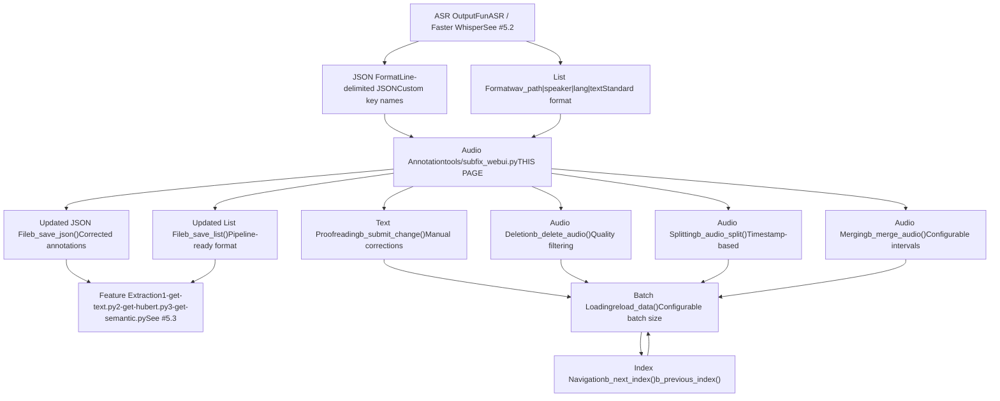
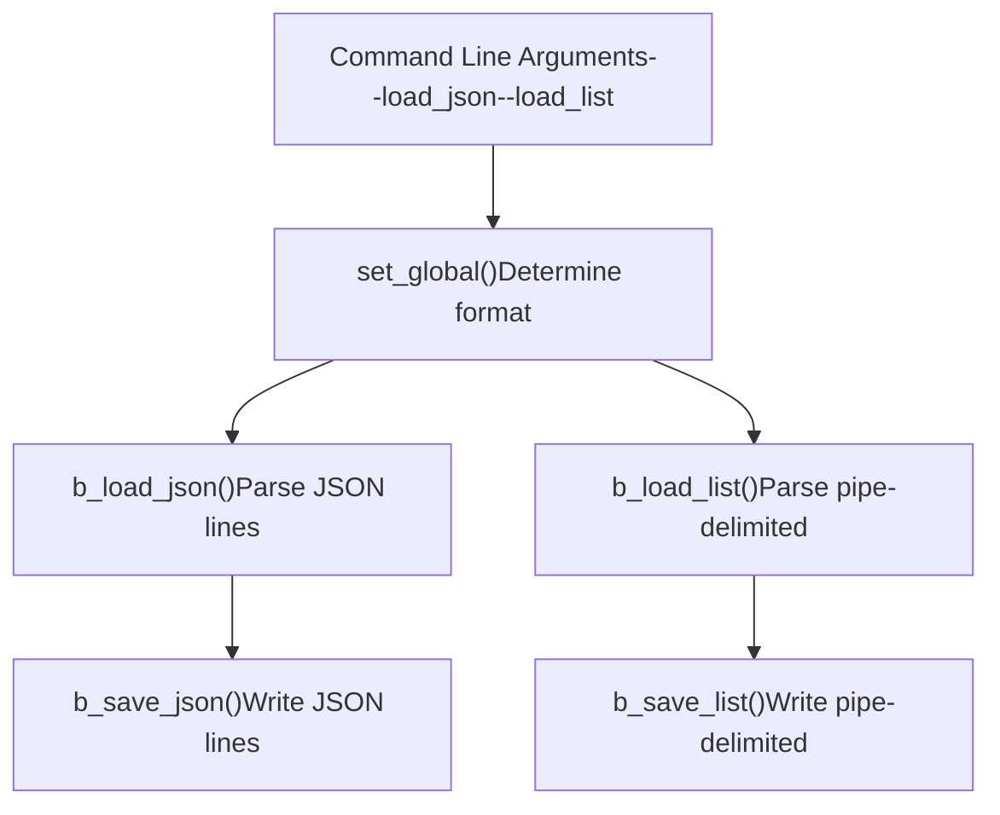
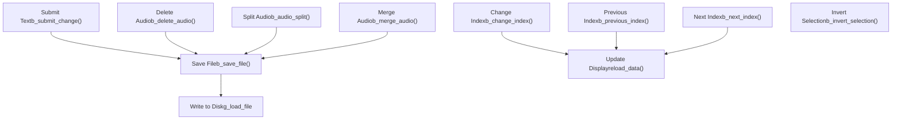
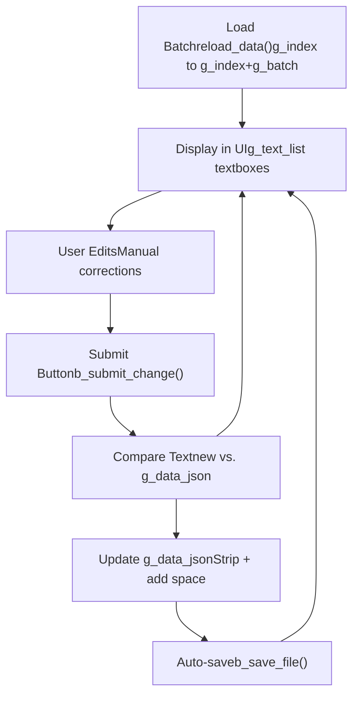
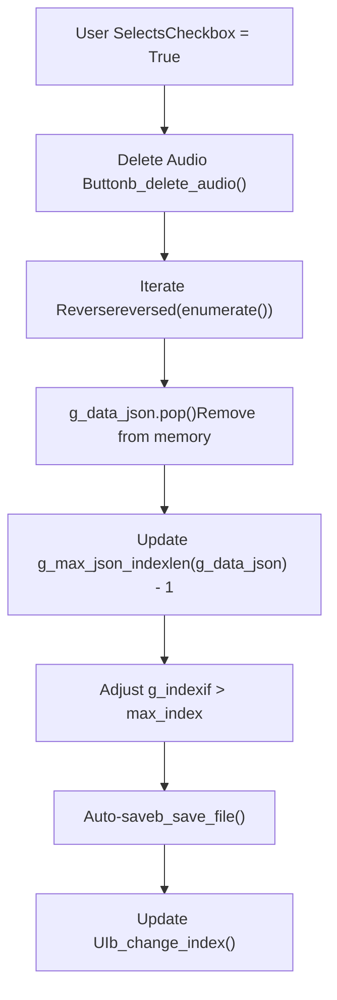
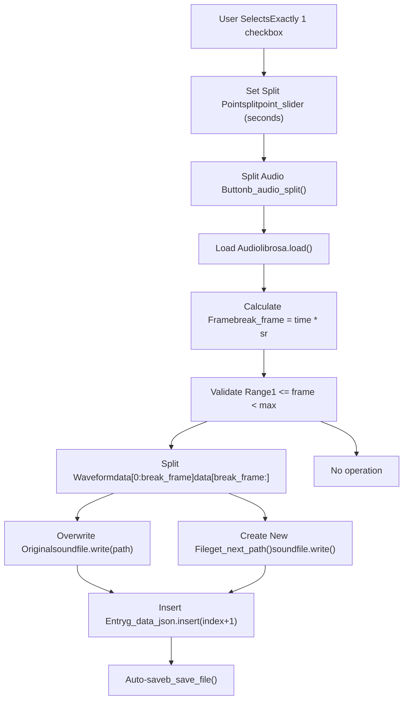
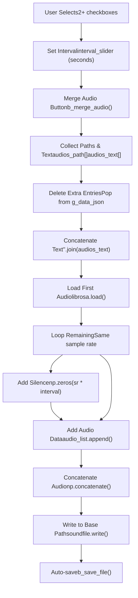
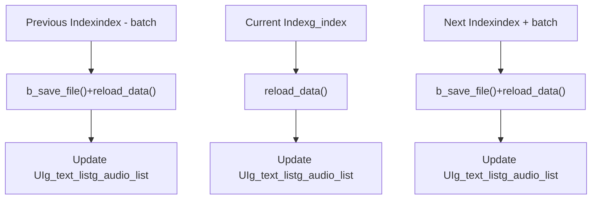
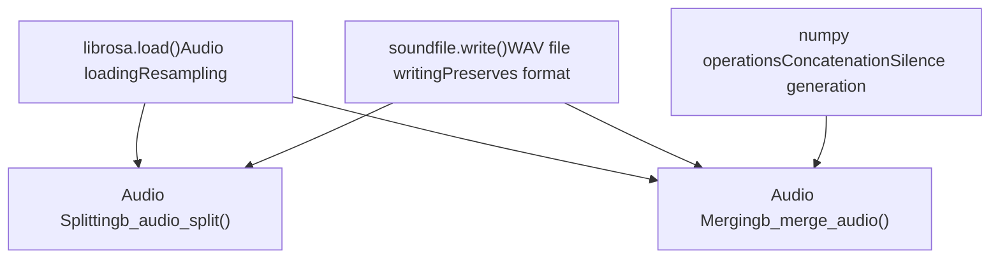
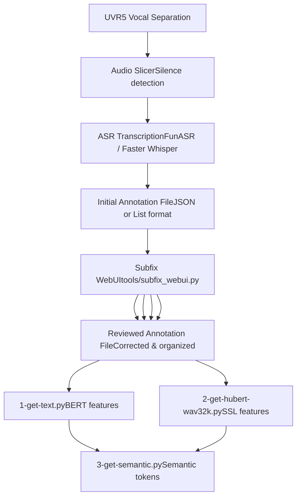

# 音频标注工具 (Audio Annotation Tools)

相关源文件

-   [tools/my\_utils.py](https://github.com/RVC-Boss/GPT-SoVITS/blob/c767f0b8/tools/my_utils.py)
-   [tools/slice\_audio.py](https://github.com/RVC-Boss/GPT-SoVITS/blob/c767f0b8/tools/slice_audio.py)
-   [tools/slicer2.py](https://github.com/RVC-Boss/GPT-SoVITS/blob/c767f0b8/tools/slicer2.py)
-   [tools/subfix\_webui.py](https://github.com/RVC-Boss/GPT-SoVITS/blob/c767f0b8/tools/subfix_webui.py)
-   [tools/uvr5/webui.py](https://github.com/RVC-Boss/GPT-SoVITS/blob/c767f0b8/tools/uvr5/webui.py)

本文档描述了用于校对和管理训练数据的音频标注系统。标注界面提供了查看 ASR 转录 (transcription)、切分和合并音频片段以及在特征提取之前组织数据集的工具。

有关音频预处理操作（人声分离、基于静音的切分、降噪），请参阅 [Audio Preprocessing Tools (音频预处理工具)](/RVC-Boss/GPT-SoVITS/5.1-audio-preprocessing-tools)。有关自动语音识别，请参阅 [Automatic Speech Recognition (自动语音识别)](/RVC-Boss/GPT-SoVITS/5.2-automatic-speech-recognition)。有关随后的特征提取过程，请参阅 [Feature Extraction Scripts (特征提取脚本)](/RVC-Boss/GPT-SoVITS/5.3-feature-extraction-scripts)。

## 目的与范围 (Purpose and Scope)

音频标注工具可以对自动转录的数据进行手动质量控制。在 ASR 生成初始转录后，该界面允许用户：

-   校对并纠正转录错误
-   删除低质量的音频片段
-   在指定的时间戳切分长音频剪辑
-   合并短片段，并配置静音间隔
-   高效地浏览大型数据集
-   保持音频文件与文本标注之间的同步

主要工具是 `subfix_webui.py`，它为这些操作提供了一个基于 Gradio 的 Web 界面。

## 系统架构 (System Architecture)


**来源:** [tools/subfix\_webui.py1-426](https://github.com/RVC-Boss/GPT-SoVITS/blob/c767f0b8/tools/subfix_webui.py#L1-L426)

## 数据格式支持 (Data Format Support)

标注工具支持两种文件格式来加载和保存训练数据。

### JSON 格式 (JSON Format)

行分隔的 JSON 格式，其中每一行代表一个音频-文本对：

```json
{"text": "transcription text", "wav_path": "/path/to/audio.wav"}
{"text": "another transcription", "wav_path": "/path/to/audio2.wav"}
```
键名可以通过命令行参数配置：

-   `--json_key_text`: 文本字段的键名（默认：`"text"`）
-   `--json_key_path`: 音频路径字段的键名（默认：`"wav_path"`）

**来源:** [tools/subfix\_webui.py238-243](https://github.com/RVC-Boss/GPT-SoVITS/blob/c767f0b8/tools/subfix_webui.py#L238-L243) [tools/subfix\_webui.py303-304](https://github.com/RVC-Boss/GPT-SoVITS/blob/c767f0b8/tools/subfix_webui.py#L303-L304)

### List 格式 (List Format)

整个 GPT-SoVITS 流水线中使用的竖线分隔格式：

```text
/path/to/audio.wav|speaker_name|language|transcription text
/path/to/audio2.wav|speaker_name|language|another transcription
```
字段按顺序解析：

1.  `wav_path`: 音频文件的绝对或相对路径
2.  `speaker_name`: 说话人标识符
3.  `language`: 语言代码（例如 `zh`, `en`, `ja`）
4.  `text`: 转录文本

**来源:** [tools/subfix\_webui.py246-260](https://github.com/RVC-Boss/GPT-SoVITS/blob/c767f0b8/tools/subfix_webui.py#L246-L260) [tools/subfix\_webui.py228-236](https://github.com/RVC-Boss/GPT-SoVITS/blob/c767f0b8/tools/subfix_webui.py#L228-L236)

### 格式选择 (Format Selection)


**来源:** [tools/subfix\_webui.py276-294](https://github.com/RVC-Boss/GPT-SoVITS/blob/c767f0b8/tools/subfix_webui.py#L276-L294) [tools/subfix\_webui.py262-274](https://github.com/RVC-Boss/GPT-SoVITS/blob/c767f0b8/tools/subfix_webui.py#L262-L274)

## 用户界面组件 (User Interface Components)

Gradio 界面以可配置的批次 (batch) 显示音频-文本对，并带有编辑和管理控件。

### 界面布局 (Interface Layout)

| 组件类型 | 用途 | 实现 |
| --- | --- | --- |
| 文本框 | 显示和编辑转录内容 | `g_text_list` 中的 `gr.Textbox` |
| 音频播放器 | 播放参考音频 | `g_audio_list` 中的 `gr.Audio` |
| 复选框 | 选择用于批量操作的项目 | `g_checkbox_list` 中的 `gr.Checkbox` |
| 索引滑块 | 导航到特定的批次位置 | `index_slider` |
| 批大小滑块 | 配置每页显示的项目数 | `batchsize_slider` |
| 切分点滑块 | 指定音频切分的时间戳 | `splitpoint_slider` |
| 间隔滑块 | 配置合并时的静音时长 | `interval_slider` |

**来源:** [tools/subfix\_webui.py326-351](https://github.com/RVC-Boss/GPT-SoVITS/blob/c767f0b8/tools/subfix_webui.py#L326-L351)

### 控制按钮 (Control Buttons)


**来源:** [tools/subfix\_webui.py318-324](https://github.com/RVC-Boss/GPT-SoVITS/blob/c767f0b8/tools/subfix_webui.py#L318-L324) [tools/subfix\_webui.py353-408](https://github.com/RVC-Boss/GPT-SoVITS/blob/c767f0b8/tools/subfix_webui.py#L353-L408)

## 核心操作 (Core Operations)

### 文本标注与校对 (Text Annotation and Proofreading)

纠正 ASR 转录错误的主要工作流。


`b_submit_change()` 函数处理当前批次中的所有文本框：

```python
def b_submit_change(*text_list):
    for i, new_text in enumerate(text_list):
        if g_index + i <= g_max_json_index:
            new_text = new_text.strip() + " "
            if g_data_json[g_index + i][g_json_key_text] != new_text:
                g_data_json[g_index + i][g_json_key_text] = new_text
```
**重要提示:** 界面不会自动保存更改。用户在导航离开之前必须点击“提交文本 (Submit Text)”，否则更改将丢失。

**来源:** [tools/subfix\_webui.py96-107](https://github.com/RVC-Boss/GPT-SoVITS/blob/c767f0b8/tools/subfix_webui.py#L96-L107) [tools/subfix\_webui.py362-368](https://github.com/RVC-Boss/GPT-SoVITS/blob/c767f0b8/tools/subfix_webui.py#L362-L368)

### 音频删除 (Audio Deletion)

从数据集中移除低质量或不正确的音频片段。

**过程:**

1.  用户使用复选框选择音频项目
2.  点击“删除音频 (Delete Audio)”按钮
3.  所选项目按逆序从 `g_data_json` 中移除
4.  如有必要，调整索引以保持在有效范围内
5.  更改会自动保存


**注意:** 删除操作仅移除标注文件中的条目。磁盘上的实际音频文件不会被删除。

**来源:** [tools/subfix\_webui.py110-131](https://github.com/RVC-Boss/GPT-SoVITS/blob/c767f0b8/tools/subfix_webui.py#L110-L131) [tools/subfix\_webui.py388-392](https://github.com/RVC-Boss/GPT-SoVITS/blob/c767f0b8/tools/subfix_webui.py#L388-L392)

### 音频切分 (Audio Splitting)

在指定的时间戳将单个音频文件切分为两个独立的片段。

**操作:**

1.  仅选择一个音频项目（复选框）
2.  使用“音频切分点 (Audio Split Point(s))”滑块设置以秒为单位的切分点
3.  点击“切分音频 (Split Audio)”按钮


**文件命名:** 新文件使用递增的后缀命名：

-   原始文件: `audio.wav`
-   第一次切分: `audio.wav`（覆盖）
-   第二次切分: `audio_00.wav`, `audio_01.wav` 等

如果 `audio_00.wav` 到 `audio_99.wav` 全部存在，则改用 UUID。

**来源:** [tools/subfix\_webui.py149-175](https://github.com/RVC-Boss/GPT-SoVITS/blob/c767f0b8/tools/subfix_webui.py#L149-L175) [tools/subfix\_webui.py139-146](https://github.com/RVC-Boss/GPT-SoVITS/blob/c767f0b8/tools/subfix_webui.py#L139-L146) [tools/subfix\_webui.py400-404](https://github.com/RVC-Boss/GPT-SoVITS/blob/c767f0b8/tools/subfix_webui.py#L400-L404)

### 音频合并 (Audio Merging)

将多个选定的音频片段合并为单个文件，并带有可配置的静音间隔。

**过程:**

1.  选择两个或更多音频项目（复选框）
2.  使用“合并间隔 (Interval)”滑块设置以秒为单位的静音间隔
3.  点击“合并音频 (Merge Audio)”按钮


**合并行为:**

-   所有片段的文本被合并，不带分隔符
-   音频片段连接在一起，并在它们之间加入静音间隔
-   第一个选定的音频文件将被合并结果覆盖
-   所有其他选定的条目将从数据集中移除
-   合并后的条目保留第一个选定项目的位置

**来源:** [tools/subfix\_webui.py178-219](https://github.com/RVC-Boss/GPT-SoVITS/blob/c767f0b8/tools/subfix_webui.py#L178-L219) [tools/subfix\_webui.py394-398](https://github.com/RVC-Boss/GPT-SoVITS/blob/c767f0b8/tools/subfix_webui.py#L394-L398)

### 导航与批次管理 (Navigation and Batch Management)

界面分批显示数据，以便高效处理大型数据集。

**全局状态变量:**

-   `g_index`: 数据集中的当前起始索引
-   `g_batch`: 每页显示的项目数（可配置，默认：10）
-   `g_max_json_index`: 最大有效索引（长度 - 1）
-   `g_data_json`: 内存中的完整数据集

**导航函数:**

| 函数 | 行为 | 自动保存 |
| --- | --- | --- |
| `b_change_index()` | 跳转到特定索引 | 否 |
| `b_next_index()` | 前进一个批次 | 是 |
| `b_previous_index()` | 后退一个批次 | 是 |
| `reload_data()` | 加载批次以供显示 | 否 |


**边界处理:**

-   在索引 0 处点击“上一个” → 停留在 0
-   点击“下一个”超出最大值 → 停留在当前位置
-   减少数据集大小的更改会在必要时调整 `g_index`

**来源:** [tools/subfix\_webui.py38-93](https://github.com/RVC-Boss/GPT-SoVITS/blob/c767f0b8/tools/subfix_webui.py#L38-L93) [tools/subfix\_webui.py370-386](https://github.com/RVC-Boss/GPT-SoVITS/blob/c767f0b8/tools/subfix_webui.py#L370-L386)

## 实现细节 (Implementation Details)

### 启动与配置 (Startup and Configuration)

标注工具通过命令行参数启动：

```bash
python tools/subfix_webui.py \
    --load_list path/to/inp_text.list \
    --json_key_text text \
    --json_key_path wav_path \
    --g_batch 10 \
    --webui_port_subfix 9871 \
    --is_share False
```
**参数:**

| 参数 | 用途 | 默认值 |
| --- | --- | --- |
| `--load_json` | JSON 文件路径 | `"None"` |
| `--load_list` | 列表文件路径 | `"None"` |
| `--json_key_text` | JSON 文本键名 | `"text"` |
| `--json_key_path` | JSON 路径键名 | `"wav_path"` |
| `--g_batch` | 每批项目数 | `10` |
| `--webui_port_subfix` | Web 服务器端口 | `9871` |
| `--is_share` | Gradio 共享模式 | `"False"` |

**来源:** [tools/subfix\_webui.py297-309](https://github.com/RVC-Boss/GPT-SoVITS/blob/c767f0b8/tools/subfix_webui.py#L297-L309)

### 音频处理依赖 (Audio Processing Dependencies)

该工具依赖多个库进行音频操作：


**关键操作:**

-   `librosa.load(path, sr=None, mono=True)`: 加载音频并自动重采样 (Resampling)
-   `np.zeros(int(sample_rate * seconds))`: 生成静音
-   `np.concatenate(audio_list)`: 连接音频片段
-   `soundfile.write(path, data, sample_rate)`: 写入音频文件

**来源:** [tools/subfix\_webui.py159-168](https://github.com/RVC-Boss/GPT-SoVITS/blob/c767f0b8/tools/subfix_webui.py#L159-L168) [tools/subfix\_webui.py199-212](https://github.com/RVC-Boss/GPT-SoVITS/blob/c767f0b8/tools/subfix_webui.py#L199-L212)

### 反向选择 (Selection Inversion)

界面包含一个用于反转复选框选择的便捷函数：

```python
def b_invert_selection(*checkbox_list):
    new_list = [not item if item is True else True for item in checkbox_list]
    return new_list
```
这允许用户：

1.  选择几个要保留的项目
2.  反转选择 (Invert selection)
3.  删除其他所有内容

**来源:** [tools/subfix\_webui.py134-136](https://github.com/RVC-Boss/GPT-SoVITS/blob/c767f0b8/tools/subfix_webui.py#L134-L136) [tools/subfix\_webui.py406](https://github.com/RVC-Boss/GPT-SoVITS/blob/c767f0b8/tools/subfix_webui.py#L406-L406)

## 与训练流水线集成 (Integration with Training Pipeline)

在数据准备工作流中，标注工具位于 ASR 转录和特征提取之间。


**典型工作流:**

1.  **预处理**: UVR5 移除背景音乐，切分器对音频进行切分
2.  **ASR**: 自动转录生成初始标注
3.  **标注**（本阶段）: 手动检查和纠正
    -   修复转录错误
    -   切分过长的剪辑（建议 >30 秒）
    -   合并过短的片段（建议 <2 秒）
    -   移除质量差的音频
4.  **特征提取**: 处理经过审核的数据以进行训练

**质量指南:**

-   为了获得最佳训练效果，音频剪辑应在 2-30 秒之间
-   转录内容必须与音频完全匹配（字符级准确度）
-   移除带有背景噪音、串扰或发音不清晰的剪辑
-   确保合并片段中的说话人身份一致

**来源:** [tools/subfix\_webui.py1-426](https://github.com/RVC-Boss/GPT-SoVITS/blob/c767f0b8/tools/subfix_webui.py#L1-L426)

## 常用用法模式 (Common Usage Patterns)

### 纠正 ASR 错误

```text
1. 加载包含错误的批次
2. 在文本框中编辑文本
3. 点击“提交文本 (Submit Text)”（至关重要 - 否则更改不会保存）
4. 导航到下一批
```
### 移除质量差的音频

```text
1. 播放音频剪辑以识别质量问题
2. 勾选要移除剪辑的复选框
3. 点击“删除音频 (Delete Audio)”
4. 删除的条目会自动保存
```
### 切分长片段

```text
1. 选择一个长音频剪辑 (>30 秒)
2. 播放音频以识别自然中断点
3. 将“音频切分点 (Audio Split Point(s))”滑块设置到时间戳
4. 点击“切分音频 (Split Audio)”
5. 创建两个条目：原始文件 + _00.wav
```
### 合并短片段

```text
1. 选择多个连续的短剪辑（每个 <2 秒）
2. 设置“合并间隔 (Interval)”滑块以确定剪辑之间的静音（0-2 秒）
3. 点击“合并音频 (Merge Audio)”
4. 第一个剪辑被合并结果覆盖
5. 其他剪辑从数据集中删除
```
**来源:** [tools/subfix\_webui.py1-426](https://github.com/RVC-Boss/GPT-SoVITS/blob/c767f0b8/tools/subfix_webui.py#L1-L426)
