# Model Training (模型训练)

相关源文件

-   [GPT\_SoVITS/prepare\_datasets/1-get-text.py](https://github.com/RVC-Boss/GPT-SoVITS/blob/c767f0b8/GPT_SoVITS/prepare_datasets/1-get-text.py)
-   [GPT\_SoVITS/prepare\_datasets/2-get-hubert-wav32k.py](https://github.com/RVC-Boss/GPT-SoVITS/blob/c767f0b8/GPT_SoVITS/prepare_datasets/2-get-hubert-wav32k.py)
-   [GPT\_SoVITS/prepare\_datasets/3-get-semantic.py](https://github.com/RVC-Boss/GPT-SoVITS/blob/c767f0b8/GPT_SoVITS/prepare_datasets/3-get-semantic.py)
-   [GPT\_SoVITS/s1\_train.py](https://github.com/RVC-Boss/GPT-SoVITS/blob/c767f0b8/GPT_SoVITS/s1_train.py)
-   [api.py](https://github.com/RVC-Boss/GPT-SoVITS/blob/c767f0b8/api.py)
-   [config.py](https://github.com/RVC-Boss/GPT-SoVITS/blob/c767f0b8/config.py)
-   [webui.py](https://github.com/RVC-Boss/GPT-SoVITS/blob/c767f0b8/webui.py)

本页面提供了 GPT-SoVITS 完整模型训练工作流的概览。有关数据准备阶段（包括音频预处理和特征提取）的详细信息，请参见 [Data Preparation](/RVC-Boss/GPT-SoVITS/5-data-preparation)。有关数据集结构和文件格式的细节，请参见 [Dataset Format and Structure](/RVC-Boss/GPT-SoVITS/6.1-dataset-format-and-structure)。有关 GPT 训练的详细配置，请参见 [GPT Model Training](/RVC-Boss/GPT-SoVITS/6.2-gpt-model-training)。有关 SoVITS 训练的细节，请参见 [SoVITS Model Training](/RVC-Boss/GPT-SoVITS/6.3-sovits-model-training)。

GPT-SoVITS 训练系统由按顺序训练的两个独立模型组成：基于 GPT 的 Text2Semantic 模型和 SoVITS 声学模型。两者都需要包含已提取特征（BERT 嵌入、CNHubert 特征和语义标记）的预处理数据集。

## Training Architecture Overview (训练架构概览)

训练工作流通过主 WebUI 编排数据准备、特征提取和模型训练。该系统旨在跨不同的模型版本（v1, v2, v3, v4, v2Pro, v2ProPlus）工作，每个版本都有特定的架构差异和训练要求。

```mermaid
flowchart TD
    open1abc["open1abc()webui.py:1046-1162One-click preprocessing"]
    open1a["open1a()webui.py:780-846Text feature extraction"]
    open1b["open1b()webui.py:870-937Audio feature extraction"]
    open1c["open1c()webui.py:960-1023Semantic token extraction"]
    open1Bb["open1Bb()webui.py:590-663GPT training launcher"]
    open1Ba["open1Ba()webui.py:489-571SoVITS training launcher"]
    get_text["1-get-text.pyBERT + phoneme extractionWrites: 2-name2text.txt, 3-bert/*.pt"]
    get_hubert["2-get-hubert-wav32k.pyCNHubert SSL featuresWrites: 4-cnhubert/.pt, 5-wav32k/.wav"]
    get_sv["2-get-sv.pySpeaker verificationWrites: 5.1-sv/*.pt"]
    get_semantic["3-get-semantic.pyVQ quantizationWrites: 6-name2semantic.tsv"]
    s1_train["s1_train.pyText2SemanticLightningModulePyTorch Lightning + DDP"]
    s2_train["s2_train.pySynthesizerTrnv1/v2/v2Pro"]
    s2_train_v3["s2_train_v3_lora.pySynthesizerTrnV3v3/v4 LoRA"]
    s1_config["s1longer.yaml / s1longer-v2.yamlGPT hyperparametersPaths, batch size, epochs"]
    s2_config["s2.json / s2v2Pro.jsonSoVITS hyperparametersLoRA rank, learning rates"]
    gpt_weights["GPT_weights_v*/exp_name-e{epoch}.ckpt"]
    sovits_weights["SoVITS_weights_v*/exp_name_e{epoch}_s{step}.pth"]

    open1abc --> open1a
    open1abc --> open1b
    open1abc --> open1c
    open1a --> get_text
    open1b --> get_hubert
    open1b --> get_sv
    open1c --> get_semantic
    get --> text_open1Bb
    get --> semantic_open1Bb
    get --> hubert_open1Ba
    get --> text_open1Ba
    open1Bb --> s1_train
    open1Ba --> s2_train
    open1Ba --> s2_train_v3
    s1 --> config_s1_train
    s2 --> config_s2_train
    s2 --> config_s2_train_v3
    s1 --> train_gpt_weights
    s2 --> train_sovits_weights
    s2 --> train_v3_sovits_weights
```


**Training Workflow Orchestration (训练工作流编排)**

Sources: [webui.py489-1162](https://github.com/RVC-Boss/GPT-SoVITS/blob/c767f0b8/webui.py#L489-L1162) [GPT\_SoVITS/s1\_train.py1-172](https://github.com/RVC-Boss/GPT-SoVITS/blob/c767f0b8/GPT_SoVITS/s1_train.py#L1-L172) [config.py1-219](https://github.com/RVC-Boss/GPT-SoVITS/blob/c767f0b8/config.py#L1-L219)

训练过程通过 WebUI 中的启动函数控制，这些函数为每个阶段生成独立的 Python 进程。`open1abc` 函数提供所有三个数据准备阶段的一键执行，而 `open1Bb` 和 `open1Ba` 分别启动 GPT 和 SoVITS 训练过程。

## Data Preparation Pipeline (数据准备流水线)

在训练开始之前，原始音频和文本数据必须通过三个连续阶段进行处理，以提取不同类型的特征。每个阶段都可以使用 `i_part` 和 `all_parts` 参数在多个 GPU 上并行化。

```mermaid
flowchart TD
    inp_text["inp_text.listwav_path|speaker|lang|text"]
    inp_wav["inp_wav_dir/Raw audio files"]
    clean_text_fn["clean_text()text/cleaner.pyPhoneme conversion"]
    tokenizer["AutoTokenizerchinese-roberta-wwm-ext-large"]
    bert_model["AutoModelForMaskedLMHidden states extraction"]
    load_audio_fn["load_audio()32kHz resample"]
    cnhubert_model["cnhubert.get_model()SSL feature extractor"]
    vq_model["SynthesizerTrn.extract_latent()Pretrained VQ-VAE"]
    name2text["2-name2text.txtphonemes + word2ph"]
    bert_dir["3-bert/*.pt1024-dim tensors"]
    hubert_dir["4-cnhubert/*.pt768-dim tensors"]
    wav32k["5-wav32k/*.wavResampled audio"]
    semantic["6-name2semantic.tsvDiscrete codes"]

    inp --> text_clean_text_fn
    inp --> text_tokenizer
    clean --> text_fn_bert_model
    tokenizer --> bert_model
    inp --> wav_load_audio_fn
    load --> audio_fn_cnhubert_model
    hubert --> dir_vq_model
    bert --> model_name2text
    bert --> model_bert_dir
    cnhubert --> model_hubert_dir
    cnhubert --> model_wav32k
    vq --> model_semantic
```


**Feature Extraction Stages (特征提取阶段)**

Sources: [GPT\_SoVITS/prepare\_datasets/1-get-text.py1-144](https://github.com/RVC-Boss/GPT-SoVITS/blob/c767f0b8/GPT_SoVITS/prepare_datasets/1-get-text.py#L1-L144) [GPT\_SoVITS/prepare\_datasets/2-get-hubert-wav32k.py1-135](https://github.com/RVC-Boss/GPT-SoVITS/blob/c767f0b8/GPT_SoVITS/prepare_datasets/2-get-hubert-wav32k.py#L1-L135) [GPT\_SoVITS/prepare\_datasets/3-get-semantic.py1-119](https://github.com/RVC-Boss/GPT-SoVITS/blob/c767f0b8/GPT_SoVITS/prepare_datasets/3-get-semantic.py#L1-L119)

### Stage 1A: Text and BERT Features (阶段 1A：文本和 BERT 特征)

`1-get-text.py` 中的 `process()` 函数读取输入列表，并为每个条目调用 `clean_text()` 以获取音素和字到音素映射 (word-to-phoneme mappings)。对于中文文本，它使用 `get_bert_feature()` 提取 BERT 特征，该函数拼接了 BERT 模型的最后三个隐藏层，并根据 word2ph 比例扩展特征。

| Output | Description | Dimensions |
| --- | --- | --- |
| `2-name2text.txt` | 制表符分隔：名称、音素、word2ph、归一化文本 | 文本文件 |
| `3-bert/*.pt` | BERT 上下文嵌入，每个音频文件一个 | \[1024, num\_phones\] |

### Stage 1B: Audio Features (阶段 1B：音频特征)

`2-get-hubert-wav32k.py` 中的 `name2go()` 函数以 32kHz 加载音频，应用归一化，并使用 CNHubert 提取 SSL 特征。音频被重采样至 16kHz 以进行 CNHubert 处理，然后保存原始 32kHz 版本。对于 v2Pro 变体，还有一个额外的 `2-get-sv.py` 脚本提取说话人验证嵌入 (speaker verification embeddings)。

| Output | Description | Dimensions |
| --- | --- | --- |
| `4-cnhubert/*.pt` | Self-supervised learning (SSL, 自监督学习) 特征 | \[768, num\_frames\] |
| `5-wav32k/*.wav` | 标准化音频 | 32kHz WAV |
| `5.1-sv/*.pt` | Speaker verification vectors (说话人验证向量) (仅限 v2Pro) | \[20480\] |

### Stage 1C: Semantic Tokens (阶段 1C：语义标记)

`3-get-semantic.py` 中的 `name2go()` 函数加载预训练的 SoVITS 模型，并对 CNHubert 特征调用 `extract_latent()` 以获取离散的 VQ 代码。这些代码作为 GPT 训练的目标序列。

| Output | Description | Format |
| --- | --- | --- |
| `6-name2semantic.tsv` | 每个音频文件的空格分隔标记 ID | TSV: name\\tsemantic\_codes |

Sources: [GPT\_SoVITS/prepare\_datasets/1-get-text.py68-98](https://github.com/RVC-Boss/GPT-SoVITS/blob/c767f0b8/GPT_SoVITS/prepare_datasets/1-get-text.py#L68-L98) [GPT\_SoVITS/prepare\_datasets/2-get-hubert-wav32k.py78-105](https://github.com/RVC-Boss/GPT-SoVITS/blob/c767f0b8/GPT_SoVITS/prepare_datasets/2-get-hubert-wav32k.py#L78-L105) [GPT\_SoVITS/prepare\_datasets/3-get-semantic.py89-100](https://github.com/RVC-Boss/GPT-SoVITS/blob/c767f0b8/GPT_SoVITS/prepare_datasets/3-get-semantic.py#L89-L100)

## Training Configuration System (训练配置系统)

GPT 和 SoVITS 训练都使用特定版本的配置文件，这些文件在训练开始前以编程方式进行修改。WebUI 函数使用用户选择的参数填充 (populate) 这些配置，并将临时副本写入 `TEMP` 目录。

```mermaid
flowchart TD
    version_env["os.environ['version']webui.py:4Global version: v2Pro"]
    check_pretrained["check_pretrained_is_exist()webui.py:167-183Validates model files"]
    s1_yaml_v1["s1longer.yamlFor v1 only"]
    s1_yaml_v2["s1longer-v2.yamlFor v2/v3/v4/v2Pro"]
    s1_populate["open1Bb()Populates config:batch_size, epochstrain_semantic_pathtrain_phoneme_path"]
    tmp_s1["TEMP/tmp_s1.yamlWritten for training"]
    s2_json["s2.jsonFor v1/v2"]
    s2_json_pro["s2v2Pro.json / s2v2ProPlus.jsonFor v2Pro variants"]
    s1_populate_s2["open1Ba()Populates config:batch_size, epochspretrained pathslora_rank (v3/v4)"]
    tmp_s2["TEMP/tmp_s2.jsonWritten for training"]
    pretrained_sovits["pretrained_sovits_nameconfig.py:12-19Version-specific paths"]
    pretrained_gpt["pretrained_gpt_nameconfig.py:21-28Version-specific paths"]

    version --> env_check_pretrained
    check --> pretrained_pretrained_sovits
    check --> pretrained_pretrained_gpt
    version --> env_s1_populate
    s1 --> yaml_v1_s1_populate
    s1 --> yaml_v2_s1_populate
    s1 --> populate_tmp_s1
    version --> env_s1_populate_s2
    s2 --> json_s1_populate_s2
    s2 --> json_pro_s1_populate_s2
    s1 --> populate_s2_tmp_s2
    pretrained --> sovits_s1_populate_s2
```


**Configuration Flow (配置流)**

Sources: [webui.py4-189](https://github.com/RVC-Boss/GPT-SoVITS/blob/c767f0b8/webui.py#L4-L189) [webui.py590-675](https://github.com/RVC-Boss/GPT-SoVITS/blob/c767f0b8/webui.py#L590-L675) [webui.py489-583](https://github.com/RVC-Boss/GPT-SoVITS/blob/c767f0b8/webui.py#L489-L583) [config.py12-75](https://github.com/RVC-Boss/GPT-SoVITS/blob/c767f0b8/config.py#L12-L75)

### GPT 配置参数

`open1Bb()` 函数加载基础 YAML 配置，并在保存到 `TEMP/tmp_s1.yaml` 之前根据用户输入对其进行修改。关键参数包括：

| Parameter | Default | Description |
| --- | --- | --- |
| `batch_size` | 从 GPU 显存自动计算 | 训练批处理大小，如果 `is_half=False` 则减半 |
| `epochs` | 用户指定 | 总训练轮数 |
| `save_every_n_epoch` | 用户指定 | 检查点保存频率 |
| `if_dpo` | 用户开关 | 启用 DPO 损失以减少重复 |
| `train_semantic_path` | `{exp_dir}/6-name2semantic.tsv` | 语义标记路径 |
| `train_phoneme_path` | `{exp_dir}/2-name2text.txt` | 音素序列路径 |
| `precision` | 如果 `is_half=False` 则为 "32"，否则来自配置 | 训练精度 (16/32/bf16) |

### SoVITS 配置参数

`open1Ba()` 函数处理特定版本的配置加载，v1/v2 使用 `s2.json`，v2Pro 变体使用 `s2{version}.json`：

| Parameter | Version-Specific Defaults | Description |
| --- | --- | --- |
| `batch_size` | v1/v2: mem//2, v3/v4: mem//8 | 针对 v3/v4 由于 CFM 采用更小的批次 |
| `epochs` | v1/v2: 8, v3/v4: 2 | v3/v4 需要更少的轮数 |
| `save_every_epoch` | v1/v2: 4, v3/v4: 1 | v3/v4 检查点更频繁 |
| `text_low_lr_rate` | 用户指定 | 文本编码器的学习率乘数 |
| `lora_rank` | 用户指定（仅限 v3/v4） | 显存高效训练的 LoRA 秩 |
| `pretrained_s2G` | 特定版本的路径 | 生成器初始化权重 |
| `pretrained_s2D` | 派生自 s2G 路径 | 判别器初始化权重 |
| `grad_ckpt` | 用户开关 | 梯度检查点，用于节省显存 |

Sources: [webui.py604-634](https://github.com/RVC-Boss/GPT-SoVITS/blob/c767f0b8/webui.py#L604-L634) [webui.py507-540](https://github.com/RVC-Boss/GPT-SoVITS/blob/c767f0b8/webui.py#L507-L540)

## Training Process Execution (训练过程执行)

GPT 和 SoVITS 训练都是使用 `subprocess.Popen` 作为独立的 Python 进程启动的，这使得 WebUI 在训练运行时能保持响应。这些进程受到监控，并可以通过 WebUI 终止。

### GPT 训练启动

GPT 训练进程由 `open1Bb()` 生成：

```
cmd = '"%s" -s GPT_SoVITS/s1_train.py --config_file "%s"' % (python_exec, tmp_config_path)
p_train_GPT = Popen(cmd, shell=True)
p_train_GPT.wait()
```
`s1_train.py` 脚本使用带有 `Text2SemanticLightningModule` 的 PyTorch Lightning `Trainer`。训练在多 GPU 设置中使用 DDP (Distributed Data Parallel, 分布式数据并行)，进程组后端在 Linux 上设置为 "nccl"，在 Windows 上设置为 "gloo"。

来自 `s1_train.py` 的关键训练组件：

-   **模型**：`Text2SemanticLightningModule` (AR/models/t2s\_lightning\_module.py)
-   **数据模块**：`Text2SemanticDataModule` 读取语义标记和音素
-   **检查点回调**：`my_model_ckpt` 扩展了 `ModelCheckpoint`，以同时保存完整检查点和半精度权重
-   **恢复逻辑**：使用 `get_newest_ckpt()` 自动查找 `{output_dir}/ckpt/` 中的最新检查点

Sources: [webui.py636-655](https://github.com/RVC-Boss/GPT-SoVITS/blob/c767f0b8/webui.py#L636-L655) [GPT\_SoVITS/s1\_train.py85-148](https://github.com/RVC-Boss/GPT-SoVITS/blob/c767f0b8/GPT_SoVITS/s1_train.py#L85-L148)

### SoVITS 训练启动

SoVITS 训练进程的选择取决于版本：

```
if version in ["v1", "v2", "v2Pro", "v2ProPlus"]:
    cmd = '"%s" -s GPT_SoVITS/s2_train.py --config "%s"' % (python_exec, tmp_config_path)
else:
    cmd = '"%s" -s GPT_SoVITS/s2_train_v3_lora.py --config "%s"' % (python_exec, tmp_config_path)
```
这种区分至关重要：

-   **v1/v2/v2Pro**：使用 `s2_train.py` 对 `SynthesizerTrn` 进行全量 Fine-tuning (微调)
-   **v3/v4**：使用 `s2_train_v3_lora.py` 对 `SynthesizerTrnV3` 进行 LoRA Fine-tuning (微调)

与全量微调所需的 14GB+ 相比，LoRA 训练使得 v3/v4 能够在 8GB 显存的 GPU 上进行训练。

Sources: [webui.py541-563](https://github.com/RVC-Boss/GPT-SoVITS/blob/c767f0b8/webui.py#L541-L563) [webui.py119-132](https://github.com/RVC-Boss/GPT-SoVITS/blob/c767f0b8/webui.py#L119-L132)

## Multi-GPU Training Support (多 GPU 训练支持)

两个训练阶段都支持跨多个 GPU 的 Distributed Training (分布式训练)。GPU 分配通过环境变量和进程生成来管理。

### Data Preparation Parallelization (数据准备并行化)

数据准备阶段 (1A, 1B, 1C) 通过生成多个进程（每个 GPU 一个）来使用手动并行化：

```
gpu_names = gpu_numbers.split("-")
all_parts = len(gpu_names)
for i_part in range(all_parts):
    config.update({
        "i_part": str(i_part),
        "all_parts": str(all_parts),
        "_CUDA_VISIBLE_DEVICES": str(fix_gpu_number(gpu_names[i_part])),
    })
    os.environ.update(config)
    cmd = '"%s" -s GPT_SoVITS/prepare_datasets/1-get-text.py' % python_exec
    p = Popen(cmd, shell=True)
    ps1a.append(p)
```
每个进程处理 `lines[int(i_part)::int(all_parts)]`，确保负载 (workload) 均匀分布。

### Training Parallelization (训练并行化)

GPT 训练使用 PyTorch Lightning 内置的 DDP：

```
trainer = Trainer(
    devices=-1 if torch.cuda.is_available() else 1,
    strategy=DDPStrategy(process_group_backend="nccl" if platform.system() != "Windows" else "gloo"),
)
```
GPU 可见性通过 `CUDA_VISIBLE_DEVICES` 控制：

```
os.environ["_CUDA_VISIBLE_DEVICES"] = str(fix_gpu_numbers(gpu_numbers.replace("-", ",")))
```
Sources: [webui.py796-811](https://github.com/RVC-Boss/GPT-SoVITS/blob/c767f0b8/webui.py#L796-L811) [GPT\_SoVITS/s1\_train.py111-128](https://github.com/RVC-Boss/GPT-SoVITS/blob/c767f0b8/GPT_SoVITS/s1_train.py#L111-L128) [webui.py630-631](https://github.com/RVC-Boss/GPT-SoVITS/blob/c767f0b8/webui.py#L630-L631)

## Version-Specific Training Considerations (特定版本的训练考量)

由于架构差异，各模型版本的训练行为有显著不同：

| Version | Architecture | Training Script | VRAM Required | Typical Epochs | Key Features |
| --- | --- | --- | --- | --- | --- |
| v1 | SynthesizerTrn (直接解码) | s2\_train.py | 14GB+ | 8-25 | 原始 32kHz 架构 |
| v2 | SynthesizerTrn (直接解码) | s2\_train.py | 14GB+ | 8-25 | 改进的训练稳定性 |
| v2Pro | SynthesizerTrn + SV 嵌入 | s2\_train.py | 14GB+ | 8-25 | 增强的说话人相似度 |
| v2ProPlus | SynthesizerTrn + 增强型 SV | s2\_train.py | 14GB+ | 8-25 | 进一步改进克隆效果 |
| v3 | SynthesizerTrnV3 + CFM + BigVGAN | s2\_train\_v3\_lora.py | 8GB (LoRA) | 2-16 | 24kHz 带声码器 |
| v4 | SynthesizerTrnV3 + CFM + HiFiGAN | s2\_train\_v3\_lora.py | 8GB (LoRA) | 2-16 | 48kHz, 无金属伪影 (Metallic Artifacts) |

### Batch Size Auto-Calculation (批处理大小自动计算)

`set_default()` 函数根据 GPU 显存计算合适的批处理大小：

```
if is_gpu_ok:
    minmem = min(mem)
    default_batch_size = int(minmem // 2 if version not in v3v4set else minmem // 8)
    default_batch_size_s1 = int(minmem // 2)
```
由于 CFM (Conditional Flow Matching, 条件流匹配) 架构带来的额外显存开销，v3/v4 使用 GPU 显存的 1/8 作为批处理大小。

### Training Duration Adjustments (训练时长调整)

v3/v4 的默认轮数减少了：

```
if version not in v3v4set:
    default_sovits_epoch = 8
    max_sovits_epoch = 25
else:
    default_sovits_epoch = 2
    max_sovits_epoch = 16
```
这可以防止 Overfitting (过拟合)，因为更强大的 CFM 架构使得 v3/v4 模型学习更快。

Sources: [webui.py104-137](https://github.com/RVC-Boss/GPT-SoVITS/blob/c767f0b8/webui.py#L104-L137) [webui.py119-132](https://github.com/RVC-Boss/GPT-SoVITS/blob/c767f0b8/webui.py#L119-L132)

## Checkpoint Management and Output Structure (检查点管理与输出结构)

训练输出组织在 `config.py` 中定义的特定版本目录中：

```
SoVITS_weights_v2/
├── exp_name_e1_s100.pth
├── exp_name_e2_s200.pth
└── exp_name_e8_s800.pth

GPT_weights_v2/
├── exp_name-e1.ckpt
├── exp_name-e5.ckpt
└── exp_name-e12.ckpt
```
版本到输出目录的映射由 `SoVITS_weight_version2root` 和 `GPT_weight_version2root` 字典管理。

### Checkpoint Saving Strategy (检查点保存策略)

两个训练脚本都支持三种检查点保存模式：

1.  **仅保存最新** (`if_save_latest=True`)：在保存新检查点之前删除旧的检查点
2.  **每 N 轮保存一次** (`save_every_epoch`)：定期的检查点间隔
3.  **保存每一个权重** (`if_save_every_weights=True`)：将半精度副本保存到权重目录

`s1_train.py` 中的 `my_model_ckpt` 回调实现了自定义保存逻辑：

```
if self.if_save_latest == True:
    to_clean = list(os.listdir(self.dirpath))
self._save_topk_checkpoint(trainer, monitor_candidates)
if self.if_save_latest == True:
    for name in to_clean:
        os.remove("%s/%s" % (self.dirpath, name))
```
训练完成后，WebUI 调用 `change_choices()` 来刷新下拉菜单，以显示新可用的检查点。

Sources: [config.py44-75](https://github.com/RVC-Boss/GPT-SoVITS/blob/c767f0b8/config.py#L44-L75) [GPT\_SoVITS/s1\_train.py29-83](https://github.com/RVC-Boss/GPT-SoVITS/blob/c767f0b8/GPT_SoVITS/s1_train.py#L29-L83) [webui.py556-562](https://github.com/RVC-Boss/GPT-SoVITS/blob/c767f0b8/webui.py#L556-L562)
