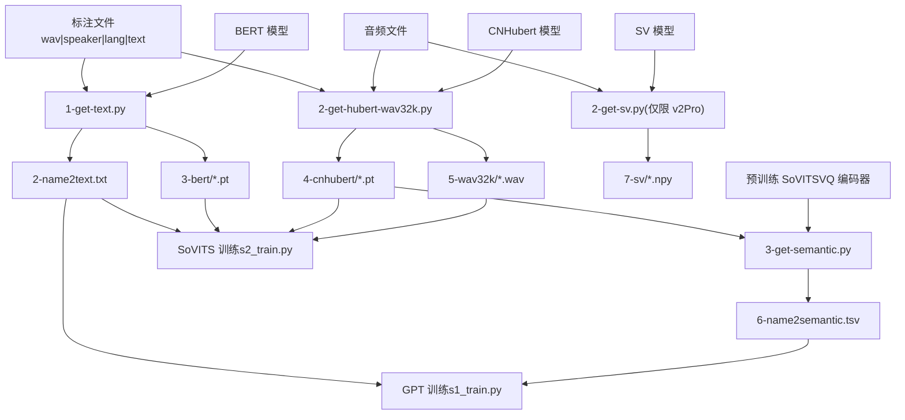
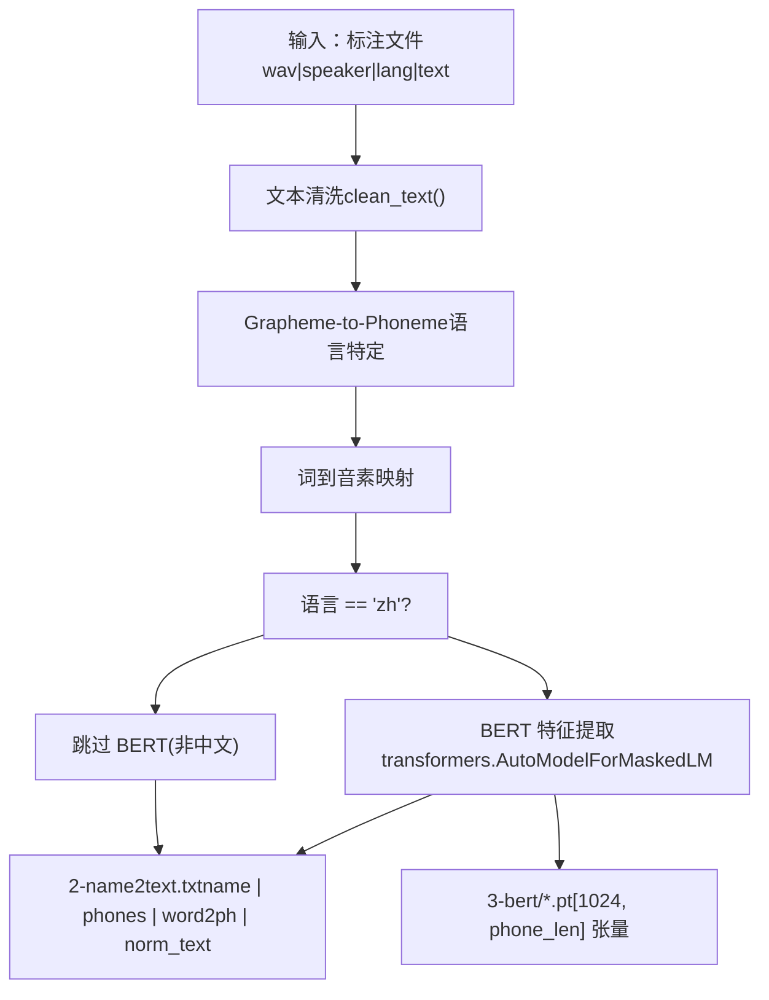
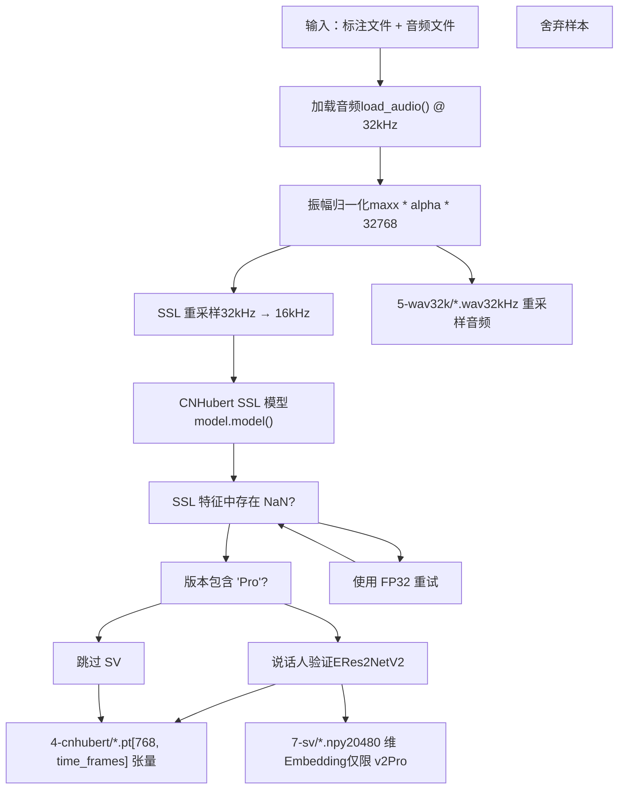
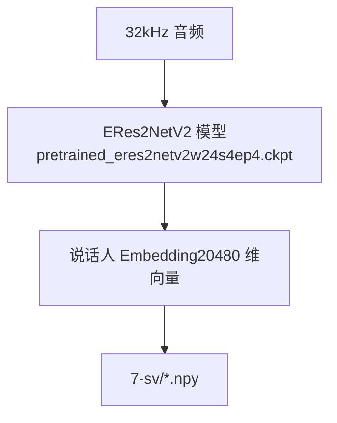
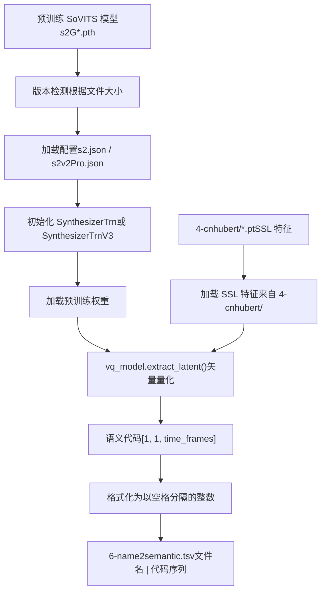
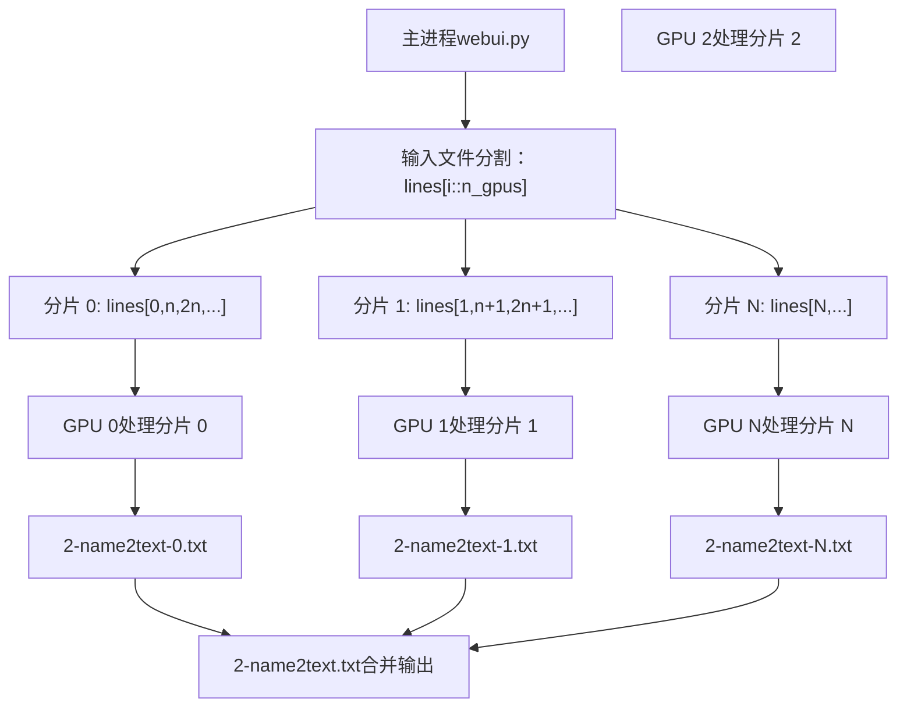
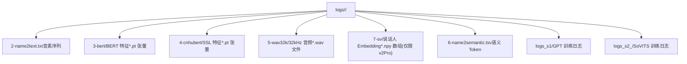
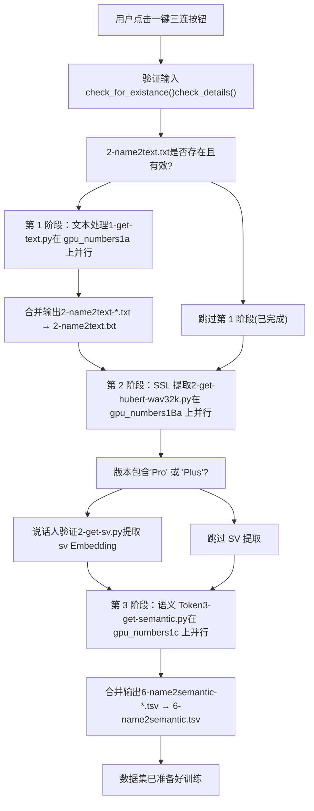
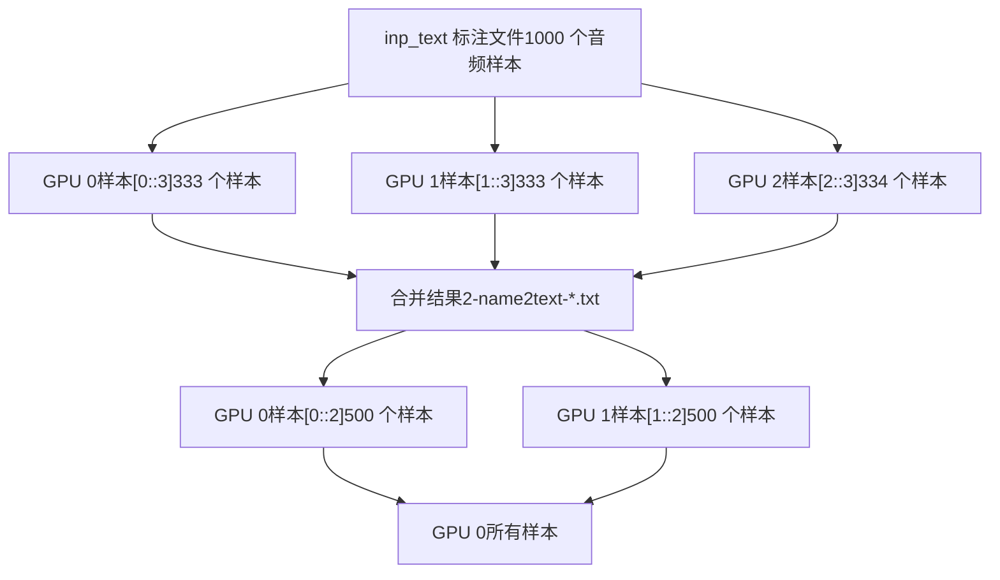
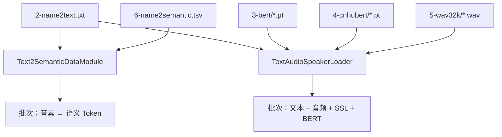

# 数据集格式与结构 (Dataset Format and Structure)

相关源文件

-   [GPT\_SoVITS/prepare\_datasets/1-get-text.py](https://github.com/RVC-Boss/GPT-SoVITS/blob/c767f0b8/GPT_SoVITS/prepare_datasets/1-get-text.py)
-   [GPT\_SoVITS/prepare\_datasets/2-get-hubert-wav32k.py](https://github.com/RVC-Boss/GPT-SoVITS/blob/c767f0b8/GPT_SoVITS/prepare_datasets/2-get-hubert-wav32k.py)
-   [GPT\_SoVITS/prepare\_datasets/3-get-semantic.py](https://github.com/RVC-Boss/GPT-SoVITS/blob/c767f0b8/GPT_SoVITS/prepare_datasets/3-get-semantic.py)
-   [GPT\_SoVITS/s1\_train.py](https://github.com/RVC-Boss/GPT-SoVITS/blob/c767f0b8/GPT_SoVITS/s1_train.py)
-   [README.md](https://github.com/RVC-Boss/GPT-SoVITS/blob/c767f0b8/README.md?plain=1)
-   [docs/cn/README.md](https://github.com/RVC-Boss/GPT-SoVITS/blob/c767f0b8/docs/cn/README.md?plain=1)
-   [docs/ja/README.md](https://github.com/RVC-Boss/GPT-SoVITS/blob/c767f0b8/docs/ja/README.md?plain=1)
-   [docs/ko/README.md](https://github.com/RVC-Boss/GPT-SoVITS/blob/c767f0b8/docs/ko/README.md?plain=1)
-   [docs/tr/README.md](https://github.com/RVC-Boss/GPT-SoVITS/blob/c767f0b8/docs/tr/README.md?plain=1)
-   [install.ps1](https://github.com/RVC-Boss/GPT-SoVITS/blob/c767f0b8/install.ps1)
-   [install.sh](https://github.com/RVC-Boss/GPT-SoVITS/blob/c767f0b8/install.sh)
-   [requirements.txt](https://github.com/RVC-Boss/GPT-SoVITS/blob/c767f0b8/requirements.txt)

## 概览 (Overview)

本文档描述了 GPT-SoVITS 训练所预期的 Dataset (数据集) 结构、整个代码库中使用的文件命名约定，以及 WebUI 中提供的一键式准备工作流。一个准备妥当的数据集遵循 `logs/<exp_name>/` 下的标准目录结构，其中包含编号的子目录，分别存储不同类型的预处理特征。

数据集准备过程通过三个顺序的特征提取阶段，将原始音频文件和文本标注转换为结构化格式。WebUI 提供了一个一键式工作流，可自动处理所有阶段，确保一致性并简化用户的数据集准备工作。

有关初始音频预处理步骤（人声分离、切片、ASR 标注）的信息，请参阅 [音频预处理工具](/RVC-Boss/GPT-SoVITS/5.1-audio-preprocessing-tools)。有关特征提取脚本的详细信息，请参阅 [特征提取脚本](/RVC-Boss/GPT-SoVITS/5.3-feature-extraction-scripts)。有关实际的模型训练过程，请参阅 [GPT 模型训练](/RVC-Boss/GPT-SoVITS/6.2-gpt-model-training) 和 [SoVITS 模型训练](/RVC-Boss/GPT-SoVITS/6.3-sovits-model-training)。

## 输入数据格式 (Input Data Format)

数据集准备工作流需要一个格式正确的输入标注文件，其结构如下：

**格式**: `wav_path|speaker_name|language|transcription_text`

**示例**:

```
output/slicer_opt/vocal_0001.wav|speaker1|zh|这是一段中文文本。
output/slicer_opt/vocal_0002.wav|speaker1|en|This is English text.
output/slicer_opt/vocal_0003.wav|speaker1|ja|これは日本語のテキストです。
```
**要求**:

-   **音频文件**: WAV 格式，采样率将在内部重采样至 32kHz
-   **语言代码**: `zh` (中文), `en` (英文), `ja` (日文), `ko` (韩文), `yue` (粤语)
-   **文本**: 与音频内容匹配的清晰转录，特殊字符 `%` 和 `￥` 将被归一化
-   **文件组织**: 标注文件中指定的所有音频路径应可被访问

来源: [GPT\_SoVITS/prepare\_datasets/1-get-text.py127-136](https://github.com/RVC-Boss/GPT-SoVITS/blob/c767f0b8/GPT_SoVITS/prepare_datasets/1-get-text.py#L127-L136) [GPT\_SoVITS/prepare\_datasets/2-get-hubert-wav32k.py108-123](https://github.com/RVC-Boss/GPT-SoVITS/blob/c767f0b8/GPT_SoVITS/prepare_datasets/2-get-hubert-wav32k.py#L108-L123)

## 手动阶段执行 (Manual Stage Execution)

对于高级用户或调试目的，每个阶段都可以独立执行。这在以下情况很有用：

-   在修复数据问题后仅重新处理特定阶段
-   为单个阶段测试不同的配置
-   调试特征提取问题

### 第 1 阶段：文本处理 (Stage 1: Text Processing)

**脚本**: `GPT_SoVITS/prepare_datasets/1-get-text.py`
**WebUI 函数**: `open1a()`
**位置**: 标签页 `1Aa-数据集格式处理` → 按钮 `中文批量一键处理` (或特定语言的按钮)

**目的**: 将文本转换为 Phoneme (音素) 序列并提取 BERT 特征（仅限中文）

**输出**:

-   `2-name2text-*.txt`（临时文件，每个 GPU 一个）
-   `2-name2text.txt`（合并后的最终输出）
-   `3-bert/*.pt`（BERT 特征，仅限中文）

**依赖项**:

-   输入：标注文件 (`inp_text`)
-   模型：位于 `bert_pretrained_dir` 的 BERT 模型

来源: [webui.py780-846](https://github.com/RVC-Boss/GPT-SoVITS/blob/c767f0b8/webui.py#L780-L846) [GPT\_SoVITS/prepare\_datasets/1-get-text.py1-144](https://github.com/RVC-Boss/GPT-SoVITS/blob/c767f0b8/GPT_SoVITS/prepare_datasets/1-get-text.py#L1-L144)

### 第 2 阶段：SSL 特征提取 (Stage 2: SSL Feature Extraction)

**脚本**:

-   主脚本: `GPT_SoVITS/prepare_datasets/2-get-hubert-wav32k.py`
-   SV (v2Pro): `GPT_SoVITS/prepare_datasets/2-get-sv.py`

**WebUI 函数**: `open1b()`
**位置**: 标签页 `1Aa-数据集格式处理` → 按钮 `自动获取SSL特征和波形` (在默认 UI 中未作为独立按钮公开)

**目的**: 提取 CNHubert 特征，重采样音频，可选地提取 Speaker Verification (说话人验证) Embedding (嵌入)

**输出**:

-   `4-cnhubert/*.pt` (SSL 特征)
-   `5-wav32k/*.wav` (重采样后的音频)
-   `7-sv/*.npy` (说话人验证特征，仅限 v2Pro/v2ProPlus)

**依赖项**:

-   输入：标注文件、音频文件
-   模型：位于 `ssl_pretrained_dir` 的 CNHubert，可选的 SV 模型

来源: [webui.py870-937](https://github.com/RVC-Boss/GPT-SoVITS/blob/c767f0b8/webui.py#L870-L937) [GPT\_SoVITS/prepare\_datasets/2-get-hubert-wav32k.py1-135](https://github.com/RVC-Boss/GPT-SoVITS/blob/c767f0b8/GPT_SoVITS/prepare_datasets/2-get-hubert-wav32k.py#L1-L135)

### 第 3 阶段：语义 Token 提取 (Stage 3: Semantic Token Extraction)

**脚本**: `GPT_SoVITS/prepare_datasets/3-get-semantic.py`
**WebUI 函数**: `open1c()`
**位置**: 标签页 `1Aa-数据集格式处理` → 按钮 `自动获取语义token` (在默认 UI 中未作为独立按钮公开)

**目的**: 使用预训练的 SoVITS VQ Encoder (编码器) 从 SSL 特征中提取 Semantic Token (语义 Token，即 VQ 代码)

**输出**:

-   `6-name2semantic-*.tsv`（临时文件，每个 GPU 一个）
-   `6-name2semantic.tsv`（合并后的最终输出）

**依赖项**:

-   输入: `4-cnhubert/*.pt`（来自第 2 阶段）
-   模型：位于 `pretrained_s2G_path` 的预训练 SoVITS

来源: [webui.py960-1023](https://github.com/RVC-Boss/GPT-SoVITS/blob/c767f0b8/webui.py#L960-L1023) [GPT\_SoVITS/prepare\_datasets/3-get-semantic.py1-119](https://github.com/RVC-Boss/GPT-SoVITS/blob/c767f0b8/GPT_SoVITS/prepare_datasets/3-get-semantic.py#L1-L119)

### 依赖图 (Dependency Graph)

**阶段依赖关系**:


来源: [webui.py1046-1130](https://github.com/RVC-Boss/GPT-SoVITS/blob/c767f0b8/webui.py#L1046-L1130)

## 第 1 阶段：文本处理和 BERT 特征提取 (Stage 1: Text Processing and BERT Feature Extraction)

### 概览 (Overview)

第 1 阶段 (`1-get-text.py`) 将文本转录处理为音素序列，并提取中文文本的 BERT 上下文 Embedding。此阶段处理文本归一化、音素转换和语言特征提取。


### 关键函数

| 函数 | 目的 | 位置 |
| --- | --- | --- |
| `open1a()` | 编排跨 GPU 的并行执行 | [webui.py780-846](https://github.com/RVC-Boss/GPT-SoVITS/blob/c767f0b8/webui.py#L780-L846) |
| `process()` | 处理每个文本样本 | [GPT\_SoVITS/prepare\_datasets/1-get-text.py86-103](https://github.com/RVC-Boss/GPT-SoVITS/blob/c767f0b8/GPT_SoVITS/prepare_datasets/1-get-text.py#L86-L103) |
| `get_bert_feature()` | 使用 word2ph 映射提取 BERT Embedding | [GPT\_SoVITS/prepare\_datasets/1-get-text.py68-84](https://github.com/RVC-Boss/GPT-SoVITS/blob/c767f0b8/GPT_SoVITS/prepare_datasets/1-get-text.py#L68-L84) |
| `clean_text()` | 特定语言的文本归一化和 G2P | [text/cleaner.py](https://github.com/RVC-Boss/GPT-SoVITS/blob/c767f0b8/text/cleaner.py) |

### 执行

该阶段通过 WebUI 调用，也可以独立运行：

```
# webui.py 中的环境配置config = {    "inp_text": inp_text,           # 标注文件路径    "inp_wav_dir": inp_wav_dir,     # 音频目录    "exp_name": exp_name,           # 实验名称    "opt_dir": opt_dir,             # 输出目录    "bert_pretrained_dir": bert_pretrained_dir,  # BERT 模型路径    "i_part": str(i_part),          # 当前分片索引（用于并行化）    "all_parts": str(all_parts),    # 总分片数    "_CUDA_VISIBLE_DEVICES": gpu_id,    "is_half": str(is_half),}
```
来源: [webui.py788-807](https://github.com/RVC-Boss/GPT-SoVITS/blob/c767f0b8/webui.py#L788-L807) [GPT\_SoVITS/prepare\_datasets/1-get-text.py5-13](https://github.com/RVC-Boss/GPT-SoVITS/blob/c767f0b8/GPT_SoVITS/prepare_datasets/1-get-text.py#L5-L13)

### 输出文件

1.  **`2-name2text.txt`**: 包含处理后文本数据的制表符分隔文件

    -   格式: `filename\tphones\tword2ph\tnorm_text`
    -   Phones: 以空格分隔的音素 ID
    -   word2ph: 指示每个词/字符的音素数量的列表
    -   norm\_text: 清洗后的归一化文本
2.  **`3-bert/*.pt`**: 包含 BERT 特征的 PyTorch 张量（仅限中文）

    -   形状: `[1024, num_phonemes]`
    -   从 BERT 模型的倒数第二层隐藏层中提取
    -   每个音素根据 word2ph 映射获得重复的特征

来源: [GPT\_SoVITS/prepare\_datasets/1-get-text.py139-143](https://github.com/RVC-Boss/GPT-SoVITS/blob/c767f0b8/GPT_SoVITS/prepare_datasets/1-get-text.py#L139-L143) [GPT\_SoVITS/prepare\_datasets/1-get-text.py93-101](https://github.com/RVC-Boss/GPT-SoVITS/blob/c767f0b8/GPT_SoVITS/prepare_datasets/1-get-text.py#L93-L101)

### 语言支持和版本兼容性

文本处理支持多种语言，并具有特定版本的处理方式：

| 语言 | BERT 特征 | G2P 系统 | 备注 |
| --- | --- | --- | --- |
| 中文 (`zh`) | ✓ 是 | G2PW (多音字消歧) | 完整支持 BERT Embedding |
| 英文 (`en`) | ✗ 否 | g2p\_en | 训练期间 BERT 特征为零 |
| 日文 (`ja`) | ✗ 否 | pyopenjtalk | 训练期间 BERT 特征为零 |
| 韩文 (`ko`) | ✗ 否 | g2pk | 训练期间 BERT 特征为零 |
| 粤语 (`yue`) | ✗ 否 | 自定义 | 训练期间 BERT 特征为零 |

**版本兼容性**: `version` 参数被传递给 `clean_text()`，以确保音素词汇表与目标模型版本 (v1/v2/v3/v4) 兼容。

来源: [GPT\_SoVITS/prepare\_datasets/1-get-text.py110-126](https://github.com/RVC-Boss/GPT-SoVITS/blob/c767f0b8/GPT_SoVITS/prepare_datasets/1-get-text.py#L110-L126) [GPT\_SoVITS/prepare\_datasets/1-get-text.py92](https://github.com/RVC-Boss/GPT-SoVITS/blob/c767f0b8/GPT_SoVITS/prepare_datasets/1-get-text.py#L92-L92)

## 第 2 阶段：SSL 特征提取和音频重采样 (Stage 2: SSL Feature Extraction and Audio Resampling)

### 概览 (Overview)

第 2 阶段 (`2-get-hubert-wav32k.py`) 使用 CNHubert 模型提取 Self-Supervised Learning (自监督学习) 特征，并将音频重采样至 32kHz。对于 v2Pro/v2ProPlus 版本，此阶段还通过单独的脚本 (`2-get-sv.py`) 提取说话人验证 Embedding。


### 关键组件

| 组件 | 目的 | 详情 |
| --- | --- | --- |
| `cnhubert.get_model()` | 加载 CNHubert SSL 模型 | 帧率约 50Hz 的 768 维特征 |
| `load_audio()` | 音频加载工具 | 支持多种格式，重采样至目标速率 |
| `open1b()` | 编排函数 | 管理并行的 GPU 执行 |
| NaN 检测 | 质量控制 | 如果 FP16 产生 NaN 值，则使用 FP32 重试 |

来源: [GPT\_SoVITS/prepare\_datasets/2-get-hubert-wav32k.py68-73](https://github.com/RVC-Boss/GPT-SoVITS/blob/c767f0b8/GPT_SoVITS/prepare_datasets/2-get-hubert-wav32k.py#L68-L73) [GPT\_SoVITS/prepare\_datasets/2-get-hubert-wav32k.py78-106](https://github.com/RVC-Boss/GPT-SoVITS/blob/c767f0b8/GPT_SoVITS/prepare_datasets/2-get-hubert-wav32k.py#L78-L106)

### 音频处理流水线

音频处理涉及精细的归一化，以确保一致的特征提取：

```
# 音频归一化策略 (源自 2-get-hubert-wav32k.py:82-88)maxx = 0.95alpha = 0.5 # 创建两个归一化版本：# 1. 用于 32kHz 输出文件：tmp_audio32 = (audio / tmp_max * (maxx * alpha * 32768)) + ((1 - alpha) * 32768) * audio # 2. 用于 SSL 特征提取（不同的缩放因子）：tmp_audio32b = (audio / tmp_max * (maxx * alpha * 1145.14)) + ((1 - alpha) * 1145.14) * audio
```
这种双重归一化确保了高质量的 32kHz 音频输出和最佳的 SSL 特征提取。

来源: [GPT\_SoVITS/prepare\_datasets/2-get-hubert-wav32k.py60-89](https://github.com/RVC-Boss/GPT-SoVITS/blob/c767f0b8/GPT_SoVITS/prepare_datasets/2-get-hubert-wav32k.py#L60-L89)

### 说话人验证 (仅限 v2Pro/v2ProPlus)

对于 v2Pro 和 v2ProPlus 版本，在 SSL 提取后会运行额外的说话人验证提取步骤：


说话人验证 Embedding 提供了额外的条件信息，以提高推理过程中的声音相似度。

来源: [webui.py910-926](https://github.com/RVC-Boss/GPT-SoVITS/blob/c767f0b8/webui.py#L910-L926) [webui.py865](https://github.com/RVC-Boss/GPT-SoVITS/blob/c767f0b8/webui.py#L865-L865)

### 输出文件

1.  **`4-cnhubert/*.pt`**: SSL 特征张量

    -   形状: `[768, time_frames]`，其中 time\_frames ≈ 音频时长 \* 50
    -   包含上下文音频表示的 PyTorch 张量
    -   在第 3 阶段用于语义 Token 提取
2.  **`5-wav32k/*.wav`**: 重采样后的音频文件

    -   采样率: 32kHz
    -   16 位 PCM 格式
    -   在 SoVITS 训练期间使用
3.  **`7-sv/*.npy`** (仅限 v2Pro/v2ProPlus): 说话人验证 Embedding

    -   形状: `[20480]`
    -   包含说话人判别特征的 NumPy 数组
    -   在 v2Pro/v2ProPlus 推理期间用于更好的说话人条件化

来源: [GPT\_SoVITS/prepare\_datasets/2-get-hubert-wav32k.py54-58](https://github.com/RVC-Boss/GPT-SoVITS/blob/c767f0b8/GPT_SoVITS/prepare_datasets/2-get-hubert-wav32k.py#L54-L58) [GPT\_SoVITS/prepare\_datasets/2-get-hubert-wav32k.py100-105](https://github.com/RVC-Boss/GPT-SoVITS/blob/c767f0b8/GPT_SoVITS/prepare_datasets/2-get-hubert-wav32k.py#L100-L105)

### 错误处理

脚本实现了强大的 NaN 检测和恢复机制：

```
# NaN 检测和重试逻辑 (源自 2-get-hubert-wav32k.py:96-134)if np.isnan(ssl.detach().numpy()).sum() != 0:    nan_fails.append((wav_name, wav_path))    print("nan filtered:%s" % wav_name)    return # 处理完所有文件后，使用 FP32 重试 NaN 失败项if len(nan_fails) > 0 and is_half == True:    is_half = False    model = model.float()    for wav in nan_fails:        name2go(wav[0], wav[1])
```
这确保了最大程度的数据利用率，同时保持了特征质量。

来源: [GPT\_SoVITS/prepare\_datasets/2-get-hubert-wav32k.py75-134](https://github.com/RVC-Boss/GPT-SoVITS/blob/c767f0b8/GPT_SoVITS/prepare_datasets/2-get-hubert-wav32k.py#L75-L134)

## 第 3 阶段：语义 Token 提取 (Stage 3: Semantic Token Extraction)

### 概览 (Overview)

第 3 阶段 (`3-get-semantic.py`) 使用预训练的 SoVITS 模型从 SSL 特征中提取语义 Token (VQ 代码)。这些 Token 代表离散的声学单元，在 GPT 模型中架起了文本和音频之间的桥梁。


### 版本检测

脚本根据文件大小自动检测 SoVITS 模型版本以确保兼容性：

| 文件大小范围 | 检测到的版本 | 模型类 |
| --- | --- | --- |
| < 82978 KB | v1 | SynthesizerTrn |
| 82978 KB - 100 MB | v2 | SynthesizerTrn |
| 100 MB - 103520 KB | v1 | SynthesizerTrn |
| 103520 KB - 700 MB | v2 | SynthesizerTrn |
| \> 700 MB | v3 | SynthesizerTrnV3 |

**注意**: v4 模型使用与 v3 相同的提取逻辑。

来源: [GPT\_SoVITS/prepare\_datasets/3-get-semantic.py18-28](https://github.com/RVC-Boss/GPT-SoVITS/blob/c767f0b8/GPT_SoVITS/prepare_datasets/3-get-semantic.py#L18-L28)

### 矢量量化过程 (Vector Quantization Process)

语义 Token 提取使用预训练的 VQ 编码器：

```
# 提取过程 (源自 3-get-semantic.py:89-100)def name2go(wav_name, lines):    hubert_path = "%s/%s.pt" % (hubert_dir, wav_name)    ssl_content = torch.load(hubert_path, map_location="cpu")    ssl_content = ssl_content.half().to(device)  # 或 float()        # 从 SSL 特征中提取 VQ 代码    codes = vq_model.extract_latent(ssl_content)        # 格式：codes 的形状为 [1, 1, time_frames]    semantic = " ".join([str(i) for i in codes[0, 0, :].tolist()])    lines.append("%s\t%s" % (wav_name, semantic))
```
`extract_latent()` 方法执行 Vector Quantization (矢量量化)，将连续的 SSL 特征映射到来自学习到的 Codebook (代码本，通常为 1024 个代码) 的离散代码。

来源: [GPT\_SoVITS/prepare\_datasets/3-get-semantic.py89-100](https://github.com/RVC-Boss/GPT-SoVITS/blob/c767f0b8/GPT_SoVITS/prepare_datasets/3-get-semantic.py#L89-L100)

### 模型初始化

脚本根据检测到的版本初始化 SoVITS 模型：

| 版本 | 配置文件 | 模型类 | 备注 |
| --- | --- | --- | --- |
| v1/v2 | `GPT_SoVITS/configs/s2.json` | `SynthesizerTrn` | 标准 VITS 架构 |
| v2Pro | `GPT_SoVITS/configs/s2v2Pro.json` | `SynthesizerTrn` | 带有说话人验证 |
| v2ProPlus | `GPT_SoVITS/configs/s2v2ProPlus.json` | `SynthesizerTrn` | 增强版 v2Pro |
| v3/v4 | `GPT_SoVITS/configs/s2.json` | `SynthesizerTrnV3` | 基于 CFM 的架构 |

来源: [webui.py968-972](https://github.com/RVC-Boss/GPT-SoVITS/blob/c767f0b8/webui.py#L968-L972) [GPT\_SoVITS/prepare\_datasets/3-get-semantic.py40-43](https://github.com/RVC-Boss/GPT-SoVITS/blob/c767f0b8/GPT_SoVITS/prepare_datasets/3-get-semantic.py#L40-L43) [GPT\_SoVITS/prepare\_datasets/3-get-semantic.py68-75](https://github.com/RVC-Boss/GPT-SoVITS/blob/c767f0b8/GPT_SoVITS/prepare_datasets/3-get-semantic.py#L68-L75)

### 输出格式

**`6-name2semantic.tsv`**: 包含语义 Token 序列的制表符分隔文件

```
item_name	semantic_audio
vocal_0001.wav	143 256 892 445 223 ... (以空格分隔的整数)
vocal_0002.wav	892 445 667 123 456 ...
```
每个整数代表来自 VQ 代码本的一个离散声学单元。这些序列由 GPT 模型在训练期间用于学习文本到语义的映射。

来源: [GPT\_SoVITS/prepare\_datasets/3-get-semantic.py103-111](https://github.com/RVC-Boss/GPT-SoVITS/blob/c767f0b8/GPT_SoVITS/prepare_datasets/3-get-semantic.py#L103-L111)

## 并行处理和 GPU 分配 (Parallel Processing and GPU Distribution)

所有三个特征提取阶段都支持跨多个 GPU 的并行处理，以加速大型数据集的数据集准备。

### 并行化策略


### 实现详情

并行化通过环境变量配置实现：

```
# GPU 分配逻辑 (源自 webui.py:796-811)gpu_names = gpu_numbers.split("-")  # 例如 "0-1-2" 表示 3 个 GPUall_parts = len(gpu_names) for i_part in range(all_parts):    config.update({        "i_part": str(i_part),           # 当前分片索引        "all_parts": str(all_parts),     # 总分片数        "_CUDA_VISIBLE_DEVICES": str(fix_gpu_number(gpu_names[i_part])),    })    os.environ.update(config)    cmd = f'"{python_exec}" -s GPT_SoVITS/prepare_datasets/1-get-text.py'    p = Popen(cmd, shell=True)    ps1a.append(p) # 等待所有进程结束for p in ps1a:    p.wait()
```
每个子进程使用 Python 的切片符号处理输入文件的一个子集：`lines[int(i_part)::int(all_parts)]`

来源: [webui.py796-819](https://github.com/RVC-Boss/GPT-SoVITS/blob/c767f0b8/webui.py#L796-L819) [GPT\_SoVITS/prepare\_datasets/1-get-text.py127](https://github.com/RVC-Boss/GPT-SoVITS/blob/c767f0b8/GPT_SoVITS/prepare_datasets/1-get-text.py#L127-L127) [GPT\_SoVITS/prepare\_datasets/2-get-hubert-wav32k.py111](https://github.com/RVC-Boss/GPT-SoVITS/blob/c767f0b8/GPT_SoVITS/prepare_datasets/2-get-hubert-wav32k.py#L111-L111)

### 输出合并

并行处理完成后，临时输出文件将被合并：

```
# 第 1 阶段的合并逻辑 (源自 webui.py:819-827)opt = []for i_part in range(all_parts):    txt_path = "%s/2-name2text-%s.txt" % (opt_dir, i_part)    with open(txt_path, "r", encoding="utf8") as f:        opt += f.read().strip("\n").split("\n")    os.remove(txt_path)  # 清理临时文件 path_text = "%s/2-name2text.txt" % opt_dirwith open(path_text, "w", encoding="utf8") as f:    f.write("\n".join(opt) + "\n")
```
类似的合并逻辑也应用于第 3 阶段的语义 Token。

来源: [webui.py819-827](https://github.com/RVC-Boss/GPT-SoVITS/blob/c767f0b8/webui.py#L819-L827) [webui.py1003-1011](https://github.com/RVC-Boss/GPT-SoVITS/blob/c767f0b8/webui.py#L1003-L1011)

### 性能考虑

| 因素 | 影响 | 建议 |
| --- | --- | --- |
| GPU 数量 | 线性加速（接近理想状态） | 使用所有可用的 GPU |
| 批次分配 | 通过切片索引自动分配 | 无需手动配置 |
| 显存使用 | FP16 模式下每个 GPU 约 4-8GB | 使用 `nvidia-smi` 监控 |
| I/O 瓶颈 | 使用多 GPU 时可能限制加速 | 使用 SSD 存储 |

来源: [webui.py780-846](https://github.com/RVC-Boss/GPT-SoVITS/blob/c767f0b8/webui.py#L780-L846) [webui.py870-937](https://github.com/RVC-Boss/GPT-SoVITS/blob/c767f0b8/webui.py#L870-L937) [webui.py960-1023](https://github.com/RVC-Boss/GPT-SoVITS/blob/c767f0b8/webui.py#L960-L1023)

## 数据集目录结构 (Dataset Directory Structure)

一个完整的 GPT-SoVITS 数据集遵循 `logs/<exp_name>/` 下的标准目录结构。编号前缀 (2-, 3-, 4- 等) 表示处理顺序以及不同特征提取阶段之间的依赖关系。

**完整的目录结构**:

```
logs/<exp_name>/
├── 2-name2text.txt          # 音素序列和文本归一化
├── 3-bert/                  # BERT 上下文 Embedding（仅限中文）
│   ├── audio_001.wav.pt
│   ├── audio_002.wav.pt
│   └── ...
├── 4-cnhubert/              # CNHubert SSL 特征
│   ├── audio_001.wav.pt
│   ├── audio_002.wav.pt
│   └── ...
├── 5-wav32k/                # 32kHz 重采样音频
│   ├── audio_001.wav
│   ├── audio_002.wav
│   └── ...
├── 6-name2semantic.tsv      # 语义 Token 序列 (VQ 代码)
├── 7-sv/                    # 说话人验证 Embedding（仅限 v2Pro/v2ProPlus）
│   ├── audio_001.wav.npy
│   ├── audio_002.wav.npy
│   └── ...
├── logs_s1/                 # 在 GPT 训练期间创建（可选）
│   └── ...
└── logs_s2_<version>/       # 在 SoVITS 训练期间创建（可选）
    └── ...
```
**目录结构图**:


来源: [GPT\_SoVITS/prepare\_datasets/1-get-text.py46-50](https://github.com/RVC-Boss/GPT-SoVITS/blob/c767f0b8/GPT_SoVITS/prepare_datasets/1-get-text.py#L46-L50) [GPT\_SoVITS/prepare\_datasets/2-get-hubert-wav32k.py54-58](https://github.com/RVC-Boss/GPT-SoVITS/blob/c767f0b8/GPT_SoVITS/prepare_datasets/2-get-hubert-wav32k.py#L54-L58) [GPT\_SoVITS/prepare\_datasets/3-get-semantic.py57-58](https://github.com/RVC-Boss/GPT-SoVITS/blob/c767f0b8/GPT_SoVITS/prepare_datasets/3-get-semantic.py#L57-L58) [webui.py533-534](https://github.com/RVC-Boss/GPT-SoVITS/blob/c767f0b8/webui.py#L533-L534) [webui.py625-626](https://github.com/RVC-Boss/GPT-SoVITS/blob/c767f0b8/webui.py#L625-L626)

## 文件命名约定 (File Naming Conventions)

数据集在所有目录中使用一致的命名方案，以保持文件对应关系：

### 保留基本文件名 (Base Filename Preservation)

所有特征文件使用与原始音频文件相同的基本文件名，并带有相应的扩展名：

```
原始音频: output/slicer_opt/vocal_segment_001.wav

↓ 处理阶段 ↓

3-bert/vocal_segment_001.wav.pt        # BERT 特征
4-cnhubert/vocal_segment_001.wav.pt    # SSL 特征
5-wav32k/vocal_segment_001.wav         # 重采样音频
7-sv/vocal_segment_001.wav.npy         # 说话人验证 (v2Pro)
```
这种命名约定确保了可以轻松地在不同目录中匹配同一个音频样本的特征。

### 文本文件格式

两个文本文件使用不同的命名模式：

| 文件 | 命名模式 | 示例条目 |
| --- | --- | --- |
| `2-name2text.txt` | 每行一个条目 | `vocal_001.wav\tph1 ph2 ph3\t[1,2,1]\t归一化文本` |
| `6-name2semantic.tsv` | 每行一个条目 | `vocal_001.wav\t143 256 892 445 223 ...` |

两者都使用基本文件名（不含路径）作为标识符。

### 并行处理期间的临时文件

在并行处理期间，会创建带有分片编号的临时文件：

```
2-name2text-0.txt    # GPU 0 处理结果
2-name2text-1.txt    # GPU 1 处理结果
2-name2text-2.txt    # GPU 2 处理结果

↓ 合并为 ↓

2-name2text.txt      # 最终合并输出
```
这些临时文件在合并后会自动删除。

来源: [GPT\_SoVITS/prepare\_datasets/1-get-text.py89-91](https://github.com/RVC-Boss/GPT-SoVITS/blob/c767f0b8/GPT_SoVITS/prepare_datasets/1-get-text.py#L89-L91) [GPT\_SoVITS/prepare\_datasets/2-get-hubert-wav32k.py79-80](https://github.com/RVC-Boss/GPT-SoVITS/blob/c767f0b8/GPT_SoVITS/prepare_datasets/2-get-hubert-wav32k.py#L79-L80) [webui.py819-827](https://github.com/RVC-Boss/GPT-SoVITS/blob/c767f0b8/webui.py#L819-L827)

## 文件格式规范 (File Format Specifications)

### 2-name2text.txt

**格式**: 制表符分隔值 (TSV) 文本文件
**编码**: UTF-8

**结构**:

```
filename\tphones\tword2ph\tnorm_text
```
**示例**:

```
vocal_001.wav	sil p i3 n g sh eng1 k e3 ai4 sil	[1, 1, 1, 1, 1, 1, 1, 1, 1, 1, 1]	拼声可爱
vocal_002.wav	sil w uo3 ai4 w an2 y uan2 sh en2 sil	[1, 1, 1, 1, 1, 1, 1, 1, 1, 1]	我爱玩原神
```
**字段描述**:

-   **filename**: 音频文件的基本文件名（不含目录路径）
-   **phones**: 由特定语言的 G2P 生成的以空格分隔的音素序列
-   **word2ph**: 指示每个词/字符的音素数量的 Python 列表
-   **norm\_text**: 清洗后的归一化文本（数字 → 词，符号 → 文本）

**字符归一化**: 文本清洗器归一化特殊字符：

-   `%` → `-` (连字符)
-   `￥` → `,` (逗号)

来源: [GPT\_SoVITS/prepare\_datasets/1-get-text.py92](https://github.com/RVC-Boss/GPT-SoVITS/blob/c767f0b8/GPT_SoVITS/prepare_datasets/1-get-text.py#L92-L92) [GPT\_SoVITS/prepare\_datasets/1-get-text.py139-143](https://github.com/RVC-Boss/GPT-SoVITS/blob/c767f0b8/GPT_SoVITS/prepare_datasets/1-get-text.py#L139-L143)

### 3-bert/\*.pt (PyTorch 张量)

**格式**: PyTorch 序列化张量文件
**文件扩展名**: `.pt`

**内容**: 中文文本的 BERT 上下文 Embedding

-   **形状**: `[1024, num_phonemes]`
-   **数据类型**: `torch.FloatTensor` 或 `torch.HalfTensor`（取决于 `is_half` 设置）
-   **来源层**: BERT 模型倒数第二层和第三层的级联

**语言限制**: 仅为中文 (`zh`) 文本生成。非中文样本没有对应的 BERT 文件。

**特征对齐**: 特征使用 `word2ph` 映射与音素对齐，其中每个字符的 BERT Embedding 根据其音素计数进行重复。

来源: [GPT\_SoVITS/prepare\_datasets/1-get-text.py68-84](https://github.com/RVC-Boss/GPT-SoVITS/blob/c767f0b8/GPT_SoVITS/prepare_datasets/1-get-text.py#L68-L84) [GPT\_SoVITS/prepare\_datasets/1-get-text.py93-98](https://github.com/RVC-Boss/GPT-SoVITS/blob/c767f0b8/GPT_SoVITS/prepare_datasets/1-get-text.py#L93-L98)

### 4-cnhubert/\*.pt (SSL 特征)

**格式**: PyTorch 序列化张量文件
**文件扩展名**: `.pt`

**内容**: 来自 CNHubert 模型的自监督学习特征

-   **形状**: `[768, time_frames]`，其中 `time_frames ≈ 音频时长秒数 * 50`
-   **数据类型**: `torch.FloatTensor` 或 `torch.HalfTensor`
-   **帧率**: ~50Hz (每秒音频 50 帧)

**提取过程**: 音频被重采样至 16kHz，然后通过 CNHubert 的 Transformer 层进行处理。最后的隐藏状态被转置为 `[768, time]` 格式。

来源: [GPT\_SoVITS/prepare\_datasets/2-get-hubert-wav32k.py95](https://github.com/RVC-Boss/GPT-SoVITS/blob/c767f0b8/GPT_SoVITS/prepare_datasets/2-get-hubert-wav32k.py#L95-L95) [GPT\_SoVITS/prepare\_datasets/2-get-hubert-wav32k.py105](https://github.com/RVC-Boss/GPT-SoVITS/blob/c767f0b8/GPT_SoVITS/prepare_datasets/2-get-hubert-wav32k.py#L105-L105)

### 5-wav32k/\*.wav (音频文件)

**格式**: WAV 音频文件
**文件扩展名**: `.wav`

**音频规范**:

-   **采样率**: 32000 Hz (32kHz)
-   **位深**: 16 位有符号整数 PCM
-   **声道**: 单声道 (1 channel)
-   **归一化**: 使用 `maxx * alpha * 32768` 公式进行振幅归一化

**目的**: SoVITS 训练的标准音频格式。无论原始采样率如何，所有音频都会被重采样至精确的 32kHz。

来源: [GPT\_SoVITS/prepare\_datasets/2-get-hubert-wav32k.py87-88](https://github.com/RVC-Boss/GPT-SoVITS/blob/c767f0b8/GPT_SoVITS/prepare_datasets/2-get-hubert-wav32k.py#L87-L88) [GPT\_SoVITS/prepare\_datasets/2-get-hubert-wav32k.py100-104](https://github.com/RVC-Boss/GPT-SoVITS/blob/c767f0b8/GPT_SoVITS/prepare_datasets/2-get-hubert-wav32k.py#L100-L104)

### 6-name2semantic.tsv

**格式**: 制表符分隔值 (TSV) 文本文件
**编码**: UTF-8

**结构**:

```
filename\tsemantic_codes
```
**示例**:

```
vocal_001.wav	143 256 892 445 223 778 334 556 891 223
vocal_002.wav	556 891 223 445 778 143 256 334 892 667
```
**字段描述**:

-   **filename**: 音频文件的基本文件名
-   **semantic\_codes**: 以空格分隔的整数代码（通常为 0-1023），代表离散的声学单元

**代码来源**: 通过将 CNHubert 特征传递给预训练的 SoVITS VQ 编码器 (`extract_latent()` 方法) 生成。

来源: [GPT\_SoVITS/prepare\_datasets/3-get-semantic.py99-100](https://github.com/RVC-Boss/GPT-SoVITS/blob/c767f0b8/GPT_SoVITS/prepare_datasets/3-get-semantic.py#L99-L100) [GPT\_SoVITS/prepare\_datasets/3-get-semantic.py117-118](https://github.com/RVC-Boss/GPT-SoVITS/blob/c767f0b8/GPT_SoVITS/prepare_datasets/3-get-semantic.py#L117-L118)

### 7-sv/\*.npy (说话人验证 Embedding)

**格式**: NumPy 数组文件
**文件扩展名**: `.npy`
**版本要求**: 仅限 v2Pro 和 v2ProPlus

**内容**: 来自 ERes2NetV2 模型的说话人验证 Embedding

-   **形状**: `[20480]` (一维数组)
-   **数据类型**: `numpy.float32` 或 `numpy.float16`
-   **模型**: `pretrained_eres2netv2w24s4ep4.ckpt`

**目的**: 为提高 v2Pro/v2ProPlus 推理期间的声音相似度提供说话人判别特征。

来源: [webui.py910-926](https://github.com/RVC-Boss/GPT-SoVITS/blob/c767f0b8/webui.py#L910-L926) [webui.py865](https://github.com/RVC-Boss/GPT-SoVITS/blob/c767f0b8/webui.py#L865-L865)

### 存储要求

各种数据集大小的近似存储要求：

| 数据集大小 | 原始音频 | 完整数据集 | 备注 |
| --- | --- | --- | --- |
| 100 个样本 (每个 1 分钟) | ~960 MB | ~4.6 GB | 不含 v2Pro：约 4.2 GB |
| 1 小时 (3600 × 1s 片段) | ~576 MB | ~2.8 GB | 不含 v2Pro：约 2.5 GB |
| 10 小时 | ~5.8 GB | ~28 GB | 典型的小型数据集 |
| 100 小时 | ~58 GB | ~280 GB | 生产级数据集 |

**组件分解** (每分钟音频):

-   原始音频: ~960 KB
-   32kHz 重采样: ~1.9 MB
-   SSL 特征: ~900 KB
-   BERT 特征 (中文): ~480 KB
-   SV Embedding (v2Pro): ~480 KB
-   文本文件: 忽略不计

来源: 基于文件格式规范和典型的压缩率。

## 一键式准备工作流 (One-Click Preparation Workflow)

WebUI 提供了一个流线型的一键式工作流，可通过智能依赖处理和错误恢复自动执行所有三个特征提取阶段。

### 访问工作流

**WebUI 中的位置**: 标签页 `1-GPT-SoVITS-TTS` → 章节 `1Aa-数据集格式处理` (Dataset Format Processing)

**按钮**: `一键三连` (One-Click Triple Process)

### 工作流概览

`open1abc()` 函数编排了完整的准备流水线：

**完整工作流图**:


来源: [webui.py1046-1130](https://github.com/RVC-Boss/GPT-SoVITS/blob/c767f0b8/webui.py#L1046-L1130) [webui.py1068-1095](https://github.com/RVC-Boss/GPT-SoVITS/blob/c767f0b8/webui.py#L1068-L1095)

### 所需参数

**输入参数** (在 WebUI 中配置):

| 参数 | 目的 | 示例 | 位置 |
| --- | --- | --- | --- |
| `version` | 模型版本 | `"v2"`, `"v3"`, `"v2Pro"`, `"v4"` | 下拉选择 |
| `exp_name` | 实验名称 | `"my_character_voice"` | 文本输入 |
| `inp_text` | 标注文件 | `"output/slicer_opt/output.list"` | 文件路径 |
| `inp_wav_dir` | 音频目录 | `"output/slicer_opt"` | 目录路径 |
| `gpu_numbers1a` | 文本处理使用的 GPU | `"0-1"` | GPU 选择 |
| `gpu_numbers1Ba` | SSL 提取使用的 GPU | `"0"` | GPU 选择 |
| `gpu_numbers1c` | 语义提取使用的 GPU | `"0"` | GPU 选择 |
| `bert_pretrained_dir` | BERT 模型位置 | 自动检测 | 只读 |
| `ssl_pretrained_dir` | CNHubert 模型位置 | 自动检测 | 只读 |
| `pretrained_s2G_path` | 预训练 SoVITS 路径 | 特定版本 | 下拉选择 |

**输出位置**: 所有输出都保存在 `logs/<exp_name>/`

来源: [webui.py1046-1057](https://github.com/RVC-Boss/GPT-SoVITS/blob/c767f0b8/webui.py#L1046-L1057) [webui.py776-779](https://github.com/RVC-Boss/GPT-SoVITS/blob/c767f0b8/webui.py#L776-L779)

### 智能跳过逻辑 (Smart Skip Logic)

工作流实现了智能跳过逻辑，以避免重新处理已完成的阶段：

**第 1 阶段跳过条件**:

```
# 源自 webui.py:1068-1072path_text = "%s/2-name2text.txt" % opt_dirif os.path.exists(path_text) == False or (    os.path.exists(path_text) == True    and len(open(path_text, "r", encoding="utf8").read().strip("\n").split("\n")) < 2):    # 执行第 1 阶段else:    # 跳过第 1 阶段，已完成
```
**跳过条件**:

1.  文件 `2-name2text.txt` 存在
2.  文件包含至少 2 行（标题 + 数据）

这允许：

-   恢复中断的工作流
-   仅重新处理失败的阶段
-   增量更新数据集

来源: [webui.py1068-1095](https://github.com/RVC-Boss/GPT-SoVITS/blob/c767f0b8/webui.py#L1068-L1095)

### 进度监控

**实时状态更新**: WebUI 通过 Gradio 组件显示状态：

| 状态 | 显示 | 含义 |
| --- | --- | --- |
| `running` | 绿色进度指示器 | 当前正在执行的阶段 |
| `finish` | 成功消息 | 阶段成功完成 |
| Error | 红色错误消息 | 阶段失败（包含错误详情） |

**进度信息**:

-   当前正在执行的阶段
-   每个子进程的 GPU 利用率
-   估计剩余时间（对于大型数据集）
-   文件计数（已处理/总计）

来源: [webui.py1096-1130](https://github.com/RVC-Boss/GPT-SoVITS/blob/c767f0b8/webui.py#L1096-L1130)

### 版本特定行为 (Version-Specific Behavior)

工作流会根据所选的模型版本自动调整：

| 版本 | 文本处理 | SSL 提取 | SV 提取 | 语义提取 |
| --- | --- | --- | --- | --- |
| v1/v2 | 标准 | 标准 | 否 | v1/v2 VQ 模型 |
| v3/v4 | 标准 | 标准 | 否 | v3 VQ 模型 |
| v2Pro | 标准 | 标准 | **是** | v2Pro VQ 模型 |
| v2ProPlus | 标准 | 标准 | **是** | v2ProPlus VQ 模型 |

**自动版本检测**: 系统根据以下内容检测模型版本：

1.  显式的 `version` 参数
2.  预训练模型文件大小（用于语义提取）
3.  模型文件名模式

来源: [webui.py1046-1057](https://github.com/RVC-Boss/GPT-SoVITS/blob/c767f0b8/webui.py#L1046-L1057) [webui.py910-926](https://github.com/RVC-Boss/GPT-SoVITS/blob/c767f0b8/webui.py#L910-L926) [GPT\_SoVITS/prepare\_datasets/3-get-semantic.py18-28](https://github.com/RVC-Boss/GPT-SoVITS/blob/c767f0b8/GPT_SoVITS/prepare_datasets/3-get-semantic.py#L18-L28)

### 并行处理

**GPU 分配**: 每个阶段都可以利用多个 GPU 进行并行处理：


**工作分配策略**:

-   每个 GPU 处理第 N 个样本：`samples[gpu_id::total_gpus]`
-   GPU 之间没有数据重复
-   增加 GPU 可获得接近线性的加速

**示例 GPU 配置**:

-   **小型数据集 (< 100 个样本)**: 对所有阶段使用单个 GPU
-   **中型数据集 (100-1000 个样本)**: `gpu_numbers1a="0-1"`, `gpu_numbers1Ba="0"`, `gpu_numbers1c="0"`
-   **大型数据集 (> 1000 个样本)**: `gpu_numbers1a="0-1-2-3"`, `gpu_numbers1Ba="0-1"`, `gpu_numbers1c="0"`

来源: [webui.py796-819](https://github.com/RVC-Boss/GPT-SoVITS/blob/c767f0b8/webui.py#L796-L819) [webui.py880-903](https://github.com/RVC-Boss/GPT-SoVITS/blob/c767f0b8/webui.py#L880-L903) [webui.py970-991](https://github.com/RVC-Boss/GPT-SoVITS/blob/c767f0b8/webui.py#L970-L991)

## 与训练集成 (Integration with Training)

准备好的数据集由特定格式的训练脚本使用：

### GPT 模型训练 (s1\_train.py)

GPT 模型需要：

```
# webui.py 中的配置:609-627data["train_semantic_path"] = "%s/6-name2semantic.tsv" % s1_dirdata["train_phoneme_path"] = "%s/2-name2text.txt" % s1_dir
```
`Text2SemanticDataModule` 加载这些文件以创建训练批次，将音素序列映射到语义 Token 序列。

来源: [webui.py625-626](https://github.com/RVC-Boss/GPT-SoVITS/blob/c767f0b8/webui.py#L625-L626) [GPT\_SoVITS/s1\_train.py132-138](https://github.com/RVC-Boss/GPT-SoVITS/blob/c767f0b8/GPT_SoVITS/s1_train.py#L132-L138)

### SoVITS 模型训练 (s2\_train.py)

SoVITS 模型需要：

```
# webui.py 中的配置:533-534data["data"]["exp_dir"] = data["s2_ckpt_dir"] = s2_dir
```
训练脚本期望在 `exp_dir` 中包含以下文件：

-   `2-name2text.txt` - 用于文本编码器条件化
-   `3-bert/*.pt` - BERT 特征（仅限中文样本）
-   `4-cnhubert/*.pt` - 用于 VQ 训练的 SSL 特征
-   `5-wav32k/*.wav` - 用于重构的目标音频
-   `6-name2semantic.tsv` - 用于条件化的语义 Token

来源: [webui.py515-536](https://github.com/RVC-Boss/GPT-SoVITS/blob/c767f0b8/webui.py#L515-L536)

### 数据加载流程 (Data Loading Flow)


### 数据集验证 (Dataset Validation)

在训练开始前，WebUI 会执行验证检查：

```
# 来自 my_utils.py 的验证函数check_for_existance([s1_dir], is_train=True)check_details([s1_dir], is_train=True)
```
这验证了所有必需的文件是否存在且格式正确。

来源: [webui.py517-518](https://github.com/RVC-Boss/GPT-SoVITS/blob/c767f0b8/webui.py#L517-L518) [webui.py611-612](https://github.com/RVC-Boss/GPT-SoVITS/blob/c767f0b8/webui.py#L611-L612) [tools/my\_utils.py](https://github.com/RVC-Boss/GPT-SoVITS/blob/c767f0b8/tools/my_utils.py)

## 最佳实践和故障排除 (Best Practices and Troubleshooting)

### 建议的工作流程

1.  **从小型测试数据集开始** (约 50 个样本)，以验证流水线是否正常工作
2.  **使用并行处理**处理超过 100 个样本的数据集
3.  **监控磁盘空间** - 确保可用空间是原始音频大小的 3-4 倍
4.  **检查中间输出** - 在继续之前验证每个阶段是否产生了有效文件
5.  **对生产级数据集使用一键式工作流**以确保一致性

### 常见问题 (Common Issues)

| 问题 | 现象 | 解决方案 |
| --- | --- | --- |
| SSL 特征中存在 NaN | 第 2 阶段报告 "nan filtered" | 自动使用 FP32 重试，检查音频质量 |
| 缺失 BERT 文件 | `3-bert/` 中没有中文对应的 `.pt` 文件 | 非中文文本正常现象；检查语言代码 |
| 语义文件为空 | `6-name2semantic.tsv` 仅有标题 | 验证 `4-cnhubert/` 是否存在且预训练模型已加载 |
| 版本不匹配 | 训练因形状不匹配而失败 | 确保提取和训练使用相同的版本 |
| 显存不足 | 提取期间出现 CUDA OOM | 减少并行 GPU 数量或使用较小的批次大小 |

### 文件存在性检查

代码库包含用于验证的实用函数：

```
# 源自 tools/my_utils.pycheck_for_existance([inp_text, inp_wav_dir], is_dataset_processing=True)check_details([inp_text, inp_wav_dir], is_dataset_processing=True)
```
这些函数验证：

-   标注文件存在且可读
-   音频目录存在且包含文件
-   标注文件中的文件路径有效

来源: [webui.py784-785](https://github.com/RVC-Boss/GPT-SoVITS/blob/c767f0b8/webui.py#L784-L785) [webui.py874-875](https://github.com/RVC-Boss/GPT-SoVITS/blob/c767f0b8/webui.py#L874-L875) [tools/my\_utils.py](https://github.com/RVC-Boss/GPT-SoVITS/blob/c767f0b8/tools/my_utils.py)

### 版本特定的注意事项 (Version-Specific Considerations)

| 版本 | 特殊要求 | 备注 |
| --- | --- | --- |
| v1/v2 | 标准流水线 | 无特殊处理 |
| v3/v4 | 更大的预训练模型 (>700MB) | 第 3 阶段处理时间较长 |
| v2Pro | 说话人验证提取 | 需要额外的 `2-get-sv.py` 步骤 |
| v2ProPlus | 与 v2Pro 相同 | 增强的模型架构 |

来源: [GPT\_SoVITS/prepare\_datasets/3-get-semantic.py18-28](https://github.com/RVC-Boss/GPT-SoVITS/blob/c767f0b8/GPT_SoVITS/prepare_datasets/3-get-semantic.py#L18-L28) [webui.py910-926](https://github.com/RVC-Boss/GPT-SoVITS/blob/c767f0b8/webui.py#L910-L926)

---

**总结**: 数据集准备工作流通过三个顺序的特征提取阶段，将原始音频和文本转换为 GPT-SoVITS 训练所需的结构化格式。该流水线支持并行处理、自动错误恢复和版本特定处理，确保所有模型变体都能获得稳健的数据集准备。

来源: [webui.py776-1130](https://github.com/RVC-Boss/GPT-SoVITS/blob/c767f0b8/webui.py#L776-1130) [GPT\_SoVITS/prepare\_datasets/1-get-text.py](https://github.com/RVC-Boss/GPT-SoVITS/blob/c767f0b8/GPT_SoVITS/prepare_datasets/1-get-text.py) [GPT\_SoVITS/prepare\_datasets/2-get-hubert-wav32k.py](https://github.com/RVC-Boss/GPT-SoVITS/blob/c767f0b8/GPT_SoVITS/prepare_datasets/2-get-hubert-wav32k.py) [GPT\_SoVITS/prepare\_datasets/3-get-semantic.py](https://github.com/RVC-Boss/GPT-SoVITS/blob/c767f0b8/GPT_SoVITS/prepare_datasets/3-get-semantic.py)
