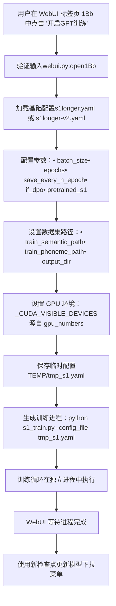
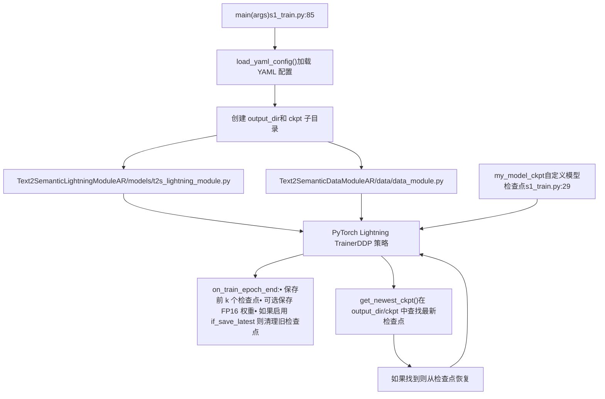
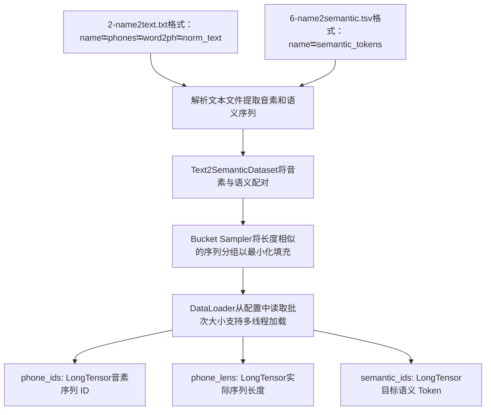
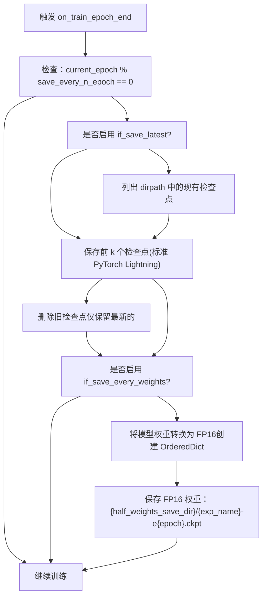

# GPT 模型训练 (GPT Model Training)

相关源文件

-   [GPT\_SoVITS/prepare\_datasets/1-get-text.py](https://github.com/RVC-Boss/GPT-SoVITS/blob/c767f0b8/GPT_SoVITS/prepare_datasets/1-get-text.py)
-   [GPT\_SoVITS/prepare\_datasets/2-get-hubert-wav32k.py](https://github.com/RVC-Boss/GPT-SoVITS/blob/c767f0b8/GPT_SoVITS/prepare_datasets/2-get-hubert-wav32k.py)
-   [GPT\_SoVITS/prepare\_datasets/3-get-semantic.py](https://github.com/RVC-Boss/GPT-SoVITS/blob/c767f0b8/GPT_SoVITS/prepare_datasets/3-get-semantic.py)
-   [GPT\_SoVITS/s1\_train.py](https://github.com/RVC-Boss/GPT-SoVITS/blob/c767f0b8/GPT_SoVITS/s1_train.py)
-   [api.py](https://github.com/RVC-Boss/GPT-SoVITS/blob/c767f0b8/api.py)
-   [config.py](https://github.com/RVC-Boss/GPT-SoVITS/blob/c767f0b8/config.py)
-   [webui.py](https://github.com/RVC-Boss/GPT-SoVITS/blob/c767f0b8/webui.py)

## 目的与范围 (Purpose and Scope)

本页档记录了 GPT (Text2Semantic) 模型的训练过程。该模型学习将 Phoneme (音素) 序列转换为 Semantic Token (语义 Token) 序列。GPT 模型是两阶段 TTS 系统的第一阶段，使用脚本 [GPT\_SoVITS/s1\_train.py](https://github.com/RVC-Boss/GPT-SoVITS/blob/c767f0b8/GPT_SoVITS/s1_train.py) 进行训练。

有关准备训练数据集（提取 BERT 特征、Hubert 特征和语义 Token）的信息，请参阅 [数据集格式与结构](/RVC-Boss/GPT-SoVITS/6.1-dataset-format-and-structure)。有关训练第二阶段 SoVITS 声学模型的信息，请参阅 [SoVITS 模型训练](/RVC-Boss/GPT-SoVITS/6.3-sovits-model-training)。

GPT 模型训练过程消耗：

-   **输入**: 来自 `2-name2text.txt` 的音素序列和来自 `6-name2semantic.tsv` 的语义 Token 序列
-   **输出**: 训练好的 GPT Checkpoint (检查点) 文件 (`.ckpt`)，保存在特定版本的权重目录中

---

## 训练配置结构 (Training Configuration Structure)

GPT 训练由位于 [GPT\_SoVITS/configs/s1longer.yaml](https://github.com/RVC-Boss/GPT-SoVITS/blob/c767f0b8/GPT_SoVITS/configs/s1longer.yaml) (v1) 和 [GPT\_SoVITS/configs/s1longer-v2.yaml](https://github.com/RVC-Boss/GPT-SoVITS/blob/c767f0b8/GPT_SoVITS/configs/s1longer-v2.yaml) (v2+) 的 YAML 配置文件控制。配置由 [webui.py590-675](https://github.com/RVC-Boss/GPT-SoVITS/blob/c767f0b8/webui.py#L590-L675) 中的 WebUI 函数 `open1Bb` 组装。

### 配置参数

| 参数 | 位置 | 描述 | 默认值/范围 |
| --- | --- | --- | --- |
| `batch_size` | `train.batch_size` | 每个 GPU 的训练批次大小 | 根据显存自动计算 |
| `epochs` | `train.epochs` | 总训练轮数 | 用户指定 |
| `precision` | `train.precision` | 训练精度 ("32" 或 "16") | 如果 GPU 支持 FP16 则为 "16" |
| `save_every_n_epoch` | `train.save_every_n_epoch` | 检查点保存频率 | 用户指定 |
| `if_save_latest` | `train.if_save_latest` | 仅保留最新的检查点 | 布尔值 |
| `if_save_every_weights` | `train.if_save_every_weights` | 每轮保存 FP16 权重 | 布尔值 |
| `if_dpo` | `train.if_dpo` | 启用 DPO 损失以减少重复 | 布尔值 |
| `pretrained_s1` | 顶级层 | 预训练 GPT 检查点路径 | 源自 `config.py` |
| `train_semantic_path` | 顶级层 | `6-name2semantic.tsv` 路径 | `{exp_dir}/6-name2semantic.tsv` |
| `train_phoneme_path` | 顶级层 | `2-name2text.txt` 路径 | `{exp_dir}/2-name2text.txt` |
| `output_dir` | 顶级层 | 训练日志和检查点目录 | `{exp_dir}/logs_s1_{version}` |
| `half_weights_save_dir` | `train.half_weights_save_dir` | FP16 权重保存目录 | 版本特定的 GPT 权重目录 |
| `exp_name` | `train.exp_name` | 用于检查点命名的实验名称 | 用户指定 |

来源: [webui.py604-627](https://github.com/RVC-Boss/GPT-SoVITS/blob/c767f0b8/webui.py#L604-L627) [config.py68-75](https://github.com/RVC-Boss/GPT-SoVITS/blob/c767f0b8/config.py#L68-L75)

---

## WebUI 训练调用流程 (WebUI Training Invocation Flow)


**WebUI 训练启动流程**

来源: [webui.py590-675](https://github.com/RVC-Boss/GPT-SoVITS/blob/c767f0b8/webui.py#L590-L675)

---

## 训练脚本架构 (Training Script Architecture)

训练过程在 [GPT\_SoVITS/s1\_train.py](https://github.com/RVC-Boss/GPT-SoVITS/blob/c767f0b8/GPT_SoVITS/s1_train.py) 中实现，使用 PyTorch Lightning 支持分布式训练。

### 主要组件


**训练脚本组件架构**

来源: [GPT\_SoVITS/s1\_train.py85-148](https://github.com/RVC-Boss/GPT-SoVITS/blob/c767f0b8/GPT_SoVITS/s1_train.py#L85-L148)

### Text2SemanticLightningModule

GPT 模型被封装在 PyTorch Lightning 模块中以简化分布式训练。主要职责：

-   **模型初始化**: 创建 GPT Transformer (变换器) 模型
-   **训练步骤**: 计算语义 Token 预测的交叉熵损失
-   **可选的 DPO 损失**: 当 `if_dpo=True` 时减少生成序列中的重复
-   **优化器配置**: 带有学习率调度的 AdamW 优化器
-   **指标记录**: 跟踪语义 Token 预测的 top-1、top-3、top-5 准确率

如果配置中指定了 `pretrained_s1`，该模块将加载预训练权重。

来源: [GPT\_SoVITS/s1\_train.py130](https://github.com/RVC-Boss/GPT-SoVITS/blob/c767f0b8/GPT_SoVITS/s1_train.py#L130-L130) [webui.py618](https://github.com/RVC-Boss/GPT-SoVITS/blob/c767f0b8/webui.py#L618-L618)

---

## 数据加载流水线 (Data Loading Pipeline)

### Text2SemanticDataModule

Data Module (数据模块) 处理训练数据的加载和批处理：


**数据加载架构**

数据集使用自定义的 Bucket Sampler (桶采样器) 将长度相似的序列分组，从而减少填充 (Padding) 开销并提高训练效率。这至关重要，因为：

-   音素序列的长度从约 10 到 500+ 个 Token 不等
-   语义序列的长度可能在 50 到 1500+ 个 Token 之间
-   过多的填充会浪费 GPU 显存和计算资源

来源: [GPT\_SoVITS/s1\_train.py132-138](https://github.com/RVC-Boss/GPT-SoVITS/blob/c767f0b8/GPT_SoVITS/s1_train.py#L132-L138)

---

## 检查点管理 (Checkpoint Management)

自定义的 `my_model_ckpt` 类扩展了 PyTorch Lightning 的 `ModelCheckpoint`，以提供专门的检查点处理：

### 检查点保存行为


**检查点保存逻辑**

来源: [GPT\_SoVITS/s1\_train.py46-82](https://github.com/RVC-Boss/GPT-SoVITS/blob/c767f0b8/GPT_SoVITS/s1_train.py#L46-L82)

### 检查点文件结构

GPT 检查点以两种格式保存：

**1. 完整训练检查点 (用于恢复训练)**

-   位置: `{output_dir}/ckpt/epoch={N}-step={M}.ckpt`
-   内容: 完整的 PyTorch Lightning 状态，包括优化器、调度器、轮数
-   精度: 与训练精度匹配 (FP16 或 FP32)

**2. 推理就绪检查点 (可选)**

-   位置: `{half_weights_save_dir}/{exp_name}-e{epoch}.ckpt`
-   当 `if_save_every_weights=True` 时创建
-   结构:

    ```
    {    "weight": OrderedDict,  # 仅限 FP16 模型权重    "config": dict,         # 完整的训练配置    "info": "GPT-e{epoch}"  # 元数据字符串}
    ```


推理就绪格式由 WebUI 和 API 用于模型加载。它排除了优化器状态以减小文件大小（约缩小 50%）。

来源: [GPT\_SoVITS/s1\_train.py62-81](https://github.com/RVC-Boss/GPT-SoVITS/blob/c767f0b8/GPT_SoVITS/s1_train.py#L62-L81) [process\_ckpt.py26](https://github.com/RVC-Boss/GPT-SoVITS/blob/c767f0b8/process_ckpt.py#L26-L26)

---

## 使用 DDP 进行多 GPU 训练 (Multi-GPU Training with DDP)

训练脚本支持跨多个 GPU 的分布式数据并行 (Distributed Data Parallel, DDP) 训练：

### DDP 配置

`Trainer` 配置如下：

-   **策略**: `DDPStrategy`，带有后端选择：
    -   Linux 上使用 `nccl`（更快的 GPU 通信）
    -   Windows 上使用 `gloo`（不支持 NCCL）
-   **设备**: `-1`（使用所有可用 GPU）或特定 GPU 索引
-   **use\_distributed\_sampler**: 设为 `False` 以使用自定义 Bucket Sampler

GPU 分配由 WebUI 设置的 `_CUDA_VISIBLE_DEVICES` 环境变量控制：

```
os.environ["_CUDA_VISIBLE_DEVICES"] = str(fix_gpu_numbers(gpu_numbers.replace("-", ",")))
```
用户在 WebUI 中使用连字符分隔的索引指定 GPU 编号（例如，“0-1-2”表示 GPU 0、1 和 2）。

来源: [GPT\_SoVITS/s1\_train.py111-128](https://github.com/RVC-Boss/GPT-SoVITS/blob/c767f0b8/GPT_SoVITS/s1_train.py#L111-L128) [webui.py630](https://github.com/RVC-Boss/GPT-SoVITS/blob/c767f0b8/webui.py#L630-L630)

### DDP 中的检查点保存

在多 GPU 训练中，只有 Rank 0 会保存推理就绪的检查点，以避免竞态条件：

```
if os.environ.get("LOCAL_RANK", "0") == "0":    my_save(to_save_od, checkpoint_path)
```
这确保了即使有多个进程同时训练，也只会写入一个一致的检查点。

来源: [GPT\_SoVITS/s1\_train.py72](https://github.com/RVC-Boss/GPT-SoVITS/blob/c767f0b8/GPT_SoVITS/s1_train.py#L72-L72)

---

## 减少重复的 DPO 损失 (DPO Loss for Repetition Reduction)

GPT 模型可以可选地使用 Direct Preference Optimization (直接偏好优化，DPO) 损失来减少重复的生成模式。通过在训练配置中设置 `if_dpo=True` 来启用。

### DPO 实现

启用后，DPO 损失会惩罚模型在训练期间生成重复的语义 Token 序列。该损失与标准的交叉熵损失一起计算，帮助模型学习产生更多样化的输出。

这对于以下方面特别有用：

-   减少合成语音中的结巴
-   防止模型陷入循环
-   提高生成韵律的自然度

DPO 损失实现是 `Text2SemanticLightningModule` 训练步骤的一部分。

来源: [webui.py622](https://github.com/RVC-Boss/GPT-SoVITS/blob/c767f0b8/webui.py#L622-L622) [GPT\_SoVITS/s1\_train.py130](https://github.com/RVC-Boss/GPT-SoVITS/blob/c767f0b8/GPT_SoVITS/s1_train.py#L130-L130)

---

## 训练执行方法 (Training Execution Methods)

### 方法 1: WebUI (推荐)

启动 GPT 训练最常用的方法是通过主 WebUI：

1.  导航到 “GPT训练” 标签页 (1Bb)
2.  配置参数：
    -   **批次大小 (Batch Size)**: 根据 GPU 显存自动计算（可编辑）
    -   **总训练轮数 (Total Epochs)**: 训练的轮数
    -   **实验名称 (Experiment Name)**: 来自数据集准备的名称
    -   **if\_dpo**: 启用 DPO 损失（复选框）
    -   **保存设置**: 仅保留最新 vs 每 N 轮保存一次
    -   **GPU 选择**: 连字符分隔的 GPU 索引（例如，“0-1”）
    -   **预训练模型**: 从下拉菜单中选择
3.  点击开始按钮启动训练
4.  在状态指示器中监控进度
5.  如果需要，使用停止按钮提前停止训练

WebUI 处理：

-   配置文件生成
-   进程生成和监控
-   训练完成后更新检查点下拉菜单

来源: [webui.py590-675](https://github.com/RVC-Boss/GPT-SoVITS/blob/c767f0b8/webui.py#L590-L675)

### 方法 2: 直接脚本执行

对于高级用户或自动化流水线：

```
python GPT_SoVITS/s1_train.py --config_file path/to/config.yaml
```
YAML 配置文件必须包含所有必需的参数。此方法对于以下方面很有用：

-   自动化的训练流水线
-   自定义的训练配置
-   与实验跟踪系统的集成

来源: [GPT\_SoVITS/s1\_train.py152-171](https://github.com/RVC-Boss/GPT-SoVITS/blob/c767f0b8/GPT_SoVITS/s1_train.py#L152-L171)

---

## 训练配置示例 (Training Configuration Example)

### 典型的配置结构

```
train:  batch_size: 12  epochs: 15  save_every_n_epoch: 5  if_save_latest: false  if_save_every_weights: true  if_dpo: true  precision: "16"  seed: 1234  half_weights_save_dir: "GPT_weights_v2"  exp_name: "my_speaker" pretrained_s1: "GPT_SoVITS/pretrained_models/gsv-v2final-pretrained/s1bert25hz-5kh-longer-epoch=12-step=369668.ckpt" train_semantic_path: "logs/my_speaker/6-name2semantic.tsv"train_phoneme_path: "logs/my_speaker/2-name2text.txt"output_dir: "logs/my_speaker/logs_s1_v2" data:  max_sec: 54  pad_val: 1024 model:  # 模型架构参数  # (从预训练检查点继承)
```
来源: [webui.py604-634](https://github.com/RVC-Boss/GPT-SoVITS/blob/c767f0b8/webui.py#L604-L634)

---

## 版本特定的注意事项 (Version-Specific Considerations)

### 版本选择

GPT 模型版本由所选的预训练模型决定：

| 版本 | 预训练检查点 | 配置文件 | 备注 |
| --- | --- | --- | --- |
| v1 | `s1bert25hz-2kh-longer-epoch=68e-step=50232.ckpt` | `s1longer.yaml` | 旧版本 |
| v2/v2Pro/v2ProPlus | `s1bert25hz-5kh-longer-epoch=12-step=369668.ckpt` | `s1longer-v2.yaml` | 当前推荐版本 |
| v3 | `s1v3.ckpt` | `s1longer-v2.yaml` | 与 v2 共享 GPT |
| v4 | `s1v3.ckpt` | `s1longer-v2.yaml` | 与 v2 共享 GPT |

所有最新版本 (v2, v2Pro, v2ProPlus, v3, v4) 均使用相同的 GPT 架构和预训练权重。区别在于 SoVITS 模型（第二阶段）。

来源: [config.py21-28](https://github.com/RVC-Boss/GPT-SoVITS/blob/c767f0b8/config.py#L21-L28) [webui.py605](https://github.com/RVC-Boss/GPT-SoVITS/blob/c767f0b8/webui.py#L605-L605)

---

## 监控训练进度 (Monitoring Training Progress)

### TensorBoard 日志记录

训练指标被记录到 TensorBoard：

```
tensorboard --logdir logs/{exp_name}/logs_s1_{version}
```
记录的指标包括：

-   **train/loss**: 总训练损失（交叉熵 + 可选的 DPO）
-   **train/top\_1\_acc**: 语义 Token 预测的 top-1 准确率
-   **train/top\_3\_acc**: top-3 准确率（主要的检查点指标）
-   **train/top\_5\_acc**: top-5 准确率
-   **train/learning\_rate**: 当前学习率

检查点回调函数以 `max` 模式监控 `top_3_acc`，当该指标提高时保存检查点。

来源: [GPT\_SoVITS/s1\_train.py95-107](https://github.com/RVC-Boss/GPT-SoVITS/blob/c767f0b8/GPT_SoVITS/s1_train.py#L95-L107)

### 控制台输出

训练期间，脚本会输出：

-   当前的轮数 (Epoch) 和步骤 (Step) 编号
-   批次处理速度 (batches/second)
-   损失值 (Loss)
-   准确率指标 (Accuracy)
-   检查点保存通知

来源: [GPT\_SoVITS/s1\_train.py111-147](https://github.com/RVC-Boss/GPT-SoVITS/blob/c767f0b8/GPT_SoVITS/s1_train.py#L111-L147)

---

## 常见问题故障排除 (Troubleshooting Common Issues)

### 显存不足 (Out of Memory) 错误

如果训练因 CUDA OOM 失败：

1.  减小配置中的 `batch_size`
2.  WebUI 会自动将 GPT 训练的批次大小计算为 `min(mem) // 2`
3.  对于手动训练，从 batch\_size=4 开始并逐渐增加
4.  确保没有其他进程在使用 GPU 显存

### 训练未从检查点恢复

脚本使用 `get_newest_ckpt()` 查找最新检查点。请验证：

-   检查点是否存在于 `{output_dir}/ckpt/` 中
-   检查点文件名是否遵循 `epoch={N}-step={M}.ckpt` 模式
-   没有访问检查点目录的权限问题

### 多 GPU 训练挂起

常见原因：

-   防火墙阻止 GPU 间通信（检查 NCCL 端口）
-   不同 GPU 间的 CUDA 版本不匹配
-   Windows 用户应验证使用的是 `gloo` 后端（而非 `nccl`）
-   确保在环境中设置了 `MASTER_ADDR="localhost"`

来源: [GPT\_SoVITS/s1\_train.py109-122](https://github.com/RVC-Boss/GPT-SoVITS/blob/c767f0b8/GPT_SoVITS/s1_train.py#L109-L122) [GPT\_SoVITS/s1\_train.py140-147](https://github.com/RVC-Boss/GPT-SoVITS/blob/c767f0b8/GPT_SoVITS/s1_train.py#L140-L147)

---

## 与推理流水线的集成 (Integration with Inference Pipeline)

训练完成后：

1.  **检查点位置**: 推理就绪的检查点保存在特定版本的目录中（例如，`GPT_weights_v2/`）
2.  **下拉菜单更新**: WebUI 使用 [config.py](https://github.com/RVC-Boss/GPT-SoVITS/blob/c767f0b8/config.py#LNaN-LNaN) 自动刷新模型选择下拉菜单
3.  **模型加载**: 推理代码使用 [api.py](https://github.com/RVC-Boss/GPT-SoVITS/blob/c767f0b8/api.py#LNaN-LNaN) 加载检查点
4.  **版本检测**: 从检查点元数据中自动检测模型版本

训练好的 GPT 模型与训练好的 SoVITS 模型（参见 [SoVITS 模型训练](/RVC-Boss/GPT-SoVITS/6.3-sovits-model-training)）配合使用，形成完整的 TTS 流水线。

来源: [config.py86-121](https://github.com/RVC-Boss/GPT-SoVITS/blob/c767f0b8/config.py#L86-L121) [api.py477-491](https://github.com/RVC-Boss/GPT-SoVITS/blob/c767f0b8/api.py#L477-L491) [webui.py648-654](https://github.com/RVC-Boss/GPT-SoVITS/blob/c767f0b8/webui.py#L648-L654)
