# SoVITS 训练 (SoVITS Training)

相关源文件

-   [GPT\_SoVITS/module/data\_utils.py](https://github.com/RVC-Boss/GPT-SoVITS/blob/c767f0b8/GPT_SoVITS/module/data_utils.py)
-   [GPT\_SoVITS/module/mel\_processing.py](https://github.com/RVC-Boss/GPT-SoVITS/blob/c767f0b8/GPT_SoVITS/module/mel_processing.py)
-   [GPT\_SoVITS/module/models.py](https://github.com/RVC-Boss/GPT-SoVITS/blob/c767f0b8/GPT_SoVITS/module/models.py)
-   [GPT\_SoVITS/onnx\_export.py](https://github.com/RVC-Boss/GPT-SoVITS/blob/c767f0b8/GPT_SoVITS/onnx_export.py)
-   [GPT\_SoVITS/prepare\_datasets/1-get-text.py](https://github.com/RVC-Boss/GPT-SoVITS/blob/c767f0b8/GPT_SoVITS/prepare_datasets/1-get-text.py)
-   [GPT\_SoVITS/prepare\_datasets/2-get-hubert-wav32k.py](https://github.com/RVC-Boss/GPT-SoVITS/blob/c767f0b8/GPT_SoVITS/prepare_datasets/2-get-hubert-wav32k.py)
-   [GPT\_SoVITS/prepare\_datasets/3-get-semantic.py](https://github.com/RVC-Boss/GPT-SoVITS/blob/c767f0b8/GPT_SoVITS/prepare_datasets/3-get-semantic.py)
-   [GPT\_SoVITS/s1\_train.py](https://github.com/RVC-Boss/GPT-SoVITS/blob/c767f0b8/GPT_SoVITS/s1_train.py)
-   [api.py](https://github.com/RVC-Boss/GPT-SoVITS/blob/c767f0b8/api.py)
-   [config.py](https://github.com/RVC-Boss/GPT-SoVITS/blob/c767f0b8/config.py)
-   [webui.py](https://github.com/RVC-Boss/GPT-SoVITS/blob/c767f0b8/webui.py)

本页提供了关于训练 GPT-SoVITS 系统中 SoVITS（基于隐式/中间 Token 合成的语音合成器，Synthesizer of Voice using Implicit/Intermediate Token-based Synthesis）组件的全面文档。SoVITS 是两阶段 TTS 系统的第二阶段，负责将语义 Token 转换为高质量音频，同时保留参考音频的声音特征。有关训练文本到语义模型（第一阶段）的信息，请参阅 [GPT 训练](/RVC-Boss/GPT-SoVITS/5.1-audio-preprocessing-tools)。

## 1. SoVITS 训练概览 (Overview of SoVITS Training)

SoVITS 是一种基于 VITS 架构并进行了重大改进的生成式语音合成模型。训练过程涉及教导模型：

1.  将 Semantic Token (语义 Token) 转换为 Mel-spectrogram (梅尔频谱图)
2.  从这些频谱图生成高质量的音频波形
3.  从参考音频样本中保留声音特征

SoVITS 有多个版本（v1、v2、v3 和 v3-LoRA），每个版本都在质量和效率上进行了逐步改进。

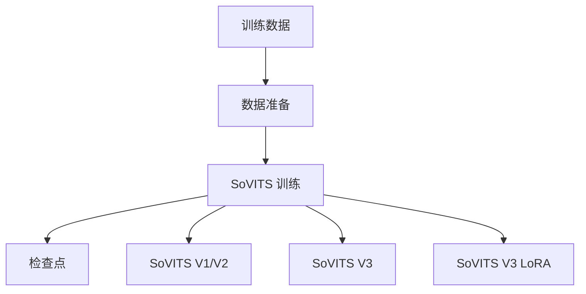
来源: [GPT\_SoVITS/s2\_train.py](https://github.com/RVC-Boss/GPT-SoVITS/blob/c767f0b8/GPT_SoVITS/s2_train.py) [GPT\_SoVITS/s2\_train\_v3.py](https://github.com/RVC-Boss/GPT-SoVITS/blob/c767f0b8/GPT_SoVITS/s2_train_v3.py) [GPT\_SoVITS/s2\_train\_v3\_lora.py](https://github.com/RVC-Boss/GPT-SoVITS/blob/c767f0b8/GPT_SoVITS/s2_train_v3_lora.py)

## 2. SoVITS 模型架构 (SoVITS Model Architecture)

SoVITS 模型通过 `SynthesizerTrn` 类及其变体（用于 v3 的 `SynthesizerTrnV3`）实现。该模型将语义 Token 和参考音频转化为高质量的语音合成。

**SoVITS 训练架构**

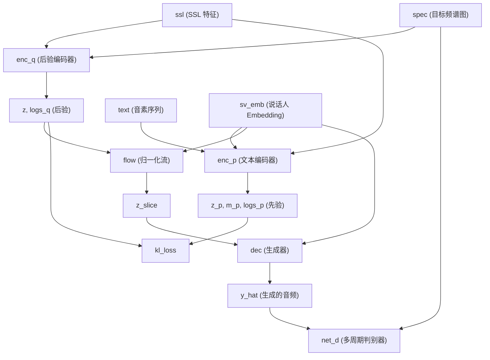
来源: [GPT\_SoVITS/s2\_train.py135-155](https://github.com/RVC-Boss/GPT-SoVITS/blob/c767f0b8/GPT_SoVITS/s2_train.py#L135-L155) [GPT\_SoVITS/s2\_train.py381-395](https://github.com/RVC-Boss/GPT-SoVITS/blob/c767f0b8/GPT_SoVITS/s2_train.py#L381-L395)

### 2.1 核心组件

| 组件 | 描述 | 代码参考 |
| --- | --- | --- |
| `SynthesizerTrn` | v1/v2 的主要生成器模型 | [GPT\_SoVITS/s2\_train.py136-149](https://github.com/RVC-Boss/GPT-SoVITS/blob/c767f0b8/GPT_SoVITS/s2_train.py#L136-L149) |
| `SynthesizerTrnV3` | v3 的增强型生成器 | [GPT\_SoVITS/s2\_train\_v3.py136-149](https://github.com/RVC-Boss/GPT-SoVITS/blob/c767f0b8/GPT_SoVITS/s2_train_v3.py#L136-L149) |
| `MultiPeriodDiscriminator` | 用于真实音频的对抗性判别器 | [GPT\_SoVITS/s2\_train.py151-155](https://github.com/RVC-Boss/GPT-SoVITS/blob/c767f0b8/GPT_SoVITS/s2_train.py#L151-L155) |
| `TextAudioSpeakerLoader` | v1/v2 训练的数据加载器 | [GPT\_SoVITS/s2\_train.py90](https://github.com/RVC-Boss/GPT-SoVITS/blob/c767f0b8/GPT_SoVITS/s2_train.py#L90-L90) |
| `TextAudioSpeakerLoaderV3` | v3 训练的数据加载器 | [GPT\_SoVITS/s2\_train\_v3.py90](https://github.com/RVC-Boss/GPT-SoVITS/blob/c767f0b8/GPT_SoVITS/s2_train_v3.py#L90-L90) |
| `TextAudioSpeakerLoaderV4` | v4 训练的数据加载器 | [GPT\_SoVITS/s2\_train\_v3\_lora.py90](https://github.com/RVC-Boss/GPT-SoVITS/blob/c767f0b8/GPT_SoVITS/s2_train_v3_lora.py#L90-L90) |

来源: [GPT\_SoVITS/s2\_train.py35-38](https://github.com/RVC-Boss/GPT-SoVITS/blob/c767f0b8/GPT_SoVITS/s2_train.py#L35-L38) [GPT\_SoVITS/s2\_train\_v3.py36-38](https://github.com/RVC-Boss/GPT-SoVITS/blob/c767f0b8/GPT_SoVITS/s2_train_v3.py#L36-L38)

### 2.2 前向过程 (Forward Process)

在训练期间，模型遵循以下过程：

1.  从参考音频中提取 Style Embedding (风格嵌入，`ge`)
2.  通过残差矢量量化器处理 SSL 特征
3.  `TextEncoder` 使用风格嵌入处理文本和量化特征
4.  `PosteriorEncoder` 编码目标频谱图
5.  模型通过 Flow (流) 网络学习从文本和量化特征到音频的映射
6.  判别器为真实的音频生成提供对抗性反馈

来源: [GPT\_SoVITS/module/models.py909-920](https://github.com/RVC-Boss/GPT-SoVITS/blob/c767f0b8/GPT_SoVITS/module/models.py#L909-L920)

## 3. 训练过程 (Training Process)

### 3.1 训练配置

SoVITS 训练通过 [webui.py489-572](https://github.com/RVC-Boss/GPT-SoVITS/blob/c767f0b8/webui.py#L489-L572) 中的 `open1Ba` 函数从 WebUI 启动。配置过程包括：

1.  加载版本特定的配置文件（v1/v2 使用 `s2.json`，v2Pro 变体使用 `s2v2Pro.json`）
2.  根据 WebUI 输入更新配置参数
3.  将临时配置写入 `TEMP/tmp_s2.json`
4.  使用该配置启动相应的训练脚本

**训练配置流程**

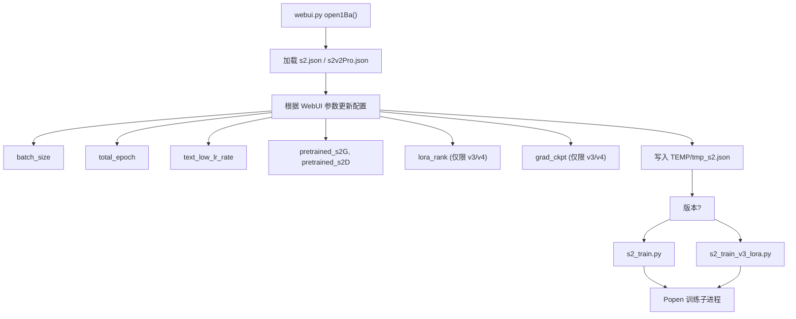
来源: [webui.py489-544](https://github.com/RVC-Boss/GPT-SoVITS/blob/c767f0b8/webui.py#L489-L544) [config.py12-19](https://github.com/RVC-Boss/GPT-SoVITS/blob/c767f0b8/config.py#L12-L19)

### 3.2 训练数据流水线 (Training Data Pipeline)

训练数据通过版本特定的加载器类进行加载和处理。系统期望在实验目录结构中包含预处理好的数据：

**所需的目录结构:**

```
logs/{exp_name}/
├── 2-name2text.txt        # 音素序列
├── 3-bert/*.pt            # BERT 特征（仅限中文）
├── 4-cnhubert/*.pt        # 来自 CNHubert 的 SSL 特征
├── 5-wav32k/*.wav         # 32kHz 重采样音频
└── 5.1-sv/*.pt            # 说话人验证 Embedding（仅限 v2Pro）
```
**训练数据流水线**

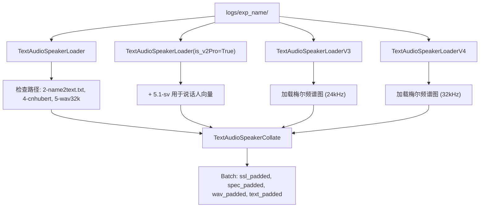
来源: [GPT\_SoVITS/module/data\_utils.py17-156](https://github.com/RVC-Boss/GPT-SoVITS/blob/c767f0b8/GPT_SoVITS/module/data_utils.py#L17-L156) [GPT\_SoVITS/module/data\_utils.py279-438](https://github.com/RVC-Boss/GPT-SoVITS/blob/c767f0b8/GPT_SoVITS/module/data_utils.py#L279-L438) [GPT\_SoVITS/module/data\_utils.py517-699](https://github.com/RVC-Boss/GPT-SoVITS/blob/c767f0b8/GPT_SoVITS/module/data_utils.py#L517-L699)

### 3.3 训练循环和损失函数 (Training Loop and Loss Functions)

不同版本的训练有显著差异：

**V1/V2/V2Pro 训练 (基于 GAN):**

-   使用判别器的对抗性训练
-   多个损失组件：Mel 损失、KL 损失、判别器/生成器损失
-   两阶段更新：先更新判别器，后更新生成器

**V3/V4 训练 (基于 CFM):**

-   仅使用 Conditional Flow Matching (条件流匹配，CFM) 损失
-   不进行判别器训练
-   单阶段更新

**SoVITS V1/V2 训练循环**

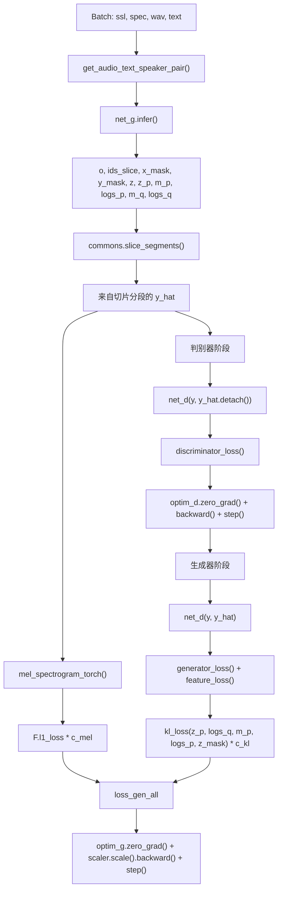
**SoVITS V3/V4 训练循环**

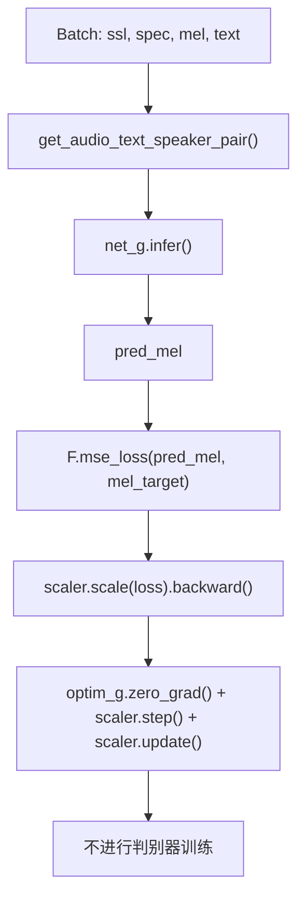
来源: [GPT\_SoVITS/module/data\_utils.py109-134](https://github.com/RVC-Boss/GPT-SoVITS/blob/c767f0b8/GPT_SoVITS/module/data_utils.py#L109-L134) [webui.py541-544](https://github.com/RVC-Boss/GPT-SoVITS/blob/c767f0b8/webui.py#L541-L544)

## 4. 模型版本 (Model Versions)

SoVITS 拥有多个版本，具有不同的架构和训练方法：

### 4.1 版本比较

| 版本 | 模型类 | 数据加载器 | 损失函数 | 训练脚本 |
| --- | --- | --- | --- | --- |
| V1/V2 | `SynthesizerTrn` | `TextAudioSpeakerLoader` | GAN + Mel + KL 损失 | `s2_train.py` |
| V2Pro/V2ProPlus | `SynthesizerTrn` | `TextAudioSpeakerLoader` | GAN + Mel + KL + SV 损失 | `s2_train.py` |
| V3 | `SynthesizerTrnV3` | `TextAudioSpeakerLoaderV3` | 仅 CFM 损失 | `s2_train_v3.py` |
| V4 | `SynthesizerTrnV3` | `TextAudioSpeakerLoaderV4` | 仅 CFM 损失 | `s2_train_v3_lora.py` |
| V3/V4 LoRA | 应用于 CFM 模块的 `get_peft_model()` | 版本特定加载器 | 带有 LoRA 的 CFM 损失 | `s2_train_v3_lora.py` |

来源: [GPT\_SoVITS/s2\_train.py136](https://github.com/RVC-Boss/GPT-SoVITS/blob/c767f0b8/GPT_SoVITS/s2_train.py#L136-L136) [GPT\_SoVITS/s2\_train\_v3.py136](https://github.com/RVC-Boss/GPT-SoVITS/blob/c767f0b8/GPT_SoVITS/s2_train_v3.py#L136-L136) [GPT\_SoVITS/s2\_train\_v3\_lora.py166-196](https://github.com/RVC-Boss/GPT-SoVITS/blob/c767f0b8/GPT_SoVITS/s2_train_v3_lora.py#L166-L196)

### 4.2 V3/V4 LoRA 实现

对于 v3 和 v4 模型，可以应用 LoRA (Low-Rank Adaptation，低秩自适应) 以减少微调期间的显存需求。该实现使用 `peft` 库为特定模块添加可训练的低秩矩阵。

**V3/V4 LoRA 配置:**

```
{  "train": {    "lora_rank": 8,  // 典型值：4, 8, 16    "grad_ckpt": true  // 启用梯度检查点  }}
```
**LoRA 实现流程**

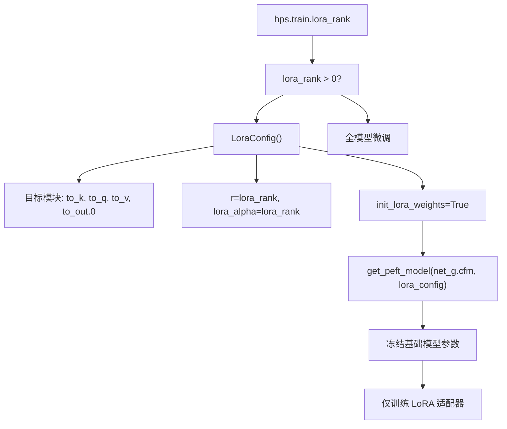
**显存优势:**

-   V3 全量训练: ~14GB VRAM
-   V3 LoRA 训练: ~8GB VRAM
-   训练速度显著加快，且质量相近

来源: [webui.py532](https://github.com/RVC-Boss/GPT-SoVITS/blob/c767f0b8/webui.py#L532-L532) [config.py15-16](https://github.com/RVC-Boss/GPT-SoVITS/blob/c767f0b8/config.py#L15-L16)

## 5. 训练参数和超参数 (Training Parameters and Hyperparameters)

### 5.1 重要训练超参数

参数通过 WebUI 或直接在配置 JSON 文件中进行配置：

| 参数 | 描述 | 典型值 | WebUI 控制 | 配置位置 |
| --- | --- | --- | --- | --- |
| `batch_size` | 训练批次大小 | 6-12 (v1/v2), 2-4 (v3/v4) | 是 | [webui.py522](https://github.com/RVC-Boss/GPT-SoVITS/blob/c767f0b8/webui.py#L522-L522) |
| `epochs` | 总训练轮数 | 8 (v1/v2), 2 (v3/v4) | 是 | [webui.py523](https://github.com/RVC-Boss/GPT-SoVITS/blob/c767f0b8/webui.py#L523-L523) |
| `text_low_lr_rate` | 文本编码器学习率倍率 | 0.4 | 是 | [webui.py524](https://github.com/RVC-Boss/GPT-SoVITS/blob/c767f0b8/webui.py#L524-L524) |
| `if_save_latest` | 仅保留最新检查点 | 是/否 | 是 | [webui.py527](https://github.com/RVC-Boss/GPT-SoVITS/blob/c767f0b8/webui.py#L527-L527) |
| `if_save_every_weights` | 每轮保存推理权重 | 是/否 | 是 | [webui.py528](https://github.com/RVC-Boss/GPT-SoVITS/blob/c767f0b8/webui.py#L528-L528) |
| `save_every_epoch` | 检查点保存频率 | 4 (v1/v2), 1 (v3/v4) | 是 | [webui.py529](https://github.com/RVC-Boss/GPT-SoVITS/blob/c767f0b8/webui.py#L529-L529) |
| `gpu_numbers` | 使用的 GPU 设备 | "0" 或 "0,1,2" | 是 | [webui.py530](https://github.com/RVC-Boss/GPT-SoVITS/blob/c767f0b8/webui.py#L530-L530) |
| `pretrained_s2G` | 生成器预训练权重 | 版本特定路径 | 是 | [webui.py525](https://github.com/RVC-Boss/GPT-SoVITS/blob/c767f0b8/webui.py#L525-L525) |
| `pretrained_s2D` | 判别器预训练权重 | 版本特定路径 | 是 | [webui.py526](https://github.com/RVC-Boss/GPT-SoVITS/blob/c767f0b8/webui.py#L526-L526) |
| `grad_ckpt` | 启用梯度检查点 | 是 (v3/v4) | 是 | [webui.py531](https://github.com/RVC-Boss/GPT-SoVITS/blob/c767f0b8/webui.py#L531-L531) |
| `lora_rank` | v3/v4 的 LoRA 秩 | 8 | 是 | [webui.py532](https://github.com/RVC-Boss/GPT-SoVITS/blob/c767f0b8/webui.py#L532-L532) |

**默认值逻辑:**

```
# 源自 webui.py set_default()if version not in v3v4set:  # v1, v2, v2Pro    default_sovits_epoch = 8    default_sovits_save_every_epoch = 4    max_sovits_epoch = 25else:  # v3, v4    default_sovits_epoch = 2    default_sovits_save_every_epoch = 1    max_sovits_epoch = 16
```
来源: [webui.py123-133](https://github.com/RVC-Boss/GPT-SoVITS/blob/c767f0b8/webui.py#L123-L133) [webui.py489-544](https://github.com/RVC-Boss/GPT-SoVITS/blob/c767f0b8/webui.py#L489-L544) [config.py12-28](https://github.com/RVC-Boss/GPT-SoVITS/blob/c767f0b8/config.py#L12-L28)

### 5.2 模型架构参数

| 参数 | 描述 | 典型值 | 文件位置 |
| --- | --- | --- | --- |
| `inter_channels` | 模型中的中间通道数 | 192 | `configs/s2.json` |
| `hidden_channels` | 模型中的隐藏通道数 | 192 | `configs/s2.json` |
| `filter_channels` | 模型中的滤波器通道数 | 768 | `configs/s2.json` |
| `n_heads` | 注意力头数 | 2 | `configs/s2.json` |
| `n_layers` | 模型中的层数 | 6 | `configs/s2.json` |
| `kernel_size` | 卷积核大小 | 3 | `configs/s2.json` |
| `p_dropout` | Dropout 概率 | 0.1 | `configs/s2.json` |
| `gin_channels` | 全局条件通道数 | 512 | `configs/s2.json` |
| `semantic_frame_rate` | 语义 Token 的帧率 | "25hz" | `configs/s2.json` |
| `freeze_quantizer` | 是否冻结量化器 | true | `configs/s2.json` |

来源: [GPT\_SoVITS/configs/s2.json](https://github.com/RVC-Boss/GPT-SoVITS/blob/c767f0b8/GPT_SoVITS/configs/s2.json) [GPT\_SoVITS/module/models.py794-838](https://github.com/RVC-Boss/GPT-SoVITS/blob/c767f0b8/GPT_SoVITS/module/models.py#L794-L838)

## 6. 检查点管理 (Checkpoint Management)

### 6.1 检查点保存策略

训练过程保存由 WebUI 参数控制的两种类型的检查点：

**检查点类型:**

1.  **训练检查点 (Training Checkpoints)** (在 `logs_s2_{version}/` 中):

    -   包含用于恢复训练的完整状态
    -   包括优化器状态、学习率、迭代次数
    -   由 `if_save_latest` 参数管理
2.  **推理权重 (Inference Weights)** (在 `SoVITS_weights_v*/` 中):

    -   针对推理进行了优化（半精度）
    -   不含优化器状态
    -   命名格式: `{exp_name}_e{epoch}_s{step}.pth`
    -   由 `if_save_every_weights` 参数管理

**检查点保存流程**

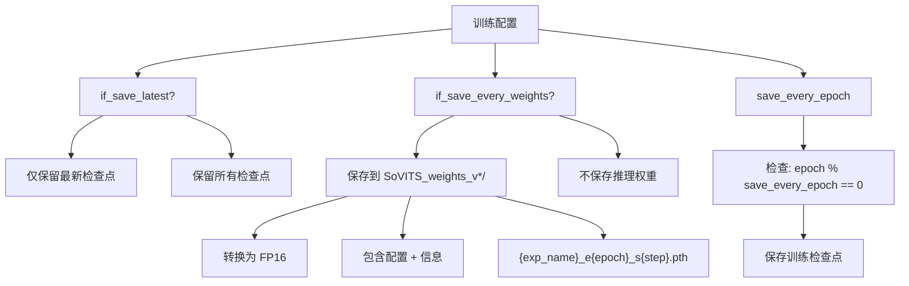
**版本特定的保存目录:**

```
# 源自 config.pySoVITS_weight_version2root = {    "v1": "SoVITS_weights",    "v2": "SoVITS_weights_v2",    "v3": "SoVITS_weights_v3",    "v4": "SoVITS_weights_v4",    "v2Pro": "SoVITS_weights_v2Pro",    "v2ProPlus": "SoVITS_weights_v2ProPlus",}
```
来源: [webui.py527-529](https://github.com/RVC-Boss/GPT-SoVITS/blob/c767f0b8/webui.py#L527-L529) [webui.py535](https://github.com/RVC-Boss/GPT-SoVITS/blob/c767f0b8/webui.py#L535-L535) [config.py60-67](https://github.com/RVC-Boss/GPT-SoVITS/blob/c767f0b8/config.py#L60-L67)

### 6.2 加载检查点以恢复训练

启动训练时，系统会尝试：

1.  加载最新的检查点（如果存在）以恢复训练
2.  如果不存在检查点，则加载指定的预训练模型
3.  否则，从头开始训练

来源: [GPT\_SoVITS/s2\_train.py206-263](https://github.com/RVC-Boss/GPT-SoVITS/blob/c767f0b8/GPT_SoVITS/s2_train.py#L206-L263) [GPT\_SoVITS/utils.py23-60](https://github.com/RVC-Boss/GPT-SoVITS/blob/c767f0b8/GPT_SoVITS/utils.py#L23-L60)

### 6.3 检查点版本检测

在加载检查点进行推理时，版本检测是自动处理的。系统使用多种策略来识别模型版本。

**检查点格式检测策略**

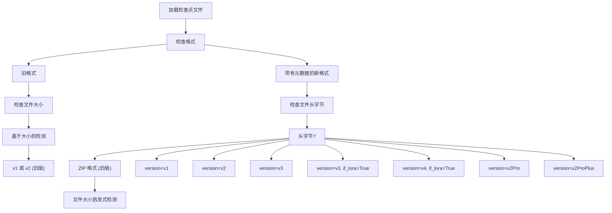
**在推理中的用法:**

```
# 源自 api.py get_sovits_weights()version, model_version, if_lora_v3 = get_sovits_version_from_path_fast(sovits_path)
```
来源: [api.py389](https://github.com/RVC-Boss/GPT-SoVITS/blob/c767f0b8/api.py#L389-L389)

## 7. 实用训练指南 (Practical Training Guide)

### 7.1 通过 WebUI 执行训练

训练 SoVITS 的推荐方式是通过 WebUI，它负责所有的配置和子进程管理：

**训练标签页工作流:**

1.  **导航到 WebUI 的训练标签页**（端口 9874）

2.  **配置实验:**

    -   设置实验名称（与 `logs/` 中的数据集目录匹配）
    -   选择模型版本 (v2, v3, v4, v2Pro, v2ProPlus)
    -   选择预训练模型路径
3.  **设置训练参数:**

    -   批次大小 (Batch size，根据 GPU 显存自动计算)
    -   总训练轮数
    -   文本低学习率
    -   保存选项（仅保留最新，或每轮保存权重）
    -   GPU 选择
4.  **开始训练:**

    -   点击 “开启SoVITS训练” 按钮
    -   训练子进程通过 `open1Ba()` 函数启动
    -   进度显示在状态输出中

**训练过程流程:**

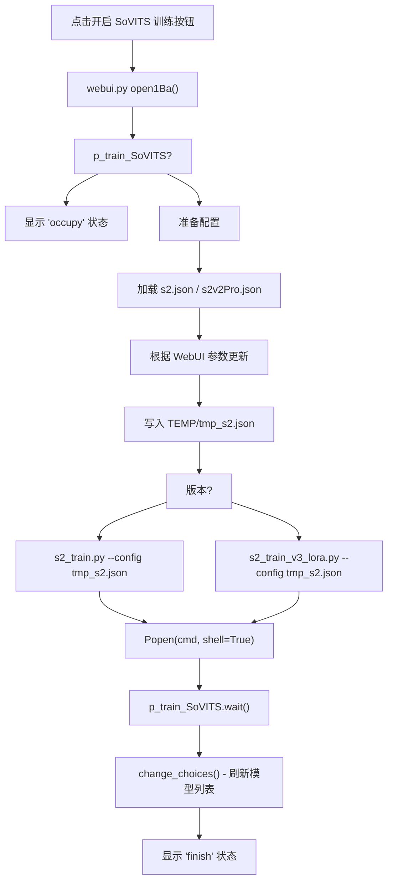
来源: [webui.py489-572](https://github.com/RVC-Boss/GPT-SoVITS/blob/c767f0b8/webui.py#L489-L572) [webui.py541-544](https://github.com/RVC-Boss/GPT-SoVITS/blob/c767f0b8/webui.py#L541-L544)

### 7.2 直接脚本执行

对于高级用户或自动化需求，可以直接启动训练：

```
# 设置版本环境变量export version="v2Pro" # 在 TEMP/tmp_s2.json 中准备包含必需字段的配置 # 运行训练 (v1/v2/v2Pro)python GPT_SoVITS/s2_train.py --config TEMP/tmp_s2.json # 运行训练 (带有 LoRA 的 v3/v4)python GPT_SoVITS/s2_train_v3_lora.py --config TEMP/tmp_s2.json
```
来源: [webui.py4](https://github.com/RVC-Boss/GPT-SoVITS/blob/c767f0b8/webui.py#L4-L4) [webui.py541-544](https://github.com/RVC-Boss/GPT-SoVITS/blob/c767f0b8/webui.py#L541-L544)

### 7.3 选择合适的版本

| 使用场景 | 推荐版本 | 所需显存 (VRAM) | 训练时间 | 质量 |
| --- | --- | --- | --- | --- |
| 最佳质量，计算资源充足 | v4 | 14GB+ | 最长 | 最高 (48kHz, 无伪影) |
| 良好质量，计算资源适中 | v3 | 12GB+ | 长 | 高 (24kHz, 少量伪影) |
| 微调现有模型 | v3/v4 LoRA | 8GB | 短 | 高 (参数高效) |
| 增强说话人相似度 | v2Pro/v2ProPlus | 10GB | 适中 | 极佳 + 说话人验证 |
| 稳定的基准版本 | v2 | 8-10GB | 适中 | 良好 |
| 资源受限 | v2 | 8GB | 适中 | 良好 |

**版本选择指南:**

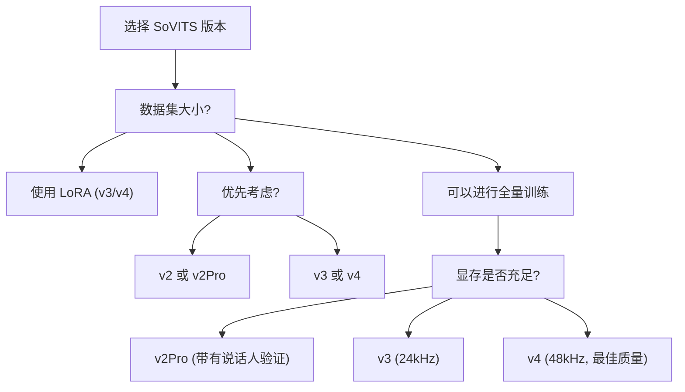
来源: [webui.py101](https://github.com/RVC-Boss/GPT-SoVITS/blob/c767f0b8/webui.py#L101-L101) [webui.py123-133](https://github.com/RVC-Boss/GPT-SoVITS/blob/c767f0b8/webui.py#L123-L133) [config.py12-28](https://github.com/RVC-Boss/GPT-SoVITS/blob/c767f0b8/config.py#L12-L28)

### 7.4 训练时间估算

**近似训练时长:**

-   取决于数据集大小、GPU 硬件和批次大小
-   默认轮数: 8 (v1/v2), 2 (v3/v4)
-   每轮处理一次完整的数据集

**示例用时 (RTX 3090, 10 分钟数据集):**

-   v2: 8 轮约 30-60 分钟
-   v3: 2 轮约 40-80 分钟
-   v4: 2 轮约 50-100 分钟
-   v3/v4 LoRA: 2 轮约 20-40 分钟

**监控进度:**

-   观察终端输出的损失值
-   检查 `logs/{exp_name}/logs_s2_{version}/` 中的 TensorBoard 日志
-   WebUI 状态更新显示正在训练/完成状态

来源: [webui.py123-133](https://github.com/RVC-Boss/GPT-SoVITS/blob/c767f0b8/webui.py#L123-L133)

## 8. 故障排除 (Troubleshooting)

常见问题及其解决方案：

1.  **显存不足 (OOM) 错误**:

    -   减小批次大小 (Batch size)
    -   通过 `grad_ckpt: true` 启用梯度检查点
    -   使用 V3-LoRA 代替完整的 V3 训练
2.  **训练不稳定**:

    -   降低学习率
    -   调整损失权重 (`c_mel`, `c_kl`)
    -   检查数据质量
3.  **合成质量差**:

    -   确保数据集具有一致的声音特征
    -   进行更多轮次的训练
    -   检查 SSL 特征质量
    -   验证音素对齐准确性
4.  **训练速度慢**:

    -   通过 `fp16_run: true` 启用混合精度
    -   使用 DDP 进行多 GPU 训练
    -   使用合适的 `num_workers` 优化数据加载器

来源: [GPT\_SoVITS/s2\_train.py282](https://github.com/RVC-Boss/GPT-SoVITS/blob/c767f0b8/GPT_SoVITS/s2_train.py#L282-L282) [GPT\_SoVITS/configs/s2.json](https://github.com/RVC-Boss/GPT-SoVITS/blob/c767f0b8/GPT_SoVITS/configs/s2.json)
