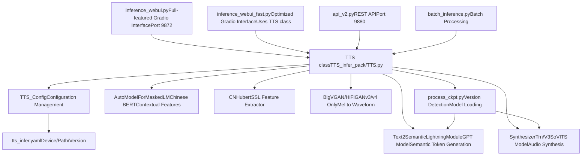
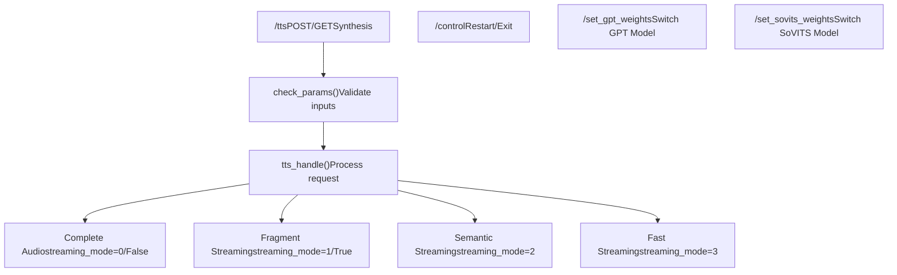
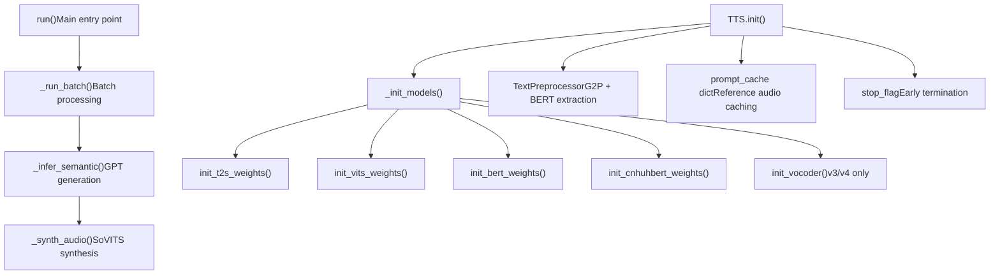
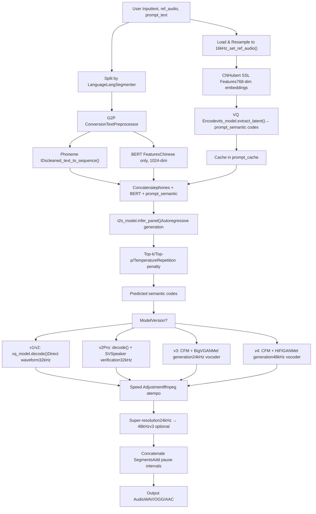
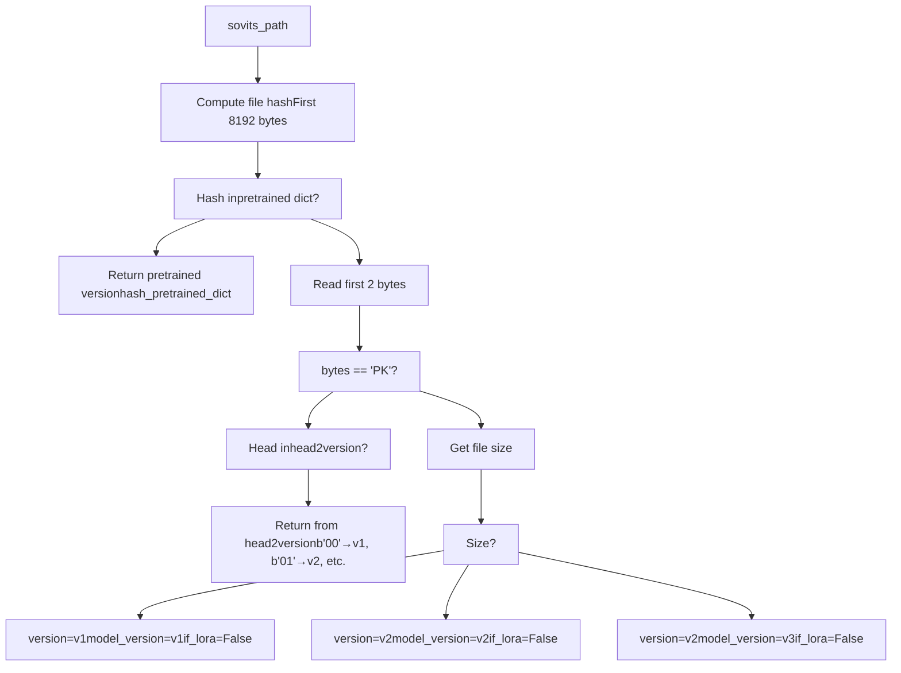
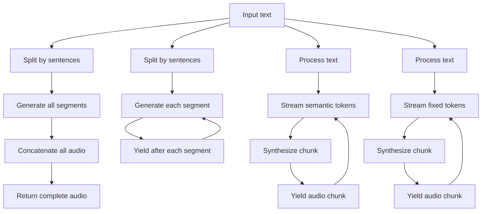

# Inference and Deployment (推理与部署)

相关源文件

-   [.gitignore](https://github.com/RVC-Boss/GPT-SoVITS/blob/c767f0b8/.gitignore)
-   [GPT\_SoVITS/AR/models/t2s\_model.py](https://github.com/RVC-Boss/GPT-SoVITS/blob/c767f0b8/GPT_SoVITS/AR/models/t2s_model.py)
-   [GPT\_SoVITS/AR/models/utils.py](https://github.com/RVC-Boss/GPT-SoVITS/blob/c767f0b8/GPT_SoVITS/AR/models/utils.py)
-   [GPT\_SoVITS/TTS\_infer\_pack/TTS.py](https://github.com/RVC-Boss/GPT-SoVITS/blob/c767f0b8/GPT_SoVITS/TTS_infer_pack/TTS.py)
-   [GPT\_SoVITS/configs/tts\_infer.yaml](https://github.com/RVC-Boss/GPT-SoVITS/blob/c767f0b8/GPT_SoVITS/configs/tts_infer.yaml)
-   [GPT\_SoVITS/inference\_webui.py](https://github.com/RVC-Boss/GPT-SoVITS/blob/c767f0b8/GPT_SoVITS/inference_webui.py)
-   [GPT\_SoVITS/inference\_webui\_fast.py](https://github.com/RVC-Boss/GPT-SoVITS/blob/c767f0b8/GPT_SoVITS/inference_webui_fast.py)
-   [GPT\_SoVITS/process\_ckpt.py](https://github.com/RVC-Boss/GPT-SoVITS/blob/c767f0b8/GPT_SoVITS/process_ckpt.py)
-   [api\_v2.py](https://github.com/RVC-Boss/GPT-SoVITS/blob/c767f0b8/api_v2.py)
-   [tools/assets.py](https://github.com/RVC-Boss/GPT-SoVITS/blob/c767f0b8/tools/assets.py)

本页面记录了 GPT-SoVITS 中的推理和部署机制，涵盖了已训练模型如何加载以及如何用于生成语音。这包括 TTS 流水线架构、可用的用户界面（WebUI 和 REST API）、Streaming Modes (流式模式) 以及部署考量。

有关训练模型的信息，请参见 [Model Training](/RVC-Boss/GPT-SoVITS/6-model-training)。有关训练前的数据集准备，请参见 [Data Preparation](/RVC-Boss/GPT-SoVITS/5-data-preparation)。

## Overview of Inference Architecture (推理架构概览)

GPT-SoVITS 提供了多个推理接口，它们都利用一个统一的 `TTS` 类作为核心 Synthesis Engine (合成引擎)。该系统支持实时合成、Batch Processing (批处理) 以及用于 Low-latency (低延迟) 应用的多种流式模式。


**Sources:** [GPT\_SoVITS/inference\_webui.py1-100](https://github.com/RVC-Boss/GPT-SoVITS/blob/c767f0b8/GPT_SoVITS/inference_webui.py#L1-L100) [GPT\_SoVITS/inference\_webui\_fast.py1-144](https://github.com/RVC-Boss/GPT-SoVITS/blob/c767f0b8/GPT_SoVITS/inference_webui_fast.py#L1-L144) [GPT\_SoVITS/TTS\_infer\_pack/TTS.py421-466](https://github.com/RVC-Boss/GPT-SoVITS/blob/c767f0b8/GPT_SoVITS/TTS_infer_pack/TTS.py#L421-L466) [api\_v2.py1-152](https://github.com/RVC-Boss/GPT-SoVITS/blob/c767f0b8/api_v2.py#L1-L152)

## Inference Interfaces (推理接口)

### Gradio WebUI 接口

GPT-SoVITS 提供了两个基于 Gradio 的 Web 界面用于交互式推理：

#### inference\_webui.py - 旧版接口

原始 WebUI 直接实现推理逻辑，而不使用 `TTS` 类。它在同一个文件中管理模型加载、文本处理和音频合成。

**关键函数：**

-   `change_sovits_weights()` - 加载 SoVITS 模型并检测版本
-   `change_gpt_weights()` - 加载 GPT 模型
-   `get_tts_wav()` - 主要的合成函数

**模型加载：**

```
inference_webui.py:229-368 - change_sovits_weights()
  ├─ 通过 get_sovits_version_from_path_fast() 检测模型版本
  ├─ 加载 SynthesizerTrn (v1/v2/v2Pro) 或 SynthesizerTrnV3 (v3/v4)
  ├─ 处理 v3/v4 的 LoRA 权重
  └─ 初始化声码器 (v3 使用 BigVGAN, v4 使用 HiFiGAN)

inference_webui.py:376-398 - change_gpt_weights()
  └─ 加载 Text2SemanticLightningModule
```
#### inference\_webui\_fast.py - 优化版接口

优化后的 WebUI 使用 `TTS` 类以获得更好的代码组织和可维护性。它提供相同的用户界面，但具有更清晰的 Separation of Concerns (关注点分离)。

**初始化：**

```
# Lines 125-147
tts_config = TTS_Config("GPT_SoVITS/configs/tts_infer.yaml")
tts_config.device = device
tts_config.is_half = is_half
tts_pipeline = TTS(tts_config)
```
**推理函数：**

```
inference_webui_fast.py:150-202 - inference()
  ├─ 构建输入字典
  ├─ 调用 tts_pipeline.run(inputs)
  └─ 生成音频分块 (audio chunks)
```
**Sources:** [GPT\_SoVITS/inference\_webui.py229-398](https://github.com/RVC-Boss/GPT-SoVITS/blob/c767f0b8/GPT_SoVITS/inference_webui.py#L229-L398) [GPT\_SoVITS/inference\_webui.py751-1002](https://github.com/RVC-Boss/GPT-SoVITS/blob/c767f0b8/GPT_SoVITS/inference_webui.py#L751-L1002) [GPT\_SoVITS/inference\_webui\_fast.py125-202](https://github.com/RVC-Boss/GPT-SoVITS/blob/c767f0b8/GPT_SoVITS/inference_webui_fast.py#L125-L202)

### REST API

REST API (`api_v2.py`) 提供了对推理能力的 Programmatic Access (程序化访问)，支持标准响应和流式响应。


**Endpoint (端点) 详情：**

| Endpoint | Method | Purpose | Key Parameters |
| --- | --- | --- | --- |
| `/tts` | POST/GET | 合成语音 | text, text\_lang, ref\_audio\_path, streaming\_mode |
| `/control` | POST/GET | 控制服务器 | command: restart/exit |
| `/set_gpt_weights` | GET | 切换 GPT 模型 | weights\_path |
| `/set_sovits_weights` | GET | 切换 SoVITS 模型 | weights\_path |

**请求模型：**

```
api_v2.py:154-178 - TTS_Request class
  ├─ text: str - 待合成文本
  ├─ text_lang: str - 语言代码
  ├─ ref_audio_path: str - 参考音频
  ├─ prompt_text: str - 参考文本
  ├─ streaming_mode: Union[bool, int] - 响应模式
  ├─ top_k/top_p/temperature - 采样参数
  └─ sample_steps: int - CFM 步数 (v3/v4)
```
**Streaming Mode (流式模式) 取值：**

-   `0` 或 `False` - 禁用，返回完整音频
-   `1` 或 `True` - 最佳质量，按文本片段流式传输
-   `2` - 中等质量，按语义块流式传输
-   `3` - 最低质量，最快响应，Fixed-length Chunks (固定长度分块)

**Sources:** [api\_v2.py154-178](https://github.com/RVC-Boss/GPT-SoVITS/blob/c767f0b8/api_v2.py#L154-L178) [api\_v2.py345-424](https://github.com/RVC-Boss/GPT-SoVITS/blob/c767f0b8/api_v2.py#L345-L424) [api\_v2.py297-343](https://github.com/RVC-Boss/GPT-SoVITS/blob/c767f0b8/api_v2.py#L297-L343)

## TTS Pipeline Architecture (TTS 流水线架构)

`TTS_infer_pack/TTS.py` 中的 `TTS` 类是核心推理引擎，编排从文本处理到音频生成的全部组件。


**Sources:** [GPT\_SoVITS/TTS\_infer\_pack/TTS.py421-466](https://github.com/RVC-Boss/GPT-SoVITS/blob/c767f0b8/GPT_SoVITS/TTS_infer_pack/TTS.py#L421-L466) [GPT\_SoVITS/TTS\_infer\_pack/TTS.py467-475](https://github.com/RVC-Boss/GPT-SoVITS/blob/c767f0b8/GPT_SoVITS/TTS_infer_pack/TTS.py#L467-L475)

### TTS 类结构

**核心 Attributes (属性)：**

```
TTS_infer_pack/TTS.py:421-466 - TTS 类初始化
  ├─ configs: TTS_Config - 配置对象
  ├─ t2s_model: Text2SemanticLightningModule - GPT 模型
  ├─ vits_model: Union[SynthesizerTrn, SynthesizerTrnV3] - SoVITS 模型
  ├─ bert_model: AutoModelForMaskedLM - 用于中文的 BERT
  ├─ cnhuhbert_model: CNHubert - SSL 特征
  ├─ vocoder: Union[BigVGAN, Generator] - v3/v4 声码器
  ├─ sr_model: AP_BWE - Super-resolution (超分辨率) (可选)
  ├─ sv_model: SV - 说话人验证 (v2Pro)
  ├─ text_preprocessor: TextPreprocessor - 文本处理
  ├─ prompt_cache: dict - 参考音频缓存
  └─ precision: torch.dtype - FP16 或 FP32
```
**模型初始化顺序：**

```
TTS_infer_pack/TTS.py:467-475 - _init_models()
  1. init_t2s_weights() - 加载 GPT 检查点
  2. init_vits_weights() - 加载 SoVITS，检测版本，初始化声码器
  3. init_bert_weights() - 加载 BERT 分词器和模型
  4. init_cnhuhbert_weights() - 加载 CNHubert SSL 模型
```
**Sources:** [GPT\_SoVITS/TTS\_infer\_pack/TTS.py421-466](https://github.com/RVC-Boss/GPT-SoVITS/blob/c767f0b8/GPT_SoVITS/TTS_infer_pack/TTS.py#L421-L466) [GPT\_SoVITS/TTS\_infer\_pack/TTS.py467-475](https://github.com/RVC-Boss/GPT-SoVITS/blob/c767f0b8/GPT_SoVITS/TTS_infer_pack/TTS.py#L467-L475) [GPT\_SoVITS/TTS\_infer\_pack/TTS.py594-609](https://github.com/RVC-Boss/GPT-SoVITS/blob/c767f0b8/GPT_SoVITS/TTS_infer_pack/TTS.py#L594-L609)

### Configuration Management (配置管理)

`TTS_Config` 类管理所有配置参数，包括模型路径、设备设置和特定版本的默认值。

**配置文件结构：**

```
# configs/tts_infer.yaml
custom:                    # 用户配置 (最高优先级)
  device: cuda
  is_half: true
  version: v2
  t2s_weights_path: GPT_SoVITS/pretrained_models/...
  vits_weights_path: GPT_SoVITS/pretrained_models/...
  
v1/v2/v3/v4/v2Pro/v2ProPlus:  # 每个版本的默认配置
  device: cpu
  is_half: false
  t2s_weights_path: ...
  vits_weights_path: ...
```
**配置优先级：**

```
TTS_infer_pack/TTS.py:299-354 - TTS_Config.__init__()
  1. 从 YAML 文件加载 (如果存在)
  2. 与 default_configs 合并
  3. 如果存在 "custom" 部分则使用，否则回退到版本默认值
  4. 验证设备 (如果 CUDA 不可用则使用 CPU)
  5. 验证 is_half (如果是 CPU 则为 False)
  6. 检查模型文件是否存在，回退到默认值
```
**Sources:** [GPT\_SoVITS/configs/tts\_infer.yaml1-57](https://github.com/RVC-Boss/GPT-SoVITS/blob/c767f0b8/GPT_SoVITS/configs/tts_infer.yaml#L1-L57) [GPT\_SoVITS/TTS\_infer\_pack/TTS.py217-419](https://github.com/RVC-Boss/GPT-SoVITS/blob/c767f0b8/GPT_SoVITS/TTS_infer_pack/TTS.py#L217-L419)

## Inference Process Flow (推理流程)

从文本输入到音频输出的完整推理流水线涉及多个处理阶段。


**Sources:** [GPT\_SoVITS/TTS\_infer\_pack/TTS.py751-1023](https://github.com/RVC-Boss/GPT-SoVITS/blob/c767f0b8/GPT_SoVITS/TTS_infer_pack/TTS.py#L751-L1023) [GPT\_SoVITS/inference\_webui.py751-1002](https://github.com/RVC-Boss/GPT-SoVITS/blob/c767f0b8/GPT_SoVITS/inference_webui.py#L751-L1002)

### Reference Audio Processing (参考音频处理)

参考音频处理一次后会被缓存，以避免 Redundant Computation (冗余计算)：

```
TTS_infer_pack/TTS.py:751-760 - set_ref_audio()
  └─ 调用三个缓存更新方法：

TTS_infer_pack/TTS.py:765-795 - _set_prompt_semantic()
  1. 通过 torchaudio.load() 加载音频
  2. 重采样至 16kHz
  3. 通过 cnhuhbert_model 提取 SSL 特征
  4. 通过 vits_model.extract_latent() 进行 VQ 编码
  5. 存储在 prompt_cache["prompt_semantic"] 中

TTS_infer_pack/TTS.py:797-834 - _set_ref_spec()
  1. 加载并重采样至模型采样率
  2. 计算 STFT 声谱图
  3. 存储在 prompt_cache["refer_spec"] 中
  4. 针对 v2Pro：提取说话人验证嵌入
```
**Sources:** [GPT\_SoVITS/TTS\_infer\_pack/TTS.py751-834](https://github.com/RVC-Boss/GPT-SoVITS/blob/c767f0b8/GPT_SoVITS/TTS_infer_pack/TTS.py#L751-L834)

### Text Processing Pipeline (文本处理流水线)

文本处理负责处理多语言输入并提取必要的特征：

```
TTS_infer_pack/TTS.py:836-949 - get_phones_and_bert()
  1. 使用 LangSegmenter 按语言切分文本
  2. 对每个分段：
     a. clean_text() - 归一化并转换为音素
     b. cleaned_text_to_sequence() - 音素转为 ID
     c. get_bert_feature() - 提取 BERT 嵌入 (仅限中文)
  3. 拼接所有分段
  4. 确保最小长度 (如果音素数 < 6 则添加填充)
```
**TextPreprocessor 类：**

```
TTS_infer_pack/TextPreprocessor.py - TextPreprocessor
  ├─ segment_and_cut() - 按语言和标点符号切分
  ├─ preprocess() - 处理每个分段
  └─ merge_short_text_in_array() - 合并短分段
```
**Sources:** [GPT\_SoVITS/TTS\_infer\_pack/TTS.py836-949](https://github.com/RVC-Boss/GPT-SoVITS/blob/c767f0b8/GPT_SoVITS/TTS_infer_pack/TTS.py#L836-L949)

### Semantic Token Generation (GPT) (语义标记生成)

GPT 模型 Autoregressively (自回归地) 生成语义标记：

```
TTS_infer_pack/TTS.py:1025-1145 - _infer_semantic()
  ├─ 输入: phoneme_ids, BERT features, prompt_semantic
  ├─ 处理:
  │   1. t2s_model.infer_panel() - 前向传播
  │   2. 应用 top_k/top_p/temperature 采样
  │   3. 应用 repetition_penalty
  │   4. 在 EOS 或达到 max_length 时提前停止
  └─ 输出: 生成的语义标记序列

AR/models/t2s_model.py:583-692 - Text2SemanticDecoder.infer_panel()
  ├─ infer_panel_batch_infer() - 带提示的批处理推理
  ├─ infer_panel_naive_batched() - 简单批处理推理
  └─ infer_panel() - 单样本推理
```
**Streaming Modes (流式模式)：**

-   **模式 0**：输出前完成全部生成
-   **模式 1**：按句子流式传输（质量最佳）
-   **模式 2**：按语义块流式传输（质量中等）
-   **模式 3**：固定长度分块（响应最快）

**Sources:** [GPT\_SoVITS/TTS\_infer\_pack/TTS.py1025-1145](https://github.com/RVC-Boss/GPT-SoVITS/blob/c767f0b8/GPT_SoVITS/TTS_infer_pack/TTS.py#L1025-L1145) [GPT\_SoVITS/AR/models/t2s\_model.py583-692](https://github.com/RVC-Boss/GPT-SoVITS/blob/c767f0b8/GPT_SoVITS/AR/models/t2s_model.py#L583-L692)

### Audio Synthesis (SoVITS) (音频合成)

SoVITS 模型将语义标记转换为音频，各版本之间存在差异：

#### v1/v2 直接合成

```
inference_webui.py:895-922 - v1/v2 合成路径
  1. 加载参考声谱图
  2. vq_model.decode(pred_semantic, phones, refers, speed)
  3. 在 32kHz 下直接波形输出
```
#### v2Pro 增强相似度

```
inference_webui.py:895-922 - v2Pro 合成
  1. 计算说话人验证嵌入
  2. vq_model.decode(pred_semantic, phones, refers, speed, sv_emb)
  3. 通过训练期间的 SV 损失增强声音相似度
```
#### v3/v4 CFM + 声码器

```
inference_webui.py:923-976 - v3/v4 合成路径
  1. vq_model.decode_encp(prompt, phones_ref, refer_spec)
     → 提取参考特征 fea_ref
  2. vq_model.decode_encp(pred_semantic, phones_tgt, refer_spec, ge, speed)
     → 生成目标特征 fea_todo
  3. 分块处理：
     a. 拼接 fea_ref + fea_todo_chunk
     b. vq_model.cfm.inference(fea, mel_ref, sample_steps)
        → CFM 生成梅尔声谱图
     c. 为下一个分块更新 mel_ref 和 fea_ref
  4. 声码器合成：
     - v3: BigVGAN(mel) → 24kHz 音频
     - v4: HiFiGAN(mel) → 48kHz 音频
```
**CFM 参数：**

-   `sample_steps`：v3 为 4/8/16/32/64/128，v4 为 4/8/16/32
-   步数越高 = 质量越好但越慢
-   分块大小：Time Steps (时间步) 为 468/934 (v3)，500/1000 (v4)

**Sources:** [GPT\_SoVITS/inference\_webui.py895-976](https://github.com/RVC-Boss/GPT-SoVITS/blob/c767f0b8/GPT_SoVITS/inference_webui.py#L895-L976) [GPT\_SoVITS/TTS\_infer\_pack/TTS.py1147-1291](https://github.com/RVC-Boss/GPT-SoVITS/blob/c767f0b8/GPT_SoVITS/TTS_infer_pack/TTS.py#L1147-L1291)

## Model Loading and Version Detection (模型加载与版本检测)

系统会自动检测模型版本并加载相应的架构。

### Version Detection Strategy (版本检测策略)


**Version Byte Headers (字节标头)：**

```
# process_ckpt.py:22-27, 72-80
model_version2byte = {
    "v3": b"03",        # v3 LoRA 权重
    "v4": b"04",        # v4 LoRA 权重
    "v2Pro": b"05",     # v2Pro 权重
    "v2ProPlus": b"06", # v2ProPlus 权重
}

head2version = {
    b"00": ["v1", "v1", False],      # 符号 v1, 模型 v1, 无 LoRA
    b"01": ["v2", "v2", False],      # 符号 v2, 模型 v2, 无 LoRA
    b"02": ["v2", "v3", False],      # 符号 v2, 模型 v3, 无 LoRA
    b"03": ["v2", "v3", True],       # 符号 v2, 模型 v3, 带 LoRA
    b"04": ["v2", "v4", True],       # 符号 v2, 模型 v4, 带 LoRA
    b"05": ["v2", "v2Pro", False],   # 符号 v2, 模型 v2Pro
    b"06": ["v2", "v2ProPlus", False], # 符号 v2, 模型 v2ProPlus
}
```
**预训练模型哈希：**

```
# process_ckpt.py:81-88
hash_pretrained_dict = {
    "dc3c97e17592963677a4a1681f30c653": ["v2", "v2", False],    # s2G488k.pth
    "6642b37f3dbb1f76882b69937c95a5f3": ["v2", "v2", False],    # s2G2333k.pth
    "43797be674a37c1c83ee81081941ed0f": ["v2", "v3", False],    # s2Gv3.pth
    "4f26b9476d0c5033e04162c486074374": ["v2", "v4", False],    # s2Gv4.pth
    "c7e9fce2223f3db685cdfa1e6368728a": ["v2", "v2Pro", False], # s2Gv2Pro.pth
    "66b313e39455b57ab1b0bc0b239c9d0a": ["v2", "v2ProPlus", False], # s2Gv2ProPlus.pth
}
```
**Sources:** [GPT\_SoVITS/process\_ckpt.py22-127](https://github.com/RVC-Boss/GPT-SoVITS/blob/c767f0b8/GPT_SoVITS/process_ckpt.py#L22-L127)

### 模型加载过程

**SoVITS 模型加载：**

```
TTS_infer_pack/TTS.py:493-591 - init_vits_weights()
  1. get_sovits_version_from_path_fast(weights_path)
     → 检测 version, model_version, if_lora_v3

  2. load_sovits_new(weights_path)
     → 加载检查点，处理自定义标头

  3. 从检查点解析配置：
     - filter_length, segment_size, sampling_rate, hop_length
     - 从 text_embedding 形状推断符号版本

  4. 初始化模型：
     - v1/v2/v2Pro: SynthesizerTrn
     - v3/v4: SynthesizerTrnV3

  5. 处理 LoRA (v3/v4)：
     a. 加载预训练基础模型
     b. 将 LoraConfig 应用于 CFM 模块
     c. 加载 LoRA 权重
     d. 合并并卸载 LoRA 适配器

  6. 初始化声码器 (v3/v4)：
     - v3: init_vocoder("v3") → BigVGAN
     - v4: init_vocoder("v4") → HiFiGAN
```
**GPT 模型加载：**

```
TTS_infer_pack/TTS.py:594-614 - init_t2s_weights()
  1. torch.load(weights_path) → 带有 ["weight", "config"] 的字典
  2. 从配置中提取 max_sec
  3. 初始化 Text2SemanticLightningModule(config, is_train=False)
  4. 加载 state_dict
  5. 提取静音标记嵌入并计算相似度矩阵
```
**Sources:** [GPT\_SoVITS/TTS\_infer\_pack/TTS.py493-614](https://github.com/RVC-Boss/GPT-SoVITS/blob/c767f0b8/GPT_SoVITS/TTS_infer_pack/TTS.py#L493-L614) [GPT\_SoVITS/process\_ckpt.py100-139](https://github.com/RVC-Boss/GPT-SoVITS/blob/c767f0b8/GPT_SoVITS/process_ckpt.py#L100-L139)

## Streaming and Response Modes (流式与响应模式)

GPT-SoVITS 支持多种流式模式，以平衡质量和延迟。

### 流式模式比较

| Mode | Description | Latency (延迟) | Quality (质量) | Use Case |
| --- | --- | --- | --- | --- |
| 0 (False) | 返回前完成全部音频 | 最高 | 最佳 | 非交互式 |
| 1 (True) | 按句子片段流式传输 | 高 | 最佳 | 交互式，质量优先 |
| 2 | 按语义块流式传输 | 中 | 良好 | 实时对话 |
| 3 | 固定长度分块 | 最低 | 可接受 | 低延迟应用 |

### 流式实现


**API 实现：**

```
# api_v2.py:388-414
if streaming_mode == 0:
    streaming_mode = False
    return_fragment = False
    fixed_length_chunk = False
elif streaming_mode == 1:
    streaming_mode = False
    return_fragment = True     # 按句子流式传输
    fixed_length_chunk = False
elif streaming_mode == 2:
    streaming_mode = True      # 流式传输语义标记
    return_fragment = False
    fixed_length_chunk = False
elif streaming_mode == 3:
    streaming_mode = True
    return_fragment = False
    fixed_length_chunk = True  # 固定长度的语义块
```
**流式生成器：**

```
api_v2.py:422-448 - streaming_generator()
  1. 对于来自 tts_pipeline.run() 的每个分块：
     a. 以指定格式 (WAV/OGG/AAC) 包装音频
     b. 如果是第一个分块，添加 WAV 标头
     c. 生成音频字节
```
**Sources:** [api\_v2.py388-448](https://github.com/RVC-Boss/GPT-SoVITS/blob/c767f0b8/api_v2.py#L388-L448)

## Deployment Configurations (部署配置)

### Hardware and Precision Settings (硬件与精度设置)

系统自动检测硬件能力并调整精度：

```
TTS_infer_pack/TTS.py:321-329 - 设备验证
  if "cuda" in str(device) and not torch.cuda.is_available():
      device = torch.device("cpu")

  if str(device) == "cpu" and is_half:
      is_half = False  # CPU 不支持 FP16
```
**精度控制：**

```
TTS_infer_pack/TTS.py:691-727 - enable_half_precision()
  1. 检查设备兼容性
  2. 更新所有模型：
     - t2s_model.half() 或 .float()
     - vits_model.half() 或 .float()
     - bert_model.half() 或 .float()
     - cnhuhbert_model.half() 或 .float()
     - vocoder.half() 或 .float()
  3. 保存配置
```
**设备迁移：**

```
TTS_infer_pack/TTS.py:729-750 - set_device()
  将所有模型移动到指定设备
```
**Sources:** [GPT\_SoVITS/TTS\_infer\_pack/TTS.py691-750](https://github.com/RVC-Boss/GPT-SoVITS/blob/c767f0b8/GPT_SoVITS/TTS_infer_pack/TTS.py#L691-L750)

### Process Priority (进程优先级) (Windows)

推理 WebUI 在 Windows 上设置高进程优先级，以获得更好的实时性能：

```
# inference_webui.py:12-22
def set_high_priority():
    if os.name != "nt":
        return  # 仅限 Windows
    p = psutil.Process(os.getpid())
    try:
        p.nice(psutil.HIGH_PRIORITY_CLASS)
        print("已将进程优先级设为 High")
    except psutil.AccessDenied:
        print("权限不足，无法修改优先级（请用管理员运行）")
```
**Sources:** [GPT\_SoVITS/inference\_webui.py12-22](https://github.com/RVC-Boss/GPT-SoVITS/blob/c767f0b8/GPT_SoVITS/inference_webui.py#L12-L22) [GPT\_SoVITS/inference\_webui\_fast.py12-22](https://github.com/RVC-Boss/GPT-SoVITS/blob/c767f0b8/GPT_SoVITS/inference_webui_fast.py#L12-L22)

### Environment Variables (环境变量)

用于部署的关键环境变量：

| Variable | Purpose | Default |
| --- | --- | --- |
| `version` | 模型版本 (v1/v2/v3/v4/v2Pro/v2ProPlus) | v2 |
| `is_half` | 启用 FP16 精度 | True (如果是 CUDA) |
| `device` | 设备名称 | cuda/cpu/mps |
| `gpt_path` | GPT 检查点路径 | 来自 weight.json |
| `sovits_path` | SoVITS 检查点路径 | 来自 weight.json |
| `infer_ttswebui` | WebUI 端口 | 9872 |
| `is_share` | Gradio 公开共享 | False |
| `bert_path` | BERT 模型目录 | pretrained\_models/... |
| `cnhubert_base_path` | CNHubert 目录 | pretrained\_models/... |

**权重持久化：**

```
inference_webui.py:57-67 - weight.json 管理
  {
    "GPT": {
      "v1": "path/to/gpt_v1.ckpt",
      "v2": "path/to/gpt_v2.ckpt"
    },
    "SoVITS": {
      "v1": "path/to/sovits_v1.pth",
      "v2": "path/to/sovits_v2.pth"
    }
  }
```
**Sources:** [GPT\_SoVITS/inference\_webui.py45-90](https://github.com/RVC-Boss/GPT-SoVITS/blob/c767f0b8/GPT_SoVITS/inference_webui.py#L45-L90) [GPT\_SoVITS/inference\_webui\_fast.py45-147](https://github.com/RVC-Boss/GPT-SoVITS/blob/c767f0b8/GPT_SoVITS/inference_webui_fast.py#L45-L147)

### API 服务器配置

**命令行参数：**

```
python api_v2.py \
  -c GPT_SoVITS/configs/tts_infer.yaml \
  -a 127.0.0.1 \
  -p 9880
```
**服务器初始化：**

```
# api_v2.py:133-149
parser = argparse.ArgumentParser(description="GPT-SoVITS api")
parser.add_argument("-c", "--tts_config", default="GPT_SoVITS/configs/tts_infer.yaml")
parser.add_argument("-a", "--bind_addr", default="127.0.0.1")
parser.add_argument("-p", "--port", default="9880")

tts_config = TTS_Config(config_path)
tts_pipeline = TTS(tts_config)

APP = FastAPI()
# ... 接口定义 ...
uvicorn.run(APP, host=host, port=port)
```
**Sources:** [api\_v2.py133-149](https://github.com/RVC-Boss/GPT-SoVITS/blob/c767f0b8/api_v2.py#L133-L149)

## Performance Optimization (性能优化)

### 模型缓存

系统会缓存参考音频特征和文本处理结果，以避免 Redundant Computation (冗余计算)：

```
# TTS_infer_pack/TTS.py:452-462 - prompt_cache 结构
prompt_cache = {
    "ref_audio_path": None,           # 参考音频文件路径
    "prompt_semantic": None,          # VQ 编码的语义标记
    "refer_spec": [],                 # STFT 声谱图
    "prompt_text": None,              # 参考文本
    "prompt_lang": None,              # 参考语言
    "phones": None,                   # 音素序列
    "bert_features": None,            # BERT 嵌入
    "norm_text": None,                # 归一化文本
    "aux_ref_audio_paths": [],        # 辅助参考
}
```
**Cache Invalidation (缓存失效)：**

```
TTS_infer_pack/TTS.py:951-976 - is_need_reprocess()
  在以下情况下返回 True：
  - 参考音频路径改变
  - 参考文本改变 (除非是 ref_free)
  - 参考语言改变 (除非是 ref_free)
```
**Sources:** [GPT\_SoVITS/TTS\_infer\_pack/TTS.py452-462](https://github.com/RVC-Boss/GPT-SoVITS/blob/c767f0b8/GPT_SoVITS/TTS_infer_pack/TTS.py#L452-L462) [GPT\_SoVITS/TTS\_infer\_pack/TTS.py951-976](https://github.com/RVC-Boss/GPT-SoVITS/blob/c767f0b8/GPT_SoVITS/TTS_infer_pack/TTS.py#L951-L976)

### Batch Processing (批处理)

TTS 类支持对多个文本进行并行推理：

```
TTS_infer_pack/TTS.py:1293-1407 - _run_batch()
  1. 处理一次参考音频 (共享)
  2. 并行处理所有文本：
     a. 文本切分和 G2P
     b. BERT 特征提取
  3. 批量语义生成：
     - 将序列填充到相同长度
     - 通过 GPT 进行单次前向传播
  4. 为每个序列合成音频
  5. 拼接并返回
```
**批处理配置：**

```
# api_v2.py 请求参数
{
    "batch_size": 1,          # 同时处理的文本数量
    "split_bucket": True,     # 按长度将文本切分到桶中
    "parallel_infer": True,   # 启用并行推理
}
```
**Sources:** [GPT\_SoVITS/TTS\_infer\_pack/TTS.py1293-1407](https://github.com/RVC-Boss/GPT-SoVITS/blob/c767f0b8/GPT_SoVITS/TTS_infer_pack/TTS.py#L1293-L1407)

### Memory Management (内存管理)

**GPU 显存清理：**

```
TTS_infer_pack/TTS.py:1409-1417 - empty_cache()
  torch.cuda.empty_cache()
  gc.collect()
```
**模型卸载 (旧版 WebUI)：**

```
# inference_webui.py:407-437
def clean_hifigan_model():
    global hifigan_model
    if hifigan_model:
        hifigan_model = hifigan_model.cpu()
        hifigan_model = None
        torch.cuda.empty_cache()

def clean_bigvgan_model():
    # 对 BigVGAN 类似

def clean_sv_cn_model():
    # 对 SV 模型类似
```
**Sources:** [GPT\_SoVITS/TTS\_infer\_pack/TTS.py1409-1417](https://github.com/RVC-Boss/GPT-SoVITS/blob/c767f0b8/GPT_SoVITS/TTS_infer_pack/TTS.py#L1409-L1417) [GPT\_SoVITS/inference\_webui.py407-496](https://github.com/RVC-Boss/GPT-SoVITS/blob/c767f0b8/GPT_SoVITS/inference_webui.py#L407-L496)

### 声码器初始化策略

声码器仅在需要时加载以节省内存：

```
TTS_infer_pack/TTS.py:615-675 - init_vocoder()
  1. 检查声码器是否已加载且类型正确
  2. 如果切换类型：
     a. 将旧声码器移至 CPU
     b. 删除参考
     c. 清理缓存
  3. 加载新声码器：
     - v3: 从预训练加载 BigVGAN (24kHz, 256 倍上采样)
     - v4: 从检查点加载 HiFiGAN (48kHz, 480 倍上采样)
  4. 设置声码器配置 (sr, T_ref, T_chunk, overlapped_len)
```
**Sources:** [GPT\_SoVITS/TTS\_infer\_pack/TTS.py615-675](https://github.com/RVC-Boss/GPT-SoVITS/blob/c767f0b8/GPT_SoVITS/TTS_infer_pack/TTS.py#L615-L675)

## Error Handling and Validation (错误处理与验证)

### 输入验证

API 执行全面的输入验证：

```
api_v2.py:305-342 - check_params()
  验证：
  - ref_audio_path: 必填，不能为空
  - text: 必填，不能为空
  - text_lang: 必填，在支持的语言中
  - prompt_lang: 必填，在支持的语言中
  - media_type: wav/raw/ogg/aac
  - text_split_method: 在可用的切分方法中

  如果无效，返回带有错误消息的 JSONResponse(400)
```
**支持的语言：**

```
# TTS_infer_pack/TTS.py:275-276
v1_languages = ["auto", "en", "zh", "ja", "all_zh", "all_ja"]
v2_languages = ["auto", "auto_yue", "en", "zh", "ja", "yue", "ko",
                 "all_zh", "all_ja", "all_yue", "all_ko"]
```
**Sources:** [api\_v2.py305-342](https://github.com/RVC-Boss/GPT-SoVITS/blob/c767f0b8/api_v2.py#L305-L342) [GPT\_SoVITS/TTS\_infer\_pack/TTS.py275-276](https://github.com/RVC-Boss/GPT-SoVITS/blob/c767f0b8/GPT_SoVITS/TTS_infer_pack/TTS.py#L275-L276)

### Early Stopping (提前停止)

多种停止推理的机制：

**停止标志：**

```
# TTS_infer_pack/TTS.py:464
self.stop_flag: bool = False

# 生成期间检查：
if self.stop_flag:
    break
```
**EOS 检测：**

```
# AR/models/t2s_model.py:558-565
if torch.argmax(logits, dim=-1)[0] == self.EOS or samples[0, 0] == self.EOS:
    stop = True
if stop:
    print(f"T2S Decoding EOS [{prefix_len} -> {y.shape[1]}]")
    break
```
**最大长度：**

```
# AR/models/t2s_model.py:558-560
if early_stop_num != -1 and (y.shape[1] - prefix_len) > early_stop_num:
    print("使用提前停止数量 (early stop num):", early_stop_num)
    stop = True
```
**Sources:** [GPT\_SoVITS/TTS\_infer\_pack/TTS.py464](https://github.com/RVC-Boss/GPT-SoVITS/blob/c767f0b8/GPT_SoVITS/TTS_infer_pack/TTS.py#L464-L464) [GPT\_SoVITS/AR/models/t2s\_model.py558-570](https://github.com/RVC-Boss/GPT-SoVITS/blob/c767f0b8/GPT_SoVITS/AR/models/t2s_model.py#L558-L570)

### 异常处理

**API 错误响应：**

```
# api_v2.py:418-452
try:
    tts_generator = tts_pipeline.run(req)
    if streaming_mode:
        return StreamingResponse(
            streaming_generator(tts_generator, media_type),
            media_type=f"audio/{media_type}"
        )
    else:
        # 完成生成
        ...
except Exception as e:
    return JSONResponse(
        status_code=400,
        content={"message": f"tts 失败: {str(e)}"}
    )
```
**WebUI 错误处理：**

```
# inference_webui.py:370-373
try:
    next(change_sovits_weights(sovits_path))
except:
    pass  # 如果初始加载失败，回退到默认值
```
**Sources:** [api\_v2.py418-452](https://github.com/RVC-Boss/GPT-SoVITS/blob/c767f0b8/api_v2.py#L418-L452) [GPT\_SoVITS/inference\_webui.py370-373](https://github.com/RVC-Boss/GPT-SoVITS/blob/c767f0b8/GPT_SoVITS/inference_webui.py#L370-L373)
