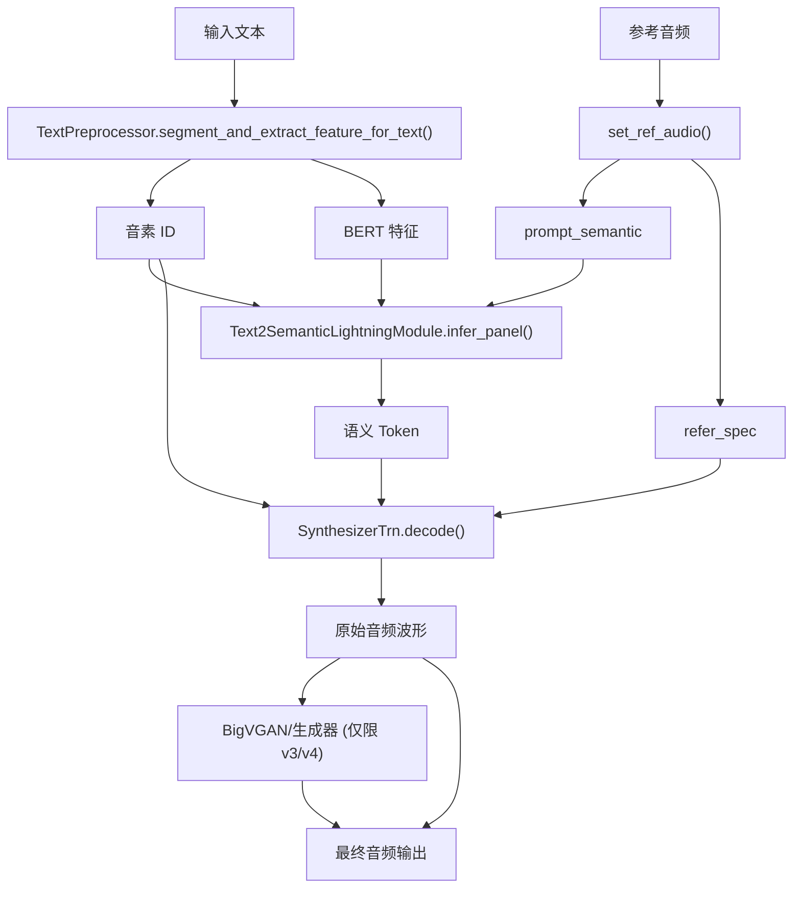
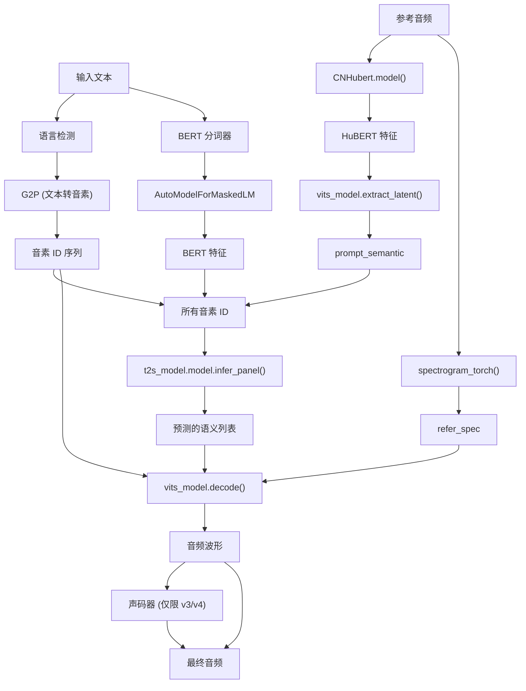
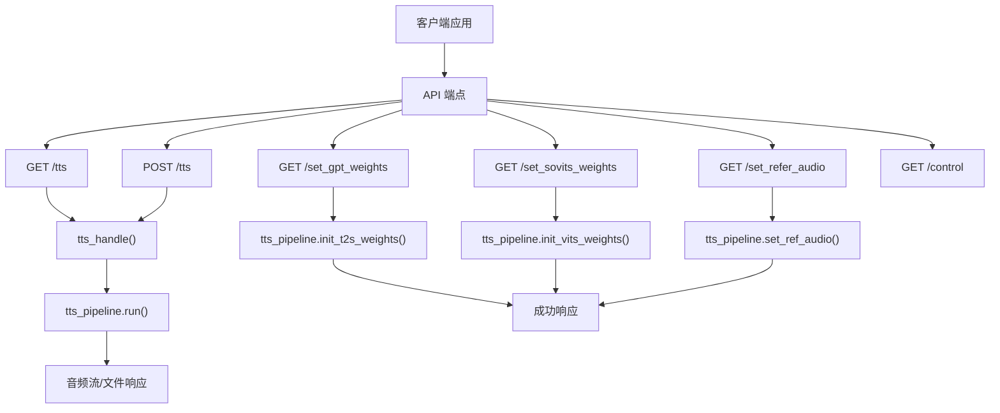
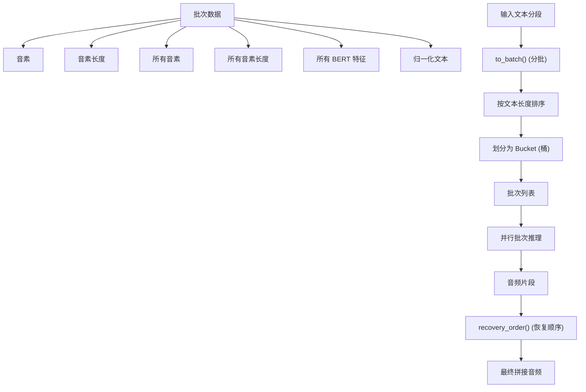

# TTS 推理 (TTS Inference)

相关源文件

-   [.gitignore](https://github.com/RVC-Boss/GPT-SoVITS/blob/c767f0b8/.gitignore)
-   [GPT\_SoVITS/AR/models/t2s\_model.py](https://github.com/RVC-Boss/GPT-SoVITS/blob/c767f0b8/GPT_SoVITS/AR/models/t2s_model.py)
-   [GPT\_SoVITS/AR/models/utils.py](https://github.com/RVC-Boss/GPT-SoVITS/blob/c767f0b8/GPT_SoVITS/AR/models/utils.py)
-   [GPT\_SoVITS/TTS\_infer\_pack/TTS.py](https://github.com/RVC-Boss/GPT-SoVITS/blob/c767f0b8/GPT_SoVITS/TTS_infer_pack/TTS.py)
-   [GPT\_SoVITS/configs/tts\_infer.yaml](https://github.com/RVC-Boss/GPT-SoVITS/blob/c767f0b8/GPT_SoVITS/configs/tts_infer.yaml)
-   [GPT\_SoVITS/inference\_webui.py](https://github.com/RVC-Boss/GPT-SoVITS/blob/c767f0b8/GPT_SoVITS/inference_webui.py)
-   [GPT\_SoVITS/inference\_webui\_fast.py](https://github.com/RVC-Boss/GPT-SoVITS/blob/c767f0b8/GPT_SoVITS/inference_webui_fast.py)
-   [GPT\_SoVITS/process\_ckpt.py](https://github.com/RVC-Boss/GPT-SoVITS/blob/c767f0b8/GPT_SoVITS/process_ckpt.py)
-   [api\_v2.py](https://github.com/RVC-Boss/GPT-SoVITS/blob/c767f0b8/api_v2.py)
-   [tools/assets.py](https://github.com/RVC-Boss/GPT-SoVITS/blob/c767f0b8/tools/assets.py)

本文档涵盖了 GPT-SoVITS 中的实时 Text-to-Speech (语音合成，TTS) 推理系统。该系统使用训练好的神经网络模型将输入文本转换为合成音频。TTS 推理流水线处理多语言文本处理、语义 Token 生成以及支持参考音频进行声音克隆的音频合成。

有关 TTS 推理中所用模型训练的信息，请参阅 [GPT 训练](/RVC-Boss/GPT-SoVITS/6.2-gpt-model-training) 和 [SoVITS 训练](/RVC-Boss/GPT-SoVITS/6.3-sovits-model-training)。有关文本预处理的详情，请参阅 [文本处理](/RVC-Boss/GPT-SoVITS/4-text-processing)。

## 概览 (Overview)

TTS 推理系统围绕 `TTS` 类构建，该类编排多个神经网络模型以执行语音合成。系统支持多个模型版本（v1、v2、v3、v4、v2Pro、v2ProPlus），各版本具有不同的能力和架构。

### 核心推理流水线


来源: [GPT\_SoVITS/TTS\_infer\_pack/TTS.py984-1430](https://github.com/RVC-Boss/GPT-SoVITS/blob/c767f0b8/GPT_SoVITS/TTS_infer_pack/TTS.py#L984-L1430)

## 核心组件 (Core Components)

### TTS 类

`TTS` 类是语音合成推理的主要接口，负责管理模型初始化、缓存以及完整的推理流水线。

| 组件 | 类型 | 用途 |
| --- | --- | --- |
| `TTS_Config` | 配置 | 模型路径、设备设置、版本选择 |
| `Text2SemanticLightningModule` | 神经网络 | 将文本转换为语义 Token |
| `SynthesizerTrn/SynthesizerTrnV3` | 神经网络 | 从语义 Token 合成音频 |
| `AutoModelForMaskedLM` | BERT 模型 | 提取文本特征 |
| `CNHubert` | 特征提取器 | 从参考音频中提取语音特征 |
| `TextPreprocessor` | 文本处理 | 多语言文本预处理 |

### 模型架构


来源: [GPT\_SoVITS/TTS\_infer\_pack/TTS.py412-441](https://github.com/RVC-Boss/GPT-SoVITS/blob/c767f0b8/GPT_SoVITS/TTS_infer_pack/TTS.py#L412-L441) [GPT\_SoVITS/TTS\_infer\_pack/TTS.py795-819](https://github.com/RVC-Boss/GPT-SoVITS/blob/c767f0b8/GPT_SoVITS/TTS_infer_pack/TTS.py#L795-L819) [GPT\_SoVITS/TTS\_infer\_pack/TTS.py1254-1315](https://github.com/RVC-Boss/GPT-SoVITS/blob/c767f0b8/GPT_SoVITS/TTS_infer_pack/TTS.py#L1254-L1315)

## 配置系统 (Configuration System)

### TTS\_Config 类

`TTS_Config` 类管理模型配置，包含版本特定的默认值和运行时设置。

```mermaid
flowchart TD
    ConfigFile["tts_infer.yaml"]
    TTS_Config["TTS_Config.init()"]
    DefaultConfigs["默认配置"]
    ModelPaths["模型文件路径"]
    DeviceSettings["设备与精度"]
    VersionConfig["模型版本"]
    t2s_weights_path["t2s_weights_path"]
    vits_weights_path["vits_weights_path"]
    bert_base_path["bert_base_path"]
    cnhuhbert_base_path["cnhuhbert_base_path"]
    Device["设备"]
    IsHalf["是否半精度 (is_half)"]
    Languages["支持的语言"]
    UseVocoder["是否使用声码器 (use_vocoder)"]

    ConfigFile --> TTS_Config
    DefaultConfigs --> TTS_Config
    TTS --> Config_ModelPaths
    TTS --> Config_DeviceSettings
    TTS --> Config_VersionConfig
    ModelPaths --> t2s_weights_path
    ModelPaths --> vits_weights_path
    ModelPaths --> bert_base_path
    ModelPaths --> cnhuhbert_base_path
    DeviceSettings --> Device
    DeviceSettings --> IsHalf
    VersionConfig --> Languages
    VersionConfig --> UseVocoder
```


### 支持的版本

| 版本 | T2S 模型 | VITS 模型 | 声码器 (Vocoder) | 语言 |
| --- | --- | --- | --- | --- |
| v1 | s1bert25hz-2kh | s2G488k.pth | 无 | en, zh, ja, auto |
| v2 | s1bert25hz-5kh | s2G2333k.pth | 无 | en, zh, ja, yue, ko, auto |
| v3 | s1v3.ckpt | s2Gv3.pth | BigVGAN | en, zh, ja, yue, ko, auto |
| v4 | s1v3.ckpt | s2Gv4.pth | Generator | en, zh, ja, yue, ko, auto |
| v2Pro | s1v3.ckpt | s2Gv2Pro.pth | 无 | en, zh, ja, yue, ko, auto |
| v2ProPlus | s1v3.ckpt | s2Gv2ProPlus.pth | 无 | en, zh, ja, yue, ko, auto |

来源: [GPT\_SoVITS/TTS\_infer\_pack/TTS.py217-273](https://github.com/RVC-Boss/GPT-SoVITS/blob/c767f0b8/GPT_SoVITS/TTS_infer_pack/TTS.py#L217-L273) [GPT\_SoVITS/configs/tts\_infer.yaml1-56](https://github.com/RVC-Boss/GPT-SoVITS/blob/c767f0b8/GPT_SoVITS/configs/tts_infer.yaml#L1-L56)

## API 接口 (API Interface)

系统为 TTS 推理提供了编程接口和 REST API 接口。

### REST API 端点


### 请求参数

`TTS_Request` 模型定义了完整的推理参数集：

| 参数 | 类型 | 默认值 | 描述 |
| --- | --- | --- | --- |
| `text` | str | 必填 | 待合成文本 |
| `text_lang` | str | 必填 | 输入文本语言 |
| `ref_audio_path` | str | 必填 | 参考音频文件路径 |
| `prompt_text` | str | "" | 参考音频的可选提示文本 |
| `prompt_lang` | str | 必填 | 提示文本语言 |
| `top_k` | int | 5 | T2S 模型的 Top-k 采样 |
| `top_p` | float | 1.0 | T2S 模型的 Top-p 采样 |
| `temperature` | float | 1.0 | 采样温度 |
| `batch_size` | int | 1 | 推理批次大小 |
| `speed_factor` | float | 1.0 | 音频播放速度倍率 |
| `streaming_mode` | bool | False | 启用流式音频响应 |
| `parallel_infer` | bool | True | 启用并行推理 |
| `sample_steps` | int | 32 | v3/v4 模型的采样步数 |

来源: [api\_v2.py150-173](https://github.com/RVC-Boss/GPT-SoVITS/blob/c767f0b8/api_v2.py#L150-L173) [api\_v2.py300-331](https://github.com/RVC-Boss/GPT-SoVITS/blob/c767f0b8/api_v2.py#L300-L331)

## 推理过程 (Inference Process)

### 主运行方法

`TTS.run()` 方法编排了完整的推理流水线：

1.  **参数验证**: 验证输入参数和语言支持
2.  **参考音频处理**: 从参考音频中提取语义 Token 和频谱图
3.  **文本预处理**: 将文本转换为音素和 BERT 特征
4.  **批处理 (Batch Processing)**: 将输入分组以进行高效处理
5.  **语义 Token 生成**: 使用 T2S 模型预测语义 Token
6.  **音频合成**: 使用 VITS 模型生成音频波形
7.  **后处理**: 应用速度调整和音频格式化

### 批处理策略


来源: [GPT\_SoVITS/TTS\_infer\_pack/TTS.py842-955](https://github.com/RVC-Boss/GPT-SoVITS/blob/c767f0b8/GPT_SoVITS/TTS_infer_pack/TTS.py#L842-L955) [GPT\_SoVITS/TTS\_infer\_pack/TTS.py957-973](https://github.com/RVC-Boss/GPT-SoVITS/blob/c767f0b8/GPT_SoVITS/TTS_infer_pack/TTS.py#L957-L973)

### 模型特定处理

不同的模型版本需要不同的处理方法：

**非声码器模型 (v1, v2, v2Pro, v2ProPlus)**:

-   通过 `vits_model.decode()` 直接生成音频
-   支持通过 `speed_factor` 参数调整速度
-   支持批处理的并行推理能力

**声码器模型 (v3, v4)**:

-   两阶段过程：VITS 模型生成梅尔频谱图，然后声码器 (Vocoder) 生成音频
-   v3 使用 `BigVGAN` 声码器，v4 使用自定义的 `Generator` 声码器
-   在更高采样率下增强了音频质量（v3 为 24kHz，v4 为 48kHz）

来源: [GPT\_SoVITS/TTS\_infer\_pack/TTS.py1254-1315](https://github.com/RVC-Boss/GPT-SoVITS/blob/c767f0b8/GPT_SoVITS/TTS_infer_pack/TTS.py#L1254-L1315) [GPT\_SoVITS/TTS\_infer\_pack/TTS.py601-661](https://github.com/RVC-Boss/GPT-SoVITS/blob/c767f0b8/GPT_SoVITS/TTS_infer_pack/TTS.py#L601-L661)

## 使用模式 (Usage Patterns)

### 编程用法

```python
# 初始化 TTS 系统config = TTS_Config("GPT_SoVITS/configs/tts_infer.yaml")tts = TTS(config) # 设置参考音频tts.set_ref_audio("reference.wav") # 运行推理inputs = {    "text": "Hello world",    "text_lang": "en",    "ref_audio_path": "reference.wav",    "prompt_text": "This is a reference",    "prompt_lang": "en"} for sr, audio_data in tts.run(inputs):    # 处理音频输出    pass
```
### 流式模式 (Streaming Mode)

系统支持为实时应用提供流式音频输出：

-   `streaming_mode=True` 启用分块音频响应
-   `return_fragment=True` 单独处理文本段
-   音频片段在生成后立即产出 (Yield)

来源: [GPT\_SoVITS/TTS\_infer\_pack/TTS.py1049-1054](https://github.com/RVC-Boss/GPT-SoVITS/blob/c767f0b8/GPT_SoVITS/TTS_infer_pack/TTS.py#L1049-L1054) [api\_v2.py348-366](https://github.com/RVC-Boss/GPT-SoVITS/blob/c767f0b8/api_v2.py#L348-L366)
