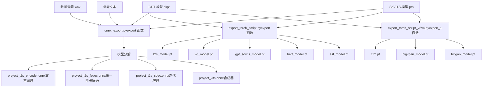
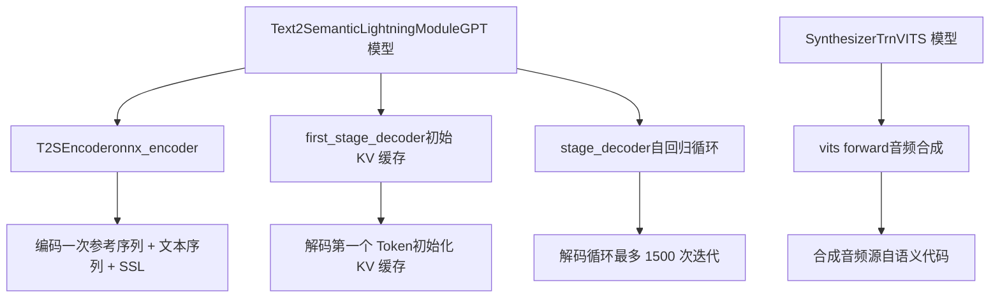
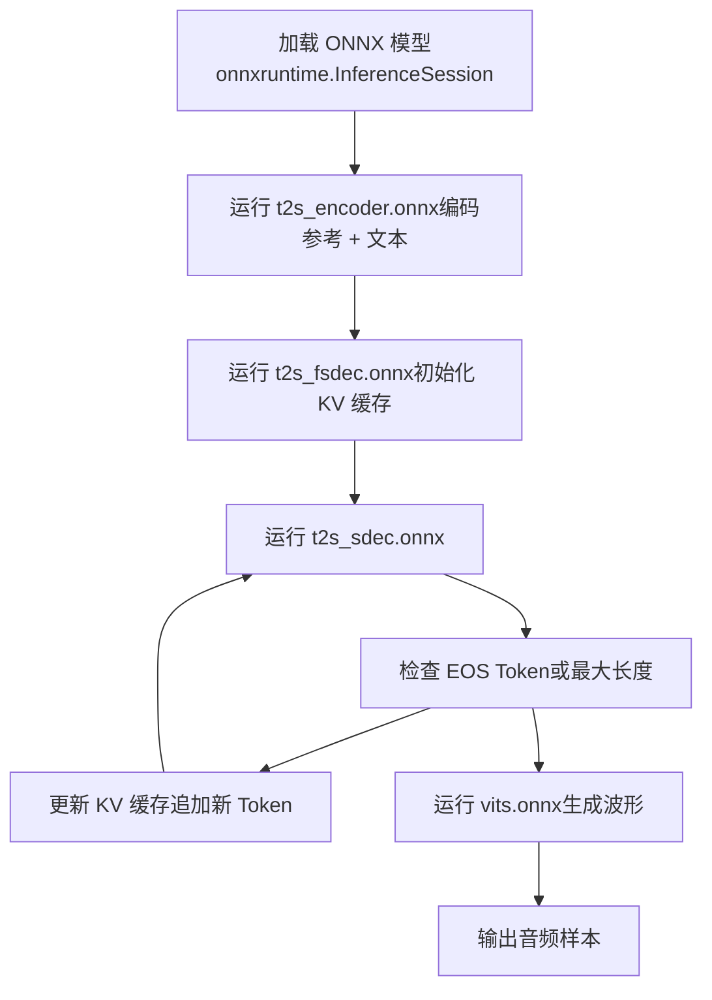
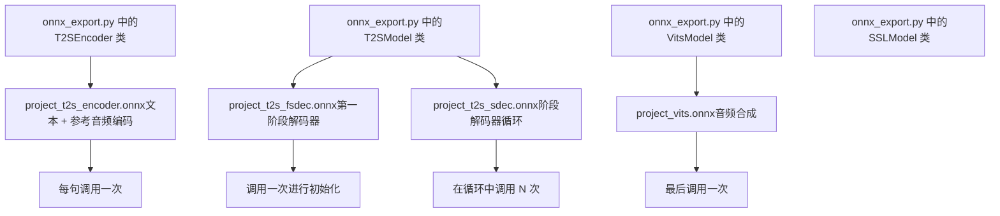
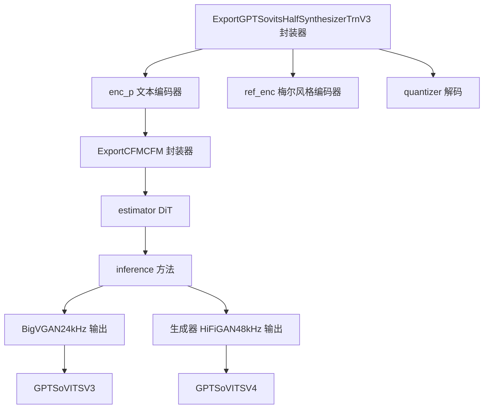
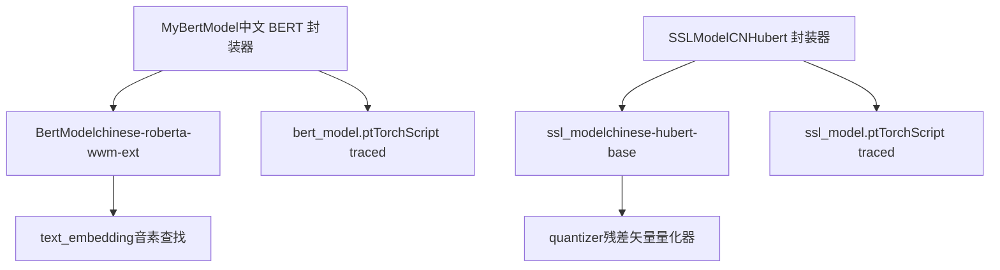
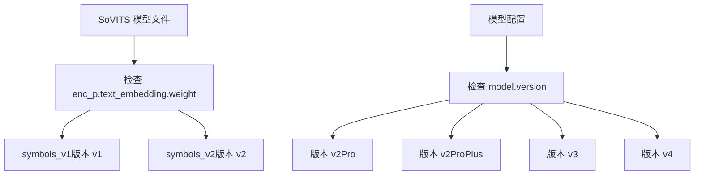
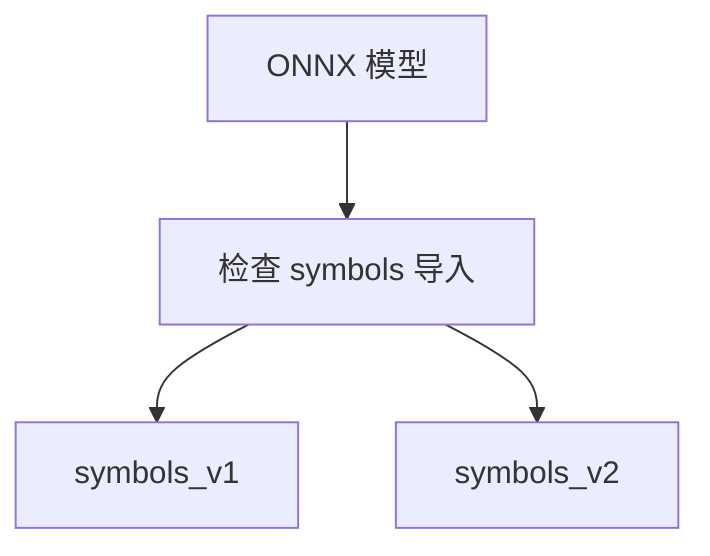

# 模型导出与 ONNX (Model Export and ONNX)

相关源文件

-   [GPT\_SoVITS/module/data\_utils.py](https://github.com/RVC-Boss/GPT-SoVITS/blob/c767f0b8/GPT_SoVITS/module/data_utils.py)
-   [GPT\_SoVITS/module/mel\_processing.py](https://github.com/RVC-Boss/GPT-SoVITS/blob/c767f0b8/GPT_SoVITS/module/mel_processing.py)
-   [GPT\_SoVITS/module/models.py](https://github.com/RVC-Boss/GPT-SoVITS/blob/c767f0b8/GPT_SoVITS/module/models.py)
-   [GPT\_SoVITS/onnx\_export.py](https://github.com/RVC-Boss/GPT-SoVITS/blob/c767f0b8/GPT_SoVITS/onnx_export.py)

本文档涵盖了 GPT-SoVITS 模型的模型导出和 ONNX 转换。导出系统将训练好的模型分解为优化后的生产就绪组件，适用于使用 ONNX Runtime 或 PyTorch 进行部署。它处理多个模型版本（v1-v4），并创建针对低延迟和高内存效率优化的推理流水线。

有关可导出模型的训练信息，请参阅 [训练](/RVC-Boss/GPT-SoVITS/6-model-training)。有关使用导出模型进行部署和推理的信息，请参阅 [TTS 推理](/RVC-Boss/GPT-SoVITS/7.1-tts-inference-process)。

## 概览 (Overview)

模型导出系统将 GPT-SoVITS 训练检查点转换为生产优化的格式。支持两种主要的导出路径：

-   **ONNX 导出**: 将模型分解为每个推理阶段独立的 `.onnx` 文件，支持流式推理和使用 ONNX Runtime 进行跨平台部署。
-   **TorchScript 导出**: 创建经过优化的 `.pt` 文件，通过 `torch.jit.trace` 和 `torch.jit.script` 进行 PyTorch 原生部署。

由于 ONNX 导出路径具有卓越的跨平台兼容性、优化的运行时性能以及对流式推理模式的支持，因此推荐在生产部署中使用。

**来源:** [GPT\_SoVITS/export\_torch\_script.py1-50](https://github.com/RVC-Boss/GPT-SoVITS/blob/c767f0b8/GPT_SoVITS/export_torch_script.py#L1-L50) [GPT\_SoVITS/onnx\_export.py1-50](https://github.com/RVC-Boss/GPT-SoVITS/blob/c767f0b8/GPT_SoVITS/onnx_export.py#L1-L50)

### 导出工作流 (Export Workflow)

**图表：完整的导出流水线**


**来源:** [GPT\_SoVITS/export\_torch\_script.py656-726](https://github.com/RVC-Boss/GPT-SoVITS/blob/c767f0b8/GPT_SoVITS/export_torch_script.py#L656-L726) [GPT\_SoVITS/onnx\_export.py277-396](https://github.com/RVC-Boss/GPT-SoVITS/blob/c767f0b8/GPT_SoVITS/onnx_export.py#L277-L396) [GPT\_SoVITS/export\_torch\_script\_v3v4.py702-923](https://github.com/RVC-Boss/GPT-SoVITS/blob/c767f0b8/GPT_SoVITS/export_torch_script_v3v4.py#L702-L923)

## 生产环境的模型分解 (Model Decomposition for Production)

ONNX 导出系统将单体的 TTS 流水线分解为独立的、经过优化的组件。这种分解支持流式推理，减少了显存开销，并允许对每个阶段进行独立优化。

### ONNX 分解策略

**图表：ONNX 模型分解**


**来源:** [GPT\_SoVITS/onnx\_export.py70-190](https://github.com/RVC-Boss/GPT-SoVITS/blob/c767f0b8/GPT_SoVITS/onnx_export.py#L70-L190) [GPT\_SoVITS/onnx\_export.py86-131](https://github.com/RVC-Boss/GPT-SoVITS/blob/c767f0b8/GPT_SoVITS/onnx_export.py#L86-L131)

### 组件职责

| ONNX 组件 | 类 | 输入形状 | 输出形状 | 用途 |
| --- | --- | --- | --- | --- |
| `t2s_encoder.onnx` | `T2SEncoder` | `ref_seq: [1, N]`
`text_seq: [1, M]`
`ref_bert: [N, 1024]`
`text_bert: [M, 1024]`
`ssl_content: [1, 768, K]` | `x: [1, N+M, 512]`
`prompts: [1, P]` | 编码音素序列并从参考音频中提取语义提示 (Prompt) |
| `t2s_fsdec.onnx` | `first_stage_decoder` | `x: [1, N, 512]`
`prompts: [1, P]` | `y: [1, P+1]`
`k, v: [L, P+1, 1, 512]`
`y_emb: [1, P+1, 512]`
`x_example: [1, P+1, 512]` | 初始化 KV 缓存并预测第一个语义 Token |
| `t2s_sdec.onnx` | `stage_decoder` | `y: [1, N]`
`k, v: [L, N, 1, 512]`
`y_emb: [1, N, 512]`
`x_example: [1, N, 512]` | `y: [1, N+1]`
`k, v: [L, N+1, 1, 512]`
`y_emb: [1, N+1, 512]`
`logits: [1, 1024]`
`samples: [1, 1]` | 使用缓存的 KV 自回归地预测下一个语义 Token |
| `vits.onnx` | `SynthesizerTrn.forward` | `text_seq: [1, N]`
`pred_semantic: [1, 1, M]`
`ref_audio: [1, K]` | `audio: [K*ratio]` | 从语义代码和参考音频中合成波形 |

**来源:** [GPT\_SoVITS/onnx\_export.py142-189](https://github.com/RVC-Boss/GPT-SoVITS/blob/c767f0b8/GPT_SoVITS/onnx_export.py#L142-L189) [GPT\_SoVITS/onnx\_export.py70-84](https://github.com/RVC-Boss/GPT-SoVITS/blob/c767f0b8/GPT_SoVITS/onnx_export.py#L70-L84) [GPT\_SoVITS/onnx\_export.py213-223](https://github.com/RVC-Boss/GPT-SoVITS/blob/c767f0b8/GPT_SoVITS/onnx_export.py#L213-L223)

### 分解实现

分解是通过封装类实现的，这些类公开了特定的模型阶段：

**T2SEncoder 封装器** (`onnx_export.py:70-84`):

```python
class T2SEncoder(nn.Module):
    def __init__(self, t2s, vits):
        super().__init__()
        self.encoder = t2s.onnx_encoder
        self.vits = vits
        
    def forward(self, ref_seq, text_seq, ref_bert, text_bert, ssl_content):
        codes = self.vits.extract_latent(ssl_content)
        prompt_semantic = codes[0, 0]
        bert = torch.cat([ref_bert.transpose(0, 1), text_bert.transpose(0, 1)], 1)
        all_phoneme_ids = torch.cat([ref_seq, text_seq], 1)
        return self.encoder(all_phoneme_ids, bert), prompt_semantic.unsqueeze(0)
```
**T2SModel 前向传播** (`onnx_export.py:106-131`): 前向传播演示了迭代解码模式：

```python
def forward(self, ref_seq, text_seq, ref_bert, text_bert, ssl_content):
    x, prompts = self.onnx_encoder(ref_seq, text_seq, ref_bert, text_bert, ssl_content)
    y, k, v, y_emb, x_example = self.first_stage_decoder(x, prompts)
        
    for idx in range(1, 1500):
        y, k, v, y_emb, logits, samples = self.stage_decoder(y, k, v, y_emb, x_example)
        if early_stop_condition:
            break
            
    return y[:, -idx:].unsqueeze(0)
```
**来源:** [GPT\_SoVITS/onnx\_export.py70-84](https://github.com/RVC-Boss/GPT-SoVITS/blob/c767f0b8/GPT_SoVITS/onnx_export.py#L70-L84) [GPT\_SoVITS/onnx\_export.py106-131](https://github.com/RVC-Boss/GPT-SoVITS/blob/c767f0b8/GPT_SoVITS/onnx_export.py#L106-L131)

## 优化的推理模式 (Optimized Inference Patterns)

### 使用分解模型的流式推理

分解后的 ONNX 模型通过将一次性编码与迭代解码分离，实现了高效的流式推理：

**图表：优化的推理流程**


**来源:** [GPT\_SoVITS/onnx\_export.py106-131](https://github.com/RVC-Boss/GPT-SoVITS/blob/c767f0b8/GPT_SoVITS/onnx_export.py#L106-L131) [GPT\_SoVITS/onnx\_export.py118-128](https://github.com/RVC-Boss/GPT-SoVITS/blob/c767f0b8/GPT_SoVITS/onnx_export.py#L118-L128)

### 动态形状支持 (Dynamic Shape Support)

ONNX 导出为所有可变长度输入指定了动态轴 (Dynamic Axes)，以在推理时支持任意序列长度：

**T2S 编码器动态轴** (`onnx_export.py:142-156`):

```python
torch.onnx.export(
    self.onnx_encoder,
    (ref_seq, text_seq, ref_bert, text_bert, ssl_content),
    f"onnx/{project_name}/{project_name}_t2s_encoder.onnx",
    dynamic_axes={
        "ref_seq": {1: "ref_length"},
        "text_seq": {1: "text_length"},
        "ref_bert": {0: "ref_length"},
        "text_bert": {0: "text_length"},
        "ssl_content": {2: "ssl_length"},
    },
    opset_version=16)
```
**VITS 动态轴** (`onnx_export.py:252-265`):

```python
torch.onnx.export(
    self.vits,
    (text_seq, pred_semantic, ref_audio),
    f"onnx/{project_name}/{project_name}_vits.onnx",
    dynamic_axes={
        "text_seq": {1: "text_length"},
        "pred_semantic": {2: "pred_length"},
        "ref_audio": {1: "audio_length"},
    },
    opset_version=17)
```
**来源:** [GPT\_SoVITS/onnx\_export.py142-156](https://github.com/RVC-Boss/GPT-SoVITS/blob/c767f0b8/GPT_SoVITS/onnx_export.py#L142-L156) [GPT\_SoVITS/onnx\_export.py159-189](https://github.com/RVC-Boss/GPT-SoVITS/blob/c767f0b8/GPT_SoVITS/onnx_export.py#L159-L189) [GPT\_SoVITS/onnx\_export.py252-265](https://github.com/RVC-Boss/GPT-SoVITS/blob/c767f0b8/GPT_SoVITS/onnx_export.py#L252-L265)

### 显存优化

分解后的架构减少了峰值显存使用量：

| 推理阶段 | 显存需求 | 优化说明 |
| --- | --- | --- |
| 文本编码 | ~500MB | 一次性分配，第一阶段解码后可释放 |
| 第一阶段解码 | ~200MB | 初始化 KV 缓存，跨迭代复用 |
| 迭代解码 | 每轮 ~100MB | 恒定显存，KV 缓存原地更新 |
| VITS 合成 | ~800MB | 最后阶段，可释放之前阶段的显存 |

**来源:** [GPT\_SoVITS/onnx\_export.py86-131](https://github.com/RVC-Boss/GPT-SoVITS/blob/c767f0b8/GPT_SoVITS/onnx_export.py#L86-L131)

## 核心导出组件 (Core Export Components)

### ONNX 模型组件

ONNX 导出系统创建了四个独立的模型文件，每个文件都针对其在推理流水线中的特定角色进行了优化：

**图表：ONNX 组件架构**


**来源:** [GPT\_SoVITS/onnx\_export.py70-84](https://github.com/RVC-Boss/GPT-SoVITS/blob/c767f0b8/GPT_SoVITS/onnx_export.py#L70-L84) [GPT\_SoVITS/onnx\_export.py86-131](https://github.com/RVC-Boss/GPT-SoVITS/blob/c767f0b8/GPT_SoVITS/onnx_export.py#L86-L131) [GPT\_SoVITS/onnx\_export.py192-223](https://github.com/RVC-Boss/GPT-SoVITS/blob/c767f0b8/GPT_SoVITS/onnx_export.py#L192-L223) [GPT\_SoVITS/onnx\_export.py268-275](https://github.com/RVC-Boss/GPT-SoVITS/blob/c767f0b8/GPT_SoVITS/onnx_export.py#L268-L275)

#### T2SEncoder 组件

`T2SEncoder` 类结合了文本编码和语义提示提取：

**实现** (`onnx_export.py:70-84`):

-   使用 `vits.extract_latent(ssl_content)` 从参考音频中提取语义代码。
-   拼接参考音素序列和目标音素序列。
-   拼接参考 BERT Embedding 和目标 BERT Embedding。
-   将拼接后的输入传递给 GPT 编码器。
-   返回编码后的特征 `x` 和语义提示。

**ONNX 导出** (`onnx_export.py:142-156`):

-   输入名称: `ref_seq`, `text_seq`, `ref_bert`, `text_bert`, `ssl_content`
-   输出名称: `x`, `prompts`
-   为所有可变长度维度指定动态轴。
-   Opset 版本: 16

#### 第一阶段解码器组件 (First Stage Decoder Component)

`first_stage_decoder` 为自回归生成初始化 KV 缓存：

**实现** (`onnx_export.py:102-103`):

-   调用 T2S 模型中的 `self.first_stage_decoder`。
-   返回初始的 `y`, `k`, `v`, `y_emb`, `x_example` 张量。
-   KV 缓存的形状为 `[num_layers, sequence_length, 1, hidden_dim]`。

**ONNX 导出** (`onnx_export.py:159-172`):

-   输入名称: `x`, `prompts`
-   输出名称: `y`, `k`, `v`, `y_emb`, `x_example`
-   为 `x` 和 `prompts` 指定动态轴。
-   Opset 版本: 16

#### 阶段解码器组件 (Stage Decoder Component)

`stage_decoder` 执行一步带有 KV 缓存更新的自回归操作：

**实现** (`onnx_export.py:118-121`):

-   接收当前的 Token 和 KV 缓存作为输入。
-   为下一个 Token 预测 Logits (对数几率)。
-   对下一个 Token 进行采样（或取 Argmax）。
-   使用新的时间步更新 KV 缓存。
-   返回更新后的状态和预测结果。

**ONNX 导出** (`onnx_export.py:174-189`):

-   输入名称: `iy`, `ik`, `iv`, `iy_emb`, `ix_example`
-   输出名称: `y`, `k`, `v`, `y_emb`, `logits`, `samples`
-   为所有序列长度维度指定动态轴。
-   Opset 版本: 16

**来源:** [GPT\_SoVITS/onnx\_export.py159-189](https://github.com/RVC-Boss/GPT-SoVITS/blob/c767f0b8/GPT_SoVITS/onnx_export.py#L159-L189)

#### VITS 合成器组件 (VITS Synthesizer Component)

`VitsModel` 为 ONNX 导出封装了 SynthesizerTrn：

**实现** (`onnx_export.py:192-223`):

-   从 `.pth` 文件加载训练好的权重。
-   根据 `text_embedding.weight` 形状自动检测版本（322 = v1, 否则为 v2）。
-   从参考音频中提取频谱图。
-   使用语义代码调用 `vq_model` 的前向传播。

**ONNX 导出** (`onnx_export.py:252-265`):

-   输入名称: `text_seq`, `pred_semantic`, `ref_audio`
-   输出名称: `audio`
-   为文本长度、语义长度和音频长度指定动态轴。
-   Opset 版本: 17

**来源:** [GPT\_SoVITS/onnx\_export.py192-223](https://github.com/RVC-Boss/GPT-SoVITS/blob/c767f0b8/GPT_SoVITS/onnx_export.py#L192-L223) [GPT\_SoVITS/onnx\_export.py252-265](https://github.com/RVC-Boss/GPT-SoVITS/blob/c767f0b8/GPT_SoVITS/onnx_export.py#L252-L265)

### TorchScript 模型组件

TorchScript 导出根据模型版本使用不同的策略：

**图表：TorchScript 架构**

```mermaid
flowchart TD
    T2SScript["T2SModeltorch.jit.script"]
    VitsScript["VitsModeltorch.jit.trace"]
    BERTScript["MyBertModeltorch.jit.trace"]
    SSLScript["SSLModeltorch.jit.trace"]
    CombinedScript["GPT_SoVITStorch.jit.trace"]
    HalfScript["ExportGPTSovitsHalf特征提取"]
    CFMScript["ExportCFM流匹配"]
    BigVGANScript["BigVGANV3 声码器"]
    HiFiGANScript["GeneratorV4 声码器"]
    T2SFile["t2s_model.pt"]
    VitsFile["vq_model.pt"]
    BERTFile["bert_model.pt"]
    SSLFile["ssl_model.pt"]
    CombinedFile["gpt_sovits_model.pt"]
    CFMFile["cfm.pt"]
    VocoderFile["vocoder.pt"]

    T2SScript --> T2SFile
    VitsScript --> VitsFile
    BERTScript --> BERTFile
    SSLScript --> SSLFile
    CombinedScript --> CombinedFile
    CFMScript --> CFMFile
    BigVGANScript --> VocoderFile
    HiFiGANScript --> VocoderFile
```


**来源:** [GPT\_SoVITS/export\_torch\_script.py405-565](https://github.com/RVC-Boss/GPT-SoVITS/blob/c767f0b8/GPT_SoVITS/export_torch_script.py#L405-L565) [GPT\_SoVITS/export\_torch\_script\_v3v4.py223-500](https://github.com/RVC-Boss/GPT-SoVITS/blob/c767f0b8/GPT_SoVITS/export_torch_script_v3v4.py#L223-L500)

### 版本特定的合成器导出

由于架构变更，不同模型版本的合成器导出有显著差异：

#### V1/V2 合成器

**架构**: 单体的基于 VITS 的合成，集成了 HiFiGAN 声码器。

| 导出格式 | 使用的类 | 文件输出 | 实现方式 |
| --- | --- | --- | --- |
| ONNX | `models_onnx` 中的 `SynthesizerTrn` | `project_vits.onnx` | 直接生成波形 |
| TorchScript | `models` 中的 `SynthesizerTrn` | `vq_model.pt` | Traced 合成 |

**ONNX 导出流程** (`onnx_export.py:192-223`):

1.  从 `.pth` 文件加载训练好的权重。
2.  根据 `enc_p.text_embedding.weight.shape[0]` 自动检测版本（322 = v1, 否则为 v2）。
3.  使用检测到的版本创建 `SynthesizerTrn`。
4.  导出带有动态轴的单个 ONNX 文件。

**来源:** [GPT\_SoVITS/onnx\_export.py192-223](https://github.com/RVC-Boss/GPT-SoVITS/blob/c767f0b8/GPT_SoVITS/onnx_export.py#L192-L223) [GPT\_SoVITS/module/models\_onnx.py766-896](https://github.com/RVC-Boss/GPT-SoVITS/blob/c767f0b8/GPT_SoVITS/module/models_onnx.py#L766-L896)

#### V3/V4 合成器

**架构**: 多阶段流水线，包含 Conditional Flow Matching (条件流匹配) 和外部声码器。

**图表：V3/V4 导出流水线**


**导出组件**:

| 组件 | 类 | 文件 | 用途 |
| --- | --- | --- | --- |
| 特征提取器 | `ExportGPTSovitsHalf` | 流水线的一部分 | 文本编码器 + 量化器 |
| CFM 生成器 | `ExportCFM` | `cfm.pt` | 梅尔频谱图生成 |
| V3 声码器 | `BigVGAN` | `bigvgan_model.pt` | 24kHz 波形合成 |
| V4 声码器 | `Generator` | `hifigan_model.pt` | 48kHz 波形合成 |

**来源:** [GPT\_SoVITS/export\_torch\_script\_v3v4.py223-437](https://github.com/RVC-Boss/GPT-SoVITS/blob/c767f0b8/GPT_SoVITS/export_torch_script_v3v4.py#L223-L437) [GPT\_SoVITS/export\_torch\_script\_v3v4.py501-602](https://github.com/RVC-Boss/GPT-SoVITS/blob/c767f0b8/GPT_SoVITS/export_torch_script_v3v4.py#L501-L602)

### 辅助模型导出 (Auxiliary Model Exports)

还导出了其他模型以支持完整的推理流水线：

**图表：辅助导出组件**


**BERT 模型导出** (`export_torch_script.py:539-561`):

-   从中文 RoBERTa 检查点封装 `BertModel`。
-   使用 `torch.jit.trace` 导出为 `bert_model.pt`。
-   输入：动态长度的音素 ID。
-   输出：1024 维上下文 Embedding。

**SSL 模型导出** (`export_torch_script.py:577-625`):

-   封装 CNHubert 基础模型。
-   使用 `torch.jit.trace` 导出为 `ssl_model.pt`。
-   输入：动态长度的 16kHz 音频。
-   输出：转置为 `[B, 768, T]` 的 768 维 SSL 特征。

**注意**: ONNX 导出不包含辅助模型——在调用 ONNX 模型之前，必须先使用 PyTorch 独立运行这些模型。

**来源:** [GPT\_SoVITS/export\_torch\_script.py539-561](https://github.com/RVC-Boss/GPT-SoVITS/blob/c767f0b8/GPT_SoVITS/export_torch_script.py#L539-L561) [GPT\_SoVITS/export\_torch\_script.py577-625](https://github.com/RVC-Boss/GPT-SoVITS/blob/c767f0b8/GPT_SoVITS/export_torch_script.py#L577-L625)

## 导出函数与用法 (Export Functions and Usage)

### ONNX 导出函数

主要的 ONNX 导出入口点是 `onnx_export.py:277-396` 中的 `export()`:

```python
def export(vits_path, gpt_path, project_name, vits_model="v2")
```
**参数**:

-   `vits_path` (str): 训练好的 SoVITS 检查点 `.pth` 路径。
-   `gpt_path` (str): 训练好的 GPT 检查点 `.ckpt` 路径。
-   `project_name` (str): 输出文件的项目名称。
-   `vits_model` (str): 模型版本，`"v1"` 或 `"v2"`。

**输出** (位于 `onnx/{project_name}/` 目录):

-   `{project_name}_t2s_encoder.onnx`: 文本编码组件。
-   `{project_name}_t2s_fsdec.onnx`: 第一阶段解码器。
-   `{project_name}_t2s_sdec.onnx`: 用于循环的阶段解码器。
-   `{project_name}_vits.onnx`: VITS 合成器。
-   `{project_name}.json`: 配置元数据。

**配置文件** (`onnx_export.py:369-384`):

```json
{
    "Folder": "project_name",
    "Name": "project_name",
    "Type": "GPT-SoVits",
    "Rate": 32000,
    "NumLayers": 12,
    "EmbeddingDim": 512,
    "Dict": "BasicDict",
    "BertPath": "chinese-roberta-wwm-ext-large",
    "AddBlank": false
}
```
**用法示例**:

```python
from onnx_export import export

export(
    vits_path="SoVITS_weights/model_e30_s3930.pth",
    gpt_path="GPT_weights/model-e25.ckpt",
    project_name="my_voice",
    vits_model="v2")
```
**来源:** [GPT\_SoVITS/onnx\_export.py277-396](https://github.com/RVC-Boss/GPT-SoVITS/blob/c767f0b8/GPT_SoVITS/onnx_export.py#L277-L396) [GPT\_SoVITS/onnx\_export.py369-384](https://github.com/RVC-Boss/GPT-SoVITS/blob/c767f0b8/GPT_SoVITS/onnx_export.py#L369-L384)

### TorchScript 导出函数

#### V1/V2 导出函数

**函数签名** (`export_torch_script.py:656-726`):

```python
def export(gpt_path, vits_path, ref_audio_path, ref_text, output_path,
          export_bert_and_ssl=False, device="cpu")
```
**参数**:

-   `gpt_path` (str): GPT 检查点 `.ckpt` 路径。
-   `vits_path` (str): SoVITS 检查点 `.pth` 路径。
-   `ref_audio_path` (str): 参考音频 WAV 文件。
-   `ref_text` (str): 参考音频的音素序列。
-   `output_path` (str): 导出模型的输出目录。
-   `export_bert_and_ssl` (bool): 是否导出 BERT 和 SSL 模型。
-   `device` (str): 导出设备，`"cpu"` 或 `"cuda"`。

**输出**:

-   `t2s_model.pt`: 文本到语义模型 (TorchScript)。
-   `vq_model.pt`: VITS 合成模型 (TorchScript)。
-   `gpt_sovits_model.pt`: 组合后的端到端模型（可选）。
-   `bert_model.pt`: BERT 文本编码器（如果 `export_bert_and_ssl=True`）。
-   `ssl_model.pt`: CNHubert SSL 提取器（如果 `export_bert_and_ssl=True`）。

**示例**:

```python
from export_torch_script import export

export(
    gpt_path="GPT_weights/model-e25.ckpt",
    vits_path="SoVITS_weights/model_e30_s3930.pth",
    ref_audio_path="reference_audio.wav",
    ref_text="n i2 h ao3 w o3 sh i4",
    output_path="exported/",
    export_bert_and_ssl=True,
    device="cpu")
```
**来源:** [GPT\_SoVITS/export\_torch\_script.py656-726](https://github.com/RVC-Boss/GPT-SoVITS/blob/c767f0b8/GPT_SoVITS/export_torch_script.py#L656-L726)

#### V2Pro 导出函数

**函数签名** (`export_torch_script.py:728-789`):

```python
def export_prov2(gpt_path, vits_path, version, ref_audio_path, ref_text, output_path,
                export_bert_and_ssl=False, device="cpu", is_half=True)
```
**额外特性**:

-   包含说话人验证 (SV) Embedding。
-   支持 `v2Pro` 和 `v2ProPlus` 版本。
-   通过 SV 条件化增强说话人相似度。

**来源:** [GPT\_SoVITS/export\_torch_script.py728-789](https://github.com/RVC-Boss/GPT-SoVITS/blob/c767f0b8/GPT_SoVITS/export_torch_script.py#L728-L789)

#### V3/V4 导出函数

**函数签名** (`export_torch_script_v3v4.py:702-923`):

```python
def export_1(gpt_path, sovits_path, version, ref_audio_path, ref_text, output_path)
```
**参数**:

-   `version` (str): 模型版本，`"v3"` 或 `"v4"`。

**输出**:

-   `gpt_model.pt`: T2S 模型。
-   `sovits_model.pt`: 特征提取模型。
-   `cfm.pt`: Conditional Flow Matching 模型。
-   `bigvgan_model.pt`: BigVGAN 声码器 (v3) 或 `hifigan_model.pt`: HiFiGAN 声码器 (v4)。
-   完整的流水线模型: `GPTSoVITSV3` 或 `GPTSoVITSV4`。

**来源:** [GPT\_SoVITS/export\_torch\_script\_v3v4.py702-923](https://github.com/RVC-Boss/GPT-SoVITS/blob/c767f0b8/GPT_SoVITS/export_torch_script_v3v4.py#L702-L923)

### CLI 用法

**ONNX 导出**:

```bash
python onnx_export.py
# 编辑脚本中的第 393-396 行以设置路径：
# gpt_path = "GPT_weights/model.ckpt"
# vits_path = "SoVITS_weights/model.pth"
# exp_path = "project_name"
```
**TorchScript V1/V2 导出**:

```bash
python export_torch_script.py \
    --gpt_model GPT_weights/model.ckpt \
    --sovits_model SoVITS_weights/model.pth \
    --ref_audio reference.wav \
    --ref_text "phoneme sequence" \
    --output_path exported/ \
    --export_common_model \
    --device cuda
```
**TorchScript V3/V4 导出**:

```bash
python export_torch_script_v3v4.py \
    --gpt_model GPT_weights/model.ckpt \
    --sovits_model SoVITS_weights/model.pth \
    --version v3 \
    --ref_audio reference.wav \
    --ref_text "phoneme sequence" \
    --output_path exported/
```
**来源:** [GPT\_SoVITS/export\_torch\_script.py833-853](https://github.com/RVC-Boss/GPT-SoVITS/blob/c767f0b8/GPT_SoVITS/export_torch_script.py#L833-L853) [GPT\_SoVITS/export\_torch\_script\_v3v4.py925-948](https://github.com/RVC-Boss/GPT-SoVITS/blob/c767f0b8/GPT_SoVITS/export_torch_script_v3v4.py#L925-L948)

### 模型版本检测 (Model Version Detection)

导出系统使用不同的策略自动检测模型版本：

#### TorchScript 版本检测


#### ONNX 版本检测


**来源:** [GPT\_SoVITS/export\_torch\_script.py364-373](https://github.com/RVC-Boss/GPT-SoVITS/blob/c767f0b8/GPT_SoVITS/export_torch_script.py#L364-L373) [GPT\_SoVITS/onnx\_export.py196-200](https://github.com/RVC-Boss/GPT-SoVITS/blob/c767f0b8/GPT_SoVITS/onnx_export.py#L196-L200) [GPT\_SoVITS/export\_torch\_script\_v3v4.py592-601](https://github.com/RVC-Boss/GPT-SoVITS/blob/c767f0b8/GPT_SoVITS/export_torch_script_v3v4.py#L592-L601)

## TorchScript 优化 (TorchScript Optimization)

### Tracing vs Scripting (追踪 vs 脚本化)

导出系统为不同的组件同时使用追踪 (Tracing) 和脚本化 (Scripting)：

| 组件 | 方法 | 原因 |
| --- | --- | --- |
| `T2SModel` | `torch.jit.script` | 依赖控制流 |
| `VitsModel` | `torch.jit.trace` | 固定计算图 |
| `SSLModel` | `torch.jit.trace` | 简单的线性传播 |
| 组合模型 | `torch.jit.trace` | 端到端优化 |

**来源:** [export\_torch\_script.py654-676](https://github.com/RVC-Boss/GPT-SoVITS/blob/c767f0b8/export_torch_script.py#L654-L676) [export\_torch\_script\_v3v4.py806-820](https://github.com/RVC-Boss/GPT-SoVITS/blob/c767f0b8/export_torch_script_v3v4.py#L806-L820)

### 动态形状处理 (Dynamic Shape Handling)

为可变长度输入标记动态形状：

```python
torch._dynamo.mark_dynamic(ssl_content, 2)
torch._dynamo.mark_dynamic(ref_audio_sr, 1)
torch._dynamo.mark_dynamic(ref_seq, 1)
torch._dynamo.mark_dynamic(text_seq, 1)
```
**来源:** [export\_torch\_script.py663-668](https://github.com/RVC-Boss/GPT-SoVITS/blob/c767f0b8/export_torch_script.py#L663-L668)

## 使用示例 (Usage Example)

```bash
python export_torch_script.py \
    --gpt_model GPT_weights/model.ckpt \
    --sovits_model SoVITS_weights/model.pth \
    --ref_audio reference.wav \
    --ref_text "参考文本内容" \
    --output_path exported_models/ \
    --export_common_model \
    --device cuda
```
**来源:** [export\_torch\_script.py833-853](https://github.com/RVC-Boss/GPT-SoVITS/blob/c767f0b8/export_torch_script.py#L833-L853)
