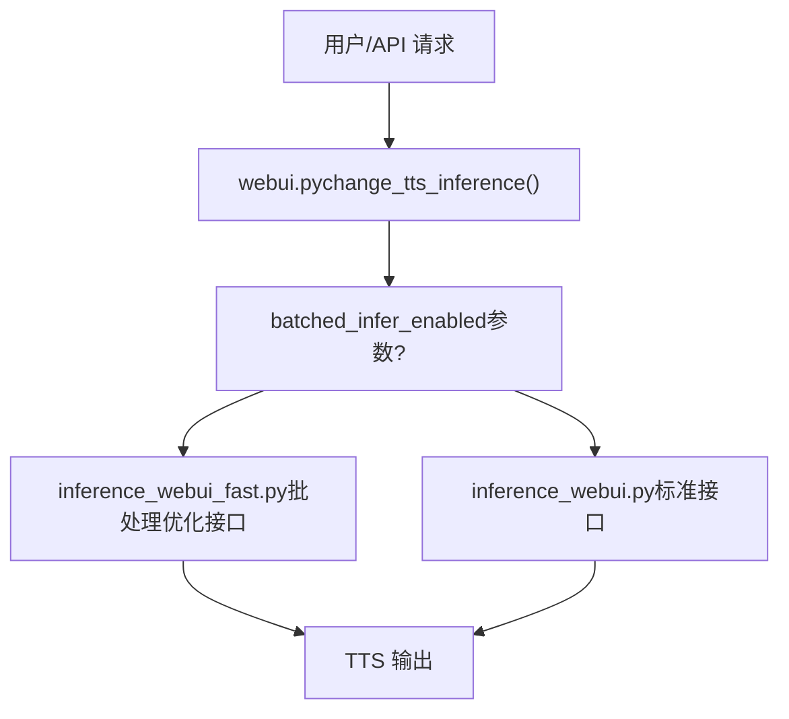
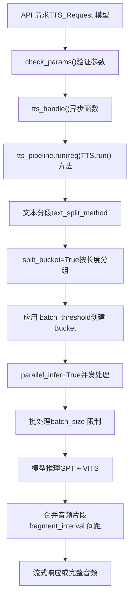
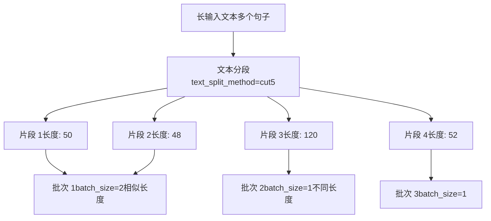
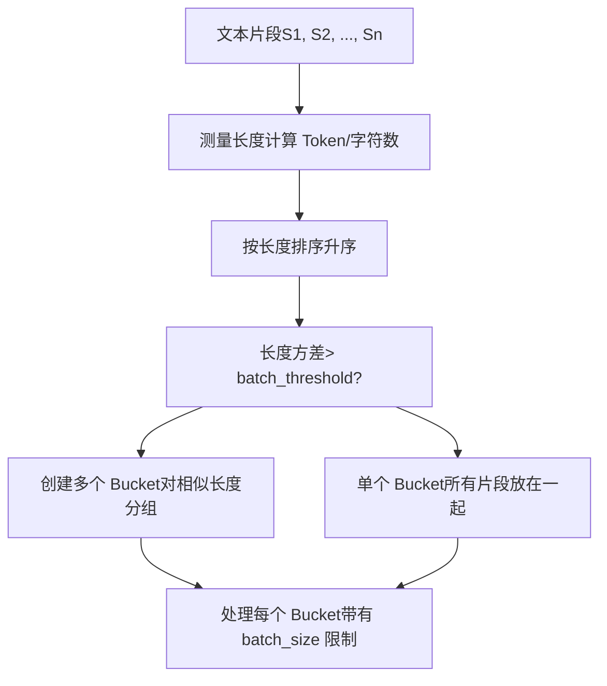
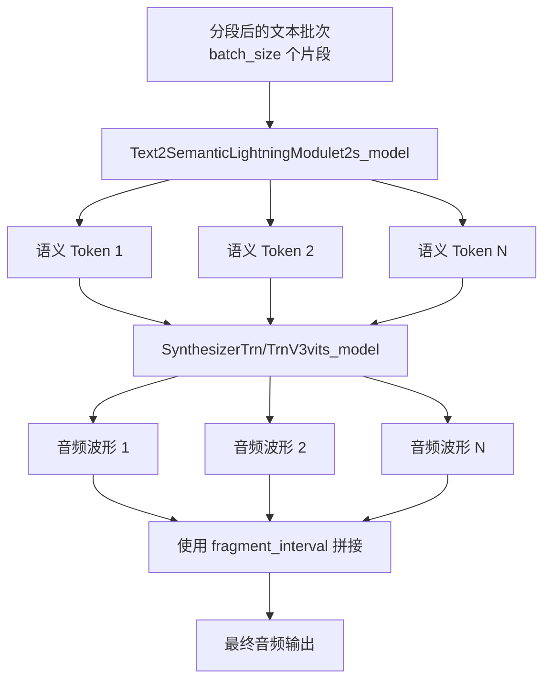
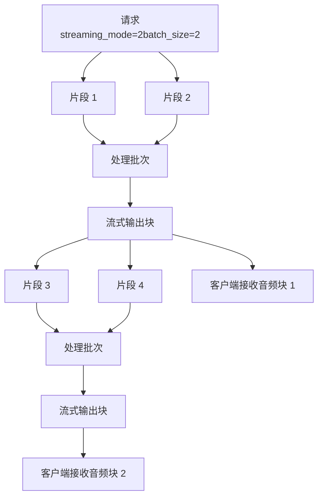
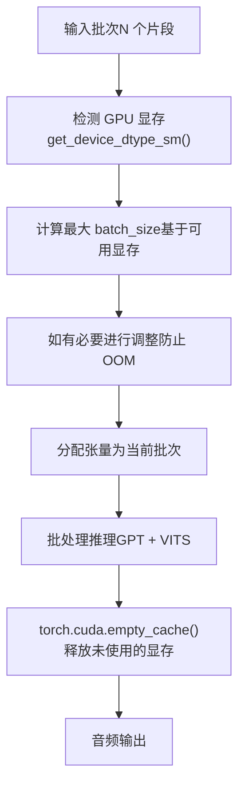

# 批处理 (Batch Processing)

相关源文件

-   [api.py](https://github.com/RVC-Boss/GPT-SoVITS/blob/c767f0b8/api.py)
-   [config.py](https://github.com/RVC-Boss/GPT-SoVITS/blob/c767f0b8/config.py)
-   [webui.py](https://github.com/RVC-Boss/GPT-SoVITS/blob/c767f0b8/webui.py)

## 目的与范围 (Purpose and Scope)

本文档说明了 GPT-SoVITS 如何处理批处理 (Batch Processing)，以便高效地从多个文本输入或需要分段的长文本中生成语音。批处理支持并行推理并优化了资源利用。有关单句推理工作流，请参阅 [TTS 推理过程](/RVC-Boss/GPT-SoVITS/7.1-tts-inference-process)。有关 API 集成的详情，请参阅 [REST API](/RVC-Boss/GPT-SoVITS/3.3-rest-api)。

## 概览 (Overview)

GPT-SoVITS 中的批处理主要提供两种方式：

1.  **快速推理模式 (Fast Inference Mode)**: 专门针对批处理操作优化的接口 (`inference_webui_fast.py`)。
2.  **批处理参数 (Batch Parameters)**: API 和 TTS 流水线中可配置的选项，用于控制批处理行为。

这些机制实现了对长文本、多个请求的高效处理，以及跨文本段的并行推理。

## 批处理模式 (Batch Processing Modes)

### 快速推理 WebUI 选择

系统根据批处理需求提供两个推理接口供选择：


来源: [webui.py331-363](https://github.com/RVC-Boss/GPT-SoVITS/blob/c767f0b8/webui.py#L331-L363)

选择发生在 `change_tts_inference` 函数中，该函数会生成不同的推理进程：

-   第 334 行：快速模式使用 `inference_webui_fast.py`
-   第 336 行：标准模式使用 `inference_webui.py`

### 带有批处理参数的标准模式

即使不使用快速推理接口，也可以通过控制文本分段和并行处理的可配置参数来支持批处理。

## 批处理参数 (Batch Processing Parameters)

以下参数控制跨 API 端点的批处理行为：

| 参数 | 类型 | 默认值 | 描述 |
| --- | --- | --- | --- |
| `batch_size` | int | 1 | 并行处理的语义 Token 序列数量 |
| `batch_threshold` | float | 0.75 | 基于长度方差分割批次的阈值 |
| `split_bucket` | bool | True | 启用对相似长度段的 Bucketing (分桶)，以实现高效批处理 |
| `parallel_infer` | bool | True | 启用跨文本段的并行推理 |
| `text_split_method` | str | "cut5" | 将长文本分割为段的算法 |
| `fragment_interval` | float | 0.3 | 拼接音频片段之间的时间间隔（秒） |

来源: [api\_v2.py154-178](https://github.com/RVC-Boss/GPT-SoVITS/blob/c767f0b8/api_v2.py#L154-L178) [api.py39-93](https://github.com/RVC-Boss/GPT-SoVITS/blob/c767f0b8/api.py#L39-L93)

## API 批处理 (API Batch Processing)

### 请求结构

`api.py` 和 `api_v2.py` 均在 `/tts` 端点的 GET 和 POST 请求中支持批处理参数。

**POST 请求结构**:

```json
{
    "text": "需要分段的长文本...",
    "text_lang": "zh",
    "ref_audio_path": "reference.wav",
    "prompt_lang": "zh",
    "prompt_text": "参考音频的转写",
    "batch_size": 4,
    "batch_threshold": 0.75,
    "split_bucket": true,
    "parallel_infer": true,
    "text_split_method": "cut5",
    "fragment_interval": 0.3
}
```
来源: [api\_v2.py22-48](https://github.com/RVC-Boss/GPT-SoVITS/blob/c767f0b8/api_v2.py#L22-L48) [api.py39-93](https://github.com/RVC-Boss/GPT-SoVITS/blob/c767f0b8/api.py#L39-L93)

### 批处理流水线 (Batch Processing Pipeline)


来源: [api\_v2.py345-446](https://github.com/RVC-Boss/GPT-SoVITS/blob/c767f0b8/api_v2.py#L345-L446) [api.py809-1031](https://github.com/RVC-Boss/GPT-SoVITS/blob/c767f0b8/api.py#L809-L1031)

## 文本分段策略 (Text Segmentation Strategies)

`text_split_method` 参数决定了在批处理之前如何将长文本划分为可处理的段。

### 可用的分段方法

系统支持通过 `get_cut_method_names()` 获取的多种文本分段策略：

-   `cut0`: 不分割（处理整个文本）
-   `cut1`: 按句子边界分割
-   `cut2`: 按标点符号分割
-   `cut3`: 按字符限制分割
-   `cut4`: 按语义边界分割
-   `cut5`: 平衡分割（默认值，针对质量和效率进行优化）

来源: [api\_v2.py131](https://github.com/RVC-Boss/GPT-SoVITS/blob/c767f0b8/api_v2.py#L131-L131) [GPT\_SoVITS/TTS\_infer\_pack/TTS.py35](https://github.com/RVC-Boss/GPT-SoVITS/blob/c767f0b8/GPT_SoVITS/TTS_infer_pack/TTS.py#L35-L35)

### 分段与批处理流程


来源: [api\_v2.py312-343](https://github.com/RVC-Boss/GPT-SoVITS/blob/c767f0b8/api_v2.py#L312-L343) [api\_v2.py361](https://github.com/RVC-Boss/GPT-SoVITS/blob/c767f0b8/api_v2.py#L361-L361)

## Bucket 分割算法 (Bucket Splitting Algorithm)

当 `split_bucket=True` 时，片段将按相似长度分组，以最小化填充 (Padding) 开销并最大化 GPU 利用率。

### Bucket 创建逻辑


**算法**: `batch_threshold` 参数（默认 0.75）控制 Bucket 分割。如果潜在 Bucket 中的最小长度/最大长度比率低于此阈值，片段将被分割到不同的 Bucket 中以减少填充。

来源: [api\_v2.py166-167](https://github.com/RVC-Boss/GPT-SoVITS/blob/c767f0b8/api_v2.py#L166-L167)

## 并行推理 (Parallel Inference)

当 `parallel_infer=True` 时，系统会通过 GPT 和 VITS 阶段并发处理多个文本段。

### 并行处理架构


来源: [api\_v2.py173](https://github.com/RVC-Boss/GPT-SoVITS/blob/c767f0b8/api_v2.py#L173-L173) [GPT\_SoVITS/TTS\_infer\_pack/TTS.py421-466](https://github.com/RVC-Boss/GPT-SoVITS/blob/c767f0b8/GPT_SoVITS/TTS_infer_pack/TTS.py#L421-L466)

**处理流程**:

1.  将文本段编码为带有 BERT 特征的音素。
2.  GPT 模型为每个片段生成语义 Token（可并行化）。
3.  VITS 模型从语义 Token 中合成音频（可并行化）。
4.  使用 `fragment_interval` 间隔拼接音频片段。

## TTS 流水线集成 (TTS Pipeline Integration)

批处理被集成在负责编排推理流水线的核心 `TTS` 类中。

### 关键组件


**TTS.run() 方法**: 批处理推理的主要入口点，接受包含批处理参数的请求字典，并产生 (Yield) 音频块。

来源: [GPT\_SoVITS/TTS\_infer\_pack/TTS.py421-466](https://github.com/RVC-Boss/GPT-SoVITS/blob/c767f0b8/GPT_SoVITS/TTS_infer_pack/TTS.py#L421-L466) [GPT\_SoVITS/TTS\_infer\_pack/TTS.py217-419](https://github.com/RVC-Boss/GPT-SoVITS/blob/c767f0b8/GPT_SoVITS/TTS_infer_pack/TTS.py#L217-L419) [GPT\_SoVITS/TTS\_infer\_pack/TTS.py448-450](https://github.com/RVC-Boss/GPT-SoVITS/blob/c767f0b8/GPT_SoVITS/TTS_infer_pack/TTS.py#L448-L450)

## 带有批处理的流式模式 (Streaming Mode with Batching)

批处理可以与流式处理结合使用，在处理片段时实时生成音频。

### 流式模式 (Streaming Modes)

| 模式值 | 类型 | 描述 | 延迟 | 质量 |
| --- | --- | --- | --- | --- |
| 0 | int 或 False | 禁用 - 返回完整音频 | 最高 | 最佳 |
| 1 | int 或 True | 最佳质量 - 完整的片段 | 高 | 最佳 |
| 2 | int | 中等 - 分块流式传输 | 中等 | 良好 |
| 3 | int | 快速 - 最小分块 | 最低 | 可接受 |

来源: [api\_v2.py172](https://github.com/RVC-Boss/GPT-SoVITS/blob/c767f0b8/api_v2.py#L172-L172) [api\_v2.py44](https://github.com/RVC-Boss/GPT-SoVITS/blob/c767f0b8/api_v2.py#L44-L44)

### 流式批处理流程


**流式实现**: 在 `tts_handle()` 函数中，当启用 `streaming_mode` 时，生成器函数会随着音频块的产生而产出它们，并封装适当的 WAV 格式头。

来源: [api\_v2.py388-438](https://github.com/RVC-Boss/GPT-SoVITS/blob/c767f0b8/api_v2.py#L388-L438)

### 流式特定参数

-   `overlap_length` (int, 默认 2): 块之间重叠的语义 Token 数量，以确保平滑过渡。
-   `min_chunk_length` (int, 默认 16): 每个块的最小语义 Token 长度，直接影响音频块的时长。

来源: [api\_v2.py177-178](https://github.com/RVC-Boss/GPT-SoVITS/blob/c767f0b8/api_v2.py#L177-L178) [api\_v2.py45-46](https://github.com/RVC-Boss/GPT-SoVITS/blob/c767f0b8/api_v2.py#L45-L46)

## 性能考虑 (Performance Considerations)

### 批次大小 (Batch Size) 选择

最佳的 `batch_size` 取决于可用的 GPU 显存。`config.py` 中的系统会自动根据检测到的硬件确定默认批次大小：

**自动配置逻辑**:

```python
# 源自 config.py 逻辑if is_gpu_ok:    minmem = min(mem)    default_batch_size = int(minmem // 2 if version not in v3v4set else minmem // 8)else:    default_batch_size = int(psutil.virtual_memory().total / 1024 / 1024 / 1024 / 4)
```
**建议**:

-   V1/V2/V2Pro 模型: `batch_size = GPU_显存_GB // 2`
-   V3/V4 模型: `batch_size = GPU_显存_GB // 8` (CFM 模型需要更多显存)

来源: [webui.py104-139](https://github.com/RVC-Boss/GPT-SoVITS/blob/c767f0b8/webui.py#L104-L139) [config.py148-196](https://github.com/RVC-Boss/GPT-SoVITS/blob/c767f0b8/config.py#L148-L196)

### 显存管理策略


**显存管理**: 系统在支持时使用半精度 (`is_half=True`) 以减少显存使用。`config.py` 中的自动检测会根据 GPU 计算能力确定精度。

来源: [config.py148-196](https://github.com/RVC-Boss/GPT-SoVITS/blob/c767f0b8/config.py#L148-L196) [GPT\_SoVITS/TTS\_infer\_pack/TTS.py691-728](https://github.com/RVC-Boss/GPT-SoVITS/blob/c767f0b8/GPT_SoVITS/TTS_infer_pack/TTS.py#L691-L728)

## 环境配置 (Environment Configuration)

### 配置文件

**tts\_infer.yaml**: 存储默认的推理设置，包括设备和精度。

```yaml
custom:
  device: cuda
  is_half: true
  version: v2
  t2s_weights_path: path/to/gpt.ckpt
  vits_weights_path: path/to/sovits.pth
  # ... 其他版本
```
来源: [GPT\_SoVITS/configs/tts\_infer.yaml1-57](https://github.com/RVC-Boss/GPT-SoVITS/blob/c767f0b8/GPT_SoVITS/configs/tts_infer.yaml#L1-L57)

### 通过 config.py 进行运行时配置

`config.py` 模块管理：

-   通过 `get_device_dtype_sm()` 进行 GPU 检测和设备选择。
-   基于显存的默认批次大小。
-   基于硬件能力的精度设置。

**关键变量**:

-   `infer_device`: 选定的推理设备。
-   `is_half`: 是否使用 FP16 精度。
-   `IS_GPU`: 指示 GPU 可用性的布尔值。
-   `memset`: 可用 GPU 显存大小的集合。

来源: [config.py1-219](https://github.com/RVC-Boss/GPT-SoVITS/blob/c767f0b8/config.py#L1-L219) [config.py148-196](https://github.com/RVC-Boss/GPT-SoVITS/blob/c767f0b8/config.py#L148-L196)

## 错误处理 (Error Handling)

批处理系统包含全面的错误处理机制：

### 常见错误场景

1.  **参数验证**: `check_params()` 在处理前验证所有批处理参数。
2.  **显存不足 (Out of Memory)**: 自动捕获并返回包含减小 `batch_size` 建议的错误。
3.  **模型加载失败**: 如果 GPU 不可用，则优雅地回退到 CPU。
4.  **无效的文本分段方法**: 返回 HTTP 400 以及有效方法列表。

**错误响应格式**:

```json
{
    "code": 400,
    "message": "tts failed",
    "Exception": "CUDA out of memory. Tried to allocate X GB..."
}
```
来源: [api\_v2.py305-342](https://github.com/RVC-Boss/GPT-SoVITS/blob/c767f0b8/api_v2.py#L305-L342) [api\_v2.py444-445](https://github.com/RVC-Boss/GPT-SoVITS/blob/c767f0b8/api_v2.py#L444-L445)

## 使用示例 (Usage Examples)

### 示例 1: 通过 API 进行基础批处理

```python
import requests

url = "http://127.0.0.1:9880/tts"
payload = {
    "text": "这是一段很长的文本，需要分段处理才能高效生成语音。系统会自动将文本切分成多个片段。",
    "text_lang": "zh",
    "ref_audio_path": "reference.wav",
    "prompt_lang": "zh",
    "prompt_text": "参考音频的文本内容",
    "batch_size": 4,
    "batch_threshold": 0.75,
    "split_bucket": True,
    "parallel_infer": True,
    "text_split_method": "cut5"
}

response = requests.post(url, json=payload)
with open("output.wav", "wb") as f:
    f.write(response.content)
```
### 示例 2: 流式批处理

```python
import requests

url = "http://127.0.0.1:9880/tts"
payload = {
    "text": "长文本内容用于实时流式生成...",
    "text_lang": "zh",
    "ref_audio_path": "reference.wav",
    "prompt_lang": "zh",
    "streaming_mode": 2,  # 中等质量流式传输
    "batch_size": 2,
    "overlap_length": 2,
    "min_chunk_length": 16,
    "parallel_infer": True
}

response = requests.post(url, json=payload, stream=True)
for chunk in response.iter_content(chunk_size=4096):
    if chunk:
        # 实时处理或播放音频块
        audio_player.play(chunk)
```
### 示例 3: 通过 WebUI 启动快速批处理推理

通过 WebUI 的 `change_tts_inference` 函数启用快速批处理推理模式：

```python
# 在 webui.py 中
change_tts_inference(
    bert_path="GPT_SoVITS/pretrained_models/chinese-roberta-wwm-ext-large",
    cnhubert_base_path="GPT_SoVITS/pretrained_models/chinese-hubert-base",
    gpu_number="0",
    gpt_path="path/to/gpt_model.ckpt",
    sovits_path="path/to/sovits_model.pth",
    batched_infer_enabled=True  # 启用快速批处理模式
)
```
这将生成 `inference_webui_fast.py` 而非标准接口。

来源: [webui.py331-363](https://github.com/RVC-Boss/GPT-SoVITS/blob/c767f0b8/webui.py#L331-L363)

## 与其他组件的集成 (Integration with Other Components)

批处理与多个系统组件进行交互：

-   **文本处理流水线** ([#2.2](/RVC-Boss/GPT-SoVITS/2.2-text-processing-pipeline)): 在分段前提供语言检测和归一化。
-   **核心模型架构** ([#2.1](/RVC-Boss/GPT-SoVITS/2.1-core-model-architectures)): GPT 和 VITS 模型处理批处理后的张量输入。
-   **训练流水线** ([#2.3](/RVC-Boss/GPT-SoVITS/2.3-training-pipeline)): 训练也使用批处理以提高效率。
-   **推理流水线** ([#7.1](/RVC-Boss/GPT-SoVITS/7.1-tts-inference-process)): 核心 TTS 流水线编排批处理。
-   **REST API** ([#3.3](/RVC-Boss/GPT-SoVITS/3.3-rest-api)): 通过 API 端点公开批处理参数。

## 总结 (Summary)

GPT-SoVITS 批处理提供：

1.  **双重接口选项**: 标准和优化的快速推理模式。
2.  **可配置参数**: 通过 `batch_size`、`batch_threshold`、`split_bucket` 实现对批处理策略的精细控制。
3.  **智能分段**: 多种文本分割方法以及自动分桶。
4.  **并行推理**: 当 `parallel_infer=True` 时并发处理各个片段。
5.  **流式支持**: 配合批处理进行实时音频生成。
6.  **显存优化**: 基于可用 GPU 显存自动调整批次大小。
7.  **API 集成**: 通过 REST 端点提供完整的批处理支持。

这些能力实现了对长文本、多个请求的高效处理，并在资源受限的情况下维持了音频质量。

来源: [webui.py1-1529](https://github.com/RVC-Boss/GPT-SoVITS/blob/c767f0b8/webui.py#L1-L1529) [api\_v2.py1-577](https://github.com/RVC-Boss/GPT-SoVITS/blob/c767f0b8/api_v2.py#L1-L577) [api.py1-1500](https://github.com/RVC-Boss/GPT-SoVITS/blob/c767f0b8/api.py#L1-L1500) [GPT\_SoVITS/TTS\_infer\_pack/TTS.py1-1400](https://github.com/RVC-Boss/GPT-SoVITS/blob/c767f0b8/GPT_SoVITS/TTS_infer_pack/TTS.py#L1-L1400) [config.py1-219](https://github.com/RVC-Boss/GPT-SoVITS/blob/c767f0b8/config.py#L1-L219)
