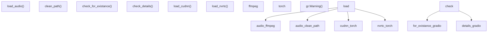
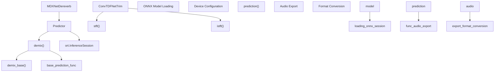

# Utilities and Tools (工具与实用程序)

相关源文件

-   [api.py](https://github.com/RVC-Boss/GPT-SoVITS/blob/c767f0b8/api.py)
-   [config.py](https://github.com/RVC-Boss/GPT-SoVITS/blob/c767f0b8/config.py)
-   [tools/my\_utils.py](https://github.com/RVC-Boss/GPT-SoVITS/blob/c767f0b8/tools/my_utils.py)
-   [tools/slice\_audio.py](https://github.com/RVC-Boss/GPT-SoVITS/blob/c767f0b8/tools/slice_audio.py)
-   [tools/slicer2.py](https://github.com/RVC-Boss/GPT-SoVITS/blob/c767f0b8/tools/slicer2.py)
-   [tools/subfix\_webui.py](https://github.com/RVC-Boss/GPT-SoVITS/blob/c767f0b8/tools/subfix_webui.py)
-   [tools/uvr5/webui.py](https://github.com/RVC-Boss/GPT-SoVITS/blob/c767f0b8/tools/uvr5/webui.py)
-   [webui.py](https://github.com/RVC-Boss/GPT-SoVITS/blob/c767f0b8/webui.py)

本文档涵盖了辅助 GPT-SoVITS 运行但并非核心 TTS 流水线部分的实用函数、开发工具和支持系统。这些包括通用 Helper Functions (辅助函数)、数据集管理工具、音频处理实用程序、Internationalization (国际化) 支持和 Development Aids (开发辅助工具)。

有关核心 TTS 推理过程的信息，请参见 [Inference Pipeline](/RVC-Boss/GPT-SoVITS/2.4-inference-pipeline)。有关训练特定工具，请参见 [Training Pipeline](/RVC-Boss/GPT-SoVITS/2.3-training-pipeline)。有关集成到主工作流中的音频分离和 ASR 工具，请参见 [Data Preparation](/RVC-Boss/GPT-SoVITS/5-data-preparation)。

## Common Utility Functions (通用实用函数)

[`tools/my_utils.py`](https://github.com/RVC-Boss/GPT-SoVITS/blob/c767f0b8/tools/my_utils.py) 模块提供了在整个 GPT-SoVITS 代码库中用于音频加载、路径处理、文件验证和系统设置的基本实用函数。

### Core Utility Functions (核心实用函数)


**Audio Loading and Path Management (音频加载与路径管理)**

`load_audio()` 函数提供了具有自动格式转换和重采样的鲁棒性 (robust) 音频文件加载：

-   使用 FFmpeg 进行格式转换和重采样
-   支持单声道转换
-   通过 FFmpeg 处理各种音频格式
-   包括使用 `clean_path()` 进行路径清洗，以处理空格和编码问题

**File Validation System (文件验证系统)**

验证函数确保在训练或处理前数据的完整性 (data integrity)：

-   `check_for_existance()` 验证训练数据集的文件和目录是否存在
-   `check_details()` 对数据集结构和内容执行更深层次的验证
-   通过 Gradio 警告为缺失组件提供用户反馈

**CUDA Library Management (CUDA 库管理)**

平台特定的 CUDA 库加载函数确保了正确的 GPU 加速 (GPU Acceleration)：

-   `load_cudnn()` 在 Windows 和 Linux 上加载 cuDNN 库
-   `load_nvrtc()` 加载 NVRTC (NVIDIA Runtime Compilation, 运行时编译) 库
-   处理 DLL/SO 文件发现和带错误处理的加载

Sources: [tools/my\_utils.py16-37](https://github.com/RVC-Boss/GPT-SoVITS/blob/c767f0b8/tools/my_utils.py#L16-L37) [tools/my\_utils.py49-87](https://github.com/RVC-Boss/GPT-SoVITS/blob/c767f0b8/tools/my_utils.py#L49-L87) [tools/my\_utils.py140-185](https://github.com/RVC-Boss/GPT-SoVITS/blob/c767f0b8/tools/my_utils.py#L140-L185) [tools/my\_utils.py187-232](https://github.com/RVC-Boss/GPT-SoVITS/blob/c767f0b8/tools/my_utils.py#L187-L232)

## Dataset Management Tools (数据集管理工具)

### Audio Annotation WebUI (音频标注 WebUI)

[`tools/subfix_webui.py`](https://github.com/RVC-Boss/GPT-SoVITS/blob/c767f0b8/tools/subfix_webui.py) 提供了一个专门用于数据集标注和修正的 Web 界面，这对于准备高质量训练数据至关重要。

```mermaid
flowchart TD
    b_save_json["b_save_json()"]
    b_save_file["b_save_file()"]
    b_save_list["b_save_list()"]
    set_global["set_global()"]
    b_load_file["b_load_file()"]
    b_load_json["b_load_json()"]
    b_load_list["b_load_list()"]
    reload_data["reload_data()"]
    b_change_index["b_change_index()"]
    b_submit_change["b_submit_change()"]
    b_audio_split["b_audio_split()"]
    b_merge_audio["b_merge_audio()"]
    b_delete_audio["b_delete_audio()"]
    get_next_path["get_next_path()"]
    g_data_json["g_data_json"]
    g_index["g_index"]
    g_batch["g_batch"]

    reload --> data_g_data_json
    b --> change_index_reload_data
    b --> submit_change_g_data_json
    b --> audio_split_get_next_path
    b --> merge_audio_g_data_json
    b --> save_file_b_save_json
    b --> save_file_b_save_list
    set --> global_b_load_file
    b --> load_file_b_load_json
    b --> load_file_b_load_list
```


**Core Features (核心特性)**

该标注工具支持 JSON 和列表文件格式进行数据集管理：

| Feature | Function | Description |
| --- | --- | --- |
| 文本编辑 | `b_submit_change()` | 手动文本修正与标注 |
| 音频切分 | `b_audio_split()` | 在指定的时间戳 (timestamps) 处切分音频 |
| 音频合并 | `b_merge_audio()` | 合并多个音频片段 |
| 批量导航 | `b_change_index()` | 在大型数据集中导航 |
| 数据持久化 | `b_save_file()` | 将更改保存到磁盘 (Data Persistence) |

**Audio Processing Capabilities (音频处理能力)**

该工具在标注界面中提供直接的音频操作：

-   **音频切分**：使用 `librosa` 和 `soundfile` 在指定的断点 (breakpoints) 处创建新片段
-   **音频合并**：将选定的片段与可配置的静音间隔合并
-   **路径管理**：自动为新音频片段生成唯一的文件名
-   **批量处理**：通过分页控制处理多个文件

**Data Format Support (数据格式支持)**

支持两种主要的数据集格式：

-   **JSON 格式**：具有可配置键映射的结构化数据
-   **列表格式**：管道符分隔 (Pipe-separated) 格式 (`wav_path|speaker_name|language|text`)

Sources: [tools/subfix\_webui.py275-294](https://github.com/RVC-Boss/GPT-SoVITS/blob/c767f0b8/tools/subfix_webui.py#L275-L294) [tools/subfix\_webui.py148-175](https://github.com/RVC-Boss/GPT-SoVITS/blob/c767f0b8/tools/subfix_webui.py#L148-L175) [tools/subfix\_webui.py177-218](https://github.com/RVC-Boss/GPT-SoVITS/blob/c767f0b8/tools/subfix_webui.py#L177-L218) [tools/subfix\_webui.py221-266](https://github.com/RVC-Boss/GPT-SoVITS/blob/c767f0b8/tools/subfix_webui.py#L221-L266)

## Audio Processing Utilities (音频处理实用程序)

### UVR5 Audio Source Separation (UVR5 音频源分离)

UVR5 (Ultimate Vocal Remover 5) 系统提供了先进的 Audio Source Separation (音频源分离) 能力，用于人声/伴奏分离和音频增强，这对于准备干净的训练数据至关重要。

#### MDX-Net 音频分离

[`tools/uvr5/mdxnet.py`](https://github.com/RVC-Boss/GPT-SoVITS/blob/c767f0b8/tools/uvr5/mdxnet.py) 实现了用于高质量音频源分离和去混响 (Dereverb) 处理的 MDX-Net 模型。


**Core Classes and Functions (核心类与函数)**

| Class/Function | Purpose | Key Features |
| --- | --- | --- |
| `ConvTDFNetTrim` | 音频张量的 STFT/ISTFT 处理 | 处理切块 (chunking)、分窗 (windowing)、频率填充 |
| `Predictor` | ONNX 模型推理协调器 | 管理模型加载、分块处理、去噪 |
| `MDXNetDereverb` | 特定于去混响的处理 | 专门用于去除混响和延迟效果 |
| `demix()` | 高层分离接口 | 处理音频分段和边缘 (margin) 处理 |
| `prediction()` | 文件 I/O 和格式转换 | 支持 wav, flac, mp3 输出格式 |

**Processing Workflow (处理工作流)**

MDX-Net 分离过程遵循结构化流水线：

1.  **模型初始化**：加载带有 CUDA/DML/CPU 执行提供程序 (Execution Providers) 的 ONNX 模型
2.  **音频分段**：将输入切分为具有可配置边缘的重叠分块
3.  **STFT 处理**：使用 `ConvTDFNetTrim.stft()` 将音频转换为频域 (Frequency Domain)
4.  **神经分离**：应用已训练模型来分离声源
5.  **ISTFT 重建**：使用 `ConvTDFNetTrim.istft()` 转换回时域 (Time Domain)
6.  **输出生成**：保存分离的人声和伴奏

Sources: [tools/uvr5/mdxnet.py15-71](https://github.com/RVC-Boss/GPT-SoVITS/blob/c767f0b8/tools/uvr5/mdxnet.py#L15-L71) [tools/uvr5/mdxnet.py74-123](https://github.com/RVC-Boss/GPT-SoVITS/blob/c767f0b8/tools/uvr5/mdxnet.py#L74-L123) [tools/uvr5/mdxnet.py208-224](https://github.com/RVC-Boss/GPT-SoVITS/blob/c767f0b8/tools/uvr5/mdxnet.py#L208-L224)

#### VR 音频处理模型

[`tools/uvr5/vr.py`](https://github.com/RVC-Boss/GPT-SoVITS/blob/c767f0b8/tools/uvr5/vr.py) 实现了 Vocal Removal (VR) 模型，使用多频带处理进行人声/伴奏分离和回声消除 (Echo Removal)。

```mermaid
flowchart TD
    AudioPre["AudioPre"]
    AudioPreDeEcho["AudioPreDeEcho"]
    ModelParameters["ModelParameters"]
    band_processing["Multi-band STFT"]
    spec_combination["spec_utils.combine_spectrograms()"]
    high_end_processing["High-end Processing"]
    CascadedASPPNet["Nets.CascadedASPPNet"]
    CascadedNet["CascadedNet"]
    inference_func["inference()"]
    mask_application["Mask Application"]
    spectrogram_separation["Spectrogram Separation"]
    wave_reconstruction["spec_utils.cmb_spectrogram_to_wave()"]

    AudioPre --> ModelParameters
    AudioPre --> CascadedASPPNet
    AudioPreDeEcho --> CascadedNet
    ModelParameters --> band_processing
    band --> processing_spec_combination
    CascadedASPPNet --> inference_func
    CascadedNet --> inference_func
    inference --> func_mask_application
    mask --> application_spectrogram_separation
    spectrogram --> separation_wave_reconstruction
    high --> end_processing_wave_reconstruction
```


**Model Architecture Details (模型架构细节)**

| Component | Function | Technical Details |
| --- | --- | --- |
| `AudioPre` | 标准人声分离 | 使用带有 `CascadedASPPNet` 的 4 频带处理 |
| `AudioPreDeEcho` | 回声/延迟去除 | 使用带有 48/64 输出通道的 `CascadedNet` |
| `ModelParameters` | 频带配置 | 从 `modelparams/4band_v2.json` 或 `4band_v3.json` 加载 |
| Multi-band STFT | 频率分析 | 分别处理不同的频带 |
| High-end Processing | 频率重建 | 针对高频内容使用镜像 (Mirroring) 技术 |

**Processing Features (处理特性)**

-   **Multi-band Architecture (多频带架构)**：针对不同频率范围的独立处理
-   **激进程度 (Aggressiveness Levels)**：可配置的激进程度以控制分离质量
-   **格式支持**：通过 FFmpeg 转换输出为 WAV, FLAC 或其他格式
-   **内存管理**：针对大文件的分块处理
-   **质量选项**：TTA (Test Time Augmentation) 用于改进结果

Sources: [tools/uvr5/vr.py19-44](https://github.com/RVC-Boss/GPT-SoVITS/blob/c767f0b8/tools/uvr5/vr.py#L19-L44) [tools/uvr5/vr.py190-216](https://github.com/RVC-Boss/GPT-SoVITS/blob/c767f0b8/tools/uvr5/vr.py#L190-L216) [tools/uvr5/vr.py45-188](https://github.com/RVC-Boss/GPT-SoVITS/blob/c767f0b8/tools/uvr5/vr.py#L45-L188)

### Audio Slicing Tool (音频切分工具)

[`tools/slice_audio.py`](https://github.com/RVC-Boss/GPT-SoVITS/blob/c767f0b8/tools/slice_audio.py) 提供了在数据集准备工作流中使用的自动音频分段功能。

```mermaid
flowchart TD
    inp["Audio Input(File or Directory)"]
    input_validation["Input Validation"]
    slicer_params["Slicer Parameterssr=32000thresholdmin_lengthmin_intervalhop_sizemax_sil_kept"]
    slicer_init["Slicer(sr=32000)"]
    load_audio_func["load_audio()"]
    slice_audio["slicer.slice()"]
    save_segments["Save Audio Segments"]
    opt_root["Output Directory"]
    audio_segments["Segmented Audio Files"]

    inp --> input_validation
    input --> validation_load_audio_func
    slicer --> params_slicer_init
    load --> audio_func_slice_audio
    slicer --> init_slice_audio
    slice --> audio_save_segments
    save --> segments_opt_root
    opt --> root_audio_segments
```


**Slicing Parameters (切分参数)**

音频切分器接受可配置参数以实现最佳分段：

| Parameter | Purpose | Default/Range |
| --- | --- | --- |
| `threshold` | 用于静音检测 (Silence Detection) 的音量阈值 | 用户定义 |
| `min_length` | 最小分段长度 | 用户定义 |
| `min_interval` | 切分点之间的最小间隔 | 用户定义 |
| `hop_size` | 分析窗的跳步大小 (Hop size) | 用户定义 |
| `max_sil_kept` | 要保留的最大静音时长 | 用户定义 |
| `_max` | 幅度归一化因子 | 用户定义 |
| `alpha` | 音频混合比例 | 用户定义 |

**Processing Workflow (处理工作流)**

切分过程可处理单个文件或批量目录：

1.  **输入验证**：检查输入是文件还是目录
2.  **音频加载**：使用 `my_utils` 中的 `load_audio()` 进行稳健的文件处理
3.  **分段**：应用带有静音检测的 `Slicer` 算法
4.  **输出管理**：将分段保存到组织良好的输出目录结构中

Sources: [tools/slice\_audio.py13-22](https://github.com/RVC-Boss/GPT-SoVITS/blob/c767f0b8/tools/slice_audio.py#L13-L22) [tools/slice\_audio.py1-11](https://github.com/RVC-Boss/GPT-SoVITS/blob/c767f0b8/tools/slice_audio.py#L1-L11)

## Internationalization System (国际化系统)

国际化系统通过一个中心化的翻译管理系统为 GPT-SoVITS 用户界面提供多语言支持。

### I18n Architecture (I18n 架构)

```mermaid
flowchart TD
    I18nAuto["I18nAuto Class"]
    scan_language_list["scan_language_list()"]
    language_detection["Language Detection"]
    en_US["en_US.json"]
    zh_CN["zh_CN.json"]
    ja_JP["ja_JP.json"]
    es_ES["es_ES.json"]
    fr_FR["fr_FR.json"]
    ru_RU["ru_RU.json"]
    other_locales["...other locales"]
    ui_strings["UI String Keys"]
    error_messages["Error Message Keys"]
    tooltips["Tooltip Keys"]
    model_descriptions["Model Description Keys"]
    webui["webui.py"]
    inference_webui["inference_webui.py"]
    subfix_webui["subfix_webui.py"]

    I18nAuto --> scan_language_list
    I18nAuto --> language_detection
    en --> US_I18nAuto
    zh --> CN_I18nAuto
    ja --> JP_I18nAuto
    es --> ES_I18nAuto
    fr --> FR_I18nAuto
    ru --> RU_I18nAuto
    other --> locales_I18nAuto
    ui --> strings_I18nAuto
    error --> messages_I18nAuto
    tooltips --> I18nAuto
    model --> descriptions_I18nAuto
    I18nAuto --> webui
    I18nAuto --> inference_webui
    I18nAuto --> subfix_webui
```


**Supported Languages (支持的语言)**

该系统目前支持以下具有完整翻译文件的语言：

| Language | Locale Code | File |
| --- | --- | --- |
| 英语 (English) | `en_US` | `tools/i18n/locale/en_US.json` |
| 简体中文 (Simplified Chinese) | `zh_CN` | `tools/i18n/locale/zh_CN.json` |
| 繁体中文 (Traditional Chinese) | `zh_TW` | `tools/i18n/locale/zh_TW.json` |
| 香港中文 (Hong Kong Chinese) | `zh_HK` | `tools/i18n/locale/zh_HK.json` |
| 新加坡中文 (Singapore Chinese) | `zh_SG` | `tools/i18n/locale/zh_SG.json` |
| 日语 (Japanese) | `ja_JP` | `tools/i18n/locale/ja_JP.json` |
| 西班牙语 (Spanish) | `es_ES` | `tools/i18n/locale/es_ES.json` |
| 法语 (French) | `fr_FR` | `tools/i18n/locale/fr_FR.json` |
| 意大利语 (Italian) | `it_IT` | `tools/i18n/locale/it_IT.json` |
| 俄语 (Russian) | `ru_RU` | `tools/i18n/locale/ru_RU.json` |
| 土耳其语 (Turkish) | `tr_TR` | `tools/i18n/locale/tr_TR.json` |

**Translation Coverage (翻译覆盖范围)**

每个区域设置 (locale) 文件都包含主要系统组件的翻译：

-   **UI 元素 (UI Elements)**：按钮标签、表单字段、导航元素
-   **训练消息**：GPT 训练、SoVITS 训练、模型信息
-   **错误处理**：文件验证、路径错误、模型加载问题
-   **工具说明**：UVR5、ASR、音频处理工具
-   **参数说明**：训练参数、推理设置

**Integration Pattern (集成模式)**

i18n 系统通过一致的模式集成到 GPT-SoVITS 应用程序中：

```
from tools.i18n.i18n import I18nAuto
i18n = I18nAuto(language=language)
# 用法：i18n("translation_key")
```
Sources: [tools/subfix\_webui.py2-4](https://github.com/RVC-Boss/GPT-SoVITS/blob/c767f0b8/tools/subfix_webui.py#L2-L4) [tools/my\_utils.py11-13](https://github.com/RVC-Boss/GPT-SoVITS/blob/c767f0b8/tools/my_utils.py#L11-L13) [tools/i18n/locale/en\_US.json1-226](https://github.com/RVC-Boss/GPT-SoVITS/blob/c767f0b8/tools/i18n/locale/en_US.json#L1-L226) [tools/i18n/locale/zh\_CN.json1-226](https://github.com/RVC-Boss/GPT-SoVITS/blob/c767f0b8/tools/i18n/locale/zh_CN.json#L1-L226)

## Development and Configuration Tools (开发与配置工具)

### System Configuration Management (系统配置管理)

实用程序系统提供基本配置和开发支持功能，确保在不同环境和硬件配置下运行的一致性。

```mermaid
flowchart TD
    cuda_detection["CUDA Detection"]
    library_loading["Library Loading"]
    path_validation["Path Validation"]
    load_cudnn_func["load_cudnn()"]
    load_nvrtc_func["load_nvrtc()"]
    gpu_setup["GPU Setup"]
    windows_dlls["Windows DLL Loading"]
    linux_so["Linux SO Loading"]
    platform_detection["Platform Detection"]
    validation_warnings["Validation Warnings"]
    missing_file_detection["Missing File Detection"]
    user_feedback["User Feedback"]

    cuda --> detection_load_cudnn_func
    cuda --> detection_load_nvrtc_func
    load --> cudnn_func_windows_dlls
    load --> cudnn_func_linux_so
    load --> nvrtc_func_windows_dlls
    load --> nvrtc_func_linux_so
    path --> validation_validation_warnings
    validation --> warnings_user_feedback
    missing --> file_detection_user_feedback
```


**CUDA Environment Management (CUDA 环境管理)**

系统自动检测并配置 CUDA 库，以获得最佳 GPU 性能：

-   **Dynamic Library Loading (动态库加载)**：自动发现并加载 cuDNN 和 NVRTC 库
-   **平台兼容性**：处理 Windows (`.dll`) 和 Linux (`.so`) 库格式
-   **错误恢复**：当 CUDA 不可用或配置错误时，优雅地回退 (fallback)
-   **路径发现**：在标准 PyTorch 安装路径中搜索所需库

**Dataset Validation Framework (数据集验证框架)**

全面的验证确保在昂贵的训练操作前的数据完整性：

-   **训练数据集验证**：验证所需文件（BERT 特征、Hubert 特征、音频文件、语义标记）是否存在
-   **路径结构检查**：验证预期的目录结构和文件命名规范
-   **内容验证**：对文件内容和格式执行基本检查
-   **用户反馈集成**：通过 Gradio 界面提供清晰的错误消息

**Cross-Platform Audio Handling (跨平台音频处理)**

跨不同操作系统的稳健音频处理能力：

-   **FFmpeg 集成**：利用 FFmpeg 提供通用的音频格式支持
-   **路径归一化**：处理特定平台的路径分隔符和编码问题
-   **错误处理**：为音频加载失败提供描述性错误消息

Sources: [tools/my\_utils.py140-165](https://github.com/RVC-Boss/GPT-SoVITS/blob/c767f0b8/tools/my_utils.py#L140-L165) [tools/my\_utils.py187-232](https://github.com/RVC-Boss/GPT-SoVITS/blob/c767f0b8/tools/my_utils.py#L187-L232) [tools/my\_utils.py49-87](https://github.com/RVC-Boss/GPT-SoVITS/blob/c767f0b8/tools/my_utils.py#L49-L87) [tools/my\_utils.py90-138](https://github.com/RVC-Boss/GPT-SoVITS/blob/c767f0b8/tools/my_utils.py#L90-L138)
