# 音频处理实用程序 (Audio Processing Utilities)

相关源文件

-   [tools/my\_utils.py](https://github.com/RVC-Boss/GPT-SoVITS/blob/c767f0b8/tools/my_utils.py)
-   [tools/slice\_audio.py](https://github.com/RVC-Boss/GPT-SoVITS/blob/c767f0b8/tools/slice_audio.py)
-   [tools/slicer2.py](https://github.com/RVC-Boss/GPT-SoVITS/blob/c767f0b8/tools/slicer2.py)
-   [tools/subfix\_webui.py](https://github.com/RVC-Boss/GPT-SoVITS/blob/c767f0b8/tools/subfix_webui.py)
-   [tools/uvr5/webui.py](https://github.com/RVC-Boss/GPT-SoVITS/blob/c767f0b8/tools/uvr5/webui.py)

## 目的与范围 (Purpose and Scope)

本文档涵盖了 GPT-SoVITS 中的音频处理实用程序，这些程序负责处理音频文件加载、路径操作、基于静音的分段 (Silence-based Segmentation)、人声分离 (Vocal Separation) 以及数据集标注 (Dataset Annotation)。这些工具主要位于 `tools/` 目录中，是数据准备流水线 (Data Preparation Pipeline) 的基础组件。

有关使用这些工具的完整数据准备工作流程的信息，请参阅[数据准备](/RVC-Boss/GPT-SoVITS/5-data-preparation)。有关 ASR 转录工具的信息，请参阅[自动语音识别](/RVC-Boss/GPT-SoVITS/5.2-automatic-speech-recognition)。有关特征提取过程的信息，请参阅[特征提取脚本](/RVC-Boss/GPT-SoVITS/5.3-feature-extraction-scripts)。

---

## 系统概述 (System Overview)

音频处理实用程序提供了三大类功能：

1.  **核心实用程序 (Core Utilities)** - 基本音频加载、路径清洗和文件验证
2.  **预处理工具 (Preprocessing Tools)** - 人声分离 (UVR5) 和基于静音的切割
3.  **标注工具 (Annotation Tools)** - 手动数据集整理 (Manual Dataset Curation) 和音频编辑

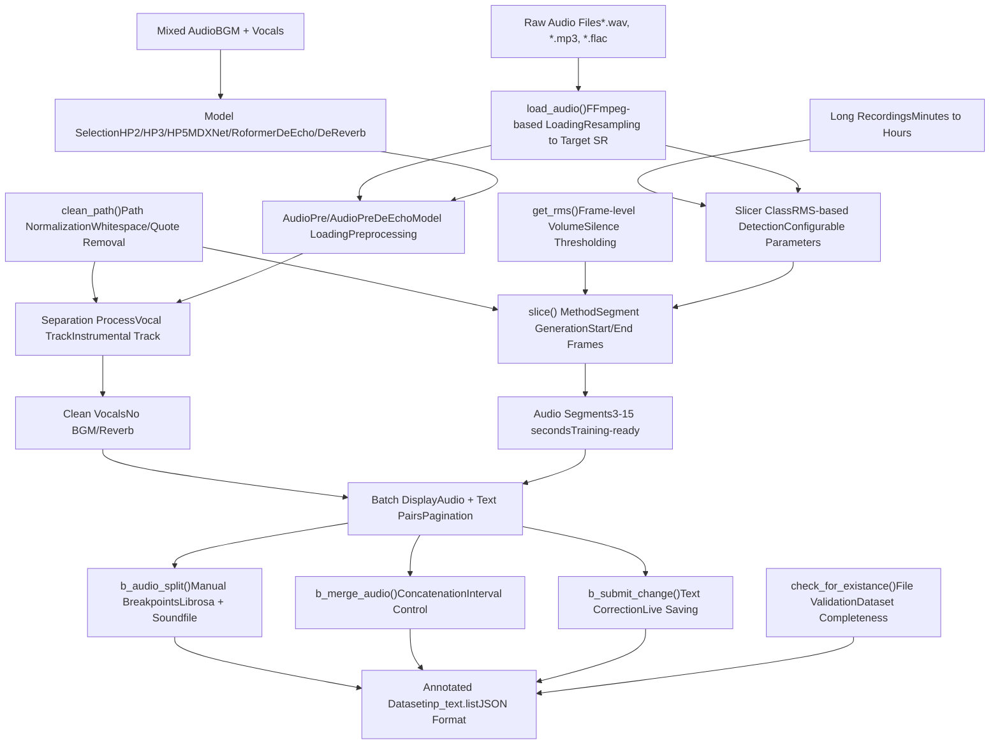
**来源：** [tools/my\_utils.py1-232](https://github.com/RVC-Boss/GPT-SoVITS/blob/c767f0b8/tools/my_utils.py#L1-L232) [tools/uvr5/webui.py1-225](https://github.com/RVC-Boss/GPT-SoVITS/blob/c767f0b8/tools/uvr5/webui.py#L1-L225) [tools/slicer2.py1-231](https://github.com/RVC-Boss/GPT-SoVITS/blob/c767f0b8/tools/slicer2.py#L1-L231) [tools/subfix\_webui.py1-426](https://github.com/RVC-Boss/GPT-SoVITS/blob/c767f0b8/tools/subfix_webui.py#L1-L426)

---

## 核心音频加载和路径工具 (Core Audio Loading and Path Utilities)

### my\_utils.py 模块

`my_utils` 模块提供了在整个代码库中用于音频文件操作和路径处理的基本函数。

#### load\_audio() 函数

`load_audio()` 函数是主要的音频加载接口，使用 FFmpeg 处理各种音频格式并自动重采样 (Resampling)。

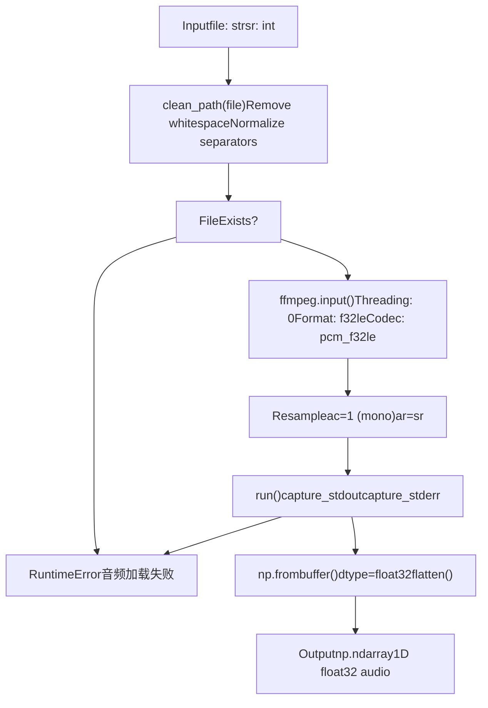
**关键实现细节：**

-   **文件路径清洗**：[tools/my\_utils.py21](https://github.com/RVC-Boss/GPT-SoVITS/blob/c767f0b8/tools/my_utils.py#L21-L21) 在处理前调用 `clean_path()`
-   **FFmpeg 参数**：[tools/my\_utils.py25-26](https://github.com/RVC-Boss/GPT-SoVITS/blob/c767f0b8/tools/my_utils.py#L25-L26)
    -   `format="f32le"`：32 位小端 (Little-endian) 浮点输出
    -   `acodec="pcm_f32le"`：PCM 浮点编码
    -   `ac=1`：转换为单声道
    -   `ar=sr`：重采样到目标采样率 (Sample Rate)
-   **错误处理**：[tools/my\_utils.py29-35](https://github.com/RVC-Boss/GPT-SoVITS/blob/c767f0b8/tools/my_utils.py#L29-L35) 提供友好的错误消息
-   **输出格式**：返回展平的 numpy float32 数组

**来源：** [tools/my\_utils.py16-37](https://github.com/RVC-Boss/GPT-SoVITS/blob/c767f0b8/tools/my_utils.py#L16-L37)

#### clean\_path() 函数

`clean_path()` 函数规范化文件路径，以防止常见的用户输入错误。

| 操作 | 描述 | 行引用 |
| --- | --- | --- |
| 末尾斜杠移除 | 递归移除路径末尾的 `\` 或 `/` | [tools/my\_utils.py41-42](https://github.com/RVC-Boss/GPT-SoVITS/blob/c767f0b8/tools/my_utils.py#L41-L42) |
| 分隔符规范化 | 将 `/` 和 `\` 替换为操作系统特定的分隔符 | [tools/my\_utils.py43](https://github.com/RVC-Boss/GPT-SoVITS/blob/c767f0b8/tools/my_utils.py#L43-L43) |
| 空白字符修整 | 移除前导/尾随空格、引号、换行符 | [tools/my\_utils.py44-46](https://github.com/RVC-Boss/GPT-SoVITS/blob/c767f0b8/tools/my_utils.py#L44-L46) |
| Unicode 控制字符 | 剥离 `\u202a` (从左至右嵌入) | [tools/my\_utils.py45](https://github.com/RVC-Boss/GPT-SoVITS/blob/c767f0b8/tools/my_utils.py#L45-L45) |

**转换示例：**

-   `' "C:/path/to/file.wav"\n '` → `C:\path\to\file.wav` (Windows)
-   `"/home/user/audio.mp3 "` → `/home/user/audio.mp3` (Linux)

**来源：** [tools/my\_utils.py40-46](https://github.com/RVC-Boss/GPT-SoVITS/blob/c767f0b8/tools/my_utils.py#L40-L46)

#### 文件验证函数 (File Validation Functions)

该模块通过 `check_for_existance()` 和 `check_details()` 提供数据集验证。

**check\_for\_existance()** 验证训练数据的完整性：

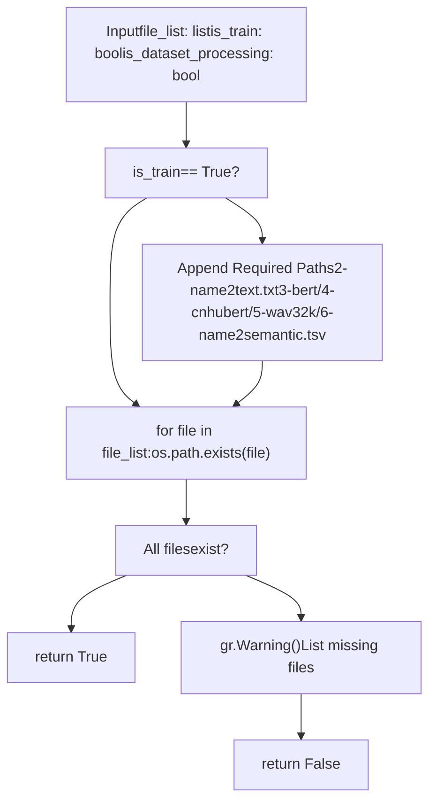
**训练数据集要求** [tools/my\_utils.py52-56](https://github.com/RVC-Boss/GPT-SoVITS/blob/c767f0b8/tools/my_utils.py#L52-L56)：

1.  `2-name2text.txt` - 音素序列 (Phoneme sequences)
2.  `3-bert/` - BERT 特征目录
3.  `4-cnhubert/` - CNHubert 特征目录
4.  `5-wav32k/` - 重采样音频 (Resampled audio) 目录
5.  `6-name2semantic.tsv` - 语义令牌 (Semantic tokens) 文件

**check\_details()** 验证数据集格式正确性：

-   **List 文件格式**：[tools/my\_utils.py93-95](https://github.com/RVC-Boss/GPT-SoVITS/blob/c767f0b8/tools/my_utils.py#L93-L95) 检查 `.list` 扩展名
-   **音频路径验证**：[tools/my\_utils.py96-99](https://github.com/RVC-Boss/GPT-SoVITS/blob/c767f0b8/tools/my_utils.py#L96-L99) 验证目录是否存在
-   **路径解析**：[tools/my\_utils.py102-108](https://github.com/RVC-Boss/GPT-SoVITS/blob/c767f0b8/tools/my_utils.py#L102-L108) 处理绝对/相对路径
-   **训练数据检查**：[tools/my\_utils.py114-137](https://github.com/RVC-Boss/GPT-SoVITS/blob/c767f0b8/tools/my_utils.py#L114-L137) 验证非空数据集

**来源：** [tools/my\_utils.py49-138](https://github.com/RVC-Boss/GPT-SoVITS/blob/c767f0b8/tools/my_utils.py#L49-L138)

#### CUDA 库加载

该模块包含在不同平台上加载 CUDA 库的实用程序，以避免运行时错误。

**load\_cudnn()** [tools/my\_utils.py140-185](https://github.com/RVC-Boss/GPT-SoVITS/blob/c767f0b8/tools/my_utils.py#L140-L185)：

-   **Windows**：从 torch lib 目录加载 `cudnn_cnn*.dll`
-   **Linux**：从 nvidia/cudnn/lib 加载 `libcudnn_cnn*.so*`
-   使用 `ctypes.CDLL()` 进行显式库加载
-   在 Windows 上将 DLL 目录添加到系统路径

**load\_nvrtc()** [tools/my\_utils.py187-231](https://github.com/RVC-Boss/GPT-SoVITS/blob/c767f0b8/tools/my_utils.py#L187-L231)：

-   **Windows**：加载用于 CUDA 运行时编译的 `nvrtc*.dll`
-   **Linux**：从 nvidia/cuda\_nvrtc/lib 加载 `libnvrtc*.so*`
-   某些 torch 操作中的即时编译 (JIT compilation) 需要此库

**来源：** [tools/my\_utils.py140-231](https://github.com/RVC-Boss/GPT-SoVITS/blob/c767f0b8/tools/my_utils.py#L140-L231)

---

## 音频切割系统 (Audio Slicing System)

音频切割系统根据静音检测将长录音分割成适合训练的片段。

### Slicer 类架构

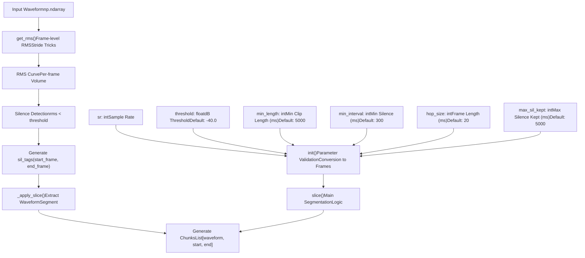
**来源：** [tools/slicer2.py38-153](https://github.com/RVC-Boss/GPT-SoVITS/blob/c767f0b8/tools/slicer2.py#L38-L153)

### 参数验证与转换 (Parameter Validation and Conversion)

`Slicer.__init__()` 方法验证参数并将毫秒转换为帧数。

**约束条件** [tools/slicer2.py48-51](https://github.com/RVC-Boss/GPT-SoVITS/blob/c767f0b8/tools/slicer2.py#L48-L51)：

```
min_length >= min_interval >= hop_sizemax_sil_kept >= hop_size
```
**转换** [tools/slicer2.py52-58](https://github.com/RVC-Boss/GPT-SoVITS/blob/c767f0b8/tools/slicer2.py#L52-L58)：

| 参数 | 输入 (ms) | 输出 (帧数) | 计算方式 |
| --- | --- | --- | --- |
| `threshold` | dB 值 | 线性振幅 | `10 ** (threshold / 20.0)` |
| `hop_size` | 毫秒 | 样本数 | `round(sr * hop_size / 1000)` |
| `win_size` | \- | 样本数 | `min(min_interval, 4 * hop_size)` |
| `min_length` | 毫秒 | 帧数 | `round(sr * min_length / 1000 / hop_size)` |
| `min_interval` | 毫秒 | 帧数 | `round(min_interval / hop_size)` |
| `max_sil_kept` | 毫秒 | 帧数 | `round(sr * max_sil_kept / 1000 / hop_size)` |

**来源：** [tools/slicer2.py39-58](https://github.com/RVC-Boss/GPT-SoVITS/blob/c767f0b8/tools/slicer2.py#L39-L58)

### RMS 计算

`get_rms()` 函数使用 NumPy 跨步技巧 (Stride tricks) 计算均方根 (RMS) 值，以提高效率。

**算法** [tools/slicer2.py5-35](https://github.com/RVC-Boss/GPT-SoVITS/blob/c767f0b8/tools/slicer2.py#L5-L35)：

1.  **填充 (Padding)**：在每侧添加 `frame_length // 2` 个样本
2.  **跨步视图 (Strided View)**：创建重叠帧而不复制数据
3.  **帧提取**：应用 `hop_length` 下采样
4.  **功率计算**：每帧 `mean(abs(x)^2)`
5.  **RMS**：`sqrt(power)`

这与 librosa 中用于帧级特征提取的方法相同。

**来源：** [tools/slicer2.py5-35](https://github.com/RVC-Boss/GPT-SoVITS/blob/c767f0b8/tools/slicer2.py#L5-L35)

### 切割逻辑 (Slice Logic)

`slice()` 方法实现了核心分段算法。

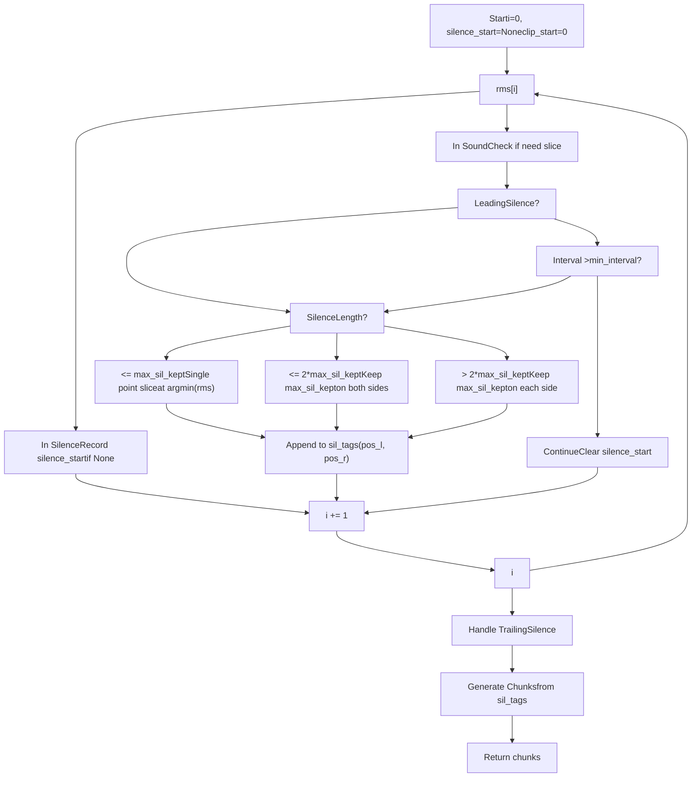
**关键逻辑点：**

1.  **前导静音** [tools/slicer2.py89](https://github.com/RVC-Boss/GPT-SoVITS/blob/c767f0b8/tools/slicer2.py#L89-L89)：`silence_start == 0 and i > max_sil_kept`
2.  **中间切割** [tools/slicer2.py90](https://github.com/RVC-Boss/GPT-SoVITS/blob/c767f0b8/tools/slicer2.py#L90-L90)：`i - silence_start >= min_interval and i - clip_start >= min_length`
3.  **静音位置** [tools/slicer2.py95-120](https://github.com/RVC-Boss/GPT-SoVITS/blob/c767f0b8/tools/slicer2.py#L95-L120)：基于静音长度的三种情况
    -   **短静音**：找到单个最小值点
    -   **中等静音**：在最小值周围保留 `max_sil_kept` 帧
    -   **长静音**：在左右边缘各保留 `max_sil_kept` 帧
4.  **尾随静音** [tools/slicer2.py122-127](https://github.com/RVC-Boss/GPT-SoVITS/blob/c767f0b8/tools/slicer2.py#L122-L127)：处理音频末尾的静音

**输出格式** [tools/slicer2.py129-152](https://github.com/RVC-Boss/GPT-SoVITS/blob/c767f0b8/tools/slicer2.py#L129-L152)：

```
[[waveform_segment, start_sample, end_sample], ...]
```
**来源：** [tools/slicer2.py67-152](https://github.com/RVC-Boss/GPT-SoVITS/blob/c767f0b8/tools/slicer2.py#L67-L152)

### slice\_audio.py 脚本

`slice_audio.py` 脚本为 Slicer 类提供命令行界面，并具有额外的归一化 (Normalization) 功能。

**使用模式** [tools/slice\_audio.py13-50](https://github.com/RVC-Boss/GPT-SoVITS/blob/c767f0b8/tools/slice_audio.py#L13-L50)：

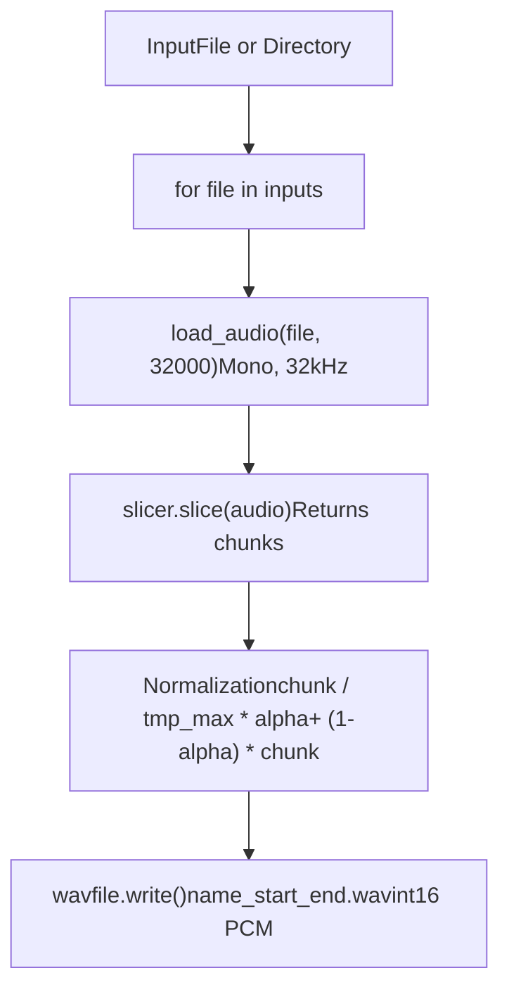
**归一化策略** [tools/slice\_audio.py38-41](https://github.com/RVC-Boss/GPT-SoVITS/blob/c767f0b8/tools/slice_audio.py#L38-L41)：

-   找到片段中的最大绝对值：`tmp_max = np.abs(chunk).max()`
-   如果 `tmp_max > 1`，则归一化到 \[-1, 1\]
-   应用响度调整：`(chunk / tmp_max * (_max * alpha)) + (1 - alpha) * chunk`
    -   `_max`：目标最大振幅 (Amplitude)
    -   `alpha`：归一化与原始数据之间的混合因子

**输出命名** [tools/slice\_audio.py42-47](https://github.com/RVC-Boss/GPT-SoVITS/blob/c767f0b8/tools/slice_audio.py#L42-L47)：

-   格式：`{original_name}_{start_frame:010d}_{end_frame:010d}.wav`
-   采样率：32000 Hz
-   编码：16 位有符号整数 PCM

**来源：** [tools/slice\_audio.py13-50](https://github.com/RVC-Boss/GPT-SoVITS/blob/c767f0b8/tools/slice_audio.py#L13-L50)

---

## UVR5 人声分离 (Vocal Separation)

UVR5 (Ultimate Vocal Remover 5) 提供基于神经网络的人声分离，用于清洗训练数据。

### 模型类型与选择

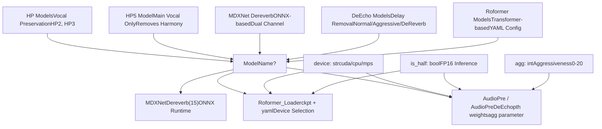
**模型选择逻辑** [tools/uvr5/webui.py51-74](https://github.com/RVC-Boss/GPT-SoVITS/blob/c767f0b8/tools/uvr5/webui.py#L51-L74)：

| 条件 | 模型类型 | 类 | 参数 |
| --- | --- | --- | --- |
| `"onnx_dereverb_By_FoxJoy"` | MDXNet | `MDXNetDereverb` | `chunk_size=15` |
| `"roformer" in name.lower()` | Roformer | `Roformer_Loader` | `model_path`, `config_path`, `device`, `is_half` |
| `"DeEcho" in name` | DeEcho | `AudioPreDeEcho` | `agg`, `model_path`, `device`, `is_half` |
| 默认 | VR 模型 | `AudioPre` | `agg`, `model_path`, `device`, `is_half` |

**来源：** [tools/uvr5/webui.py45-74](https://github.com/RVC-Boss/GPT-SoVITS/blob/c767f0b8/tools/uvr5/webui.py#L45-L74)

### 处理流水线 (Processing Pipeline)

UVR5 处理流水线支持批量音频分离 (Batch Audio Separation) 及格式转换。

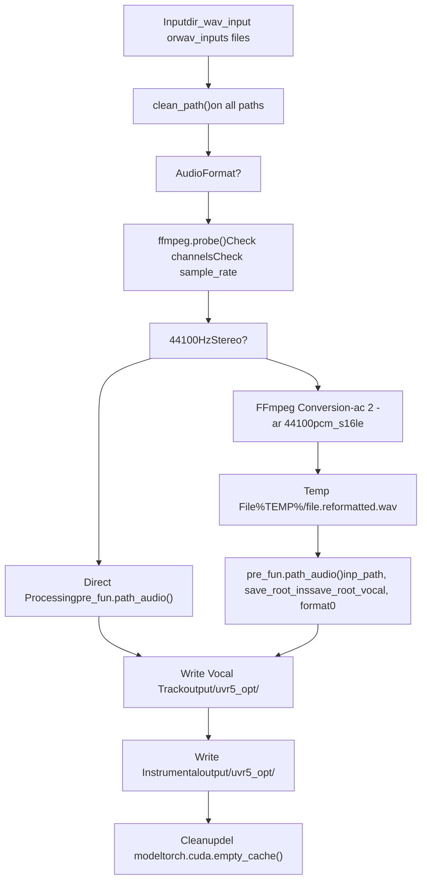
**格式要求** [tools/uvr5/webui.py86-88](https://github.com/RVC-Boss/GPT-SoVITS/blob/c767f0b8/tools/uvr5/webui.py#L86-L88)：

-   **采样率**：44100 Hz
-   **通道数**：2 (立体声)
-   如果不匹配则自动转换

**重新格式化命令** [tools/uvr5/webui.py99](https://github.com/RVC-Boss/GPT-SoVITS/blob/c767f0b8/tools/uvr5/webui.py#L99-L99)：

```
ffmpeg -i "{input}" -vn -acodec pcm_s16le -ac 2 -ar 44100 "{output}" -y
```
**HP3 模式检测** [tools/uvr5/webui.py51](https://github.com/RVC-Boss/GPT-SoVITS/blob/c767f0b8/tools/uvr5/webui.py#L51-L51)：

-   当 `model_name` 中包含 `"HP3"` 时进行特殊处理
-   作为 `is_hp3` 参数传递给 `_path_audio_()`

**内存清理** [tools/uvr5/webui.py113-124](https://github.com/RVC-Boss/GPT-SoVITS/blob/c767f0b8/tools/uvr5/webui.py#L113-L124)：

-   根据类型删除模型对象
-   使用 `torch.cuda.empty_cache()` 清理 CUDA 缓存
-   ONNX 模型与 PyTorch 模型的清理方式不同

**来源：** [tools/uvr5/webui.py45-125](https://github.com/RVC-Boss/GPT-SoVITS/blob/c767f0b8/tools/uvr5/webui.py#L45-L125)

### WebUI 界面

UVR5 WebUI 提供了一个用于批量人声分离的 Gradio 界面。

**界面组件** [tools/uvr5/webui.py171-217](https://github.com/RVC-Boss/GPT-SoVITS/blob/c767f0b8/tools/uvr5/webui.py#L171-L217)：

| 组件 | 类型 | 用途 | 默认值 |
| --- | --- | --- | --- |
| `model_choose` | 下拉菜单 | 选择分离模型 | \- |
| `dir_wav_input` | 文本框 | 输入文件夹路径 | \- |
| `wav_inputs` | 文件 | 多文件上传 | \- |
| `agg` | 滑块 | 激进程度 (0-20) | 10 |
| `opt_vocal_root` | 文本框 | 人声输出文件夹 | `"output/uvr5_opt"` |
| `opt_ins_root` | 文本框 | 伴奏输出文件夹 | `"output/uvr5_opt"` |
| `format0` | 单选框 | 输出格式 | `"flac"` |

**可用格式** [tools/uvr5/webui.py193-198](https://github.com/RVC-Boss/GPT-SoVITS/blob/c767f0b8/tools/uvr5/webui.py#L193-L198)：

-   `wav` - 未压缩
-   `flac` - 无损压缩 (Lossless compression)
-   `mp3` - 有损压缩
-   `m4a` - AAC 压缩

**启动配置** [tools/uvr5/webui.py27-30](https://github.com/RVC-Boss/GPT-SoVITS/blob/c767f0b8/tools/uvr5/webui.py#L27-L30)：

```
device = sys.argv[1]           # cuda/cpu/mpsis_half = eval(sys.argv[2])    # True/Falsewebui_port_uvr5 = int(sys.argv[3])  # Port numberis_share = eval(sys.argv[4])   # Gradio sharing
```
**来源：** [tools/uvr5/webui.py128-224](https://github.com/RVC-Boss/GPT-SoVITS/blob/c767f0b8/tools/uvr5/webui.py#L128-L224)

---

## 音频标注工具 (Audio Annotation Tool)

`subfix_webui.py` 提供了一个交互式界面，用于通过音频编辑功能进行数据集整理。

### 数据格式支持

标注工具支持两种文件格式：

**JSON 格式** [tools/subfix\_webui.py238-243](https://github.com/RVC-Boss/GPT-SoVITS/blob/c767f0b8/tools/subfix_webui.py#L238-L243)：

```
{"text": "transcription", "wav_path": "/path/to/audio.wav"}{"text": "another line", "wav_path": "/path/to/audio2.wav"}
```
-   每一行是一个单独的 JSON 对象
-   可通过 `--json_key_text` 和 `--json_key_path` 配置键名

**List 格式** [tools/subfix\_webui.py246-259](https://github.com/RVC-Boss/GPT-SoVITS/blob/c767f0b8/tools/subfix_webui.py#L246-L259)：

```
wav_path|speaker_name|language|text
/path/audio.wav|Speaker1|ZH|转录文本
```
-   竖线分隔值 (Pipe-separated values) (需要 4 个字段)
-   由 GPT-SoVITS 训练流水线使用

**来源：** [tools/subfix\_webui.py222-273](https://github.com/RVC-Boss/GPT-SoVITS/blob/c767f0b8/tools/subfix_webui.py#L222-L273)

### 批量显示与导航

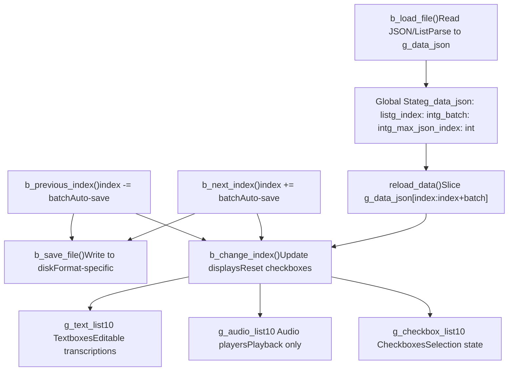
**批量参数** [tools/subfix\_webui.py29-35](https://github.com/RVC-Boss/GPT-SoVITS/blob/c767f0b8/tools/subfix_webui.py#L29-L35)：

-   `g_batch`：每页显示的条目数 (默认：10)
-   `g_index`：当前起始索引
-   `g_max_json_index`：条目总数 - 1

**导航逻辑** [tools/subfix\_webui.py80-93](https://github.com/RVC-Boss/GPT-SoVITS/blob/c767f0b8/tools/subfix_webui.py#L80-L93)：

-   **下一页**：如果未到末尾，则增加 `batch`
-   **上一页**：如果未到开头，则减少 `batch`
-   **自动保存**：两个函数在导航前都会调用 `b_save_file()`

**来源：** [tools/subfix\_webui.py24-93](https://github.com/RVC-Boss/GPT-SoVITS/blob/c767f0b8/tools/subfix_webui.py#L24-L93)

### 音频编辑操作 (Audio Editing Operations)

#### 音频分割

`b_audio_split()` 函数在指定的时间点分割单个音频文件。

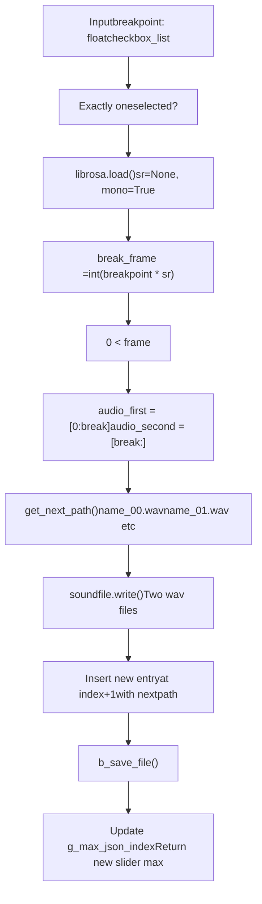
**路径生成** [tools/subfix\_webui.py139-146](https://github.com/RVC-Boss/GPT-SoVITS/blob/c767f0b8/tools/subfix_webui.py#L139-L146)：

-   尝试从 `{base_name}_00.wav` 到 `{base_name}_99.wav`
-   如果所有编号插槽都被占用，则回退到 UUID
-   保留原始文件扩展名

**音频处理** [tools/subfix\_webui.py159-168](https://github.com/RVC-Boss/GPT-SoVITS/blob/c767f0b8/tools/subfix_webui.py#L159-L168)：

-   使用 `librosa.load()` 读取
-   使用 `soundfile.write()` 写入
-   保留原始采样率
-   使用第一段覆盖原始文件

**来源：** [tools/subfix\_webui.py149-175](https://github.com/RVC-Boss/GPT-SoVITS/blob/c767f0b8/tools/subfix_webui.py#L149-L175)

#### 音频合并

`b_merge_audio()` 函数将多个选定的音频文件连接起来，并可选择静音间隔。

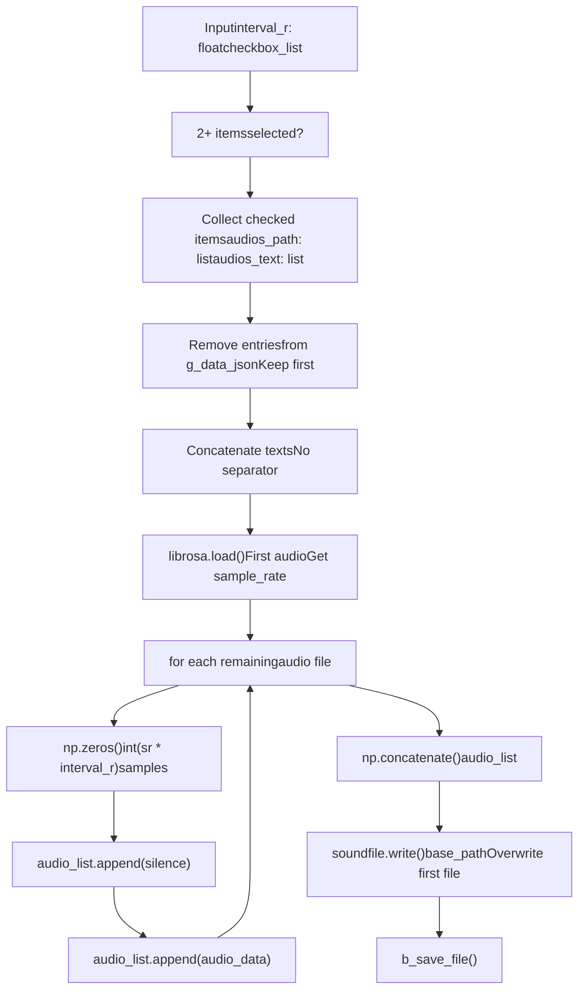
**关键特性** [tools/subfix\_webui.py178-214](https://github.com/RVC-Boss/GPT-SoVITS/blob/c767f0b8/tools/subfix_webui.py#L178-L214)：

1.  **文本连接**：[tools/subfix\_webui.py197](https://github.com/RVC-Boss/GPT-SoVITS/blob/c767f0b8/tools/subfix_webui.py#L197-L197) - 直接连接字符串，无分隔符
2.  **静音插入**：[tools/subfix\_webui.py205-206](https://github.com/RVC-Boss/GPT-SoVITS/blob/c767f0b8/tools/subfix_webui.py#L205-L206) - 在分段之间（不在第一个之前）
3.  **采样率一致性**：[tools/subfix\_webui.py202](https://github.com/RVC-Boss/GPT-SoVITS/blob/c767f0b8/tools/subfix_webui.py#L202-L202) - 所有文件使用第一个文件的采样率
4.  **文件清理**：[tools/subfix\_webui.py192-193](https://github.com/RVC-Boss/GPT-SoVITS/blob/c767f0b8/tools/subfix_webui.py#L192-L193) - 从数据集中移除合并的条目
5.  **基础文件更新**：[tools/subfix\_webui.py212](https://github.com/RVC-Boss/GPT-SoVITS/blob/c767f0b8/tools/subfix_webui.py#L212-L212) - 覆盖第一个选定的文件

**来源：** [tools/subfix\_webui.py178-219](https://github.com/RVC-Boss/GPT-SoVITS/blob/c767f0b8/tools/subfix_webui.py#L178-L219)

### 文本编辑与管理

#### 文本提交 (Text Submission)

`b_submit_change()` 函数将编辑后的文本保存回数据集。

**处理逻辑** [tools/subfix\_webui.py96-107](https://github.com/RVC-Boss/GPT-SoVITS/blob/c767f0b8/tools/subfix_webui.py#L96-L107)：

1.  遍历所有文本输入
2.  修整空白并添加尾随空格
3.  与 `g_data_json` 中存储的值进行比较
4.  如果有更改，更新并设置 `change = True`
5.  如果有任何更改，调用 `b_save_file()`
6.  重新加载当前页面

**文本规范化** [tools/subfix\_webui.py101](https://github.com/RVC-Boss/GPT-SoVITS/blob/c767f0b8/tools/subfix_webui.py#L101-L101)：

```
new_text = new_text.strip() + " "
```
-   移除前导/尾随空白字符
-   确保尾随空格以保持一致性

**来源：** [tools/subfix\_webui.py96-107](https://github.com/RVC-Boss/GPT-SoVITS/blob/c767f0b8/tools/subfix_webui.py#L96-L107)

#### 选择操作

**删除音频** [tools/subfix\_webui.py110-131](https://github.com/RVC-Boss/GPT-SoVITS/blob/c767f0b8/tools/subfix_webui.py#L110-L131)：

-   反向遍历复选框
-   从 `g_data_json` 中移除已选条目
-   更新 `g_max_json_index`
-   根据需要调整 `g_index` 以保持在范围内
-   立即保存更改

**反选** [tools/subfix\_webui.py134-136](https://github.com/RVC-Boss/GPT-SoVITS/blob/c767f0b8/tools/subfix_webui.py#L134-L136)：

```
[not item if item is True else True for item in checkbox_list]
```
-   简单的列表推导式
-   切换所有复选框状态

**来源：** [tools/subfix\_webui.py110-136](https://github.com/RVC-Boss/GPT-SoVITS/blob/c767f0b8/tools/subfix_webui.py#L110-L136)

### 命令行界面

标注工具接受多个命令行参数进行配置。

**参数表** [tools/subfix\_webui.py298-305](https://github.com/RVC-Boss/GPT-SoVITS/blob/c767f0b8/tools/subfix_webui.py#L298-L305)：

| 参数 | 默认值 | 描述 |
| --- | --- | --- |
| `--load_json` | `"None"` | JSON 文件路径 (每行一个对象) |
| `--load_list` | `"None"` | List 文件路径 (竖线分隔) |
| `--is_share` | `"False"` | 启用 Gradio 共享 |
| `--webui_port_subfix` | `9871` | Web 界面端口 |
| `--json_key_text` | `"text"` | 文本字段的 JSON 键名 |
| `--json_key_path` | `"wav_path"` | 音频路径的 JSON 键名 |
| `--g_batch` | `10` | 每页条目数 |

**格式优先级** [tools/subfix\_webui.py281-289](https://github.com/RVC-Boss/GPT-SoVITS/blob/c767f0b8/tools/subfix_webui.py#L281-L289)：

1.  如果 `load_json != "None"`：使用 JSON 格式
2.  否则，如果 `load_list != "None"`：使用 List 格式
3.  否则：默认为 `"demo.list"`

**来源：** [tools/subfix\_webui.py297-309](https://github.com/RVC-Boss/GPT-SoVITS/blob/c767f0b8/tools/subfix_webui.py#L297-L309)

---

## 与训练流水线的集成 (Integration with Training Pipeline)

这些音频处理实用程序集成在更广泛的 GPT-SoVITS 训练工作流程中。

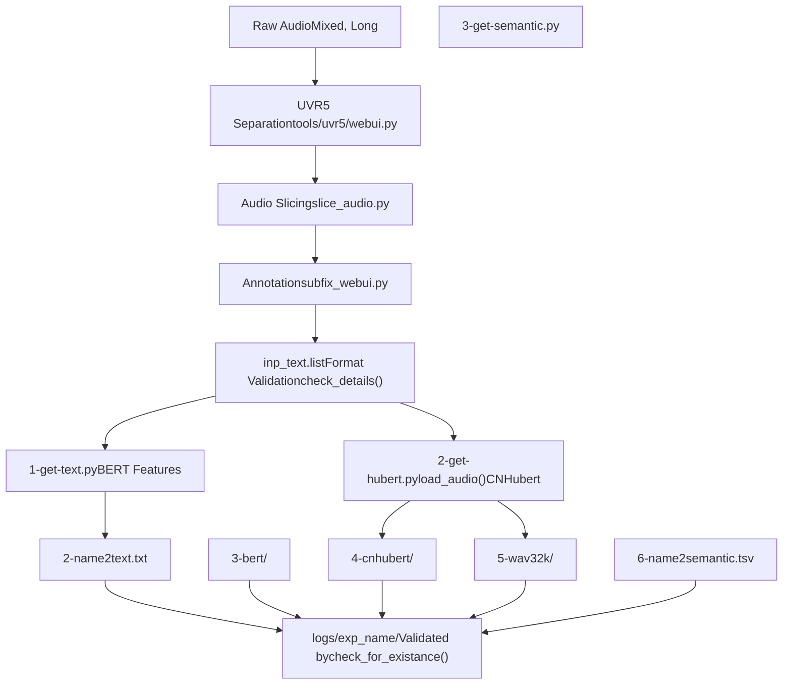
**关键集成点：**

1.  **路径清洗**：`clean_path()` 被广泛用于 WebUI 和脚本中
2.  **音频加载**：`load_audio()` 为特征提取规范化输入数据
3.  **验证**：`check_for_existance()` 和 `check_details()` 在训练前验证数据集的完整性
4.  **格式兼容性**：来自 `subfix_webui.py` 的 List 格式直接由训练脚本使用

**来源：** [tools/my\_utils.py1-232](https://github.com/RVC-Boss/GPT-SoVITS/blob/c767f0b8/tools/my_utils.py#L1-L232) [tools/slice\_audio.py1-53](https://github.com/RVC-Boss/GPT-SoVITS/blob/c767f0b8/tools/slice_audio.py#L1-L53) [tools/subfix\_webui.py1-426](https://github.com/RVC-Boss/GPT-SoVITS/blob/c767f0b8/tools/subfix_webui.py#L1-L426)

---

## 使用示例 (Usage Examples)

### 示例 1：批量人声分离

```
# 从命令行启动 UVR5 WebUIpython tools/uvr5/webui.py cuda True 9873 False# 参数：device, is_half, port, is_share
```
**WebUI 工作流程：**

1.  选择模型（例如，"HP3\_all\_vocals"）
2.  输入文件夹：`C:/raw_audio/`
3.  人声输出文件夹：`output/uvr5_opt/vocals/`
4.  伴奏输出文件夹：`output/uvr5_opt/inst/`
5.  格式：FLAC
6.  点击 "转换" (Convert)

### 示例 2：通过脚本进行音频切割

```
python tools/slice_audio.py \  "C:/raw_audio/" \  "output/sliced/" \  -40 \  5000 \  300 \  20 \  5000 \  0.9 \  0.25 \  0 \  1# 参数：inp, opt_root, threshold, min_length, min_interval, #       hop_size, max_sil_kept, _max, alpha, i_part, all_part
```
**参数说明：**

-   `threshold=-40`：静音阈值低于 -40 dB
-   `min_length=5000`：每段片段最少 5 秒
-   `min_interval=300`：分割所需的最少 300 毫秒静音
-   `hop_size=20`：20 毫秒帧分析
-   `max_sil_kept=5000`：最多保留 5 秒静音
-   `_max=0.9`：目标最大振幅
-   `alpha=0.25`：25% 归一化混合

### 示例 3：数据集标注

```
python tools/subfix_webui.py \  --load_list "output/preprocessed.list" \  --webui_port_subfix 9871 \  --g_batch 15 \  --is_share False
```
**WebUI 操作：**

1.  浏览页面（每页 15 个条目）
2.  在文本框中直接编辑转录文本
3.  使用复选框选择音频
4.  在特定时间分割：调整滑块，点击 "音频切割" (Split Audio)
5.  合并多个：选择条目，设置间隔，点击 "音频合并" (Merge Audio)
6.  保存更改：在导航前点击 "提交文本" (Submit Text)
7.  删除错误：选择条目，点击 "删除音频" (Delete Audio)

**来源：** [tools/slice\_audio.py53](https://github.com/RVC-Boss/GPT-SoVITS/blob/c767f0b8/tools/slice_audio.py#L53-L53) [tools/subfix\_webui.py419-425](https://github.com/RVC-Boss/GPT-SoVITS/blob/c767f0b8/tools/subfix_webui.py#L419-L425) [tools/uvr5/webui.py27-30](https://github.com/RVC-Boss/GPT-SoVITS/blob/c767f0b8/tools/uvr5/webui.py#L27-L30)

---

## 性能考虑 (Performance Considerations)

### 音频加载效率

`load_audio()` 函数使用 FFmpeg 进行高效的格式转换：

-   **禁用多线程**：`threads=0` 以避免干扰 PyTorch
-   **流式输出**：直接捕获 stdout，无需中间文件
-   **单次转换**：合并解码、重采样和声道混合

### 内存管理

**UVR5 内存清理** [tools/uvr5/webui.py113-124](https://github.com/RVC-Boss/GPT-SoVITS/blob/c767f0b8/tools/uvr5/webui.py#L113-L124)：

```
try:    if model_name == "onnx_dereverb_By_FoxJoy":        del pre_fun.pred.model        del pre_fun.pred.model_    else:        del pre_fun.model        del pre_funexcept:    traceback.print_exc()if torch.cuda.is_available():    torch.cuda.empty_cache()
```
**切割器效率**：

-   使用 NumPy 跨步技巧 (Stride tricks) [tools/slicer2.py16-21](https://github.com/RVC-Boss/GPT-SoVITS/blob/c767f0b8/tools/slicer2.py#L16-L21) 避免复制大型数组
-   单次处理 RMS
-   返回原始波形的引用而非副本

### 并行处理

**slice\_audio.py** 支持数据集分区 [tools/slice\_audio.py31](https://github.com/RVC-Boss/GPT-SoVITS/blob/c767f0b8/tools/slice_audio.py#L31-L31)：

```
for inp_path in input[int(i_part)::int(all_part)]:
```
-   `i_part`：当前进程索引（从 0 开始）
-   `all_part`：总进程数
-   示例：4 个进程 → `i_part=0,1,2,3` 且 `all_part=4`

**来源：** [tools/my\_utils.py16-37](https://github.com/RVC-Boss/GPT-SoVITS/blob/c767f0b8/tools/my_utils.py#L16-S37) [tools/uvr5/webui.py113-124](https://github.com/RVC-Boss/GPT-SoVITS/blob/c767f0b8/tools/uvr5/webui.py#L113-L124) [tools/slicer2.py5-35](https://github.com/RVC-Boss/GPT-SoVITS/blob/c767f0b8/tools/slicer2.py#L5-L35) [tools/slice\_audio.py31](https://github.com/RVC-Boss/GPT-SoVITS/blob/c767f0b8/tools/slice_audio.py#L31-L31)

---

## 错误处理 (Error Handling)

### 路径验证错误

`clean_path()` 函数可防止常见错误：

-   **带引号的路径**：剥离单引号/双引号
-   **空白字符**：移除前导/尾随空格
-   **Unicode 控制**：移除不可见字符，如 `\u202a`
-   **分隔符**：规范化为操作系统特定的分隔符

### 音频加载错误

**错误消息** [tools/my\_utils.py22-35](https://github.com/RVC-Boss/GPT-SoVITS/blob/c767f0b8/tools/my_utils.py#L22-L35)：

-   文件未找到：`"You input a wrong audio path that does not exists, please fix it!"`
-   FFmpeg 失败：`"音频加载失败"`
-   包含用于调试的完整异常回溯

### 数据集验证

**check\_details()** 提供特定警告 [tools/my\_utils.py90-137](https://github.com/RVC-Boss/GPT-SoVITS/blob/c767f0b8/tools/my_utils.py#L90-L137)：

-   `"请填入正确的List路径"`：无效的 list 文件扩展名
-   `"请填入正确的音频文件夹路径"`：音频文件夹不存在
-   `"路径错误"`：音频文件路径无法解析
-   `"缺少音素数据集"`：音素文件为空
-   `"缺少Hubert数据集"`：Hubert 目录为空
-   `"缺少音频数据集"`：wav32k 目录为空
-   `"缺少语义数据集"`：语义 TSV 文件为空

**来源：** [tools/my\_utils.py40-137](https://github.com/RVC-Boss/GPT-SoVITS/blob/c767f0b8/tools/my_utils.py#L40-L137)

---

## 总结 (Summary)

音频处理实用程序提供了关键的预处理功能：

1.  **核心函数 (Core Functions)** (`my_utils.py`)：

    -   通过 FFmpeg 进行通用音频加载
    -   路径规范化以实现跨平台兼容性
    -   数据集验证以确保训练就绪
2.  **预处理工具 (Preprocessing Tools)**：

    -   支持多种模型类型的 UVR5 人声分离
    -   具有可配置参数的基于静音的音频切割
    -   格式转换与归一化
3.  **数据集整理 (Dataset Curation)** (`subfix_webui.py`)：

    -   交互式批量编辑界面
    -   音频分割与合并
    -   支持多种格式 (JSON/List)

这些实用程序构成了数据准备流水线的基础，确保了用于高质量语音模型训练的音频是干净且格式正确的。
