# 进程管理与 GPU 分配 (Process Management and GPU Allocation)

相关源文件

-   [api.py](https://github.com/RVC-Boss/GPT-SoVITS/blob/c767f0b8/api.py)
-   [config.py](https://github.com/RVC-Boss/GPT-SoVITS/blob/c767f0b8/config.py)
-   [webui.py](https://github.com/RVC-Boss/GPT-SoVITS/blob/c767f0b8/webui.py)

本文档描述了 GPT-SoVITS 如何为各种工具管理操作系统进程，以及如何在这些进程之间分配 GPU 资源。该系统协调多个并发 Python 子进程 (Concurrent Python subprocesses)（训练、预处理、推理），同时仔细管理 GPU 显存和计算资源 (GPU memory and compute resources)，以防止冲突并最大限度地提高硬件利用率。

有关模型加载和版本检测的信息，请参阅[版本检测与模型加载](/RVC-Boss/GPT-SoVITS/8.3-version-detection-and-model-loading)。有关触发这些进程的主 WebUI 界面的详细信息，请参阅[主 WebUI](/RVC-Boss/GPT-SoVITS/3.1-main-webui)。

---

## 硬件检测与能力评估 (Hardware Detection and Capability Assessment)

系统在启动时执行自动硬件检测 (Hardware Detection)，以确定可用的计算资源及其能力。这些信息在整个代码库中用于对精度 (Precision)、批处理大小 (Batch sizes) 和设备分配 (Device allocation) 做出智能决策。

### GPU 枚举过程 (GPU Enumeration Process)

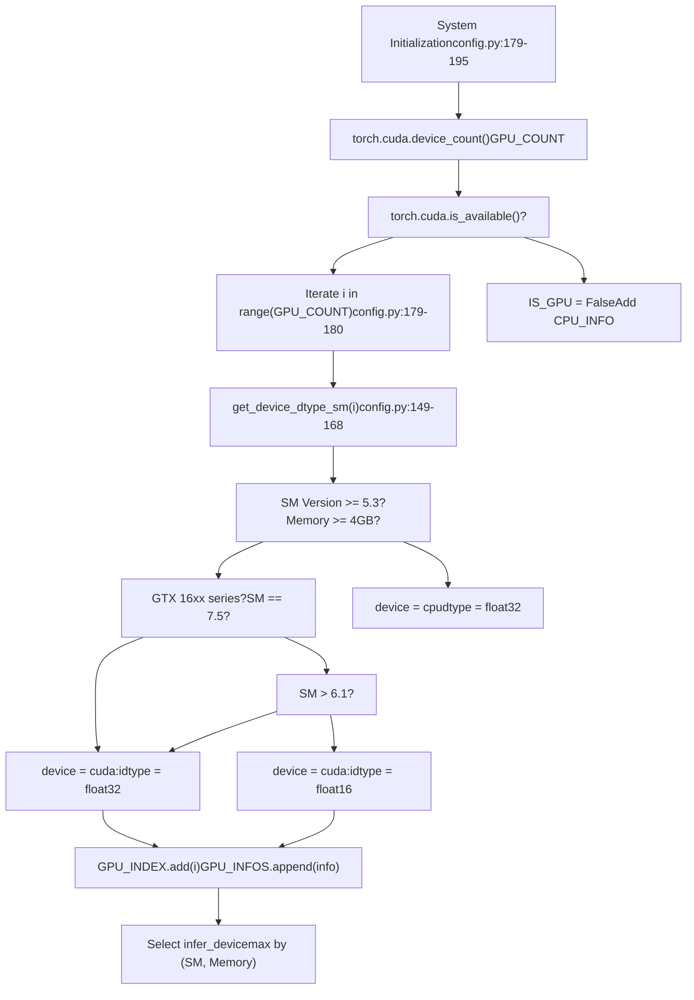
**硬件检测逻辑**

`get_device_dtype_sm` 函数根据三个标准评估每个 GPU 的适用性：

| 标准 | 阈值 | 结果 |
| --- | --- | --- |
| 显存 | < 4GB | 回退到 CPU |
| SM 版本 (SM Version) | < 5.3 | 回退到 CPU |
| SM 版本 | 6.1 或 16xx 系列 | CUDA 上的 FP32 |
| SM 版本 | \> 6.1 | CUDA 上的 FP16 |

来源： [config.py149-168](https://github.com/RVC-Boss/GPT-SoVITS/blob/c767f0b8/config.py#L149-L168) [config.py179-195](https://github.com/RVC-Boss/GPT-SoVITS/blob/c767f0b8/config.py#L179-L195)

### 设备选择策略 (Device Selection Strategy)

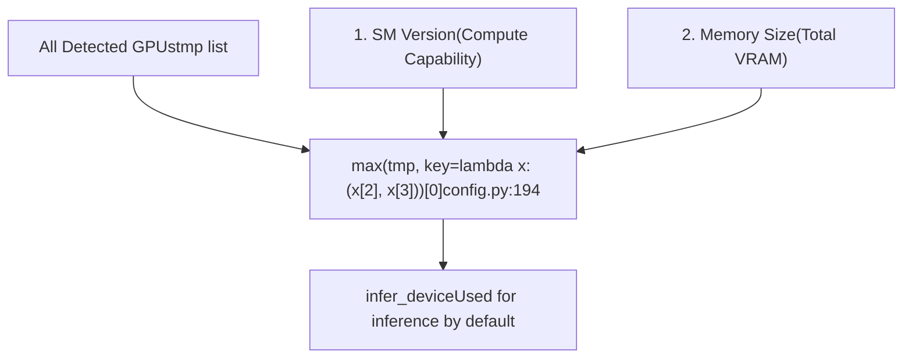
系统通过优先考虑计算能力 (Compute capability) (SM 版本) 而非显存大小，为推理选择性能最强的 GPU。这确保了在可用时优先选用带有张量核心 (Tensor cores) 的现代架构。

来源： [config.py194-195](https://github.com/RVC-Boss/GPT-SoVITS/blob/c767f0b8/config.py#L194-L195)

---

## GPU 分配架构 (GPU Allocation Architecture)

### 环境变量控制 (Environment Variable Control)

GPT-SoVITS 使用 `_CUDA_VISIBLE_DEVICES` 环境变量 (Environment Variable)（而非标准的 `CUDA_VISIBLE_DEVICES`）来控制生成的子进程的 GPU 可见性。下划线前缀可防止与用户设置的环境变量发生冲突。

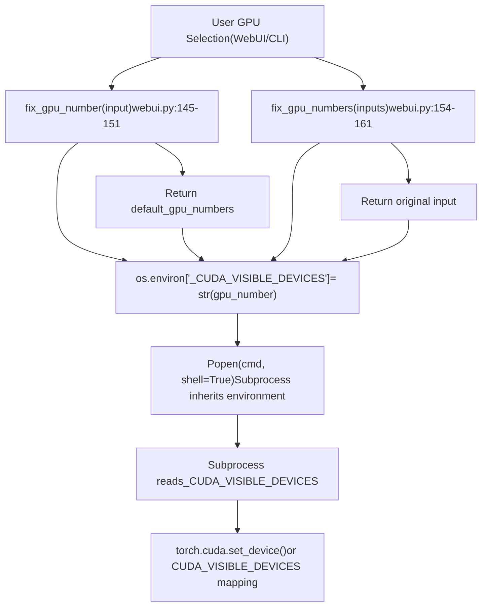
**GPU 编号验证 (GPU Number Validation)**

验证函数确保 GPU 索引在 `GPU_INDEX` 设置的有效范围内：

```
# 示例：对于一个 3-GPU 系统，GPU_INDEX = {0, 1, 2}# 输入："5" -> 输出：default_gpu_numbers (例如 0)# 输入："0,1,5" -> 输出："0,1,0" (5 被限制为默认值)
```
来源： [webui.py145-161](https://github.com/RVC-Boss/GPT-SoVITS/blob/c767f0b8/webui.py#L145-L161)

### 多 GPU 分配策略 (Multi-GPU Allocation Strategy)

对于数据预处理 (Data Preprocessing) 任务，系统支持使用连字符分隔格式 (Hyphen-separated format) 将工作拆分到多个 GPU 上：

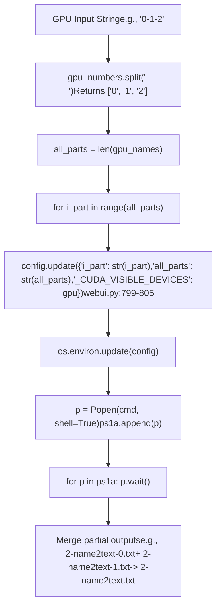
**并行处理模式 (Parallel Processing Pattern)**

每个生成的进程都会接收到：

-   `i_part`：当前分区索引 (Partition index)（从 0 开始）
-   `all_parts`：总分区数
-   `_CUDA_VISIBLE_DEVICES`：分配的 GPU 索引

子进程脚本根据这些参数划分工作负载 (Workload)：

```
# 在子进程中（例如 1-get-text.py）i_part = int(os.environ['i_part'])all_parts = int(os.environ['all_parts'])# 处理满足以下条件的条目：idx % all_parts == i_part
```
来源： [webui.py796-811](https://github.com/RVC-Boss/GPT-SoVITS/blob/c767f0b8/webui.py#L796-L811) [webui.py889-901](https://github.com/RVC-Boss/GPT-SoVITS/blob/c767f0b8/webui.py#L889-L901) [webui.py983-995](https://github.com/RVC-Boss/GPT-SoVITS/blob/c767f0b8/webui.py#L983-L995)

---

## 进程管理架构 (Process Management Architecture)

### 全局进程注册表 (Global Process Registry)

WebUI 维护全局变量来跟踪活动的子进程：

| 变量 | 类型 | 用途 | 单例 (Singleton) |
| --- | --- | --- | --- |
| `p_label` | `Popen` | 标注 WebUI 子进程 | 是 |
| `p_uvr5` | `Popen` | UVR5 人声分离 WebUI | 是 |
| `p_asr` | `Popen` | ASR 转录子进程 | 是 |
| `p_denoise` | `Popen` | 去噪子进程 | 是 |
| `p_tts_inference` | `Popen` | 推理 WebUI 子进程 | 是 |
| `p_train_SoVITS` | `Popen` | SoVITS 训练子进程 | 是 |
| `p_train_GPT` | `Popen` | GPT 训练子进程 | 是 |
| `ps_slice` | `list[Popen]` | 音频切割子进程 | 否（多进程） |
| `ps1a` | `list[Popen]` | BERT/文本特征提取 | 否（多 GPU） |
| `ps1b` | `list[Popen]` | Hubert 特征提取 | 否（多 GPU） |
| `ps1c` | `list[Popen]` | 语义令牌提取 | 否（多 GPU） |
| `ps1abc` | `list[Popen]` | 一键准备流水线 | 否（多阶段） |

来源： [webui.py204-208](https://github.com/RVC-Boss/GPT-SoVITS/blob/c767f0b8/webui.py#L204-L208) [webui.py485-486](https://github.com/RVC-Boss/GPT-SoVITS/blob/c767f0b8/webui.py#L485-L486) [webui.py586-587](https://github.com/RVC-Boss/GPT-SoVITS/blob/c767f0b8/webui.py#L586-L587) [webui.py678-679](https://github.com/RVC-Boss/GPT-SoVITS/blob/c767f0b8/webui.py#L678-L679) [webui.py776-777](https://github.com/RVC-Boss/GPT-SoVITS/blob/c767f0b8/webui.py#L776-L777) [webui.py865-867](https://github.com/RVC-Boss/GPT-SoVITS/blob/c767f0b8/webui.py#L865-L867) [webui.py956-957](https://github.com/RVC-Boss/GPT-SoVITS/blob/c767f0b8/webui.py#L956-L957) [webui.py1042-1043](https://github.com/RVC-Boss/GPT-SoVITS/blob/c767f0b8/webui.py#L1042-L1043)

### 进程生命周期状态机 (Process Lifecycle State Machine)

> **[Mermaid 状态图]**
> *(图表结构无法解析)*

来源： [webui.py270-295](https://github.com/RVC-Boss/GPT-SoVITS/blob/c767f0b8/webui.py#L270-L295) [webui.py371-414](https://github.com/RVC-Boss/GPT-SoVITS/blob/c767f0b8/webui.py#L371-L414) [webui.py780-840](https://github.com/RVC-Boss/GPT-SoVITS/blob/c767f0b8/webui.py#L780-L840)

### 进程生成模式 (Process Spawning Pattern)

所有工具的进程生成都遵循一致的模式：

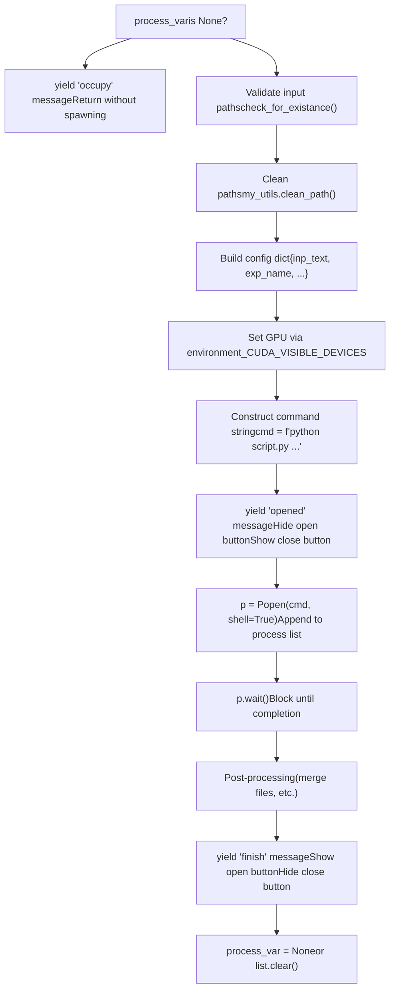
来源： [webui.py780-846](https://github.com/RVC-Boss/GPT-SoVITS/blob/c767f0b8/webui.py#L780-L846) [webui.py870-937](https://github.com/RVC-Boss/GPT-SoVITS/blob/c767f0b8/webui.py#L870-L937) [webui.py960-1023](https://github.com/RVC-Boss/GPT-SoVITS/blob/c767f0b8/webui.py#L960-L1023)

---

## 特定平台的进程终止 (Platform-Specific Process Termination)

### 跨平台终止策略 (Cross-Platform Kill Strategy)

系统根据操作系统使用不同的终止策略 (Termination strategies)：

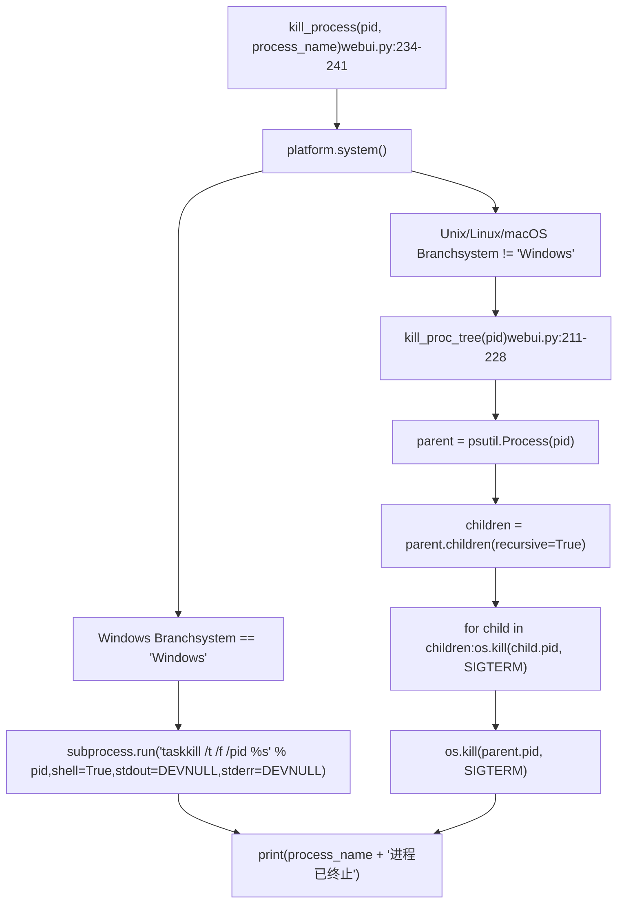
**Windows 终止**

使用带有以下标志的 `taskkill`：

-   `/t`：终止进程树 (Process tree)（包括子进程）
-   `/f`：强制终止
-   `/pid`：目标进程 ID

**Unix 终止**

使用 `psutil` 递归寻找子进程，然后发送 `SIGTERM` 信号。这种方法更细粒度，但需要 `psutil` 库来实现可靠的进程树遍历。

来源： [webui.py211-241](https://github.com/RVC-Boss/GPT-SoVITS/blob/c767f0b8/webui.py#L211-L241)

---

## 训练进程管理 (Training Process Management)

### SoVITS 训练配置

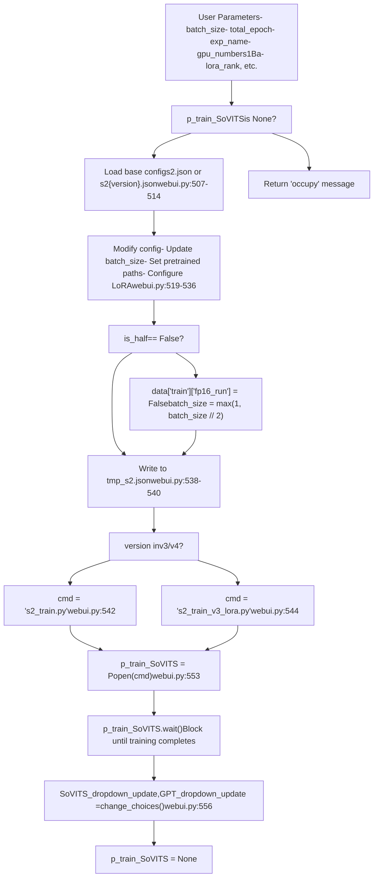
**配置修改**

训练前修改的关键参数：

1.  `batch_size`：如果在 FP32 模式下则减半
2.  `gpu_numbers`：通过配置字典设置，而非环境变量（DDP 在内部处理）
3.  `pretrained_s2G/s2D`：从预训练权重初始化
4.  `lora_rank`：仅用于 v3/v4 LoRA 训练 (LoRA training)
5.  `grad_ckpt`：用于提高内存效率的梯度检查点 (Gradient checkpointing)

来源： [webui.py489-583](https://github.com/RVC-Boss/GPT-SoVITS/blob/c767f0b8/webui.py#L489-L583)

### GPT 训练配置

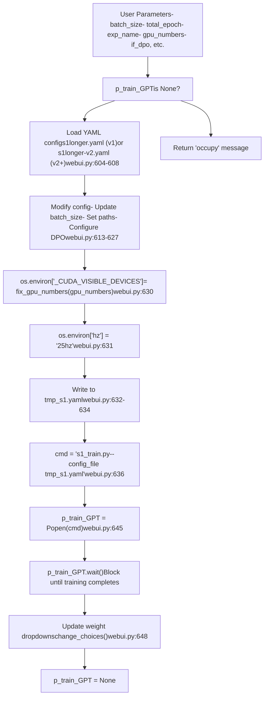
**GPT 特定的环境设置**

与 SoVITS 训练不同，GPT 训练：

1.  使用环境变量 `_CUDA_VISIBLE_DEVICES` 进行 GPU 选择（在训练脚本内部转换）
2.  通过 `os.environ['hz']` 设置语义令牌速率
3.  依靠 PyTorch Lightning 的 DDP (分布式数据并行) 进行多 GPU 协调

来源： [webui.py590-675](https://github.com/RVC-Boss/GPT-SoVITS/blob/c767f0b8/webui.py#L590-L675)

---

## 数据准备流水线管理 (Data Preparation Pipeline Management)

### 一键准备流水线 (One-Click Pipeline) (1Aabc)

一键准备流水线协调了三个顺序阶段，每个阶段都具有多 GPU 并行处理能力：

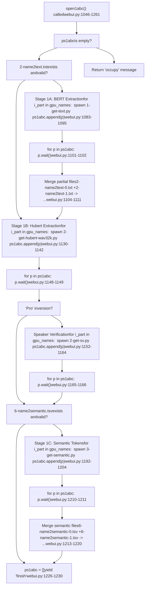
**流水线特性**

1.  **跳过逻辑**：在运行每个阶段之前检查现有的输出文件
2.  **顺序阶段**：必须按 1A → 1B → (如果是 v2Pro 则执行 1B-SV) → 1C 的顺序运行
3.  **阶段内并行**：每个阶段会生成多个 GPU 进程
4.  **进度更新**：产生 UI 更新，如 "1A-Doing", "1A-Done, 1B-Doing"
5.  **错误恢复**：try-catch 封装器在失败时调用 `close1abc()`

来源： [webui.py1046-1261](https://github.com/RVC-Boss/GPT-SoVITS/blob/c767f0b8/webui.py#L1046-L1261)

### 文件合并策略 (File Merging Strategy)

在并行处理完成后，部分结果将被合并：

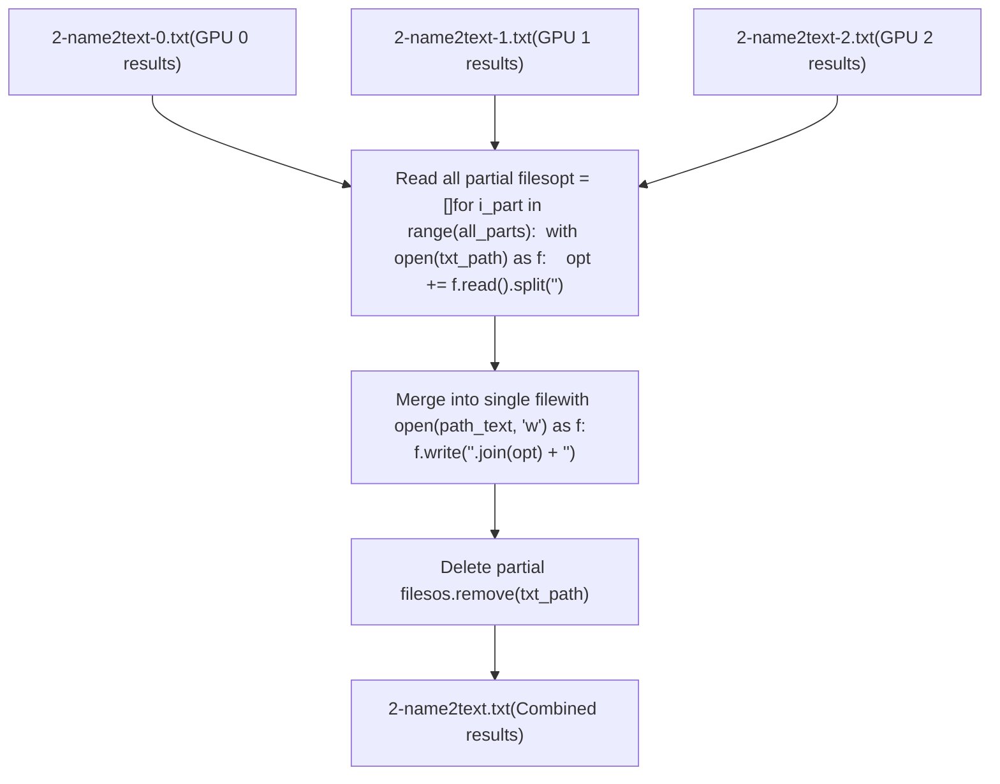
该模式用于：

-   文本特征： [webui.py819-827](https://github.com/RVC-Boss/GPT-SoVITS/blob/c767f0b8/webui.py#L819-L827)
-   语义令牌： [webui.py1003-1011](https://github.com/RVC-Boss/GPT-SoVITS/blob/c767f0b8/webui.py#L1003-L1011) [webui.py1213-1220](https://github.com/RVC-Boss/GPT-SoVITS/blob/c767f0b8/webui.py#L1213-L1220)

来源： [webui.py819-827](https://github.com/RVC-Boss/GPT-SoVITS/blob/c767f0b8/webui.py#L819-L827) [webui.py1003-1011](https://github.com/RVC-Boss/GPT-SoVITS/blob/c767f0b8/webui.py#L1003-L1011) [webui.py1213-1220](https://github.com/RVC-Boss/GPT-SoVITS/blob/c767f0b8/webui.py#L1213-L1220)

---

## 子进程工具启动 (Subprocess Tool Launching)

### WebUI 子进程管理

某些工具在单独的进程中启动它们自己的 Gradio WebUI：

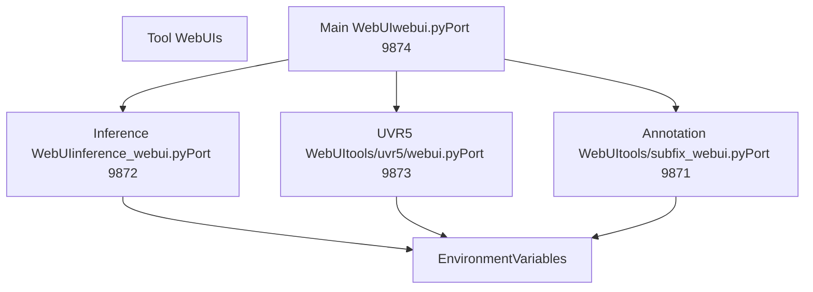
**生成推理 WebUI**

```
# webui.py:331-363def change_tts_inference(...):    if p_tts_inference is None:        os.environ["gpt_path"] = gpt_path        os.environ["sovits_path"] = sovits_path        os.environ["cnhubert_base_path"] = cnhubert_base_path        os.environ["bert_path"] = bert_path        os.environ["_CUDA_VISIBLE_DEVICES"] = str(fix_gpu_number(gpu_number))        os.environ["is_half"] = str(is_half)        os.environ["infer_ttswebui"] = str(webui_port_infer_tts)        os.environ["is_share"] = str(is_share)                cmd = f'"{python_exec}" -s GPT_SoVITS/inference_webui.py "{language}"'        p_tts_inference = Popen(cmd, shell=True)
```
生成的进程读取这些环境变量来配置自身，而不需要命令行参数。

来源： [webui.py331-363](https://github.com/RVC-Boss/GPT-SoVITS/blob/c767f0b8/webui.py#L331-L363) [webui.py270-295](https://github.com/RVC-Boss/GPT-SoVITS/blob/c767f0b8/webui.py#L270-L295) [webui.py301-325](https://github.com/RVC-Boss/GPT-SoVITS/blob/c767f0b8/webui.py#L301-L325)

---

## 资源清理与显存管理 (Resource Cleanup and Memory Management)

### API 中的 CUDA 显存清理

API 服务器为消耗大量 GPU 显存的模型提供了显式的清理函数：

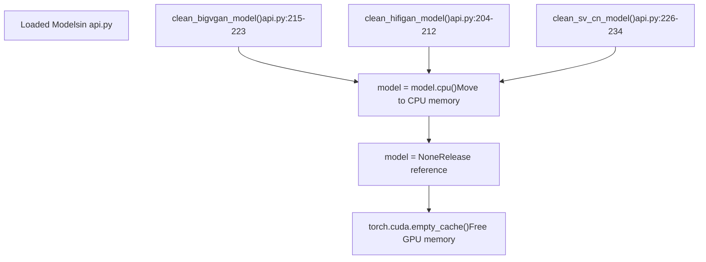
**清理模式**

所有清理函数都遵循相同的模式：

1.  将模型移动到 CPU (如果存在)
2.  将全局变量设置为 `None`
3.  调用 `torch.cuda.empty_cache()` 来释放缓存的显存

这一点非常重要，因为：

-   BigVGAN 和 HiFiGAN 是约 200MB 的声码器模型
-   人声验证模型约为 100MB
-   在模型切换期间可能会加载多个版本

来源： [api.py204-234](https://github.com/RVC-Boss/GPT-SoVITS/blob/c767f0b8/api.py#L204-L234)

### 延迟初始化策略 (Lazy Initialization Strategy)

模型仅在需要时进行初始化：

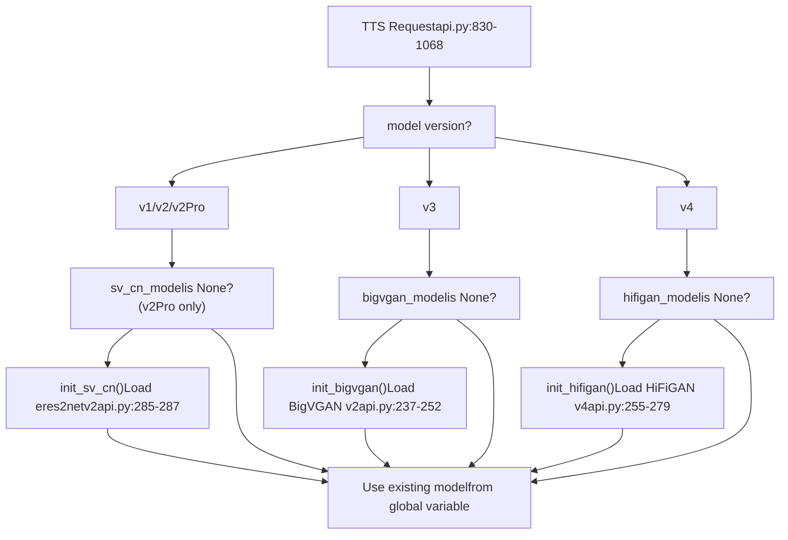
这确保了：

-   仅将所需的模型加载到显存 (VRAM) 中
-   不同版本之间的模型切换是高效的
-   最大限度地减少内存占用 (Memory footprint)

来源： [api.py854-862](https://github.com/RVC-Boss/GPT-SoVITS/blob/c767f0b8/api.py#L854-L862) [api.py1016-1021](https://github.com/RVC-Boss/GPT-SoVITS/blob/c767f0b8/api.py#L1016-L1021) [api.py890-893](https://github.com/RVC-Boss/GPT-SoVITS/blob/c767f0b8/api.py#L890-L893)

---

## 批处理大小与精度调整 (Batch Size and Precision Adjustment)

### 自动批处理大小计算

系统根据可用的 GPU 显存计算默认批处理大小：

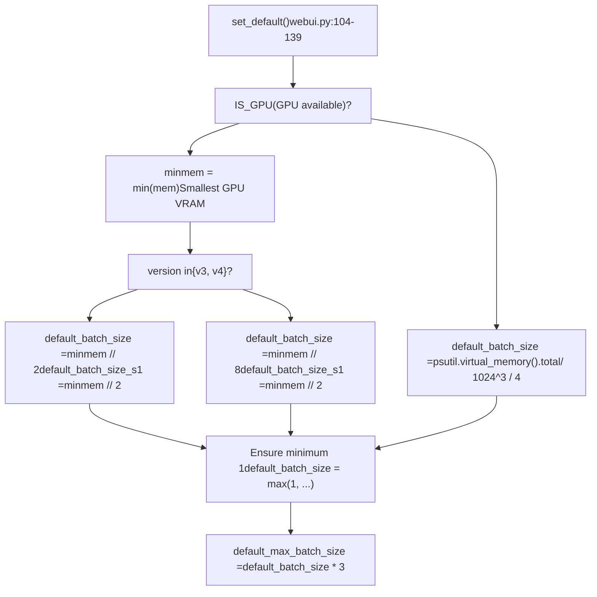
**批处理大小公式**

| 条件 | SoVITS 批处理大小 | GPT 批处理大小 | 原因 |
| --- | --- | --- | --- |
| GPU, v1/v2 | VRAM ÷ 2 | VRAM ÷ 2 | 标准显存使用 |
| GPU, v3/v4 | VRAM ÷ 8 | VRAM ÷ 2 | CFM 需要更多显存 |
| CPU | RAM ÷ 4 | RAM ÷ 4 | CPU 训练的保守估计 |

该公式使用以 GB 为单位的 GPU 显存作为除数输入（例如，8GB GPU → v1/v2 的 `batch_size` = 4）。

来源： [webui.py104-139](https://github.com/RVC-Boss/GPT-SoVITS/blob/c767f0b8/webui.py#L104-L139)

### FP32 的精度回退 (Precision Fallback for FP32)

当 `is_half=False` 时，系统会自动调整设置：

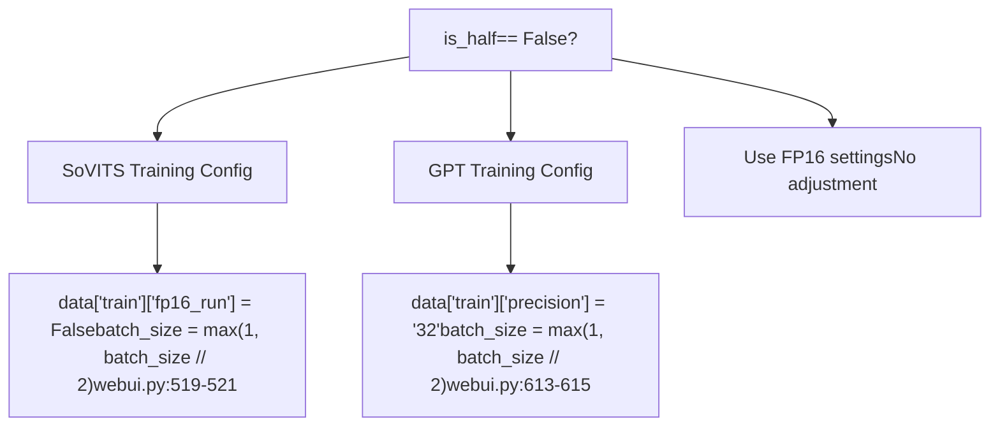
FP32 模式下每个参数使用的显存是 FP16 的 2 倍，因此批处理大小减半以维持类似的显存使用量。

来源： [webui.py519-521](https://github.com/RVC-Boss/GPT-SoVITS/blob/c767f0b8/webui.py#L519-L521) [webui.py613-615](https://github.com/RVC-Boss/GPT-SoVITS/blob/c767f0b8/webui.py#L613-L615)

---

## 训练配置文件管理 (Training Configuration File Management)

### 临时配置模式 (Temporary Configuration Pattern)

训练过程使用临时配置文件以避免冲突：

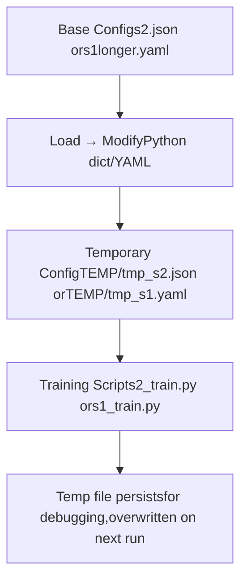
**配置流程**

1.  从 `GPT_SoVITS/configs/` 加载基础配置
2.  根据用户输入修改参数
3.  写入 `TEMP/tmp_s2.json` 或 `TEMP/tmp_s1.yaml`
4.  将临时文件路径传递给训练脚本
5.  临时文件保留以供检查，但在下次运行期间会被覆盖

来源： [webui.py538-540](https://github.com/RVC-Boss/GPT-SoVITS/blob/c767f0b8/webui.py#L538-L540) [webui.py632-634](https://github.com/RVC-Boss/GPT-SoVITS/blob/c767f0b8/webui.py#L632-L634)

### 多 GPU 训练配置 (Multi-GPU Training Configuration)

**SoVITS 多 GPU (s2\_train.py)**

GPU 分配通过配置文件处理，而非环境变量：

```
# webui.py:530data["train"]["gpu_numbers"] = gpu_numbers1Ba  # 例如 "0,1,2" # 在 s2_train.py 内部（未在提供的文件中显示）# 读取 config["train"]["gpu_numbers"]# 使用 torch.nn.DataParallel 或 DistributedDataParallel
```
**GPT 多 GPU (s1\_train.py)**

使用环境变量来实现 PyTorch Lightning DDP：

```
# webui.py:630os.environ["_CUDA_VISIBLE_DEVICES"] = str(fix_gpu_numbers(gpu_numbers.replace("-", ","))) # 在 s1_train.py 内部（未在提供的文件中显示）# PyTorch Lightning trainer 读取 CUDA_VISIBLE_DEVICES# 在可见的 GPU 上自动设置 DDP
```
来源： [webui.py530](https://github.com/RVC-Boss/GPT-SoVITS/blob/c767f0b8/webui.py#L530-L530) [webui.py630](https://github.com/RVC-Boss/GPT-SoVITS/blob/c767f0b8/webui.py#L630-L630)

---

## 进程监控与 UI 集成 (Process Monitoring and UI Integration)

### 通过 Yield 进行 Gradio UI 更新

进程管理函数使用 Python 生成器 (Generator) 提供实时的 UI 更新：

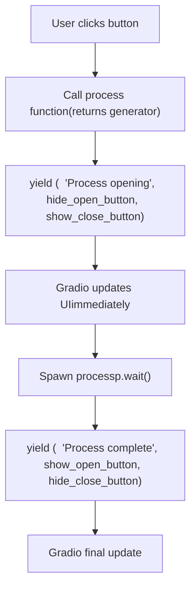
**Yield 模式**

所有进程管理函数都遵循此模式：

```
def open_process(...):    if process_var is None:        # 初始 yield：将 UI 更新为 "运行中" 状态        yield (            process_info(name, "opened"),            {"__type__": "update", "visible": False},  # 隐藏打开按钮            {"__type__": "update", "visible": True},   # 显示关闭按钮        )                # 执行实际工作        p = Popen(cmd, shell=True)        p.wait()                # 最终 yield：将 UI 更新为 "完成" 状态        yield (            process_info(name, "finish"),            {"__type__": "update", "visible": True},   # 显示打开按钮            {"__type__": "update", "visible": False},  # 隐藏关闭按钮        )
```
来源： [webui.py280-295](https://github.com/RVC-Boss/GPT-SoVITS/blob/c767f0b8/webui.py#L280-L295) [webui.py386-405](https://github.com/RVC-Boss/GPT-SoVITS/blob/c767f0b8/webui.py#L386-L405) [webui.py812-840](https://github.com/RVC-Boss/GPT-SoVITS/blob/c767f0b8/webui.py#L812-L840)

### 进程状态消息 (Process State Messages)

`process_info()` 函数提供了国际化的状态消息：

| 指示器 | 英文含义 | 使用场景 |
| --- | --- | --- |
| `"opened"` | "Process opened" | 进程启动 |
| `"closed"` | "Process closed" | 进程被终止 |
| `"running"` | "Process running" | 进程进行中 |
| `"finish"` | "Process finished" | 进程成功完成 |
| `"failed"` | "Process failed" | 进程遇到错误 |
| `"occupy"` | "Process occupied, must terminate before starting next" | 正在运行时尝试启动 |

来源： [webui.py244-264](https://github.com/RVC-Boss/GPT-SoVITS/blob/c767f0b8/webui.py#L244-L264)

---

## 总结 (Summary)

GPT-SoVITS 的进程管理系统提供了：

1.  **稳健的硬件检测**：具有能力评估的自动 GPU 枚举
2.  **灵活的 GPU 分配**：支持单 GPU、多 GPU 和多进程场景
3.  **安全的进程生命周期**：通过空值检查防止并发执行
4.  **平台可移植性**：跨平台进程终止（Windows/Unix）
5.  **显存优化**：自动批处理大小计算和精度回退
6.  **用户友好的 UI**：通过生成器模式实现实时状态更新
7.  **资源清理**：针对 GPU 模型的显式内存管理

该架构平衡了简单性（全局进程变量）和功能性（多 GPU 并行处理），以提供可靠的训练和推理环境。

来源： [webui.py1-1261](https://github.com/RVC-Boss/GPT-SoVITS/blob/c767f0b8/webui.py#L1-L1261) [config.py148-196](https://github.com/RVC-Boss/GPT-SoVITS/blob/c767f0b8/config.py#L148-L196) [api.py204-287](https://github.com/RVC-Boss/GPT-SoVITS/blob/c767f0b8/api.py#L204-L287)
