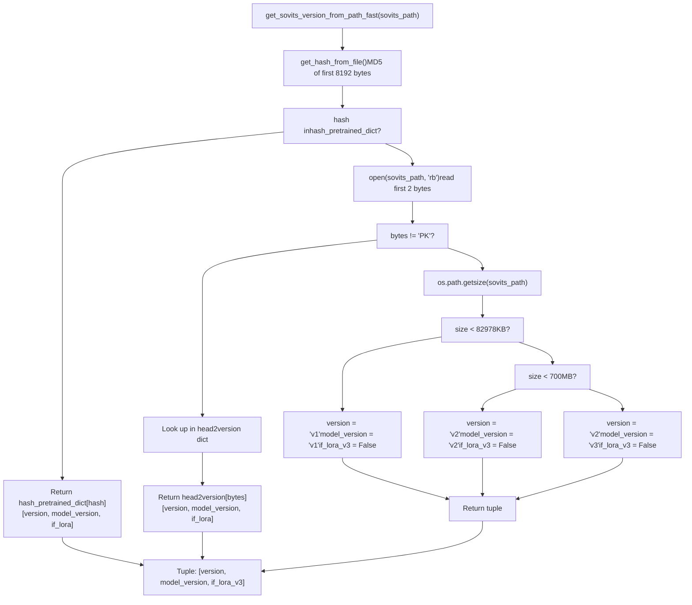
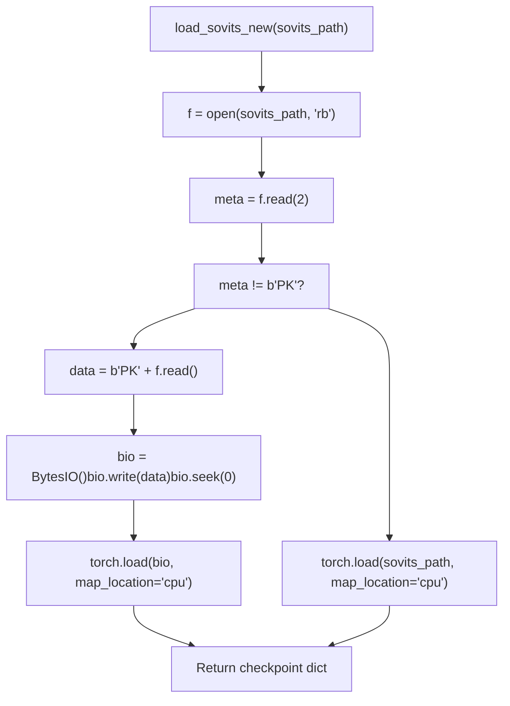
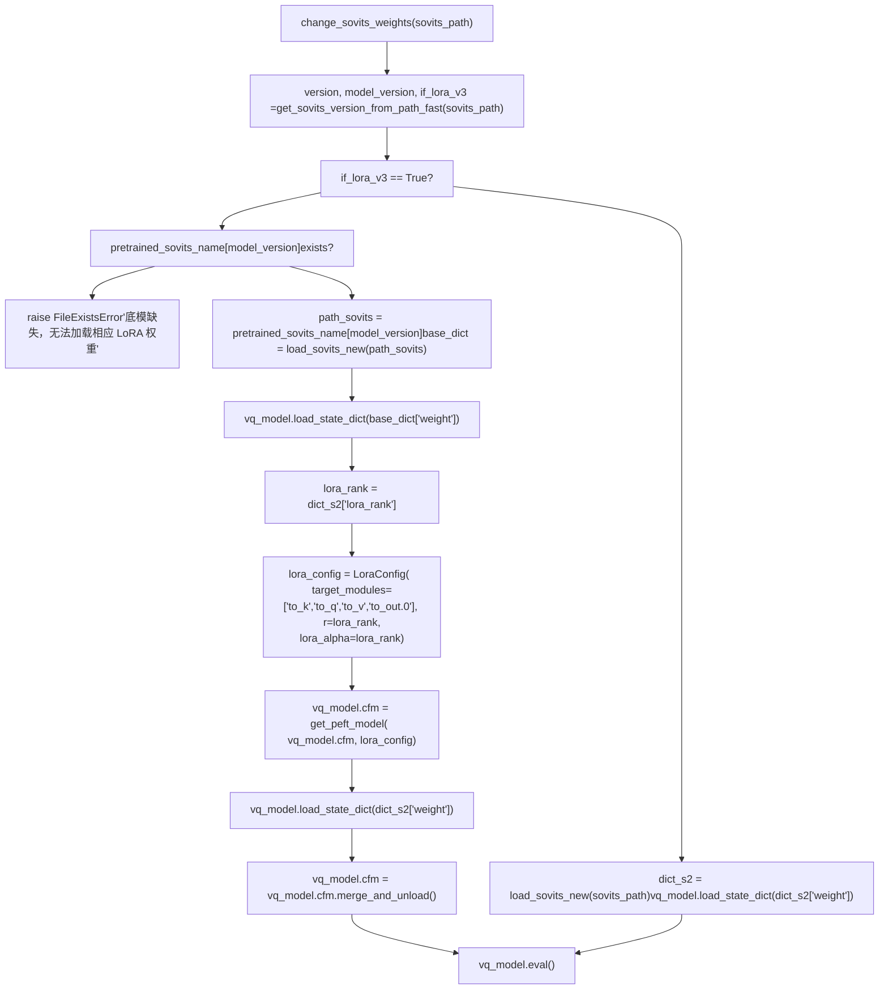
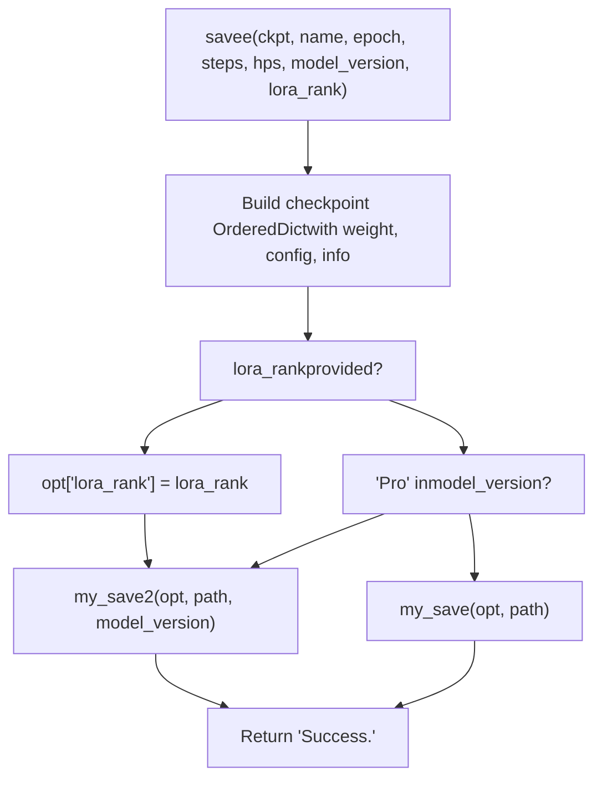
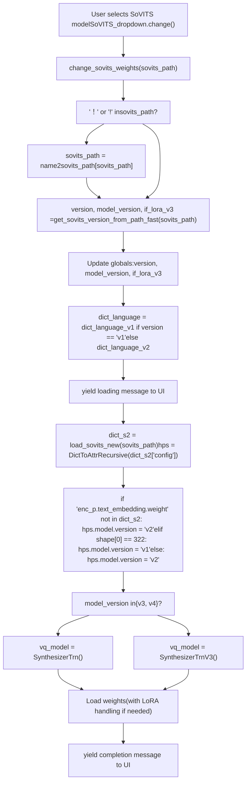
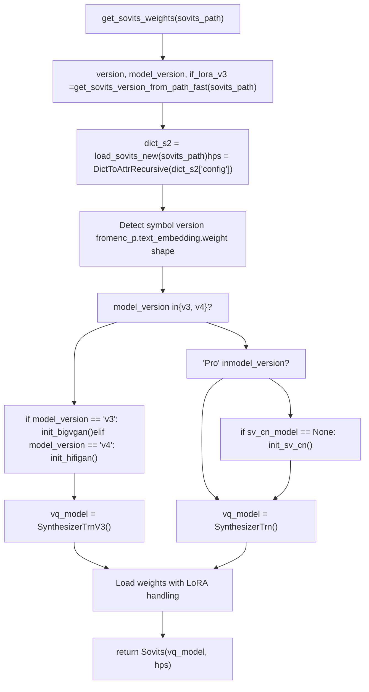

# 版本检测与模型加载 (Version Detection and Model Loading)

相关源文件

-   [GPT\_SoVITS/inference\_webui.py](https://github.com/RVC-Boss/GPT-SoVITS/blob/c767f0b8/GPT_SoVITS/inference_webui.py)
-   [GPT\_SoVITS/inference\_webui\_fast.py](https://github.com/RVC-Boss/GPT-SoVITS/blob/c767f0b8/GPT_SoVITS/inference_webui_fast.py)
-   [GPT\_SoVITS/process\_ckpt.py](https://github.com/RVC-Boss/GPT-SoVITS/blob/c767f0b8/GPT_SoVITS/process_ckpt.py)
-   [api.py](https://github.com/RVC-Boss/GPT-SoVITS/blob/c767f0b8/api.py)
-   [config.py](https://github.com/RVC-Boss/GPT-SoVITS/blob/c767f0b8/config.py)
-   [tools/assets.py](https://github.com/RVC-Boss/GPT-SoVITS/blob/c767f0b8/tools/assets.py)
-   [webui.py](https://github.com/RVC-Boss/GPT-SoVITS/blob/c767f0b8/webui.py)

## 概述 (Overview)

`process_ckpt.py` 模块为 SoVITS 模型提供了自动版本检测 (Version Detection) 和检查点 (Checkpoint) 加载功能。该系统无需将完整权重加载到内存中即可识别模型版本（v1、v2、v3、v4、v2Pro、v2ProPlus），从而实现在 WebUI 和 API 中进行高效的模型切换。

**核心函数：**

-   `get_sovits_version_from_path_fast()` - 三级版本检测（哈希 (Hash) → 头部 (Header) → 大小 (Size)）
-   `load_sovits_new()` - 具有自定义字节前缀处理的检查点加载
-   `savee()` - 具有版本编码 (Version Encoding) 的训练检查点保存
-   `my_save()` / `my_save2()` - 具有中文路径支持的文件保存

**关键集成点：**

-   [GPT\_SoVITS/inference\_webui.py229-368](https://github.com/RVC-Boss/GPT-SoVITS/blob/c767f0b8/GPT_SoVITS/inference_webui.py#L229-L368) - `change_sovits_weights()`
-   [api.py381-464](https://github.com/RVC-Boss/GPT-SoVITS/blob/c767f0b8/api.py#L381-L464) - `get_sovits_weights()`
-   [GPT\_SoVITS/inference\_webui\_fast.py233-298](https://github.com/RVC-Boss/GPT-SoVITS/blob/c767f0b8/GPT_SoVITS/inference_webui_fast.py#L233-L298) - 快速推理流水线

有关版本之间的架构差异，请参阅[模型版本与演进](/RVC-Boss/GPT-SoVITS/1.2-model-versions-and-evolution)。

**来源：** [GPT\_SoVITS/process\_ckpt.py1-139](https://github.com/RVC-Boss/GPT-SoVITS/blob/c767f0b8/GPT_SoVITS/process_ckpt.py#L1-L139)

---

## 版本检测策略 (Version Detection Strategy)

该系统采用三级检测策略，通过检查点文件识别模型版本，而无需将整个模型加载到内存中。

### 检测流程 (Detection Flow)

**get\_sovits\_version\_from\_path\_fast() 函数流程**


**来源：** [GPT\_SoVITS/process\_ckpt.py100-126](https://github.com/RVC-Boss/GPT-SoVITS/blob/c767f0b8/GPT_SoVITS/process_ckpt.py#L100-L126) [GPT\_SoVITS/process\_ckpt.py92-97](https://github.com/RVC-Boss/GPT-SoVITS/blob/c767f0b8/GPT_SoVITS/process_ckpt.py#L92-L97)

### 第一级：基于哈希的检测（预训练模型） (Tier 1: Hash-Based Detection)

`hash_pretrained_dict` 字典将 MD5 哈希 (Hash)（文件的前 8192 个字节）映射到所有官方预训练模型的版本信息。

| 哈希 (MD5) | 版本 | 模型版本 | LoRA | 检查点文件 |
| --- | --- | --- | --- | --- |
| `dc3c97e17592963677a4a1681f30c653` | v2 | v2 | 否 | `s2G488k.pth` |
| `6642b37f3dbb1f76882b69937c95a5f3` | v2 | v2 | 否 | `s2G2333k.pth` |
| `43797be674a37c1c83ee81081941ed0f` | v2 | v3 | 否 | `s2Gv3.pth` |
| `4f26b9476d0c5033e04162c486074374` | v2 | v4 | 否 | `s2Gv4.pth` |
| `c7e9fce2223f3db685cdfa1e6368728a` | v2 | v2Pro | 否 | `s2Gv2Pro.pth` |
| `66b313e39455b57ab1b0bc0b239c9d0a` | v2 | v2ProPlus | 否 | `s2Gv2ProPlus.pth` |

`get_hash_from_file()` 函数对文件的前 8192 个字节使用 `hashlib.md5()` 计算 MD5 哈希。

**来源：** [GPT\_SoVITS/process\_ckpt.py81-97](https://github.com/RVC-Boss/GPT-SoVITS/blob/c767f0b8/GPT_SoVITS/process_ckpt.py#L81-L97) [GPT\_SoVITS/process\_ckpt.py100-104](https://github.com/RVC-Boss/GPT-SoVITS/blob/c767f0b8/GPT_SoVITS/process_ckpt.py#L100-L104)

### 第二级：字节头部检测（新权重） (Tier 2: Byte Header Detection)

`my_save2()` 函数将标准的 PyTorch `b"PK"` 魔术字节 (Magic bytes) 替换为自定义的 2 字节版本头部 (Header)。`head2version` 字典负责解码这些头部。

**head2version 字典：**

| 字节头部 | 符号版本 | 模型版本 | LoRA | 描述 |
| --- | --- | --- | --- | --- |
| `b"00"` | v1 | v1 | 否 | 原始版本（322 个音素） |
| `b"01"` | v2 | v2 | 否 | V2 符号（340+ 个音素） |
| `b"02"` | v2 | v3 | 否 | V3 完整权重 (CFM) |
| `b"03"` | v2 | v3 | 是 | V3 LoRA 适配器 (Adapter) |
| `b"04"` | v2 | v4 | 是 | V4 LoRA 适配器 |
| `b"05"` | v2 | v2Pro | 否 | V2Pro 人声验证 (Speaker Verification) |
| `b"06"` | v2 | v2ProPlus | 否 | V2ProPlus 增强型 SV |

**版本元组结构：**

-   `[0]` **符号版本 (Symbol version)**：控制 `dict_language` 和音素序列编码
-   `[1]` **模型版本 (Model version)**：决定架构类（`SynthesizerTrn` 与 `SynthesizerTrnV3`）
-   `[2]` **LoRA 标志**：如果为 `True`，则在加载适配器时需要预训练底模 (Base model)

**来源：** [GPT\_SoVITS/process\_ckpt.py22-27](https://github.com/RVC-Boss/GPT-SoVITS/blob/c767f0b8/GPT_SoVITS/process_ckpt.py#L22-L27) [GPT\_SoVITS/process\_ckpt.py72-80](https://github.com/RVC-Boss/GPT-SoVITS/blob/c767f0b8/GPT_SoVITS/process_ckpt.py#L72-L80) [GPT\_SoVITS/process\_ckpt.py106-109](https://github.com/RVC-Boss/GPT-SoVITS/blob/c767f0b8/GPT_SoVITS/process_ckpt.py#L106-L109)

### 第三级：文件大小回退（旧权重） (Tier 3: File Size Fallback)

对于没有自定义头部的旧检查点文件（使用标准 PyTorch `"PK"` 魔术字节），将通过文件大小推断版本：

-   **< 82,978 KB**：v1 权重
-   **< 700 MB**：v2 权重
-   **≥ 700 MB**：v3 权重（符号版本 = v2）

**来源：** [GPT\_SoVITS/process\_ckpt.py110-126](https://github.com/RVC-Boss/GPT-SoVITS/blob/c767f0b8/GPT_SoVITS/process_ckpt.py#L110-L126)

---

## 检查点加载过程 (Checkpoint Loading Process)

### 具有字节前缀处理的标准加载

`load_sovits_new()` 函数通过处理标准 PyTorch 文件和版本编码文件，规范化了检查点加载过程。

**load\_sovits\_new() 函数流程**


**检查点字典结构：**

```
checkpoint = {    "weight": {layer_name: tensor, ...},  # 模型 state_dict    "config": {...},                       # HPS 对象（超参数 (Hyperparameters)）    "info": "8epoch_25000iteration",       # 训练元数据    "lora_rank": 16                        # 可选：仅限 LoRA 模型}
```
**来源：** [GPT\_SoVITS/process\_ckpt.py129-138](https://github.com/RVC-Boss/GPT-SoVITS/blob/c767f0b8/GPT_SoVITS/process_ckpt.py#L129-L138)

---

## LoRA 权重处理 (LoRA Weight Handling)

### LoRA 检测与加载

V3 和 V4 模型支持在 8GB 显存 (VRAM) 下进行 LoRA 训练。LoRA 检查点包含适配器权重，必须应用在预训练底模之上。

**LoRA 加载流程 (change\_sovits\_weights)**


**预训练底模路径（来自 config.py）：**

```
pretrained_sovits_name = {    "v3": "GPT_SoVITS/pretrained_models/s2Gv3.pth",    "v4": "GPT_SoVITS/pretrained_models/gsv-v4-pretrained/s2Gv4.pth"}
```
**来源：** [GPT\_SoVITS/inference\_webui.py322-342](https://github.com/RVC-Boss/GPT-SoVITS/blob/c767f0b8/GPT_SoVITS/inference_webui.py#L322-L342) [api.py445-461](https://github.com/RVC-Boss/GPT-SoVITS/blob/c767f0b8/api.py#L445-L461) [config.py12-19](https://github.com/RVC-Boss/GPT-SoVITS/blob/c767f0b8/config.py#L12-L19)

### LoRA 配置细节 (LoRA Configuration Details)

PEFT 库将 LoRA 适配器专门应用于 CFM (Continuous Flow Matching) 模块的注意力层 (Attention layers)。

**LoraConfig 参数：**

| 参数 | 值 | 用途 |
| --- | --- | --- |
| `target_modules` | `["to_k", "to_q", "to_v", "to_out.0"]` | 注意力投影层 (Projection layers) |
| `r` | 从 `checkpoint["lora_rank"]` 提取 | LoRA 秩 (Rank)（通常为 8-32） |
| `lora_alpha` | 与 `r` 相同 | 缩放因子 |
| `init_lora_weights` | `True` | 在加载前初始化权重 |

**模块层级结构：**

```
vq_model (SynthesizerTrnV3)
└── cfm (CFM 模块)
    └── DiT 块
        └── 注意力层
            ├── to_k   (键投影)
            ├── to_q   (查询投影)
            ├── to_v   (值投影)
            └── to_out.0 (输出投影)
```
加载适配器权重后，`vq_model.cfm.merge_and_unload()` 会将 LoRA 矩阵合并到底模权重中，以实现高效推理。

**来源：** [GPT\_SoVITS/inference\_webui.py330-340](https://github.com/RVC-Boss/GPT-SoVITS/blob/c767f0b8/GPT_SoVITS/inference_webui.py#L330-L340) [api.py450-459](https://github.com/RVC-Boss/GPT-SoVITS/blob/c767f0b8/api.py#L450-L459)

---

## 检查点保存函数 (Checkpoint Saving Functions)

### my\_save() - 中文路径支持

`my_save()` 函数通过先保存到临时文件的方式，处理文件路径中的非 ASCII 字符（中国 Windows 用户常用）。

**函数逻辑：**

```
def my_save(fea, path):    dir = os.path.dirname(path)      # 提取目录    name = os.path.basename(path)     # 提取文件名    tmp_path = "%s.pth" % (ttime())   # 临时名称：时间戳.pth    torch.save(fea, tmp_path)         # 保存到临时文件（ASCII 路径）    shutil.move(tmp_path, "%s/%s" % (dir, name))  # 移动到最终路径
```
这避免了在某些平台上由于非 ASCII 路径导致的 `torch.save()` 失败。

**来源：** [GPT\_SoVITS/process\_ckpt.py12-17](https://github.com/RVC-Boss/GPT-SoVITS/blob/c767f0b8/GPT_SoVITS/process_ckpt.py#L12-L17)

### my\_save2() - 版本编码保存

`my_save2()` 函数在写入检查点时会带有自定义的字节头部，以便进行版本识别。

**函数逻辑：**

```
def my_save2(fea, path, model_version):    bio = BytesIO()    torch.save(fea, bio)              # 保存到内存缓冲区    bio.seek(0)    data = bio.getvalue()             # 获取原始字节    byte = model_version2byte[model_version]  # 获取版本字节    data = byte + data[2:]            # 将 'PK' 替换为版本字节    with open(path, 'wb') as f:        f.write(data)                 # 写入修改后的数据
```
**model\_version2byte 映射：**

```
model_version2byte = {    "v3": b"03",        # V3 LoRA    "v4": b"04",        # V4 LoRA    "v2Pro": b"05",     # V2Pro    "v2ProPlus": b"06"  # V2ProPlus}
```
**来源：** [GPT\_SoVITS/process\_ckpt.py22-38](https://github.com/RVC-Boss/GPT-SoVITS/blob/c767f0b8/GPT_SoVITS/process_ckpt.py#L22-L38)

### savee() - 训练检查点保存

在训练过程中调用 `savee()` 函数，以保存带有适当版本控制的模型检查点。

**函数签名：**

```
def savee(ckpt, name, epoch, steps, hps, model_version=None, lora_rank=None)
```
**检查点构建：**

```
opt = OrderedDict()opt["weight"] = {}for key in ckpt.keys():    if "enc_q" in key:        # 跳过编码器量化器（推理不需要）        continue    opt["weight"][key] = ckpt[key].half()  # 转换为 FP16opt["config"] = hps           # 超参数字典opt["info"] = "%sepoch_%siteration" % (epoch, steps)  # 训练进度if lora_rank:    opt["lora_rank"] = lora_rank  # 仅限 LoRA 模型
```
**保存逻辑流程：**


**来源：** [GPT\_SoVITS/process\_ckpt.py41-60](https://github.com/RVC-Boss/GPT-SoVITS/blob/c767f0b8/GPT_SoVITS/process_ckpt.py#L41-L60)

---

## 集成点 (Integration Points)

### 推理 WebUI 集成

当用户从下拉菜单中选择模型时，主 WebUI 使用 `change_sovits_weights()`。

**inference\_webui.py 中的 change\_sovits\_weights() 流程**


**更新的全局变量：**

-   `version` - 控制 `dict_language` 和音素编码（v1 与 v2 符号表 (Symbol tables)）
-   `model_version` - 决定架构类和声码器 (Vocoder) 初始化
-   `if_lora_v3` - 控制 LoRA 加载路径的布尔标志
-   `vq_model` - 已加载的 SoVITS 模型实例
-   `hps` - 来自检查点配置的超参数

**来源：** [GPT\_SoVITS/inference\_webui.py229-368](https://github.com/RVC-Boss/GPT-SoVITS/blob/c767f0b8/GPT_SoVITS/inference_webui.py#L229-L368)

### API 服务器集成

API 服务器 (`api.py`) 在 `get_sovits_weights()` 函数中使用了相同的版本检测系统，该函数在通过 `/control` 接口更改模型时被调用。

**get\_sovits\_weights() 函数流程：**


**Sovits 类：**

```
class Sovits:    def __init__(self, vq_model, hps):        self.vq_model = vq_model  # SynthesizerTrn 或 SynthesizerTrnV3        self.hps = hps            # 超参数
```
**来源：** [api.py381-464](https://github.com/RVC-Boss/GPT-SoVITS/blob/c767f0b8/api.py#L381-L464) [api.py372-375](https://github.com/RVC-Boss/GPT-SoVITS/blob/c767f0b8/api.py#L372-L375)

### 快速推理 WebUI 集成

快速推理流水线 (`inference_webui_fast.py`) 在 `TTS_Config` 和 `TTS` 类中使用版本检测。

**初始化流程：**

```
# 从环境或 weight.json 加载初始配置gpt_path = os.environ.get("gpt_path", weight_data.get("GPT", {}).get(version, GPT_names[-1]))sovits_path = os.environ.get("sovits_path", weight_data.get("SoVITS", {}).get(version, SoVITS_names[0])) # 初始化 TTS 配置和流水线tts_config = TTS_Config("GPT_SoVITS/configs/tts_infer.yaml")tts_config.update_version(version)  # 设置版本特定参数tts_pipeline = TTS(tts_config)      # 内部调用 get_sovits_version_from_path_fast # 当用户更改模型时def change_sovits_weights(sovits_path):    version, model_version, if_lora_v3 = get_sovits_version_from_path_fast(sovits_path)    tts_pipeline.init_vits_weights(sovits_path)  # 重新加载模型并进行版本检测
```
**来源：** [GPT\_SoVITS/inference\_webui\_fast.py228-298](https://github.com/RVC-Boss/GPT-SoVITS/blob/c767f0b8/GPT_SoVITS/inference_webui_fast.py#L228-L298) [GPT\_SoVITS/inference\_webui\_fast.py125-147](https://github.com/RVC-Boss/GPT-SoVITS/blob/c767f0b8/GPT_SoVITS/inference_webui_fast.py#L125-L147)

---

## 模型实例化逻辑 (Model Instantiation Logic)

在版本检测之后，系统会实例化 (Instantiate) 相应的模型类并初始化版本特定的组件。

### 模型类选择

| 模型版本 | Python 类 | 配置文件 | 声码器 (Vocoder) | 其他组件 |
| --- | --- | --- | --- | --- |
| v1, v2 | `SynthesizerTrn` | `s2.json` | 内置解码器 | 无 |
| v2Pro | `SynthesizerTrn` | `s2v2Pro.json` | 内置解码器 | `sv_cn_model` (SV) |
| v2ProPlus | `SynthesizerTrn` | `s2v2ProPlus.json` | 内置解码器 | `sv_cn_model` (SV) |
| v3 | `SynthesizerTrnV3` | `s2.json` | `bigvgan_model` | BigVGAN v2 24kHz |
| v4 | `SynthesizerTrnV3` | `s2.json` | `hifigan_model` | HiFi-GAN v4 48kHz |

**来源：** [GPT\_SoVITS/inference\_webui.py293-311](https://github.com/RVC-Boss/GPT-SoVITS/blob/c767f0b8/GPT_SoVITS/inference_webui.py#L293-L311) [api.py408-431](https://github.com/RVC-Boss/GPT-SoVITS/blob/c767f0b8/api.py#L408-L431)

### 符号版本检测 (Symbol Version Detection)

符号版本（v1 与 v2）决定了在文本处理中使用哪个音素词汇表。这通过检查文本嵌入层 (Text embedding layer) 的形状来检测。

**检测逻辑：**

```
# 来自 inference_webui.py:285-290if "enc_p.text_embedding.weight" not in dict_s2["weight"]:    hps.model.version = "v2"  # 具有 v2 符号的 V3/V4 架构elif dict_s2["weight"]["enc_p.text_embedding.weight"].shape[0] == 322:    hps.model.version = "v1"  # 原始 322 个音素的词汇表else:    hps.model.version = "v2"  # 扩展的 340+ 个音素的词汇表
```
**符号版本的影响：**

-   `version = "v1"`：使用 `dict_language_v1`（6 种语言选项）
-   `version = "v2"`：使用 `dict_language_v2`（10 种语言选项，包括粤语 (Cantonese) 和韩语 (Korean)）

**来源：** [GPT\_SoVITS/inference\_webui.py285-291](https://github.com/RVC-Boss/GPT-SoVITS/blob/c767f0b8/GPT_SoVITS/inference_webui.py#L285-L291) [GPT\_SoVITS/inference\_webui.py140-161](https://github.com/RVC-Boss/GPT-SoVITS/blob/c767f0b8/GPT_SoVITS/inference_webui.py#L140-L161)

### 声码器初始化

V3 和 V4 模型需要外部声码器，这些声码器会按需初始化。

**声码器加载函数：**

```
# V3: BigVGANdef init_bigvgan():    global bigvgan_model    from BigVGAN import bigvgan    bigvgan_model = bigvgan.BigVGAN.from_pretrained(        "GPT_SoVITS/pretrained_models/models--nvidia--bigvgan_v2_24khz_100band_256x",        use_cuda_kernel=False    )    bigvgan_model.remove_weight_norm()    bigvgan_model = bigvgan_model.eval().to(device) # V4: HiFi-GANdef init_hifigan():    global hifigan_model    hifigan_model = Generator(        initial_channel=100, resblock="1",        upsample_rates=[10, 6, 2, 2, 2], ...    )    state_dict = torch.load("GPT_SoVITS/pretrained_models/gsv-v4-pretrained/vocoder.pth")    hifigan_model.load_state_dict(state_dict)    hifigan_model = hifigan_model.eval().to(device)
```
**来源：** [GPT\_SoVITS/inference\_webui.py440-485](https://github.com/RVC-Boss/GPT-SoVITS/blob/c767f0b8/GPT_SoVITS/inference_webui.py#L440-L485) [api.py237-280](https://github.com/RVC-Boss/GPT-SoVITS/blob/c767f0b8/api.py#L237-L280)

---

## 总结 (Summary)

版本检测与模型加载系统提供了：

1.  **快速版本识别**，无需将完整模型权重加载到内存中
2.  通过文件大小回退实现与旧版检查点格式的**向后兼容性 (Backwards compatibility)**
3.  通过可扩展的字节头部系统实现**向前兼容性 (Forward compatibility)**
4.  具有自动底模加载和适配器合并功能的 **LoRA 支持**
5.  针对非 ASCII 路径的**稳健文件处理**

该系统实现在 UI 和 API 中无缝切换模型版本，同时保持对所有历史检查点格式的兼容性。

**来源：** [GPT\_SoVITS/process\_ckpt.py1-139](https://github.com/RVC-Boss/GPT-SoVITS/blob/c767f0b8/GPT_SoVITS/process_ckpt.py#L1-L139) [config.py12-75](https://github.com/RVC-Boss/GPT-SoVITS/blob/c767f0b8/config.py#L12-L75)
