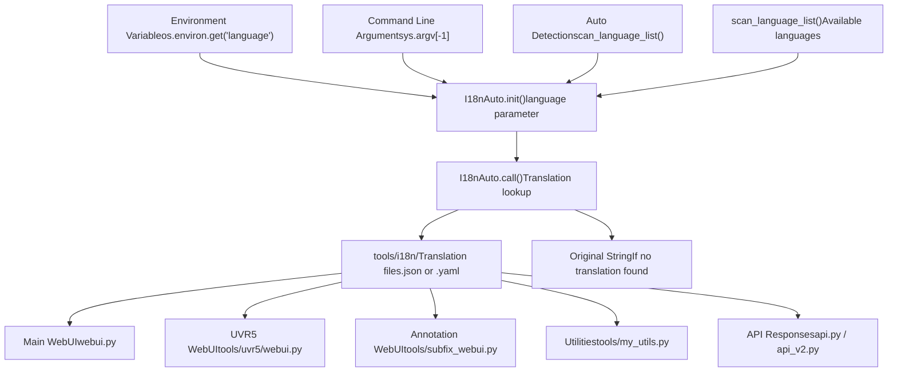
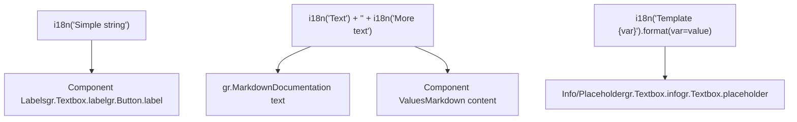
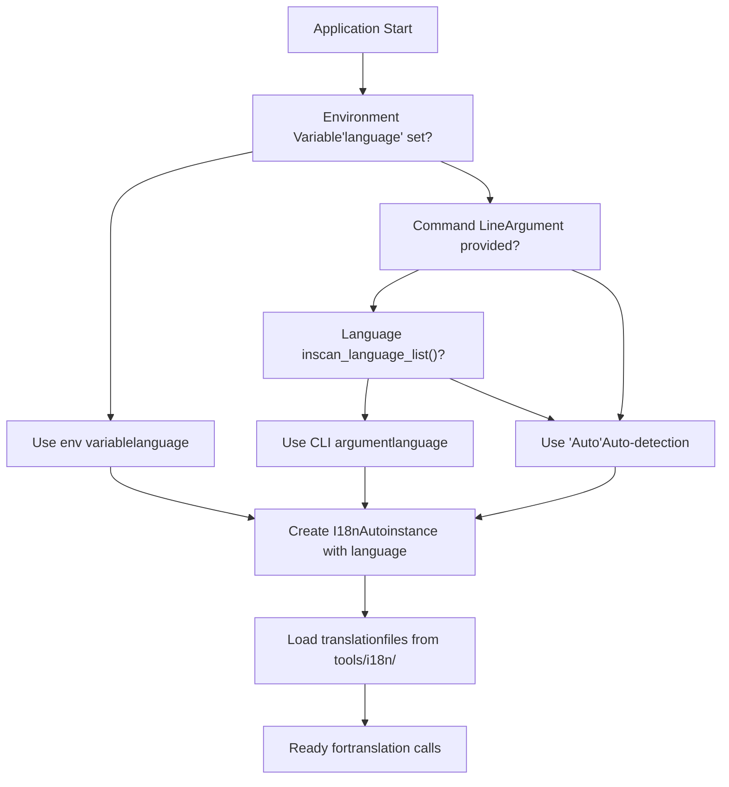
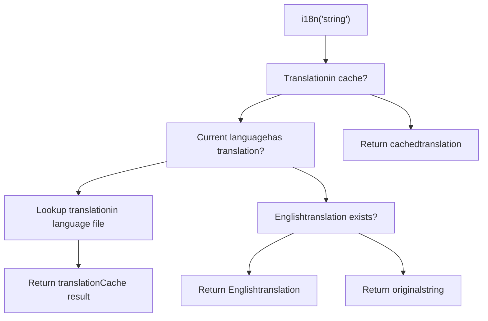
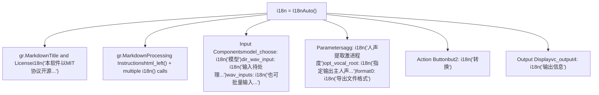

# 国际化 (Internationalization / i18n)

相关源文件

-   [tools/my\_utils.py](https://github.com/RVC-Boss/GPT-SoVITS/blob/c767f0b8/tools/my_utils.py)
-   [tools/slice\_audio.py](https://github.com/RVC-Boss/GPT-SoVITS/blob/c767f0b8/tools/slice_audio.py)
-   [tools/slicer2.py](https://github.com/RVC-Boss/GPT-SoVITS/blob/c767f0b8/tools/slicer2.py)
-   [tools/subfix\_webui.py](https://github.com/RVC-Boss/GPT-SoVITS/blob/c767f0b8/tools/subfix_webui.py)
-   [tools/uvr5/webui.py](https://github.com/RVC-Boss/GPT-SoVITS/blob/c767f0b8/tools/uvr5/webui.py)

## 目的与范围 (Purpose and Scope)

本页面记录了 GPT-SoVITS 在用户界面 (User Interface / UI)、错误消息 (Error Messages) 和文档中支持多种语言所使用的国际化 (Internationalization / i18n) 系统。该系统为向用户显示的所有文本提供了自动语言检测 (Automatic language detection)、翻译管理 (Translation management) 和运行时语言切换 (Runtime language switching) 功能。

有关用于 TTS 合成的文本处理（G2P 转换、音素生成）的信息，请参阅[文本处理](/RVC-Boss/GPT-SoVITS/4-text-processing)。

---

## 系统概述 (System Overview)

GPT-SoVITS 国际化系统是围绕位于 `tools/i18n/i18n.py` 中的 `I18nAuto` 类构建的。该类提供了一个简单的、可调用的接口 (Callable interface)，用于根据用户的语言偏好在运行时翻译 UI 字符串。

### 核心架构


**来源：** [tools/uvr5/webui.py7-10](https://github.com/RVC-Boss/GPT-SoVITS/blob/c767f0b8/tools/uvr5/webui.py#L7-L10) [tools/subfix\_webui.py2-5](https://github.com/RVC-Boss/GPT-SoVITS/blob/c767f0b8/tools/subfix_webui.py#L2-L5) [tools/my\_utils.py11-13](https://github.com/RVC-Boss/GPT-SoVITS/blob/c767f0b8/tools/my_utils.py#L11-L13)

---

## I18nAuto 类

### 初始化模式 (Initialization Patterns)

`I18nAuto` 类支持三种初始化模式，每种模式在代码库的不同部分中使用：

#### 模式 1：默认自动检测 (Pattern 1: Default Auto Detection)

用于不需要显式控制语言的简单 UI 模块：

```
from tools.i18n.i18n import I18nAutoi18n = I18nAuto()
```
此模式依靠系统的默认语言检测机制。

**来源：** [tools/uvr5/webui.py7-10](https://github.com/RVC-Boss/GPT-SoVITS/blob/c767f0b8/tools/uvr5/webui.py#L7-L10)

#### 模式 2：环境变量 (Pattern 2: Environment Variable)

用于可能被系统各个部分导入的实用程序模块：

```
from tools.i18n.i18n import I18nAutoi18n = I18nAuto(language=os.environ.get("language", "Auto"))
```
这允许通过环境变量 (Environment variables) 配置语言，并以 "Auto" 作为回退 (Fallback) 选项。

**来源：** [tools/my\_utils.py11-13](https://github.com/RVC-Boss/GPT-SoVITS/blob/c767f0b8/tools/my_utils.py#L11-L13)

#### 模式 3：命令行参数 (Pattern 3: Command Line Argument)

用于接受语言作为命令行参数的独立 WebUI 脚本：

```
from tools.i18n.i18n import I18nAuto, scan_language_listlanguage = sys.argv[-1] if sys.argv[-1] in scan_language_list() else "Auto"i18n = I18nAuto(language=language)
```
这在初始化之前会根据可用语言列表验证命令行参数。

**来源：** [tools/subfix\_webui.py2-5](https://github.com/RVC-Boss/GPT-SoVITS/blob/c767f0b8/tools/subfix_webui.py#L2-L5)

### 翻译接口 (Translation Interface)

`I18nAuto` 实例被当作一个函数调用来翻译字符串：

```
i18n("Text to translate")
```
翻译系统：

1.  在配置语言的翻译文件中查找对应翻译
2.  如果找到，则返回翻译后的字符串
3.  如果不存在翻译，则回退到原始字符串
4.  保留格式和特殊字符

---

## 使用模式 (Usage Patterns)

### Gradio UI 元素

国际化系统被广泛用于 Gradio UI 组件中，以对标签 (Labels)、描述 (Descriptions) 和 Markdown 内容进行本地化：


**来源：** [tools/uvr5/webui.py130-217](https://github.com/RVC-Boss/GPT-SoVITS/blob/c767f0b8/tools/uvr5/webui.py#L130-L217) [tools/subfix\_webui.py312-316](https://github.com/RVC-Boss/GPT-SoVITS/blob/c767f0b8/tools/subfix_webui.py#L312-L316)

### 示例：多行 Markdown 翻译

```
gr.Markdown(    value=i18n("本软件以MIT协议开源, 作者不对软件具备任何控制力, 使用软件者、传播软件导出的声音者自负全责.")    + "<br>"    + i18n("如不认可该条款, 则不能使用或引用软件包内任何代码和文件. 详见根目录LICENSE."))
```
该模式将翻译后的字符串与 HTML 格式拼接 (Concatenate) 在一起，以创建多段文本。

**来源：** [tools/uvr5/webui.py130-133](https://github.com/RVC-Boss/GPT-SoVITS/blob/c767f0b8/tools/uvr5/webui.py#L130-L133)

### 示例：组件标签翻译

```
model_choose = gr.Dropdown(label=i18n("模型"), choices=uvr5_names)dir_wav_input = gr.Textbox(    label=i18n("输入待处理音频文件夹路径"),    placeholder="C:\\Users\\Desktop\\todo-songs",)
```
组件标签总是被包裹在 `i18n()` 调用中以支持本地化。

**来源：** [tools/uvr5/webui.py173-177](https://github.com/RVC-Boss/GPT-SoVITS/blob/c767f0b8/tools/uvr5/webui.py#L173-L177)

### 示例：复杂的 HTML 说明

```
gr.Markdown(    value=html_left(        i18n("人声伴奏分离批量处理， 使用UVR5模型。")        + "<br>"        + i18n("合格的文件夹路径格式举例： E:\\codes\\py39\\vits_vc_gpu\\白鹭霜华测试样例(去文件管理器地址栏拷就行了)。")        + "<br>"        + i18n("模型分为三类：")        # ... 更多行    ))
```
复杂的文档章节会将 `i18n()` 调用与 HTML 格式辅助函数相结合。

**来源：** [tools/uvr5/webui.py138-169](https://github.com/RVC-Boss/GPT-SoVITS/blob/c767f0b8/tools/uvr5/webui.py#L138-L169)

---

## 错误消息本地化 (Error Message Localization)

代码库各处的错误消息都被包裹在 `i18n()` 调用中，以提供本地化的反馈：

### 模式：直接消息翻译

```
raise RuntimeError(i18n("音频加载失败"))
```
运行时错误 (Runtime errors) 在抛出异常前使用 `i18n()` 翻译错误消息。

**来源：** [tools/my\_utils.py35](https://github.com/RVC-Boss/GPT-SoVITS/blob/c767f0b8/tools/my_utils.py#L35-L35)

### 模式：使用 Gradio 的警告消息

```
gr.Warning(i18n("以下文件或文件夹不存在"))gr.Warning(i18n("缺少音素数据集"))gr.Warning(i18n("路径不能为空"))
```
Gradio 警告对话框 (Warning dialogs) 向用户显示本地化消息。

**来源：** [tools/my\_utils.py69-85](https://github.com/RVC-Boss/GPT-SoVITS/blob/c767f0b8/tools/my_utils.py#L69-L85) [tools/my\_utils.py124-137](https://github.com/RVC-Boss/GPT-SoVITS/blob/c767f0b8/tools/my_utils.py#L124-L137)

### 模式：特定路径的错误

```
if os.path.exists(wav_path):    ...else:    gr.Warning(wav_path + i18n("路径错误"))
```
错误消息可以将动态内容 (Dynamic content)（如文件路径）与翻译后的错误描述拼接。

**来源：** [tools/my\_utils.py112](https://github.com/RVC-Boss/GPT-SoVITS/blob/c767f0b8/tools/my_utils.py#L112-L112)

---

## 语言选择流程 (Language Selection Flow)

### 系统初始化


**来源：** [tools/subfix\_webui.py2-5](https://github.com/RVC-Boss/GPT-SoVITS/blob/c767f0b8/tools/subfix_webui.py#L2-L5) [tools/my\_utils.py11-13](https://github.com/RVC-Boss/GPT-SoVITS/blob/c767f0b8/tools/my_utils.py#L11-L13)

### 运行时翻译查找 (Runtime Translation Lookup)


---

## 翻译文件结构 (Translation File Structure)

翻译文件位于 `tools/i18n/` 目录下。系统使用 `scan_language_list()` 来枚举可用语言。

### 常用翻译键 (Common Translation Keys)

根据代码库中的使用模式，翻译按功能区域进行组织：

| 类别 | 示例键 (Example Keys) |
| --- | --- |
| **法律/许可** | "本软件以MIT协议开源...", "如不认可该条款..." |
| **UI 标签** | "模型", "输入待处理音频文件夹路径", "转换", "输出信息" |
| **文件操作** | "路径不能为空", "路径错误", "以下文件或文件夹不存在" |
| **音频处理** | "音频加载失败", "人声伴奏分离批量处理", "导出文件格式" |
| **数据集准备** | "缺少音素数据集", "缺少Hubert数据集", "缺少音频数据集", "缺少语义数据集" |
| **说明文档** | 带有 HTML 格式的长篇文档文本 |

**来源：** [tools/uvr5/webui.py130-217](https://github.com/RVC-Boss/GPT-SoVITS/blob/c767f0b8/tools/uvr5/webui.py#L130-L217) [tools/my\_utils.py35-137](https://github.com/RVC-Boss/GPT-SoVITS/blob/c767f0b8/tools/my_utils.py#L35-L137)

---

## 与 WebUI 组件的集成 (Integration with WebUI Components)

### UVR5 人声分离界面

UVR5 WebUI 展示了全面的 i18n 集成：


**来源：** [tools/uvr5/webui.py10](https://github.com/RVC-Boss/GPT-SoVITS/blob/c767f0b8/tools/uvr5/webui.py#L10-L10) [tools/uvr5/webui.py128-217](https://github.com/RVC-Boss/GPT-SoVITS/blob/c767f0b8/tools/uvr5/webui.py#L128-L217)

### 标注 WebUI 界面

标注 WebUI 展示了从命令行进行语言选择：

```
language = sys.argv[-1] if sys.argv[-1] in scan_language_list() else "Auto"i18n = I18nAuto(language=language)
```
这允许用户在启动标注界面时显式指定他们的语言偏好。

**来源：** [tools/subfix\_webui.py4-5](https://github.com/RVC-Boss/GPT-SoVITS/blob/c767f0b8/tools/subfix_webui.py#L4-L5)

---

## 添加翻译的最佳实践 (Best Practices for Adding Translations)

### 1. 包裹所有面向用户的文本

向用户显示的每个字符串都应包裹在 `i18n()` 调用中：

```
# 正确做法label = i18n("Model") # 错误做法label = "Model"
```
### 2. 在键中保留格式

尽可能将 HTML 和格式保留在翻译键之外：

```
# 正确做法i18n("First line") + "<br>" + i18n("Second line") # 不太理想（难以翻译）i18n("First line<br>Second line")
```
**来源：** [tools/uvr5/webui.py130-133](https://github.com/RVC-Boss/GPT-SoVITS/blob/c767f0b8/tools/uvr5/webui.py#L130-L133)

### 3. 拼接动态内容

将动态内容与可翻译字符串分开：

```
# 正确做法gr.Warning(file_path + i18n("路径错误")) # 错误做法（整个字符串对于每个路径都需要翻译）gr.Warning(i18n(f"{file_path} path error"))
```
**来源：** [tools/my\_utils.py112](https://github.com/RVC-Boss/GPT-SoVITS/blob/c767f0b8/tools/my_utils.py#L112-L112)

### 4. 使用一致的键

在不同的 UI 组件中对相同的概念重复使用相同的翻译键，以保持一致性并减少翻译工作量。

---

## 支持的语言 (Supported Languages)

该系统通过 `scan_language_list()` 函数支持多种语言，该函数会枚举 `tools/i18n/` 中可用的翻译文件。特殊值 "Auto" 允许根据系统区域设置 (Locale / 语言环境) 自动检测语言。

常见的支持语言可能包括：

-   中文（简体和繁体）
-   英语 (English)
-   日语 (Japanese)
-   韩语 (Korean)
-   以及基于可用翻译文件的其他语言

**来源：** [tools/subfix\_webui.py2-5](https://github.com/RVC-Boss/GPT-SoVITS/blob/c767f0b8/tools/subfix_webui.py#L2-L5)

---

## 总结表 (Summary Table)

| 组件 | 文件路径 | 初始化模式 | 主要用例 |
| --- | --- | --- | --- |
| **UVR5 WebUI** | [tools/uvr5/webui.py7-10](https://github.com/RVC-Boss/GPT-SoVITS/blob/c767f0b8/tools/uvr5/webui.py#L7-L10) | `I18nAuto()` | 人声分离 UI 标签和说明 |
| **标注 WebUI** | [tools/subfix\_webui.py2-5](https://github.com/RVC-Boss/GPT-SoVITS/blob/c767f0b8/tools/subfix_webui.py#L2-L5) | `I18nAuto(language=sys.argv[-1])` | 具有 CLI 语言选择的数据集标注界面 |
| **实用程序** | [tools/my\_utils.py11-13](https://github.com/RVC-Boss/GPT-SoVITS/blob/c767f0b8/tools/my_utils.py#L11-L13) | `I18nAuto(language=os.environ.get("language"))` | 共享实用程序中的错误消息和警告 |
| **主 WebUI** | 隐含（未显示） | 类似模式 | 主要的训练/推理界面 |

---

**来源：** [tools/uvr5/webui.py1-225](https://github.com/RVC-Boss/GPT-SoVITS/blob/c767f0b8/tools/uvr5/webui.py#L1-L225) [tools/subfix\_webui.py1-426](https://github.com/RVC-Boss/GPT-SoVITS/blob/c767f0b8/tools/subfix_webui.py#L1-L426) [tools/my\_utils.py1-232](https://github.com/RVC-Boss/GPT-SoVITS/blob/c767f0b8/tools/my_utils.py#L1-L232)
